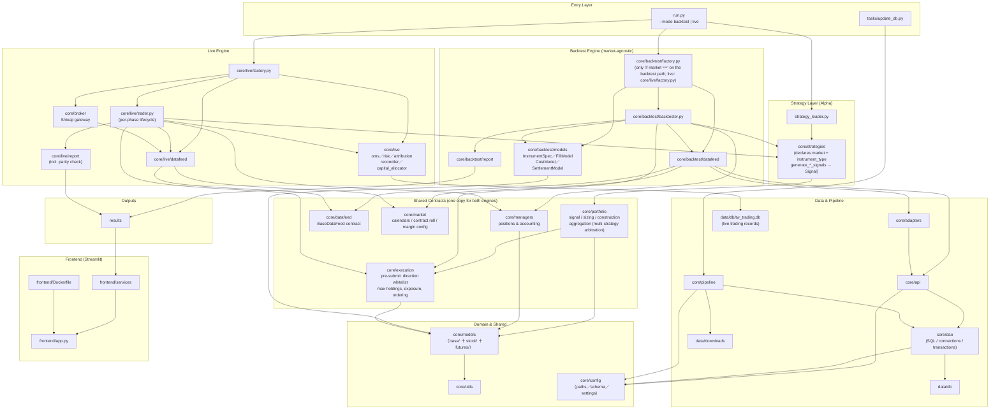

[English](#) | [Chinese (中文版)](README.md)

> `README.md` (Chinese) is the source of truth; this file is its English translation. Edit the Chinese version first, then sync this one.

# AlphaEdge

AlphaEdge is a strategy research and trading framework focused on Taiwan market workflows (backtest + reporting + data update pipeline + Streamlit result viewer).

## Architecture Overview



**Two engines, one strategy.** `Backtester` and `LiveTrader` are separate lifecycles that run the **same strategy class** — the boundary is only the order list returned by `check_*_signal()`. A strategy needs no rewrite to go live, which is what makes signal differences between live and backtest comparable row by row (the parity check in `core/live/report/`).

**Market-specific behavior is pushed down into pluggable models.** `Backtester` is market-agnostic with no subclasses; `InstrumentSpec`, `FillModel`, `CostModel`, `SettlementModel` and `DataFeed` are assembled by `core/backtest/factory.py` from the `market` + `instrument_type` a strategy declares, so adding a (market, instrument) combination never touches `backtester.py`. `core/live/factory.py` does the same job on the live side.

**The shared-contract layer is the intersection of the two engines**: position construction (`core/portfolio/`), pre-submit processing (`core/execution/`), the data-feed contract (`core/datafeed/`), market structure (`core/market/`) and position accounting (`core/managers/`) belong to neither engine; both import them. **Every shared rule is written once** — max holdings and single-symbol exposure, for instance, block the same orders in live as they do in backtest.

See [Multi-Market Engine](docs/backtest/multi-market-engine.md) and [Module Map](docs/backtest/module-map.md).

## Backtest Coverage

Each backtest runs one (market, instrument) combination, declared by the strategy base and dispatched by `factory.py`. Direction (LONG / SHORT) and instrument type are independent axes: accounting always follows each order's `position_type`, and the strategy's `allowed_directions` is only a direction whitelist.

Data ranges below reflect an inventory of `data/db` taken on 2026-09-24 and will move as the data is updated.

| Market × Instrument | Status | Scope and data range | Bar scale | Directions | Strategy base |
| ------------------- | ------ | -------------------- | --------- | ---------- | ------------- |
| TW stocks (`TW` × `STOCK`) | ✅ Supported | Symbols in `tw_stock.db`: prices 2013-01-02 – 2026-09-24 (2,395 symbols on the latest trading day)<br>Signals use adjusted prices by default; ex-dividend and corporate-action data also start 2013-01<br>Margin trading balances and institutional chip data 2013-01-02 – 2026-09-24 | `DAY`, `TICK` (ticks live in DolphinDB, not `data/db`; needs the `[tick]` extra) | **LONG**: fully cash-funded (no margin financing), overnight or intraday<br>**SHORT**: `DAY_TRADE` (cash day-trade short), `MARGIN` (margin-account short, overnight, default), `SBL` (securities borrowing, overnight); borrow fees, maintenance-ratio margin call and ex-dividend forced cover included<br>Long and short can coexist across symbols; opposite positions in the same symbol are rejected | `BaseStockStrategy` |
| TW index futures (`TW` × `FUTURE`) | ✅ Supported | TX, MTX, TMF, TE, ZEF, TF, ZFF; automatic contract roll<br>**Day-session prices** (`DAY`): TX / MTX / TE / TF from 2015-01-05 (backfill start), ZEF from 2021-06-28, ZFF from 2021-12-06, TMF from 2024-07-29 (listing dates); all products updated to 2026-09-24<br>**Night-session prices** (`NIGHT` / `COMBINED`): TX / MTX from 2017-05-16, TE from 2018-11-20, ZEF from 2021-06-29, TMF from 2024-07-30; **TF / ZFF only from 2025-06-24**<br>**Margin** (lookup mode): TX / MTX from 2020-03-13, TE / TF from 2020-07-22, ZEF from 2021-08-12, ZFF from 2022-01-26, TMF from 2024-08-09 | `DAY` only | **LONG / SHORT**: the same margin trading, daily mark-to-market and margin call; no borrow availability or borrow fees<br>Long and short can coexist across contracts; opposite positions in the same contract are rejected | `BaseFuturesStrategy` |
| Stock futures / ETF futures | ⚠️ Code works, prices missing | **Data**: universe of 320 products (249 single-stock, 47 mini single-stock, 21 ETF, 3 mini ETF), universe snapshots for 2026-08-29, 09-02 and 09-16 (3 in total); prices only for three trial products: CDF, NYF (2026-08-27 – 08-28) and EEF (2026-08-27 day session), **not enough for a meaningful backtest** (backfill tracked in [backlog/暫緩工作彙整.md](backlog/暫緩工作彙整.md) S4)<br>**Code path is wired**: the multiplier comes from the DataFeed's `resolve_multiplier()`, which reads the contract size from the universe snapshot for that day; margin looks up the amount table first (ETF future NYF is there from 2020-07-22) and falls back to the rate table for single-stock futures (`underlying price × contract size × rate`, with the underlying price read across from `tw_stock.db`)<br>**Remaining limit**: contract sizes only go back to the first snapshot on 2026-08-29, so earlier ex-dividend adjustments are invisible | `DAY` only | Same as TW index futures | `BaseFuturesStrategy` |
| US market, options | ❌ Not supported | `Market.US` and `InstrumentType.OPTION` are defined only; the factory raises `ValueError` | — | — | — |

> - Holding both directions requires `allowed_directions = {LONG, SHORT}`; a LONG intraday strategy must declare `bar_execution_order = OPEN_THEN_CLOSE` itself.
> - `enable_intraday` defaults to `True`, so a SHORT strategy goes through `DAY_TRADE` automatically; to hold shorts overnight, set it to `False` and pick a `short_method`.
> - Futures calendar-spread legs each pay full margin (spread margin is not modeled).

### Main limitations

- Tick-level futures backtests are not implemented (`TwFuturesDataFeed.get_quotes()` returns an empty list).
- The futures margin lookup start date differs per product (earliest 2020-03, see the table); earlier periods can only use the `FuturesMarginConfig.ratio()` approximation, which distorts tradable lots and margin-call thresholds.
- Futures tick sizes cover only the seven verified index futures (TX / MTX / TMF 1 point, TE / ZEF 0.05, TF / ZFF 0.2); unregistered products fall back to 1 point with a warning, so slippage set in ticks is distorted for them (default slippage is 0, so unaffected).
- A single backtest cannot hold TW stocks and TW futures at the same time (cross-market portfolios / hedging).
- The TW stock below-reference-price short restriction and the daily day-trade whitelist are not wired into matching yet, so short and day-trade opportunities are overestimated.
- Live trading (`--mode live`) has only been rehearsed in the **simulation** environment over several consecutive days; it has not been run in production. Production requires both `--production` and `--confirm-production`, which deliberately have no environment-variable equivalents.
- The live daily-loss guard is active at the **account level** only (broker-side realized + unrealized P&L); **the per-strategy layer never triggers** — the broker reports combined P&L per symbol, which cannot be split back per strategy.

See [Short-Selling Framework](docs/backtest/short-selling-framework.md) and [TW Futures Platform](docs/futures/tw-futures-platform.md) for details.

## Module Guide

| Module          | Description                                                                                                                     |
| --------------- | ------------------------------------------------------------------------------------------------------------------------------- |
| `core/`         | Core trading domain code (strategies, managers, models, adapters, API, data access layer, ETL, backtest engine; outputs land in the top-level `results/`) |
| `core/live/`    | Live trading: per-phase lifecycle, order management (OMS), position attribution, reconciliation, risk control and after-close work |
| `core/broker/`  | Broker integration (currently Shioaji): login, contract resolution, order mapping, report normalization and quote subscription |
| `core/execution/` | Pre-submit processing shared by backtest and live: direction whitelist, max holdings, single-symbol exposure, deterministic ordering |
| `core/portfolio/` | Position construction shared by backtest and live: signals, capital sizing, entry assembly, multi-strategy arbitration |
| `core/datafeed/`  | The neutral `BaseDataFeed` contract; backtest and live each implement it, and it is the type of a strategy's `setup_apis(feed)` |
| `core/market/`    | Market structure (trading calendars, futures roll, margin config), owned by neither engine |
| `frontend/`     | Streamlit Docker image for viewing backtest results                                                                             |
| `tasks/`        | Data maintenance and database update scripts                                                                                    |
| `tests/`        | Unit/integration tests and the backtest regression lines (`tests/backtest/`)                                                    |
| `scripts/`      | Guardrail checks (layer deps, doc paths, orphan API methods), regression script and manual scripts                              |
| `docs/`         | Usage and architecture docs (setup, commands, deployment, data, backtest and ETL design)                                       |
| `strategy_lab/` | Research workspace organized by concept (`strategies/`, `data_analysis/`, `notebooks/`, `ideas/`); see `strategy_lab/README.md` |
| `backlog/`      | Internal notes and future work items                                                                                            |

---

## Documentation

| Document                                                | Description                                                   |
| ------------------------------------------------------- | ------------------------------------------------------------- |
| [Dev Setup](docs/setup/dev-setup.md)                    | Python environment, dependencies, formatting, env vars        |
| [Dev Deployment](docs/deployment/dev-deployment.md)     | Day-to-day local flow: update data, run a backtest, view results |
| [Prod Deployment](docs/deployment/prod-deployment.md)   | Building Docker images, running containers, role separation   |
| [Live Deployment](docs/deployment/live-deployment.md)   | Per-phase live runs, container and cron scheduling, stop and exit codes |
| [Data Coverage](docs/exchanges/data_coverage.md)        | Data sources, API mapping, start dates and price adjustment   |
| [Command Usage](docs/commands/command-usage.md)         | Full `update_db` target reference and runnable examples       |
| [Strategy Development Guide](core/strategies/README.md) | How to implement strategies in this project                   |
| [Multi-Market Engine](docs/backtest/multi-market-engine.md) | Backtest engine architecture: one engine, five pluggable models |
| [Module Map](docs/backtest/module-map.md)               | Who calls whom on the backtest path, per-file responsibilities |
| [Short-Selling Framework](docs/backtest/short-selling-framework.md) | Direction-driven accounting, costs, margin call, forced cover |
| [TW Futures Platform](docs/futures/tw-futures-platform.md) | Futures tables and commands; mark-to-market, margin, contract roll and session semantics; known limits |
| [ETL Ingestion](docs/pipeline/etl-ingestion.md)         | Batching, idempotency and failure semantics of the data-load stage; per-updater checklist |
| [Equity Change Data](docs/pipeline/equity-change.md)    | `equity_change` data shape, known limits and throttling       |
| [Corporate Actions](docs/pipeline/corporate-action.md)  | `corporate_action` table: sources, adjustment ratios and the false-gap guard |
| [Code Quality](docs/dev/code-quality.md)                | Tooling (pyproject / ruff / CI / pre-commit) and lint ignore rationale |
| [Naming Axes](docs/dev/naming-axes.md)                  | Directory naming decision for the market axis vs the instrument-type axis |
| [Data Access Layer](docs/dev/data-access-layer.md)      | `core/dao/` layering, connection ownership, savepoints and commit timing, error semantics, new-table checklist |
| [Runtime Artifacts](docs/dev/runtime-artifacts.md)      | Conventions for `data/` / `results/` / `logs/`, log bucketing and retention |

---

## Environment Setup

First time here? Go in order: **prepare the database → pick one of the three ways to run → (if needed) set environment variables**.
Section 4 is only for changing the code.

### 1. Prepare the database

Backtests and the frontend need the SQLite3 databases. Download them from [Google Drive](https://drive.google.com/drive/folders/1iKTpnfECyHIgVj9SJ2al5BKBwceXr_ZE?usp=share_link)
and put them in `data/db/` under the project root (the code expects `data/db/tw_stock.db` and `data/db/tw_futures.db`).

```text
AlphaEdge/
└── data/
    └── db/
        ├── tw_stock.db
        └── tw_futures.db
```

To bring the data up to date afterwards, see "Update database" under Command Usage below.

### 2. Choose how to run it (pick one)

All three run the same code — **pick one and follow it**; you do not need all of them:

| Option | Best for | Install first | Where backtest results go |
| ------ | -------- | ------------- | ------------------------- |
| Option 1: Local Python (recommended) | Writing strategies, changing code | Python 3.12+ | `results/` at the project root |
| Option 2: Docker Compose | No Python install; one command to backtest and view results | Docker | Docker volume `alphaedge_results` |
| Option 3: Docker Container | Controlling the backtest and frontend containers separately | Docker | `results/` at the project root (mounted) |

#### Option 1: Local Python (recommended)

**Step 1: Install uv and create the environment**

Dependencies are managed by [uv](https://docs.astral.sh/uv/): `pyproject.toml` declares them, `uv.lock`
pins every package to an exact version, and local, CI and Docker all install from the same lock.

macOS / Linux:

```bash
brew install uv          # or: curl -LsSf https://astral.sh/uv/install.sh | sh
uv sync                  # create .venv, install dependencies and the project (Python from .python-version)
source .venv/bin/activate
```

Windows (PowerShell):

```powershell
powershell -ExecutionPolicy ByPass -c "irm https://astral.sh/uv/install.ps1 | iex"
uv sync
.venv\Scripts\activate
```

The project is installed into `.venv` in editable mode, so `core` / `tasks` / `tests` are importable
from any directory. Activate the virtualenv in every new terminal (run `deactivate` to leave it);
alternatively prefix commands with `uv run`, e.g. `uv run python run.py ...`.

**Step 2: Run a backtest**

```bash
python run.py --strategy MomentumStrategy1
```

- `--strategy` takes a strategy class name; existing strategies live in `core/strategies/stock/` and `core/strategies/futures/`.
- Optional: `--show` opens charts in a browser. Live trading is a separate path (`--mode live`); see [Live Deployment](docs/deployment/live-deployment.md) for usage and exit codes.
- Results are written to `results/` at the project root.

**Step 3: Open the frontend to view results**

The frontend packages are not in the base install, so add them once:

```bash
uv sync --extra frontend   # one-time
streamlit run frontend/app.py
```

Open `http://localhost:8501`. Leave the frontend running and use another terminal tab (with the virtualenv activated) to keep running backtests.

#### Option 2: Docker Compose

One command builds and starts two containers: `core` runs one backtest and exits, `frontend` keeps serving the page.

```bash
# Build images and start (default strategy: MomentumStrategy1)
docker compose up --build

# Use a different strategy
STRATEGY=MomentumFuturesStrategy docker compose up

# Run in the background / stop and remove containers
docker compose up -d
docker compose down
```

Open `http://localhost:8501`. After changing code, add `--build` so the images pick up the change.

> The images contain **no database**; compose mounts the host's `./data` **read-only**. Skip
> "1. Prepare the database" and the backtest fails at `sqlite3.connect`. Read-only is deliberate:
> the container only runs backtests and must not write to the host database.
> Backtest results go to the `alphaedge_results` volume; logs go to the host's `./logs`.

#### Option 3: Docker Container

**Step 1: Build the images**

```bash
docker build -f core/Dockerfile -t alphaedge-core .
docker build -f frontend/Dockerfile -t alphaedge-frontend .
```

**Step 2: Run a backtest**

```bash
docker run --rm \
  -v "$(pwd)/data:/app/data:ro" \
  -v "$(pwd)/results:/app/results" \
  alphaedge-core --strategy MomentumStrategy1
```

The image has no database, so mount the host `data/` read-only; results are written back to the host
`results/`, otherwise they vanish when the container exits. To type commands inside the container
instead, use `--entrypoint /bin/bash` with `-it`, then run `python run.py --help`.

**Step 3: Start the frontend**

```bash
docker run --rm -p 8501:8501 -v "$(pwd)/results:/results:ro" alphaedge-frontend
```

Open `http://localhost:8501`. The frontend reads the mounted `results/`; without the mount it shows no backtests.

### 3. Set environment variables (optional)

**Skip this if you only run daily backtests.** To update data or use ticks, copy the template and fill in what you need:

```bash
cp .env.example .env
```

| Variable | Purpose | Needed when |
| -------- | ------- | ----------- |
| `DDB_PATH`, `DDB_HOST`, `DDB_PORT`, `DDB_USER`, `DDB_PASSWORD` | DolphinDB connection | Accessing tick data, running tick backtests |
| `API_KEY`, `API_SECRET_KEY` | Sinopac Shioaji API | Crawling tick data |
| `FINMIND_API_TOKEN` | FinMind API | Updating FinMind data (stock overview, brokers, broker branches) |

`.env` is read by the local code; the Docker images do not include it. Details in [Dev Setup](docs/setup/dev-setup.md).

### 4. Developer tools (when changing code)

The dev tools (pytest, pytest-timeout, pytest-cov, ruff) are the `dev` dependency group, **installed by `uv sync` by default**:

```bash
uv sync               # dependencies + the project + dev tools
```

Other optional extras: `frontend` (Streamlit UI), `tick` (DolphinDB tick storage),
`lab` (`strategy_lab` report output and U.S./FX data: `python-docx`, `yfinance`);
the backtest and ETL paths run without them.

**`uv sync` makes the environment match exactly what you ask for**: extras not listed on the command are removed (the dev tools are not affected).
To keep several extras, list them together, e.g. `uv sync --extra frontend --extra lab`, or use `uv sync --all-extras`.

**Lint, format and tests**

```bash
ruff check .            # CLAUDE.md §2.5 / §2.10, configured in pyproject.toml
ruff format .
pytest -m "not slow"    # skips tests needing tw_stock.db or API credentials
pytest                  # full suite (needs data/db/tw_stock.db)
./scripts/run_regression.sh   # LONG + SHORT regression, must stay row-identical
```

**Pre-commit checks**: run ruff, the layer-dependency gate and the doc path check automatically before each commit (tests and the API orphan-method check are left to CI).

```bash
uv tool install pre-commit
pre-commit install       # one-time; installs the git hook
pre-commit run --all-files
```

**CI**: on every push GitHub Actions runs, in order: `ruff check`, `ruff format --check`, the
layer-dependency gate (`scripts/check_layer_deps.py`), the doc path check
(`scripts/check_doc_paths.py`), the remaining `pre-commit run --all-files` hooks, the API
orphan-method check (`scripts/check_api_orphan_methods.py`), the SHORT regression line,
`pytest -m "not slow"` (the coverage report rides along in the same run rather than
repeating the whole suite). **A separate job
runs in parallel** building the `core` and `frontend` Docker images and smoke-testing each —
it declares no `needs:`, so it starts alongside the list above rather than after it
(see `.github/workflows/ci.yml`). **The LONG regression line needs
`data/db/tw_stock.db`, which CI does not have, so it only runs locally.**

## Command Usage

### Update database

For full target reference and single/multi-target examples, see [Command Usage](docs/commands/command-usage.md).

```bash
python -m tasks.update_db --target no_tick
```

### Run backtest

Replace `<StrategyClassName>` with your strategy class name. More command scenarios are documented in [Command Usage](docs/commands/command-usage.md).

```bash
python run.py --strategy <StrategyClassName>
# optional: --show opens charts in a browser. Live trading uses --mode live, see docs/deployment/live-deployment.md
```

## Project Structure

```text
AlphaEdge/
├── core/                    # trading domain modules
│   ├── strategies/            # strategy implementations
│   │   ├── base.py            # BaseStrategy (market-agnostic)
│   │   ├── strategy_loader.py # auto-scans every instrument-type sub-package (stock / futures)
│   │   ├── stock/             # BaseStockStrategy + concrete stock strategies
│   │   └── futures/           # BaseFuturesStrategy + TW futures strategies
│   ├── api/                   # query interfaces and business rules (no SQL; builds DAOs with conn=)
│   ├── dao/                   # data access layer: SQL, connections and transactions live only here
│   │   ├── base.py            # BaseDAO: owns_conn, table_exists, savepoint, write methods
│   │   ├── connection.py      # connect_sqlite() single entry point (read-only mode included)
│   │   └── tw/                # one DAO per table (or per tightly related group)
│   ├── adapters/              # pure transformation layer (zero I/O): raw → Quote
│   │   ├── quote_validation.py # source-agnostic quote checks: price validity, duplicate symbols
│   │   └── tw/                # StockQuoteAdapter (one complete path each for day and tick), FuturesQuoteAdapter
│   ├── datafeed/              # the neutral BaseDataFeed contract (shared; neither engine imports the other)
│   ├── market/                # market structure: trading calendars, futures roll, margin config
│   ├── portfolio/             # position construction (shared): signal / sizing / construction / aggregation
│   ├── execution/             # pre-submit processing (shared): direction whitelist, max holdings, exposure, ordering
│   ├── managers/              # position managers (base/ + stock/ + futures/)
│   ├── models/                # domain models (base/ + stock/ + futures/)
│   ├── utils/                 # shared helpers (enums, time, logging, Shioaji account)
│   ├── config/                # paths, table schema and settings constants (lowest layer)
│   ├── pipeline/              # ETL/update pipeline
│   │   ├── shared/           # cross-market: four layer bases, HTTP helpers, date/season diffing
│   │   ├── tw/               # TW equity/futures ETL (crawlers/cleaners/loaders/updaters)
│   │   │   └── utils/        # TW-only helpers (URL table, tick metadata)
│   │   └── utils/            # cross-market: constants, DataFrame and SQLite helpers, exceptions
│   ├── backtest/              # backtest engine
│   │   ├── README.md          # bar scales, price basis, fill assumptions, performance metrics
│   │   ├── backtester.py      # the only engine: market/instrument-agnostic, no subclasses
│   │   ├── factory.py         # assembles the model set from (market, instrument_type)
│   │   ├── models/            # InstrumentSpec / FillModel / CostModel / SettlementModel
│   │   ├── datafeed/          # data loading, quote conversion, trading calendar, futures roll
│   │   ├── report/            # trading report, direction summary, charts
│   │   └── analysis/          # performance metrics (`performance_metrics.py` holds pure risk-adjusted return functions, called by the reporter to write metrics_summary.csv)
│   ├── broker/                # broker gateway (Shioaji)
│   │   └── tw/                # login/CA, contract resolution, order mapping, report normalization, accounts, live quotes
│   └── live/                  # live trading engine
│       ├── trader.py          # per-phase lifecycle (open / close / intraday / after-close)
│       ├── segment.py         # phase definitions and which phase is due right now
│       ├── factory.py         # assembles live components from (market, instrument_type)
│       ├── reconciler.py      # after-close reconciliation against broker positions
│       ├── account_sync.py    # rebuild the attribution ledger from broker positions
│       ├── capital_allocator.py  # multi-strategy capital quota allocation
│       ├── after_close.py     # after-close: reconciliation, report and parity check
│       ├── strategy_guard.py  # pre-start check that strategy declarations match backtest semantics
│       ├── termination.py     # SIGTERM wind-down and exit codes
│       ├── oms/               # order state machine, report queue, restart takeover
│       ├── risk/              # pre-trade risk, trading-mode state machine, risk event log
│       ├── attribution/       # multi-strategy position ledger and cross-strategy conflict guard
│       ├── datafeed/          # history up to T−1; today's quotes come from the broker
│       ├── intraday/          # intraday event loop and end-of-session forced actions
│       ├── notify/            # alert delivery (failures never affect the trading path)
│       └── report/            # live daily report and live-vs-backtest signal parity
├── data/                      # runtime data (git-ignored): db/ (tw_stock.db, tw_futures.db, live records tw_trading.db), downloads/, backup/, records/
├── results/                   # per-strategy backtest outputs (csv / png), git-ignored
├── logs/                      # api/ pipeline/ backtest/ launchd/, git-ignored
├── frontend/                  # Streamlit docker image
│   ├── app.py                 # Streamlit entrypoint
│   ├── config.py              # frontend configuration
│   ├── services/              # data loading and metrics (no Streamlit calls, so testable)
│   │   ├── report_loader.py   # load backtest report files
│   │   ├── metrics.py         # trade-detail helpers (computes no performance metrics; reads metrics_summary.csv)
│   │   └── futures_metrics.py # futures-only metrics (margin, lot exposure)
│   ├── static/theme.css       # page styles
│   ├── requirements.txt       # frontend image dependencies
│   ├── Dockerfile             # frontend container image
│   ├── README.md              # frontend usage notes
│   └── __init__.py
├── strategy_lab/              # research workspace (strategies/ / data_analysis/ / notebooks/ / ideas/)
├── tasks/                     # data update and maintenance entrypoints (update_db, delete_price_data, clean_logs)
├── tests/                     # test suites (`backtest/` holds engine and regression lines; `temp/`, `database/`, `downloads/` are runtime artifacts)
├── backlog/                   # internal planning notes
├── docs/                      # project docs
│   ├── backtest/              # engine architecture, module map, short-selling spec
│   ├── dev/                   # code quality, naming axes, runtime artifacts
│   ├── futures/               # TW futures platform: data, backtest semantics, known limits
│   ├── pipeline/              # ETL ingestion contract, equity change, corporate actions
│   ├── setup/                 # dev environment setup
│   ├── deployment/            # dev and prod deployment
│   ├── exchanges/             # data coverage
│   └── commands/              # command usage (zh-TW / en)
├── scripts/                   # guardrail checks and one-off tools
│   ├── run_regression.sh      # SHORT + LONG regression guardrail (run before/after engine changes)
│   ├── check_layer_deps.py    # layer deps, import cycles, market-semantics leaks, cross-axis directory pollution (CI + pre-commit)
│   ├── check_doc_paths.py     # file paths in docs that no longer resolve (stale after a move; CI + pre-commit)
│   ├── check_api_orphan_methods.py  # public methods in `core/api` with zero callers and zero tests (CI)
│   ├── clean_pycache.sh/.ps1  # remove __pycache__ and .pyc (macOS/Linux, Windows)
│   ├── live_watchdog.py       # live liveness monitor (standalone scheduled process, never touches the broker)
│   ├── check_overnight_positions.py  # does the simulation env keep overnight positions? (read-only analysis)
│   ├── launchd/               # macOS scheduling (one launch per phase)
│   └── manual/                # scripts needing credentials or a database (see its README)
├── docker-compose.yml         # compose: core + live (behind a profile, never started by `up`) + frontend + shared results volume
├── pyproject.toml             # dependency declaration (single source) and ruff/pytest config
├── uv.lock                    # versions resolved by uv (do not edit; run `uv lock` after changing pyproject)
├── run.py
├── README.md                  # Chinese (source of truth)
└── README_en.md               # English translation
```
