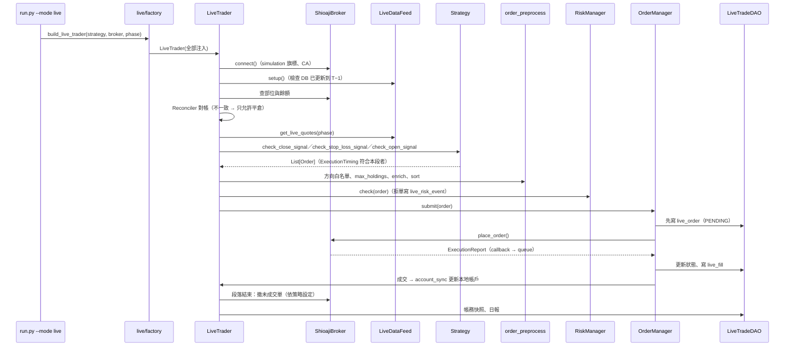

# 實盤下單架構規劃

## Abstract

- **背景／問題**：專案目前已經有「策略開發 → 爬蟲 pipeline → 回測」三段，但**沒有實盤下單**。
  - `run.py --mode live` 呼叫後直接拋 `NotImplementedError`。
  - Shioaji 相關程式只有三支 `core/utils/` 工具，都是早期留下來的：
    - `OrderUtils.place_order()`：只能下股票單，參數用 dict 傳。
    - `Callback.order_callback()`：只印出股票成交回報，而且用 `print`。
    - `ShioajiAccount`：只能登入 production，沒有 CA 憑證啟用，也沒有模擬模式。
  - 缺少的部分：委託狀態追蹤、風控、對帳、紀錄落地、期貨下單、盤中行情迴圈，全部都還沒有。
- **目標**：按量化交易常見的分層，新增三層：
  - 「券商閘道（Broker Gateway）」：`core/broker/`。
  - 「委託管理與風控（OMS／Risk）」：`core/live/`。
  - 「實盤引擎（Live Trader）」：`core/live/`。

  同一支策略類別**不用改寫、也不用 `if live`**，就可以從回測切換到 Shioaji 模擬環境，再切換到正式環境。支援的交易型態：
  - 台股現股、融資融券、現股當沖、盤中零股。
  - 指數期貨、股票期貨。
  - 日頻與盤中兩種執行頻率。
- **範圍界線（不做）**：
  - 不做選擇權。
  - 不做美股。
  - 不做多券商、多帳戶路由。
  - 不做演算法拆單（TWAP／VWAP）。
  - 不做前端下單介面。
  - 不做自動調參。
  - 通知管道（Telegram 等）只預留掛點，不實作。
  - **不改變任何既有回測結果**：回歸雙線必須零變動。會改變回測語意的項目（D2 盤中切片回放）先裁示，再另外排程。
- **驗收標準**：
  1. `python run.py --mode live --broker shioaji --simulation` 可以在 Shioaji 模擬環境跑以下兩條路徑，各連續 5 個交易日：
     - 一支股票日頻策略。
     - 一支期貨策略。

     每筆委託、成交、每日部位快照都寫進 `tw_trading.db`，收盤後對帳零差異。
  2. 盤中模式可以在模擬環境跑完整個交易時段。斷線後會自動重連、重新訂閱，而且不會重複下單。
  3. 風控測試案例全部有測試覆蓋：
     - 單筆金額上限、單日金額上限。
     - 價格偏離參考價。
     - 下單頻率。
     - kill switch。
     - 對帳不一致時停止開新倉。
  4. `python scripts/check_layer_deps.py`、`pytest`、`./scripts/run_regression.sh` 全部通過，回測 baseline 沒有重產。

---

## 進度追蹤表

| 編號 | 步驟名稱 | 產出檔案 | 驗證方式 | 狀態 | 備註／中斷點 |
|------|----------|----------|----------|:----:|--------------|
| Phase0-1 | Shioaji 帳號前置：API 條款、CA 憑證、模擬環境 API 測試 | 本文件（完成紀錄） | 模擬環境股票、期貨各下一筆並 `update_status()` 查得到；正式帳號具下單權限 | ⬜ | **使用者手動**；阻塞 Phase7-2 |
| Phase0-2 | 待裁示事項 D1~D6 定案 | 本文件〈待裁示事項〉 | 每項填入裁示結果與日期 | ⬜ | D1 阻塞 Phase4-1；D2 阻塞 Phase5-1 |
| Phase0-3 | 實盤設定與環境變數 | `core/config/settings.py`、`core/config/schema.py`、`.env.example`、`tests/test_config_consistency.py` | `pytest tests/test_config_consistency.py` 通過 | ⬜ | — |
| Phase0-4 | 分層規則登記 `core/broker/`、`core/live/` | `scripts/check_layer_deps.py` | `python scripts/check_layer_deps.py` 通過；故意反向 import 會失敗 | ⬜ | 先登記再寫程式，讓護欄從第一行就生效 |
| Phase1-1 | 下單執行參數 Enum | `core/utils/constant.py`、`tests/test_order_state_parity.py` | 與 `shioaji.constant` 同名 Enum 的值逐一比對 | ⬜ | — |
| Phase1-2 | 訂單模型補執行欄位（預設值維持回測行為） | `core/models/base/order.py`、`core/models/stock/order.py`、`core/models/futures/order.py` | `./scripts/run_regression.sh` 零變動 | ⬜ | 相依 Phase1-1、D1 |
| Phase1-3 | 委託單、成交回報、帳務快照模型 | `core/models/base/execution.py`、`core/models/stock/execution.py`、`core/models/futures/execution.py` | 新增單元測試 | ⬜ | 相依 Phase1-1 |
| Phase2-1 | `BaseBroker` 抽象介面與測試用 `FakeBroker` | `core/broker/base.py`、`tests/live/conftest.py` | `FakeBroker` 通過介面契約測試 | ⬜ | 相依 Phase1-3、Phase0-4 |
| Phase2-2 | `ShioajiSession`：登入、CA、模擬旗標、重連、限流 | `core/broker/tw/shioaji_session.py`、`core/broker/rate_limiter.py` | 限流單元測試；模擬環境登入、登出冒煙腳本 | ⬜ | 相依 Phase0-3 |
| Phase2-3 | 合約解析：上市櫃、指數期貨、股票期貨 | `core/broker/tw/shioaji_contract_resolver.py` | 以假合約表單元測試；模擬環境逐類實查一檔 | ⬜ | 相依 Phase2-2 |
| Phase2-4 | 委託轉換與合法組合檢查 | `core/broker/tw/shioaji_order_mapper.py` | 合法組合矩陣的參數化測試 | ⬜ | 相依 Phase1-2、Phase2-3 |
| Phase2-5 | 委託與成交回報正規化（callback → queue） | `core/broker/tw/shioaji_execution_handler.py` | 重放錄下的 callback 訊息：亂序、重複都能得到同一結果 | ⬜ | 相依 Phase1-3 |
| Phase2-6 | 帳務查詢：餘額、交割款、部位、期貨保證金 | `core/broker/tw/shioaji_account_query.py` | 以假回傳物件單元測試；模擬環境冒煙 | ⬜ | 相依 Phase2-2 |
| Phase2-7 | 即時行情：快照與 tick／bidask 訂閱 | `core/broker/tw/shioaji_quote_stream.py` | 轉出的 `StockQuote`／`FuturesQuote` 欄位與回測版一致 | ⬜ | 相依 Phase2-3 |
| Phase2-8 | `ShioajiBroker` 組裝 | `core/broker/tw/shioaji_broker.py` | 通過與 `FakeBroker` 相同的介面契約測試（模擬環境） | ⬜ | 相依 Phase2-2~Phase2-7 |
| Phase3-1 | 實盤紀錄資料庫 `tw_trading.db` 與 DAO | `core/config/schema.py`、`core/dao/tw/live_trade_dao.py`、`tests/test_dao_live_trade.py` | 建表冪等；同一筆成交寫兩次不重複 | ⬜ | 相依 Phase1-3 |
| Phase3-2 | `OrderManager` 委託狀態機 | `core/live/oms/order_manager.py` | 狀態轉移表的參數化測試；非法轉移會拋出 | ⬜ | 相依 Phase2-1、Phase3-1 |
| Phase3-3 | `PreTradeRiskManager` 盤前與盤中風控 | `core/live/risk/risk_manager.py`、`core/live/risk/risk_config.py` | 每條規則一個測試；kill switch 生效後零委託送出 | ⬜ | 相依 Phase3-2 |
| Phase3-4 | 共用委託前處理：從 `Backtester` 抽出 | `core/execution/order_preprocess.py`、`core/backtest/backtester.py` | 回歸雙線零變動；實盤與回測呼叫同一函式 | ⬜ | 相依 Phase0-4；**動到引擎，須跑回歸** |
| Phase3-5 | 帳戶同步：成交 → 本地 Account，券商快照覆寫 | `core/live/account_sync.py` | 以 `FakeBroker` 重放一天的成交，本地部位＝券商部位 | ⬜ | 相依 Phase2-6、Phase3-2 |
| Phase3-6 | 對帳器 `Reconciler` | `core/live/reconciler.py` | 刻意製造差異時停止開新倉並寫入 `live_risk_event` | ⬜ | 相依 Phase3-5 |
| Phase4-1 | 日頻執行時點契約（`ExecutionTiming`） | `core/strategies/base.py`、`core/models/base/order.py` | 回歸零變動；未宣告 `live_ready` 的策略拒絕進入實盤 | ⬜ | 相依 D1、Phase1-2 |
| Phase4-2 | `LiveDataFeed`：歷史到 T−1＋當日快照＋資料新鮮度檢查 | `core/live/datafeed/base.py`、`core/live/datafeed/tw/stock_live_datafeed.py`、`core/live/datafeed/tw/futures_live_datafeed.py` | DB 未更新到 T−1 時拒絕啟動；報價欄位與回測版一致 | ⬜ | 相依 Phase2-7 |
| Phase4-3 | `LiveTrader` 日頻流程（市場無關） | `core/live/trader.py` | `FakeBroker` 端到端：開盤段、尾盤段、盤後段 | ⬜ | 相依 Phase3-3~Phase3-6、Phase4-1、Phase4-2 |
| Phase4-4 | 實盤 factory | `core/live/factory.py` | 未支援的（市場, 商品）組合拋出含兩軸值的 `ValueError` | ⬜ | 相依 Phase4-3 |
| Phase4-5 | `run.py --mode live` 接線與安全旗標 | `run.py`、`tests/test_run_entry.py` | 未加 `--confirm-production` 時不可能連到正式環境 | ⬜ | 相依 Phase4-4 |
| Phase4-6 | 盤後作業：撤未成交單、對帳、快照、日報 | `core/live/trader.py`、`core/live/report/live_reporter.py` | `results/live/<Strategy>/` 產出日報；對帳結果寫入 DB | ⬜ | 相依 Phase4-3 |
| Phase5-1 | 盤中策略契約（時間切片） | `core/strategies/base.py`、`core/live/intraday/bar_builder.py` | 同一段錄製 tick 餵兩次，訊號一致 | ⬜ | 相依 D2 |
| Phase5-2 | 盤中事件迴圈：行情 queue、心跳、報價過期偵測 | `core/live/intraday/event_loop.py` | 注入延遲、斷線事件後進入安全模式，不送新倉單 | ⬜ | 相依 Phase5-1、Phase4-3 |
| Phase5-3 | 斷線重連、重新訂閱與重啟後恢復狀態 | `core/broker/tw/shioaji_session.py`、`core/live/trader.py` | 在任意時點殺掉行程後重啟：不重複下單、未完成委託重新接管 | ⬜ | 相依 Phase5-2 |
| Phase5-4 | 日終強制動作：當沖回補、期貨夜盤跨日歸屬 | `core/live/intraday/session_guard.py` | 模擬 13:20 仍有當沖部位時觸發回補 | ⬜ | 相依 Phase5-2 |
| Phase5-5 | 常駐部署與排程 | `docker-compose.yml`、`docs/deployment/live-deployment.md` | 容器內跑完一個模擬交易日；SIGTERM 會先撤單再結束 | ⬜ | 相依 Phase5-3 |
| Phase6-1 | 融資融券與現股當沖下單 | `core/broker/tw/shioaji_order_mapper.py`、`core/live/risk/risk_manager.py` | 券源不足或不可當沖的標的在送單前被擋 | ⬜ | 相依 Phase2-4、Phase3-3、D3 |
| Phase6-2 | 指數期貨：開平倉別、換月、保證金 | `core/broker/tw/shioaji_order_mapper.py`、`core/live/trader.py` | 換月日模擬環境實跑一次；保證金不足時不送單 | ⬜ | 相依 Phase2-4、Phase4-3 |
| Phase6-3 | 股票期貨合約與乘數 | `core/broker/tw/shioaji_contract_resolver.py` | 乘數取自合約並與 `futures_stock_universe` 交叉比對 | ⬜ | 相依 Phase6-2；[暫緩工作彙整.md](暫緩工作彙整.md) S4 的行情回補同屬股期 |
| Phase6-4 | 盤中零股 | `core/models/stock/order.py`、`core/broker/tw/shioaji_order_mapper.py` | 數量單位錯配（張當股）在建立委託時就拋出 | ⬜ | 相依 Phase2-4 |
| Phase7-1 | 模擬環境端到端演練（連續 5 個交易日） | 本文件（演練紀錄） | 對應 Abstract 驗收標準 1、2 | ⬜ | 相依 Phase4-6、Phase5-5、Phase6-2 |
| Phase7-2 | 正式環境小額上線檢查表 | `docs/live/production-checklist.md` | 使用者逐項勾選 | ⬜ | 相依 Phase0-1、Phase7-1 |
| Phase7-3 | 舊 Shioaji 工具收斂 | `core/utils/order.py`、`core/utils/callback.py`、`core/utils/account.py`、`core/pipeline/tw/updaters/*_tick_updater.py`、`scripts/manual/manual_tick_crawler.py` | `grep -rn "OrderUtils\|Callback.order_callback"` 無結果；tick updater 冒煙通過 | ⬜ | 相依 Phase2-2 |
| Phase7-4 | 文件 | `docs/live/live-trading.md`、`docs/backtest/module-map.md`、`README.md`、`README_en.md`、`core/strategies/README.md` | `python scripts/check_doc_paths.py` 通過 | ⬜ | 相依 Phase7-1 |

---

## 現況盤點（2026-09-17）

### 可以直接沿用的設計

| 既有設計 | 在實盤的用途 |
|----------|--------------|
| 策略四個鉤子 `check_open_signal`／`check_close_signal`／`check_stop_loss_signal`／`calculate_position_size`，輸入是 `List[BaseQuote]`、輸出是 `List[BaseOrder]` | 實盤引擎呼叫同樣的鉤子，只替換「委託之後的事」 |
| `(market, instrument_type)` 由策略基底宣告，`factory.py` 分派 | 實盤 factory 用同一組分派鍵 |
| `BaseDataFeed`：策略的 `setup_apis(feed)` 只從 feed 取 API | `LiveDataFeed` 繼承它，策略不用改 |
| `StockPositionManager`／`FuturesPositionManager` | 成交回報進來後更新本地帳戶，策略讀到的 `self.account` 結構和回測一樣 |
| `TwStockSpec` 的價格檔位與漲跌停推算 | 送單前把價格對齊檔位、檢查漲跌停區間 |
| `FuturesRollConfig`／`select_near_month()` | 實盤換月和回測共用同一份規則 |
| `SHIOAJI_FUTURES_CATEGORY`（2026-09-02 已實查核對） | 指數期貨的合約解析 |
| `OrderState`／`Status` Enum 與 `tests/test_order_state_parity.py` | 回報狀態和 Shioaji 值對齊的護欄 |
| `core/dao/` 與 `connect_sqlite()` | 實盤紀錄庫沿用同一套 DAO 分層 |

### 必須補上、或語意對不上的地方

1. **日頻 bar 在實盤不存在**。回測的 `Scale.DAY` 是在一次呼叫裡同時拿到當日 OHLC：
   - `ForeignSellShortDayTradeStrategy` 以 `quote.open` 放空，同一根 bar 以 `quote.close` 回補。
   - 實盤在開盤前不知道 `close`，在收盤前也不知道完整 OHLC。

   所以**同一個呼叫不可能在實盤成立**，必須拆成「開盤段」與「尾盤段」兩次呼叫（D1）。
2. **回測的 `Scale.TICK` 不是事件驅動**。`run_tick_backtest()` 一次把整天的 tick 交給 `execute_bar()`，策略拿到的是「全天 tick」。實盤只會一筆一筆收到 tick，兩者訊號語意不同（D2）。[多市場回測引擎架構](../docs/backtest/multi-market-engine.md) §5.1 把事件驅動迴圈列為暫緩，本文件不重寫回測引擎。
3. **訂單模型沒有執行參數**。`StockOrder` 沒有以下欄位，`FuturesOrder` 也沒有 `octype`：
   - `price_type`（限價／市價）。
   - `order_type`（ROD／IOC／FOK）。
   - `order_lot`（整股／零股）。
   - `order_cond`（現股／融資／融券）。
4. **回測沒有融資做多**：`MarginCost` 在程式裡標明「本階段僅定義不啟用」。實盤如果開放融資，回測就對不上（D3）。
5. **委託前處理只寫在 `Backtester` 裡**：方向白名單、`max_holdings`、`enrich_orders()`（補 `short_method`／`is_day_trade`）、`sort_orders()`。實盤如果自己再寫一份，就會漂移（Phase3-4）。
6. **舊 Shioaji 工具**：
   - 用 `print`，違反 Coding Style §2.9。
   - 登入沒有 `simulation` 與 `activate_ca`。
   - `get_settlement_capital()` 用 `loc[1:2]` 依位置取交割款，日後交割日數一變就會算錯。
   - tick updater 也依賴這批工具，所以要到 Phase7-3 才收斂，不能直接刪。

### Shioaji 官方限制（2026-09-17 查 sinotrade.github.io）

| 項目 | 限制 | 對設計的影響 |
|------|------|--------------|
| 正式下單前 | 要先以 `simulation=True` 完成股票、期貨 API 測試，並 `activate_ca()` | Phase0-1，使用者手動 |
| 下單類（`place_order`／`update_status`／`update_qty`／`update_price`／`cancel_order`） | 每 10 秒合計 250 次 | `RateLimiter` 分類限流，**`update_status` 也算在內**，不能拿它輪詢 |
| 帳務類（`account_balance`／`list_positions`／`margin`／`list_settlements`…） | 每 5 秒合計 25 次 | 帳務以回報驅動為主，查詢只在對帳時點做 |
| 行情查詢（`snapshots`／`ticks`／`kbars`／`credit_enquires`／`short_stock_sources`） | 每 10 秒合計 50 次；盤中 `ticks` 最多 10 次 | 快照分批、快取 |
| 訂閱 | 每個連線最多 200 檔 | 盤中策略的標的上限要在啟動時檢查 |
| 同帳號連線 | 最多 5 條 | 實盤與 tick 爬蟲共用額度，不要同時開太多 |
| 登入 | 每日 1,000 次 | 重連要退避，不能無限重試 |
| 超限處置 | 查詢超限暫停服務 1 分鐘，重複違規封 IP／ID | 限流器採保守額度（預設用官方上限的 80%） |
| `custom_field` | 英數字，最多 6 字元 | 放不下完整 client order id，只能放策略代號 |
| 期貨 `octype` | `Auto`／`New`／`Cover`／`DayTrade` | 開平倉別由訂單的 `Action` 推導，不交給 `Auto` 猜 |
| 股票 `order_cond` | `Cash`／`MarginTrading`／`ShortSelling`／`SBLShort`／`SBLShortPriceExempt` | 由 `ShortMethod` 推導 |
| 股票 `order_lot` | `Common`／`Fixing`／`Odd`／`IntradayOdd` | `IntradayOdd` 的數量單位是股 |

---

## 目標架構

### 分層（新增部分以粗體標示）

```
入口層        run.py（--mode backtest | live）
                │
策略層        core/strategies/            ← 同一支策略，回測與實盤共用
                │
組裝層        core/backtest/factory.py    **core/live/factory.py**
                │                              │
引擎層        Backtester                  **LiveTrader**（市場無關，無子類）
                ├── backtest/models/          ├── **live/oms/**（OrderManager）
                ├── backtest/datafeed/        ├── **live/risk/**（PreTradeRiskManager）
                ├── managers/  ◄──共用──────┤── **live/account_sync.py、reconciler.py**
                └── backtest/report/          ├── **live/datafeed/**（LiveDataFeed）
                                              └── **live/intraday/**（盤中迴圈）
                │                              │
共用前處理    **core/execution/**（方向白名單、max_holdings、enrich、sort：兩邊共用）
                │
券商閘道層    **core/broker/**（BaseBroker ＋ tw/Shioaji 實作）
                │
資料層        core/api/ ── core/adapters/
資料存取層    core/dao/（＋ **live_trade_dao.py**）── data/db/（＋ **tw_trading.db**）
領域層        core/models/（＋ **execution.py**：委託單、成交回報、帳務快照）
共用層        core/utils/（＋ 下單執行 Enum）
```

### 目錄

```
core/
├── broker/
│   ├── base.py                         # BaseBroker：市場無關的券商介面
│   ├── rate_limiter.py                 # 分類 token bucket
│   └── tw/
│       ├── shioaji_session.py          # 登入、CA、模擬旗標、重連、事件回呼
│       ├── shioaji_contract_resolver.py
│       ├── shioaji_order_mapper.py     # 領域訂單 ⇄ sj.StockOrder／sj.FuturesOrder
│       ├── shioaji_execution_handler.py# callback → ExecutionReport → queue
│       ├── shioaji_account_query.py
│       ├── shioaji_quote_stream.py     # snapshots／subscribe → StockQuote／FuturesQuote
│       └── shioaji_broker.py           # 組裝上面各元件，實作 BaseBroker
├── execution/
│   └── order_preprocess.py             # 回測與實盤共用的委託前處理
└── live/
    ├── trader.py                       # LiveTrader
    ├── factory.py                      # build_live_trader()
    ├── account_sync.py
    ├── reconciler.py
    ├── oms/order_manager.py
    ├── risk/{risk_config.py, risk_manager.py}
    ├── datafeed/{base.py, tw/stock_live_datafeed.py, tw/futures_live_datafeed.py}
    ├── intraday/{bar_builder.py, event_loop.py, session_guard.py}
    └── report/live_reporter.py
```

目錄軸線沿用[命名軸線](../docs/dev/naming-axes.md)的規則：
- `core/broker/` 與 `core/live/datafeed/` 的子目錄**只承載市場軸**（`tw/`）。
- 券商名稱（shioaji）與商品類別由檔名承載。

### 一次日頻實盤的呼叫序列



**先寫 DB 再送單**：程式在 `place_order()` 前後崩潰時，重啟後可以用 `live_order` 的 PENDING 紀錄，以 `seqno`／`custom_field` 去券商查詢接管，不會因為「不知道送出去了沒」而重送。

---

## 待裁示事項

| 編號 | 問題 | 建議 | 不採建議的代價 | 裁示 |
|------|------|------|----------------|------|
| D1 | 日頻策略在實盤何時執行 | 訂單新增 `ExecutionTiming`：`AT_OPEN`（08:30~09:00 盤前委託，進開盤集合競價）、`AT_CLOSE`（13:25~13:30 收盤集合競價前送出）。LiveTrader 依段落只送符合的單。**回測忽略此欄位**（仍用策略給的價），因此回歸零變動 | 如果改成「一律隔日開盤執行」，所有用 `quote.close` 成交的策略在實盤和回測之間會差一天 | 待定 |
| D2 | 盤中策略的報價契約 | 採**時間切片**：策略宣告 `live_bar_seconds`（例如 5 秒），每片傳入「每檔最新一筆」`StockQuote`（`scale=TICK`，`tick_quote` 帶 bid/ask）。回測側另立文件新增「tick 切片回放」，讓兩邊走同一契約 | 沿用現行 TICK 回測（整天 tick 一次給）時，盤中策略的回測結果沒辦法拿來預估實盤 | 待定 |
| D3 | 融資做多是否開放 | **第一階段不開放**，只支援現股、融券、借券、現股當沖（回測都有對應的 `ShortMethod`）。融資等回測補上 `MarginCost` 後再開 | 先開放的話，融資策略沒有可信的回測 | 待定 |
| D4 | 一個帳戶跑幾支策略 | **第一階段同一帳戶、同一商品類別只跑一支策略**。券商部位沒有策略標記，多策略要做本地歸屬帳（`custom_field` 只有 6 字元），複雜度高 | 多策略共用時，對帳無法判斷差異屬於哪一支 | 待定 |
| D5 | 策略的資金基準 | `init_capital` 在實盤解讀為「本策略的資金額度上限」；可用資金取 `min(額度 − 已用, 券商可用餘額)` | 直接用券商總餘額的話，策略會把帳戶其他資金也壓進去 | 待定 |
| D6 | 市價單政策 | **一律不送市價單**：需要「市價」語意時，改用可成交的限價（買用漲停價、賣用跌停價，或參考價 ± N 檔，由風控設定），期貨用 `MKP` 也要經過同一個價格上限 | 台股市價單在流動性差的標的可能吃到極端價格 | 待定 |

---

## 步驟詳述

### Phase0-1. Shioaji 帳號前置 ⬜

- **目的**：正式環境下單權限要先完成官方流程，程式沒辦法代勞。
- **做法**（使用者手動）：
  1. 在永豐金證券網站簽署 API 使用條款，確認已申請股票與期貨 API 權限。
  2. 下載 CA 憑證（`.pfx`），放在**專案目錄以外**的位置（例如 `~/.alphaedge/ca/`），不要進 git 或容器映像。
  3. 以 `sj.Shioaji(simulation=True)` 登入並 `activate_ca()`，股票、期貨各送一筆 ROD 限價單（數量 1），以 `api.update_status()` 確認狀態。
  4. 在本文件記下完成日期、使用的 shioaji 版本（目前 `requirements.txt` 為 `1.3.3`）。
- **產出**：本步驟章節末尾的完成紀錄。
- **驗證方式**：模擬環境兩筆委託都查得到；正式帳號狀態顯示可下單。
- **相依**：無。

### Phase0-2. 待裁示事項定案 ⬜

- **目的**：D1~D6 會決定模型欄位與引擎流程，先定案避免返工。
- **做法**：逐項在〈待裁示事項〉表填入裁示與日期；偏離建議時，同步修改受影響步驟的做法。
- **產出**：本文件。
- **驗證方式**：表內沒有「待定」。
- **相依**：無。

### Phase0-3. 實盤設定與環境變數 ⬜

- **目的**：模擬／正式切換、憑證位置、紀錄庫路徑集中管理。
- **做法**：
  - `core/config/settings.py` 新增：
    - `SHIOAJI_CA_PATH`、`SHIOAJI_CA_PASSWORD`。
    - `SHIOAJI_PERSON_ID`：多帳號時才需要。
    - `ALPHAEDGE_LIVE_KILL_SWITCH_PATH`：檔案存在即停止送單。
  - 沿用既有 `API_KEY`／`API_SECRET_KEY`。**刻意不提供** `ALPHAEDGE_LIVE_PRODUCTION` 這類環境變數：正式環境只能由命令列 `--confirm-production` 開啟，避免 `.env` 殘留設定讓排程默默連到正式環境。
  - `core/config/schema.py` 新增 `TW_TRADING_DB_NAME = "tw_trading.db"`、`TW_TRADING_DB_PATH`，以及 Phase3-1 的表名常數。
  - `.env.example` 補上各鍵與說明；缺值時為 `None`，由實際使用處 `require_*()`，不在 import 時拋出（沿用 `require_tick_db_path()` 的理由）。
- **產出**：上列檔案。
- **驗證方式**：`pytest tests/test_config_consistency.py`。
- **相依**：無。

### Phase0-4. 分層規則登記 ⬜

- **目的**：新套件從第一行就受分層護欄保護。
- **做法**：在 `scripts/check_layer_deps.py` 做以下調整：
  - `_LAYER_RULES` 新增：
    - `("core.broker", 3, "券商閘道層", False)`：只可 import `core.config`／`core.utils`／`core.models`，**不可 import `core.api`**，券商層不讀歷史資料。
    - `("core.execution", 4, "共用委託前處理", False)`。
    - `("core.live.oms", 4, ...)`、`("core.live.risk", 4, ...)`、`("core.live.datafeed", 4, ...)`、`("core.live.intraday", 4, ...)`、`("core.live.report", 4, ...)`。
    - `("core.live.account_sync", 4, ...)`、`("core.live.reconciler", 4, ...)`。
    - `("core.live.trader", 5, "實盤引擎本體", False)`。
    - `("core.live.factory", 6, "組裝層", False)`。
  - `_MARKET_AXIS_PACKAGES` 加入 `core/broker`、`core/live/datafeed`。
  - 「市場語意洩漏」檢查的引擎清單加入 `core/live/trader.py`；`factory.py` 的檔名比對本來就涵蓋 `core/live/factory.py`。
- **產出**：`scripts/check_layer_deps.py`。
- **驗證方式**：腳本通過；寫一個臨時檔讓 `core/broker` import `core/live`，確認腳本會失敗。
- **相依**：無。

### Phase1-1. 下單執行參數 Enum ⬜

- **目的**：專案內部用自己的 Enum，券商值的轉換只發生在 mapper，券商型別不外洩到領域層。
- **做法**：`core/utils/constant.py` 依 §2.7 先定義模組常數，再定義 Enum：
  - 既有 `StockPriceType`（LMT／MKT）沿用；新增 `FuturesPriceType`（LMT／MKT／MKP）。
  - 既有 `OrderType`（ROD／IOC／FOK）沿用；既有 `StockOrderLot` 沿用。
  - 新增 `StockOrderCond`（Cash／MarginTrading／ShortSelling／SBLShort）、`FuturesOCType`（Auto／New／Cover／DayTrade）。
  - 新增 `ExecutionTiming`（`AT_OPEN`／`AT_CLOSE`／`IMMEDIATE`），依 D1 定案。
  - 新增 `LiveOrderStatus`，是本專案的委託狀態：`PENDING_SUBMIT`／`SUBMITTED`／`PARTIALLY_FILLED`／`FILLED`／`CANCELLED`／`REJECTED`／`FAILED`。
    - 與既有 `Status` 分開：`Status` 是券商值的鏡像，`LiveOrderStatus` 是 OMS 狀態機的狀態，兩者由 mapper 轉換。
- **產出**：`core/utils/constant.py`、`core/utils/__init__.py`。
- **驗證方式**：擴充 `tests/test_order_state_parity.py`，逐一比對與 `shioaji.constant` 同名 Enum 的值。
- **相依**：無。

### Phase1-2. 訂單模型補執行欄位 ⬜

- **目的**：策略可以表達「怎麼成交」，回測行為不變。
- **做法**：
  - `BaseOrder` 新增以下欄位，全部有預設值，回測不讀它們：
    - `price_type: Optional[str] = None`：None 表示依風控預設，D6。
    - `order_type: OrderType = OrderType.ROD`。
    - `timing: Optional[ExecutionTiming] = None`：None 時由 LiveTrader 依策略 `live_schedule` 決定，D1。
    - `client_order_id: Optional[str] = None`：由 OMS 填入，策略不用填。
  - `StockOrder` 新增 `order_lot: StockOrderLot = StockOrderLot.Common`。`order_cond` **不開放策略填寫**，由 `order_preprocess` 依 `position_type` ＋ `short_method` ＋ `is_day_trade` 推導，和回測的成本路徑保證一致。
  - `FuturesOrder` 不新增 `octype` 欄位，由 mapper 依 `Action` 與持倉推導（Phase6-2）。
- **產出**：`core/models/base/order.py`、`core/models/stock/order.py`。
- **驗證方式**：`./scripts/run_regression.sh` 零變動；`pytest tests/backtest`。
- **相依**：Phase1-1、D1、D6。

### Phase1-3. 委託單、成交回報、帳務快照模型 ⬜

- **目的**：實盤特有的狀態要有領域模型，不要直接傳 Shioaji 物件，也不要傳 dict。
- **做法**：`core/models/base/execution.py`：
  - `OrderTicket`：一張已提交的委託。欄位：
    - `client_order_id`、`strategy_name`、`order: BaseOrder`、`status: LiveOrderStatus`。
    - `broker_order_id`（Shioaji `ordno`）、`broker_seqno`。
    - `filled_volume`、`avg_fill_price`、`created_at`、`updated_at`、`reject_reason`。
  - `ExecutionReport`：一筆成交回報。欄位：
    - `broker_seqno`、`broker_trade_id`、`symbol`、`action`、`price`、`volume`、`ts`。
    - `raw: Dict[str, Any]`：保留原始訊息，方便事後比對。
  - `BrokerPositionSnapshot`、`BrokerAccountSnapshot`：券商查詢結果的正規化版本。
  - `stock/`、`futures/` 各自補商品欄位：股票的 `order_cond`、`order_lot`；期貨的 `product`、`expiry`、`octype`。
- **產出**：上列檔案與 `core/models/__init__.py`。
- **驗證方式**：新增 `tests/live/test_execution_models.py`。
- **相依**：Phase1-1。

### Phase2-1. `BaseBroker` 與 `FakeBroker` ⬜

- **目的**：引擎只認介面，Shioaji 可以替換；測試不用連網。
- **做法**：
  - `core/broker/base.py` 定義抽象方法：
    - `connect()`、`close()`、`is_connected()`。
    - `place_order(order) -> OrderTicket`、`cancel_order(ticket)`、`update_order_price(ticket, price)`。
    - `refresh_order_status() -> List[OrderTicket]`。
    - `get_positions() -> List[BrokerPositionSnapshot]`、`get_account() -> BrokerAccountSnapshot`。
    - `get_snapshots(symbols) -> List[BaseQuote]`、`subscribe_quotes(symbols)`、`unsubscribe_quotes(symbols)`。
    - `execution_queue`：`queue.Queue[ExecutionReport]`。
  - `tests/live/conftest.py` 的 `FakeBroker`：可以腳本化「延遲回報、部分成交、拒單、斷線」。
  - 契約測試 `tests/live/test_broker_contract.py` 同時跑在 `FakeBroker` 上，以及（加 `-m shioaji_sim` 時）模擬環境的 `ShioajiBroker` 上。
- **產出**：上列檔案。
- **驗證方式**：契約測試通過。
- **相依**：Phase1-3、Phase0-4。

### Phase2-2. `ShioajiSession` ⬜

- **目的**：取代 `ShioajiAccount.API_login()`，把登入、模擬旗標、CA、重連、限流收在同一處。
- **做法**：
  - `connect(simulation: bool)`：
    - 建立 `sj.Shioaji(simulation=simulation)`。
    - `login()`，沿用 `CONTRACTS_TIMEOUT_MS`。
    - 正式環境才 `activate_ca()`：模擬環境不需要，而且憑證不該在測試機上被讀取。
    - 以 `api.stock_account`／`api.futopt_account` 確認帳號存在；缺哪一個就在 log 明講，不要到下單時才 `AttributeError`。
  - 註冊 session 事件回呼：斷線、重連事件寫 `logger`，並設定 `self.connected` 旗標。
  - 重連採指數退避（上限 5 分鐘），受每日登入 1,000 次限制，**單日重連次數設上限**，超過就進安全模式並停止送單。
  - `core/broker/rate_limiter.py`：分類 token bucket（`ORDER` 250/10s、`ACCOUNT` 25/5s、`MARKET_DATA` 50/10s），預設取官方值的 80%，超過時阻塞等待，並記錄等待時間。
  - 全部使用 `loguru`；API key、CA 密碼不得出現在 log。
- **產出**：`core/broker/tw/shioaji_session.py`、`core/broker/rate_limiter.py`。
- **驗證方式**：
  - 限流器以假時鐘單元測試。
  - `scripts/manual/manual_shioaji_login.py`：模擬環境登入、列出帳號、登出。
- **相依**：Phase0-3。

### Phase2-3. 合約解析 ⬜

- **目的**：從領域識別（`stock_id`、`product`＋`expiry`）拿到 Shioaji `Contract`，查不到就當場拋出。
- **做法**：
  - 股票：依序查 `api.Contracts.Stocks.TSE`、`OTC`；兩邊都查不到拋 `LookupError`，**不回 None**。舊 `OrderUtils` 回 None 之後會傳進 `api.Order`，錯誤訊息完全指不到原因。
  - 指數期貨：`api.Contracts.Futures[SHIOAJI_FUTURES_CATEGORY[product]][f"{category}{expiry}"]`。沿用 `constant.py` 的警告，**不使用 `code` 欄位**。
  - 股票期貨：在登入後掃描 `api.Contracts.Futures`，以合約的標的代號（`underlying_code`）建立 `stock_id → category` 對照表並快取。實作前先以實際登入核對欄位名稱，不要照文件猜；核對結果寫進程式註解。
  - 啟動時一次解析策略宣告的所有標的，解析失敗就拒絕啟動，不要在盤中才發現。
- **產出**：`core/broker/tw/shioaji_contract_resolver.py`。
- **驗證方式**：以假 `Contracts` 物件單元測試三類；模擬環境各實查一檔。
- **相依**：Phase2-2。

### Phase2-4. 委託轉換與合法組合檢查 ⬜

- **目的**：不合法的參數組合在本地擋下，不要送到券商才被拒。
- **做法**：
  - `to_shioaji_stock_order(order, contract)`：
    - 價格用 `TwStockSpec` 的檔位表對齊。**方向要保守**：買單往下對齊、賣單往上對齊，不讓價格變得更差。
    - `order_cond` 推導表：

      | position_type | short_method | action | order_cond | daytrade_short |
      |---------------|--------------|--------|------------|:--------------:|
      | LONG | — | BUY／SELL | Cash | False |
      | SHORT | DAY_TRADE | SELL（開） | Cash | True |
      | SHORT | DAY_TRADE | BUY（平） | Cash | False |
      | SHORT | MARGIN | SELL／BUY | ShortSelling | False |
      | SHORT | SBL | SELL／BUY | SBLShort | False |

    - 數量單位：`Common` 時 `volume` 是張；`IntradayOdd` 時是股（Phase6-4），組合錯配就拋出。
  - `to_shioaji_futures_order(order, contract, octype)`：`price_type` 依 D6。
  - 合法組合矩陣寫成資料表，由參數化測試逐格驗證。
- **產出**：`core/broker/tw/shioaji_order_mapper.py`。
- **驗證方式**：`tests/live/test_shioaji_order_mapper.py`，不需要連網（假 contract）。
- **相依**：Phase1-2、Phase2-3。

### Phase2-5. 委託與成交回報正規化 ⬜

- **目的**：回報是實盤唯一可信的成交來源，必須做到不遺漏、不重複、可重放。
- **做法**：
  - `api.set_order_callback(cb)` 的 `cb` **只做兩件事**：轉成 `ExecutionReport`／訂單狀態事件，然後 `put` 進 queue。
    - 回呼跑在 Shioaji 的內部執行緒，在裡面查 DB、下單或做重運算會拖住回報接收。
  - 四種 `OrderState`（`StockOrder`、`StockDeal`、`FuturesOrder`、`FuturesDeal`）各有 parser。
  - 去重鍵：成交用 `(broker_seqno, broker_trade_id)`；委託事件用 `(broker_seqno, op_type, exchange_ts)`。
  - **不假設順序**：成交回報可能比委託確認先到，OMS 以「成交即代表已提交」處理。
  - 原始訊息寫進 `live_fill.raw_json`，另提供錄製模式，把一天的回報存成 JSONL 供重放測試。
- **產出**：`core/broker/tw/shioaji_execution_handler.py`。
- **驗證方式**：重放測試：同一份 JSONL 打亂順序、每筆重複兩次，最後的委託狀態與成交彙總不變。
- **相依**：Phase1-3。

### Phase2-6. 帳務查詢 ⬜

- **目的**：對帳與資金基準需要券商端的真實數字。
- **做法**：
  - 股票：`account_balance()`、`list_settlements()`、`list_positions(api.stock_account)`，轉成 `BrokerAccountSnapshot`／`BrokerPositionSnapshot`。
    - **交割款依交割日期欄位加總**，不用位置索引。舊 `get_settlement_capital()` 的 `loc[1:2]` 就是反例。
  - 期貨：`margin(api.futopt_account)`（權益數、可用保證金）、`list_positions(api.futopt_account)`。
  - 全部查詢經過 `ACCOUNT` 類限流。
- **產出**：`core/broker/tw/shioaji_account_query.py`。
- **驗證方式**：以假回傳物件單元測試；模擬環境冒煙。
- **相依**：Phase2-2。

### Phase2-7. 即時行情 ⬜

- **目的**：日頻實盤要當日快照，盤中實盤要逐筆行情，兩者都轉成回測同款的報價物件。
- **做法**：
  - `get_snapshots(symbols)`：依官方單次上限分批呼叫 `api.snapshots()`，轉成 `StockQuote`（`scale=DAY`，`open/high/low` 取快照值，`close` 取最新成交價）。**`cur_price` 與 `close` 同值**，並在 docstring 註明「盤中的 close 是暫定值」。
  - `subscribe_quotes(symbols)`：股票訂閱 `QuoteType.Tick`＋`BidAsk`（`QuoteVersion.v1`），期貨訂閱 fop 版本。回呼一樣只 `put` 進 queue。
    - 超過 200 檔時在訂閱前拋出，不要讓後面的標的默默訂不到。
  - 期貨快照要帶 `session`：依時間判定日盤或夜盤；`multiplier` 取 `FUTURES_MULTIPLIER`，股票期貨取合約。
- **產出**：`core/broker/tw/shioaji_quote_stream.py`。
- **驗證方式**：轉出的報價物件和 `StockQuoteAdapter`／`FuturesQuoteAdapter` 產出的物件做欄位集合比對測試。
- **相依**：Phase2-3。

### Phase2-8. `ShioajiBroker` 組裝 ⬜

- **目的**：把 Phase2-2~Phase2-7 組成 `BaseBroker` 實作。
- **做法**：只做委派與限流套用，不寫業務邏輯。
- **產出**：`core/broker/tw/shioaji_broker.py`。
- **驗證方式**：`pytest -m shioaji_sim tests/live/test_broker_contract.py`（需模擬環境帳號；CI 不跑）。
- **相依**：Phase2-2~Phase2-7。

### Phase3-1. 實盤紀錄資料庫 ⬜

- **目的**：委託、成交、對帳、風控事件要可以查詢，也要可以在重啟後接管。
- **做法**：
  - 獨立檔案 `data/db/tw_trading.db`，**不放進 `tw_stock.db`**：研究資料可以重建，交易紀錄不能。分庫之後，重建研究庫、刪價格資料時不會誤傷交易紀錄。
  - 資料表：

    | 表 | 主鍵 | 用途 |
    |----|------|------|
    | `live_run` | `run_id` | 每次啟動一筆：策略、模式（simulation／production）、phase、起訖時間、結束原因 |
    | `live_order` | `client_order_id` | `OrderTicket` 全欄位；`broker_seqno` 建唯一索引 |
    | `live_order_event` | `(client_order_id, seq)` | 狀態轉移歷史（append-only） |
    | `live_fill` | `(broker_seqno, broker_trade_id)` | 成交明細、實際手續費與稅（取自券商） |
    | `live_position_snapshot` | `(date, strategy_name, symbol, source)` | `source` 為 `local`／`broker` |
    | `live_account_snapshot` | `(date, strategy_name, source)` | 餘額、權益、已實現與未實現損益 |
    | `live_risk_event` | 自增 | 風控拒單、kill switch、對帳差異、斷線 |

  - `core/dao/tw/live_trade_dao.py` 沿用 `BaseDAO`、`insert_or_ignore()`；SQL 只寫在 DAO 裡。
  - [PostgreSQL遷移計畫.md](PostgreSQL遷移計畫.md) 動工時，本庫要一併列入盤點。
- **產出**：`core/config/schema.py`、`core/dao/tw/live_trade_dao.py`。
- **驗證方式**：`tests/test_dao_live_trade.py`：建表重跑兩次、同一成交寫兩次列數不變。
- **相依**：Phase1-3、Phase0-3。

### Phase3-2. `OrderManager` ⬜

- **目的**：每張委託都有明確狀態，重啟可以接管，而且不會重送。
- **做法**：
  - 狀態轉移表寫成資料結構：
    - `PENDING_SUBMIT → SUBMITTED | REJECTED | FAILED`。
    - `SUBMITTED → PARTIALLY_FILLED | FILLED | CANCELLED`。
    - `PARTIALLY_FILLED → FILLED | CANCELLED`。

    非法轉移拋出，並寫 `live_risk_event`。
  - `submit()`：產生 `client_order_id`（`{run_id}-{序號}`），**先寫 DB 再呼叫 broker**；`custom_field` 放策略代號（6 字元以內，D4）。
  - `drain_executions()`：消化 broker queue、更新 ticket、寫 `live_fill`，回傳本次新成交，交給 `account_sync`。
  - `recover(run_date)`：啟動時讀取當日未終結的委託，以 `refresh_order_status()` 比對後接管；券商端查不到的 `PENDING_SUBMIT` 標為 `FAILED`，**不自動重送**。
  - `cancel_open_orders(timing)`：段落結束時撤未成交單。
- **產出**：`core/live/oms/order_manager.py`。
- **驗證方式**：參數化狀態轉移測試；用 `FakeBroker` 模擬「送出後崩潰」再 `recover()`。
- **相依**：Phase2-1、Phase3-1。

### Phase3-3. `PreTradeRiskManager` ⬜

- **目的**：策略或程式出錯時，損失要有硬上限。
- **做法**：`RiskConfig`（class 層級常數作預設，策略可以覆寫但**不能超過全域上限**）：

  | 規則 | 預設 | 觸發時 |
  |------|------|--------|
  | 單筆委託金額上限（股票：價 × 股數；期貨：保證金 × 口數） | 策略 `init_capital` 的 20% | 拒單 |
  | 單日累計委託金額上限 | `init_capital` 的 100% | 拒單 |
  | 單筆張數／口數上限 | 股票 50 張、期貨 5 口 | 拒單 |
  | 委託價偏離參考價 | 超出當日漲跌停區間，或偏離最新成交價 > 3% | 拒單 |
  | 同一標的重複送單 | 同段落、同方向已有未終結委託 | 拒單 |
  | 下單頻率 | 每分鐘 30 筆 | 拒單並進安全模式 |
  | 單日已實現＋未實現虧損 | `init_capital` 的 3% | 停止開新倉，只允許平倉 |
  | kill switch 檔案存在 | — | 拒絕所有新委託，並撤掉未成交單 |
  | 標的限制 | 全額交割、處置股、合約標示不可當沖時禁止當沖 | 拒單 |

  - 「停止開新倉，只允許平倉」和「全停」是兩種模式：全停會讓部位失去停損能力。
  - 每次拒單寫 `live_risk_event`，內容包含訂單內容與觸發規則。
- **產出**：`core/live/risk/risk_config.py`、`core/live/risk/risk_manager.py`。
- **驗證方式**：`tests/live/test_risk_manager.py`，每條規則各一個觸發與未觸發案例。
- **相依**：Phase3-2。

### Phase3-4. 共用委託前處理 ⬜

- **目的**：回測與實盤的委託前處理只能有一份，否則兩邊會漂移。
- **做法**：
  - 把 `Backtester` 中「和撮合無關」的純邏輯抽成函式，放到 `core/execution/order_preprocess.py`：
    - `get_allowed_directions()`、`get_execution_order()`。
    - `validate_orders()` 的方向檢查、`enrich_orders()`、`sort_orders()`。
    - `check_max_holdings()` 的判定部分。
  - `Backtester` 改呼叫這些函式，行為不變；`LiveTrader` 也呼叫同一批函式。
  - 事件計數仍由呼叫端傳入 `event_counts`。
- **產出**：`core/execution/order_preprocess.py`、`core/backtest/backtester.py`。
- **驗證方式**：`./scripts/run_regression.sh` 零變動；`pytest tests/backtest`；`check_layer_deps.py` 通過。
- **相依**：Phase0-4。
- **注意**：這是本文件唯一會動到回測引擎的步驟，建議單獨一個 commit，方便回退。

### Phase3-5. 帳戶同步 ⬜

- **目的**：策略讀到的 `self.account` 要反映真實部位，而且結構和回測一樣。
- **做法**：
  - 成交回報 → 組成已成交的 `StockOrder`／`FuturesOrder` → 呼叫既有 `StockPositionManager.open_position()`／`close_position()` 更新本地帳戶。**成本以券商回報的實際手續費與稅覆寫**，不採用 cost model 的估算。
  - 啟動時：以券商部位重建本地 `StockAccount`／`FuturesAccount`。重建出來的部位沒有原始開倉日，要從 `live_fill` 回推，推不出來時記為啟動日並寫警告。
  - 資金基準依 D5。
- **產出**：`core/live/account_sync.py`。
- **驗證方式**：`FakeBroker` 重放一天成交後，本地部位＝券商部位，已實現損益誤差 < 1 元。
- **相依**：Phase2-6、Phase3-2。

### Phase3-6. `Reconciler` ⬜

- **目的**：本地與券商不一致時，要在下一張委託之前發現。
- **做法**：
  - 時點：啟動時、每個段落開始前、盤後。
  - 比對 `(symbol, direction, volume)`；股票另外比對融資券別。
  - 不一致時：寫 `live_risk_event` 與兩邊的 `live_position_snapshot`，風控切到「只允許平倉」。**不自動修正本地部位**：自動修正會把真正的 bug（例如回報漏接）蓋掉。
  - 使用者確認後，以 `--resync-from-broker` 旗標重建。
- **產出**：`core/live/reconciler.py`。
- **驗證方式**：刻意讓 `FakeBroker` 多一筆部位，確認開倉單被擋、平倉單可以送出。
- **相依**：Phase3-5。

### Phase4-1. 日頻執行時點契約 ⬜

- **目的**：解決「日 K 在實盤不存在」的語意落差（D1）。
- **做法**（以 D1 建議方案為準）：
  - `BaseStrategy` 新增：
    - `live_ready: bool = False`：**預設不可上實盤**。策略作者確認過實盤語意後才手動改為 True，LiveTrader 遇到 False 就拒絕啟動。
    - `live_schedule: Dict[str, ExecutionTiming]`：例如 `{"open": AT_OPEN, "close": AT_CLOSE, "stop_loss": AT_CLOSE}`，宣告各鉤子在哪一段被呼叫。
  - 開盤段（08:30 起）傳入的報價：`open=high=low=close=參考價`，`cur_price` 為參考價，並設旗標 `is_pre_open=True`。策略如果讀 `quote.open` 當成交價，實盤會變成以參考價為基準、依 D6 換算成可成交的限價。這個差異要在策略 docstring 說明。
  - 尾盤段（13:20 起）傳入快照報價。
  - 回測完全不讀這些欄位，因此回歸零變動。
  - 每支要上實盤的策略，要在 class docstring 新增〈實盤執行〉區塊，說明每個鉤子的段落與和回測的差異。
- **產出**：`core/strategies/base.py`、`core/models/base/order.py`、`core/models/base/quote.py`。
- **驗證方式**：回歸零變動；`tests/live/test_live_ready_guard.py`。
- **相依**：D1、Phase1-2。

### Phase4-2. `LiveDataFeed` ⬜

- **目的**：策略用同一組 API 讀歷史資料，今天的報價則由券商提供。
- **做法**：
  - 繼承 `BaseDataFeed`，`setup(strategy)` 建立和回測相同的 API 物件（`StockPriceAPI` 等），以唯讀模式連 `tw_stock.db`。
  - **資料新鮮度檢查**：`price` 表最新交易日必須等於「今天的前一交易日」，否則拒絕啟動，並提示先跑 `python -m tasks.update_db`。沒有這道檢查，策略會拿前天的資料當昨天用，訊號錯了也不會報錯。
  - `is_market_open(today)`：盤前沒有今天的 DB 資料，改用券商端判斷（例如開盤段嘗試取得參考價，全部為 0 視為休市），實作前先核對可用的方法。
  - `get_quotes(date, scale)` 依段落回傳 Phase4-1 定義的報價。
  - `get_price_limit_basis()`：取快照的參考價與漲跌停價，**用公告值取代公式推算**。
- **產出**：`core/live/datafeed/base.py`、`core/live/datafeed/tw/stock_live_datafeed.py`、`core/live/datafeed/tw/futures_live_datafeed.py`。
- **驗證方式**：以過期 DB 啟動會拒絕；報價欄位集合測試。
- **相依**：Phase2-7。

### Phase4-3. `LiveTrader` 日頻流程 ⬜

- **目的**：實盤引擎本體，市場無關、沒有子類，對應 `Backtester`。
- **做法**：
  - `run(phase)`：依序執行：
    1. `broker.connect()`。
    2. `order_manager.recover()`。
    3. `account_sync` 重建帳戶。
    4. `reconciler.check()`。
    5. 依 `live_schedule` 呼叫本段的鉤子，順序依 `get_execution_order()`，和回測一致。
    6. `order_preprocess`。
    7. `risk.check()`。
    8. `order_manager.submit()`。
    9. 在段落時限內循環 `drain_executions()` 並同步帳戶。
    10. 段落結束時依設定撤單。
    11. 寫快照。
  - `try/finally` 保證 `broker.close()` 與 `data_feed.close()` 一定會執行。
  - 市場語意全部由注入物件決定，檔案內不出現 Stock／Futures／Tw 字樣（Phase0-4 的檢查）。
  - `--dry-run`：走完整流程，但 broker 替換成只記錄不送出的包裝器，委託寫入 `live_order` 並標記 `dry_run=1`。
- **產出**：`core/live/trader.py`。
- **驗證方式**：`tests/live/test_live_trader_day.py`，以 `FakeBroker` 跑開盤段、尾盤段、盤後段。
- **相依**：Phase3-3~Phase3-6、Phase4-1、Phase4-2。

### Phase4-4. 實盤 factory ⬜

- **目的**：組裝與分派只寫在 factory。
- **做法**：`build_live_trader(strategy, broker_kind, simulation, dry_run)`：
  - 以 `(strategy.market, strategy.instrument_type)` 分派，組出 `LiveDataFeed`、`PositionManager`、`InstrumentSpec`（價格檔位與漲跌停）、`RiskConfig`。
  - `broker_kind` 為 `shioaji` 或 `fake`；`fake` 只在測試使用。
- **產出**：`core/live/factory.py`。
- **驗證方式**：未支援組合的 `ValueError` 測試。
- **相依**：Phase4-3。

### Phase4-5. `run.py --mode live` ⬜

- **目的**：CLI 入口本身要防呆，不能一個參數打錯就連到正式環境。
- **做法**：
  - 新增參數：
    - `--phase {open,close,after_close,intraday}`。
    - `--simulation`：**預設**。
    - `--production` 必須搭配 `--confirm-production`，並在啟動時 log 帳號末四碼。
    - `--dry-run`、`--resync-from-broker`。
  - 退出碼沿用 `run.py` 的慣例，新增：
    - `3`：資料未更新。
    - `4`：對帳不一致。
    - `5`：kill switch。

    讓排程可以區分失敗原因。
  - 移除 `NotImplementedError` 分支與對應說明。
- **產出**：`run.py`、`tests/test_run_entry.py`。
- **驗證方式**：只給 `--production` 而沒有 `--confirm-production` 時退出碼為 2，而且沒有建立任何 broker 連線。
- **相依**：Phase4-4。

### Phase4-6. 盤後作業 ⬜

- **目的**：每天收盤後留下可稽核的結果。
- **做法**：`--phase after_close`：
  1. 刷新委託狀態，把 ROD 未成交單標為 `CANCELLED`（券商日終自動失效）。
  2. 查券商部位與帳務，完成對帳並寫快照。
  3. 輸出 `results/live/<Strategy>/<date>_orders.csv`、`_fills.csv`、`_positions.csv`。**欄位名和回測報表對齊**，前端之後可以沿用。
  4. 比對「當日實際成交價」和「策略委託價」，計算實際滑價並記錄。這是之後校正回測 `FillConfig` 的依據。
- **產出**：`core/live/trader.py`、`core/live/report/live_reporter.py`。
- **驗證方式**：`FakeBroker` 一天流程後三份 CSV 存在，而且筆數和 DB 一致。
- **相依**：Phase4-3。

### Phase5-1. 盤中策略契約 ⬜

- **目的**：盤中策略在回測與實盤看到同一種報價序列（D2）。
- **做法**（以 D2 建議方案為準）：
  - `BaseStrategy` 新增 `live_bar_seconds: Optional[int] = None`。非 None 表示盤中策略，LiveTrader 每 N 秒呼叫一次鉤子，傳入每檔最新一筆 `StockQuote`（`tick_quote` 帶最新 bid/ask）。
  - `core/live/intraday/bar_builder.py`：把 tick queue 聚合成切片。
  - 回測側的「tick 切片回放」**另立 backlog 文件**，因為它會改變 `Scale.TICK` 回測語意。本步驟只保證 `bar_builder` 是純函式，回測可以直接重用。
- **產出**：`core/strategies/base.py`、`core/live/intraday/bar_builder.py`。
- **驗證方式**：同一份錄製 tick 餵兩次，切片結果與訊號一致。
- **相依**：D2。

### Phase5-2. 盤中事件迴圈 ⬜

- **目的**：行情、回報、切片計時在單一主執行緒中依序處理，避免競態。
- **做法**：
  - 主迴圈 `select` 三個來源：行情 queue、回報 queue、切片計時器。策略鉤子只在主執行緒呼叫。
  - 心跳：超過 N 秒（預設 30 秒）沒有任何行情，就判定為行情中斷，進入「只允許平倉」。
  - 報價過期偵測：切片內某檔最新 tick 超過 N 秒時，本片不對該檔送新倉單。
- **產出**：`core/live/intraday/event_loop.py`。
- **驗證方式**：注入延遲與中斷事件的單元測試。
- **相依**：Phase5-1、Phase4-3。

### Phase5-3. 斷線重連與重啟恢復 ⬜

- **目的**：常駐程式一定會遇到斷線與重啟。
- **做法**：
  - 重連成功後：重新訂閱行情，再執行 `order_manager.recover()` 與對帳，都完成後才恢復送單。
  - 行程崩潰重啟：`live_run` 標記前一次為非正常結束，走相同的恢復流程。
- **產出**：`core/broker/tw/shioaji_session.py`、`core/live/trader.py`。
- **驗證方式**：`FakeBroker` 在送單後、回報前斷線；重啟後不重複下單，成交有正確歸戶。
- **相依**：Phase5-2。

### Phase5-4. 日終強制動作 ⬜

- **目的**：對應回測 `SettlementModel` 的強制動作，實盤要真的執行。
- **做法**：
  - 現股當沖：13:20 起仍有未回補部位時，依 `day_trade_uncovered_policy` 送出回補單。`FORCE_COVER_AT_CLOSE` 在實盤改成送可成交的限價單（D6）。
  - 期貨夜盤：15:00~次日 05:00 的成交歸屬到**次一交易日**，和 `FuturesSession` 的定義一致；程式跨午夜時不切換交易日。
- **產出**：`core/live/intraday/session_guard.py`。
- **驗證方式**：假時鐘測試 13:20 觸發，以及 23:59→00:01 交易日不變。
- **相依**：Phase5-2。

### Phase5-5. 常駐部署與排程 ⬜

- **目的**：日頻段落用排程觸發，盤中模式常駐。
- **做法**：
  - `docker-compose.yml` 新增 `live` service：CA 憑證以唯讀 volume 掛入，`data/db` 與 `results` 共用。
  - SIGTERM 處理：先撤未成交單、寫 `live_run` 結束原因，再結束程式，可參考 `core/pipeline/shared/graceful_stop.py`。
  - `docs/deployment/live-deployment.md` 說明 launchd／cron 的排程範例：
    - 08:00 `update_db` 檢查。
    - 08:30 `--phase open`。
    - 13:20 `--phase close`。
    - 14:30 `--phase after_close`。
- **產出**：上列檔案。
- **驗證方式**：容器內以模擬環境跑一個完整交易日。
- **相依**：Phase5-3。

### Phase6-1. 融資融券與現股當沖 ⬜

- **目的**：支援回測已有的三種放空管道。
- **做法**：
  - 送融券單前以 `api.short_stock_sources()` 查券源，不足時拒單，對應回測的 `rejected_no_borrow`。
  - 當沖前檢查合約的可當沖標記，只能先買不能先賣的標的禁止放空當沖。
  - 融資做多依 D3。
- **產出**：`core/broker/tw/shioaji_order_mapper.py`、`core/live/risk/risk_manager.py`。
- **驗證方式**：模擬環境各送一筆；以假回傳測試券源不足。
- **相依**：Phase2-4、Phase3-3、D3。

### Phase6-2. 指數期貨 ⬜

- **目的**：支援 `BaseFuturesStrategy` 的實盤。
- **做法**：
  - `octype` 推導：開倉用 `New`，平倉用 `Cover`；策略宣告為當沖時用 `DayTrade`。**不使用 `Auto`**：`Auto` 在同時有多空部位或換月時的行為不透明。
  - 換月：`select_near_month()` 與 `roll_config` 決定的當家契約變更時，LiveTrader 產生「平舊月＋開新月」兩張單，順序是先平後開，兩張都要經過風控。
  - 保證金：送單前以 `margin()` 的可用保證金檢查，不足就拒單。
- **產出**：`core/broker/tw/shioaji_order_mapper.py`、`core/live/trader.py`。
- **驗證方式**：模擬環境在換月前後各跑一次。
- **相依**：Phase2-4、Phase4-3。

### Phase6-3. 股票期貨 ⬜

- **目的**：個股期貨的合約與乘數會隨除權息調整，不能寫死。
- **做法**：
  - 合約解析見 Phase2-3。
  - 乘數取自合約的單位欄位，並與 `futures_stock_universe` 最新紀錄交叉比對，不一致就拒絕交易該標的，並寫 `live_risk_event`。
- **產出**：`core/broker/tw/shioaji_contract_resolver.py`。
- **驗證方式**：模擬環境實查 3 檔（標準型、小型、ETF 期貨各一）。
- **相依**：Phase6-2。

### Phase6-4. 盤中零股 ⬜

- **目的**：支援股數小於一張的委託，而且單位不能混淆。
- **做法**：
  - `StockOrder` 的 `volume` 在 `order_lot=IntradayOdd` 時單位為股。建構時檢查 `IntradayOdd` 的 `volume < 1000`、`Common` 的 `volume` 單位為張，組合錯配就拋出。
  - 回測不支援零股：`live_ready` 的策略若會產生零股單，要在 docstring〈實盤執行〉區塊註明與回測的差異。
- **產出**：`core/models/stock/order.py`、`core/broker/tw/shioaji_order_mapper.py`。
- **驗證方式**：錯配單元測試；模擬環境送一筆零股。
- **相依**：Phase2-4。

### Phase7-1. 模擬環境端到端演練 ⬜

- **目的**：正式上線前，在模擬環境連續跑一段時間。
- **做法**：
  - 選一支股票日頻策略（建議 `MomentumStrategy1`，只做多、邏輯最單純）與 `MomentumFuturesStrategy`，標為 `live_ready`，連續 5 個交易日跑 open／close／after_close。
  - 盤中模式跑 1 個完整交易日，期間手動斷網一次。
  - 每日記錄：委託數、成交數、拒單原因、對帳結果、實際滑價。
- **產出**：本文件演練紀錄。
- **驗證方式**：Abstract 驗收標準 1、2。
- **相依**：Phase4-6、Phase5-5、Phase6-2。

### Phase7-2. 正式環境小額上線檢查表 ⬜

- **目的**：把「上線前要確認的事」寫成可以逐項勾選的清單。
- **做法**：檢查表至少包含：
  - CA 憑證位置與權限。
  - `RiskConfig` 上限調到小額。
  - kill switch 演練。
  - 首日只跑 `--dry-run` 並比對委託。
  - 次日才送真單。
  - 監看 log 與 `live_risk_event` 的方式。
- **產出**：`docs/live/production-checklist.md`。
- **驗證方式**：使用者逐項勾選。
- **相依**：Phase0-1、Phase7-1。

### Phase7-3. 舊 Shioaji 工具收斂 ⬜

- **目的**：同一件事只留一套實作。
- **做法**：
  - `core/utils/order.py`（`OrderUtils`）、`core/utils/callback.py`（`Callback`）：由 `core/broker/tw/` 取代，刪除。
  - `core/utils/account.py`：
    - 登入與登出改由 `ShioajiSession` 提供。
    - `ShioajiAPI`（金鑰容器）保留給 tick updater 的多帳號輪替。
    - `get_*_capital`／`get_*_pnl`／`generate_trade_record` 由 `shioaji_account_query` 與 `live_reporter` 取代，刪除。
  - tick updater 與 `scripts/manual/manual_tick_crawler.py` 改用 `ShioajiSession`。
  - `core/backtest/datafeed/tw/market_calendar.py` 的 `import shioaji` 若只是為了型別，一併檢查。
- **產出**：上列檔案。
- **驗證方式**：`grep` 無殘留；`pytest` 通過；tick updater 冒煙一次。
- **相依**：Phase2-2。

### Phase7-4. 文件 ⬜

- **目的**：完成後依 `manage-backlog` §5，把現行設計寫進 `docs/`。
- **做法**：
  - 新增 `docs/live/live-trading.md`：架構、流程、風控、對帳、已知限制。
  - 更新 `docs/backtest/module-map.md` 與 `multi-market-engine.md` 的 `--mode live` 描述。
  - 在 README 兩種語言版本的文件索引加上連結。
  - `core/strategies/README.md` 補「策略如何標為 `live_ready`」。
- **產出**：上列檔案。
- **驗證方式**：`python scripts/check_doc_paths.py` 通過。
- **相依**：Phase7-1。

---

## 建議施作順序

```
Phase0-1（使用者手動，可與以下並行）
Phase0-2 ─┬─ Phase0-3 ─ Phase0-4
          │
          ├─ Phase1-1 → Phase1-2、Phase1-3
          │
          ├─ Phase2-1 ─ Phase2-2 → Phase2-3 → Phase2-4
          │                       ├→ Phase2-5
          │                       ├→ Phase2-6
          │                       └→ Phase2-7 → Phase2-8
          │
          ├─ Phase3-1 → Phase3-2 → Phase3-3
          │  Phase3-4（獨立 commit、跑回歸）
          │  Phase3-5 → Phase3-6
          │
          ├─ Phase4-1 → Phase4-2 → Phase4-3 → Phase4-4 → Phase4-5 → Phase4-6
          │                                       │
          │                   ┌───────────────────┤
          ├─ Phase6-1、Phase6-2 → Phase6-3、Phase6-4
          │
          └─ Phase5-1 → Phase5-2 → Phase5-3 → Phase5-4 → Phase5-5
                                                            │
                                            Phase7-1 → Phase7-2
                                            Phase7-3（Phase2-2 後即可）
                                            Phase7-4
```

**第一個可交付的里程碑**是 Phase0~Phase4 加上 Phase6-2：在模擬環境跑股票日頻與指數期貨日頻。盤中（Phase5）與其他商品（Phase6-1、6-3、6-4）可以在里程碑之後逐項加入。
