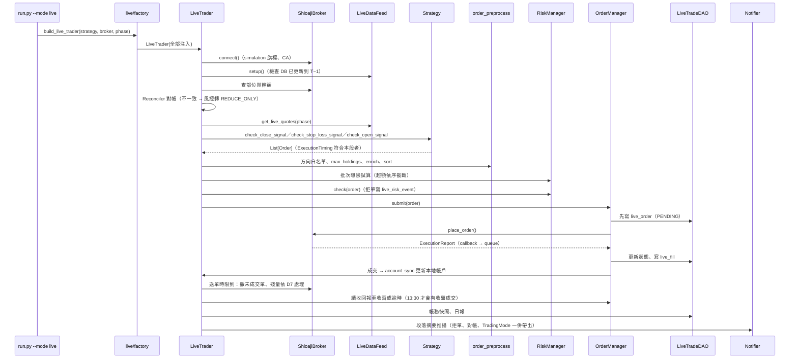

# 實盤下單架構規劃

## Abstract

- **背景／問題**：專案目前已經有「策略開發 → 爬蟲 pipeline → 回測」三段，但**沒有實盤下單**。
  - `run.py --mode live` 呼叫後直接拋 `NotImplementedError`。
  - Shioaji 相關程式只有三支 `core/utils/` 工具，都是早期留下來的：
    - `OrderUtils.place_order()`：只能下股票單，參數用 dict 傳。
    - `Callback.order_callback()`：只印出股票成交回報，而且用 `print`。
    - `ShioajiAccount`：只能登入 production，沒有 CA 憑證啟用，也沒有模擬模式。
  - 缺少的部分：委託狀態追蹤、風控、對帳、紀錄落地、期貨下單、盤中行情迴圈，全部都還沒有。
- **目標**：按量化交易常見的分層，新增四層：
  - 「券商閘道（Broker Gateway）」：`core/broker/`。
  - 「委託管理與風控（OMS／Risk）」：`core/live/oms/`、`core/live/risk/`。
  - 「實盤引擎（Live Trader）」：`core/live/`。
  - 「回測與實盤共用的委託前處理」：`core/execution/`——這一層是兩邊不漂移的關鍵，方向白名單、`max_holdings`、排序只能有一份實作。

  同一支策略類別**不用改寫、也不用 `if live`**，就可以從回測切換到 Shioaji 模擬環境，再切換到正式環境。支援的交易型態：
  - 台股現股、融券／借券、現股當沖、盤中零股（融資做多依 D3，建議第一階段不開放）。
  - 指數期貨、股票期貨。
  - 日頻與盤中兩種執行頻率。

- **範圍界線（不做）**：
  - 不做選擇權。
  - 不做美股。
  - 不做多券商、多帳戶路由。
  - 不做演算法拆單（TWAP／VWAP）。
  - 不做前端下單介面。
  - 不做自動調參。
  - 通知管道只實作一個（Telegram），其餘管道只留 `BaseNotifier` 介面。**存活監控與告警本身要做**：實盤最常見的失效不是下錯單，而是「該跑的段落沒跑、沒人發現」，只寫 log 等於沒有監控（Phase4-7）。
  - **不改變任何既有回測結果**：回歸雙線必須零變動。D2 已定案為逐筆觸發（2026-09-19），不新增切片回放，`Scale.TICK` 的回測語意不動；代價是盤中策略的回測結果無法重現實盤的逐筆順序，只能當量級參考。
- **驗收標準**：
  1. `python run.py --mode live --broker shioaji --simulation` 可以在 Shioaji 模擬環境跑以下兩條路徑，各連續 5 個交易日：
     - 一支股票日頻策略。
     - 一支期貨策略。

     每筆委託、成交、每日部位快照都寫進 `tw_trading.db`，收盤後對帳零差異。

  2. 盤中模式可以在模擬環境跑完整個交易時段。斷線後會自動重連、重新訂閱，而且不會重複下單。
  3. 風控測試案例全部有測試覆蓋：
     - 單筆金額上限、單日金額上限。
     - 價格偏離參考價。
     - 下單頻率。
     - kill switch。
     - 對帳不一致時停止開新倉。
     - 批次送單的總曝險與單一標的集中度上限。
     - `TradingMode` 降級後重啟，模式仍然延續（不會因為重啟而默默恢復送單）。
  4. 每個交易日收盤後，實盤委託與「以當日正式資料重跑同一支策略」的委託清單逐筆比對，差異都能歸因（快照口徑、風控拒單、未成交、段落時點、跨策略守門），沒有 `UNEXPLAINED` 項目。**多策略時逐策略各比一份**。
  5. 演練期間關鍵事件（啟動、結束、拒單、對帳不一致、斷線、kill switch）都有推播送達；「排程沒跑」由 LiveTrader 之外的 watchdog 偵測得到。
  6. `python scripts/check_layer_deps.py`、`pytest`、`./scripts/run_regression.sh` 全部通過，回測 baseline 沒有重產。

---

> **2026-09-17：立項後複查。** 對照程式碼修正了幾處規劃錯誤，步驟數不變：
>
> - D1：台股尾盤段要 13:25 後才送單，否則會在逐筆交易時段成交；期貨時點改由 `InstrumentSpec` 提供。
> - D6 與 Phase3-3：可成交限價的容許滑價（2%）要小於風控的價格偏離上限（3%），原寫法會被自己的風控拒單；重複送單規則改成不擋分批建倉。
> - Phase4-1：開盤段不再把 OHLC 填成參考價（會讓漲幅訊號默默變 0），改成讀取時拋出。
> - Phase3-4：`enrich_orders()` 本來就委派給 CostModel，不搬；`order_preprocess` 只收純參數，並在 Phase0-4 登記預期的同層 import。
> - Phase3-2、Phase3-5、Phase5-2、Phase5-4 等：送出前崩潰的委託沒有 seqno、成交回報不帶手續費、單一事件 queue、`CONVERT_TO_MARGIN` 在實盤不存在、夜盤帳務日與行情查詢日分開。

> **2026-09-17：對照量化交易常見架構的健檢。** 分層（券商閘道／OMS／風控／引擎／資料）、
> 委託狀態機、先寫 DB 再送單、回報去重與重放、對帳、限流、`FakeBroker` 契約測試、`--dry-run`
> 與小額上線這些骨幹都在，缺的集中在**營運面**。本次補上六項，步驟數 40 → 42（2026-09-19 D4 改為多策略後再增三項，共 45）：
>
> - **缺告警與存活監控**（新增 Phase4-7）：所有異常只寫 log 與 DB，都是 pull 型；kill switch 也要人先發現不對勁才會去建檔。程式在 09:05 掛掉沒有任何人會知道。
> - **缺實盤與回測的訊號一致性比對**（新增 Phase4-8）：原本只記錄滑價。滑價可以事後校正，訊號漂移不行，而且不比對就看不出來。
> - **未成交殘量沒有政策**（新增 D7）：13:25 送的 ROD 單收盤未成交時怎麼辦沒寫。平倉／停損未成交會默默變成隔夜部位，風險遠大於開倉未成交。
> - **安全模式散在四個元件**（併入 Phase3-3）：風控、對帳、事件迴圈、session 各自會切「只允許平倉」／「全停」，但沒有單一持有者，也沒有落地——重啟等於偷偷解除 halt。
> - **`custom_field` 的用途選錯**（改 D4、Phase3-2、Phase4-1）：那 6 個字元應該拿來放 client order id 的壓縮碼，讓重啟接管由屬性猜測變成精確比對。**2026-09-19 D4 改為支援多策略後，這個結論不變、理由更強**：壓縮碼可經 `live_order.strategy_name` 反查策略，策略代號卻無法反查是哪一張單。
> - **缺稽核與曝險欄位**（改 Phase3-1、Phase3-3）：`live_run` 沒記 code version 與參數快照，出事查不到當時跑的是哪一版；風控只有逐單上限，一次送多張單時加總可能超額。
>
> 另外補了時區與時鐘偏差檢查（Phase0-3、Phase2-2）、交易日曆來源（Phase4-2）、`live_ready` 的
> 「狀態可重建」契約（Phase4-1）、`tw_trading.db` 的 WAL 與單一寫入者（Phase3-1）。
>
> **同日收尾複查**（不新增步驟）：散在各步驟的「安全模式」措辭統一成 `TradingMode` 的三個值；
> Phase4-3 的段落流程補完——**送單時限與連線關閉時點必須分開**，尾盤段的成交回報要 13:30 收盤
> 集合競價後才會進來，13:29 就關連線會讓當日 `live_fill` 出現空窗、對帳在錯的時點判定不一致；
> Phase4-5 補 `--broker`／`--resume-trading` 與退出碼 `6`（「昨天出事還沒人處理」要和「今天剛
> 出事」分得開）；Phase6-2 補換月兩腿的順序相依與失敗處理（平舊月未成交就不送開新月，否則曝險
> 翻倍）；Phase4-8 的單日回測結果不可覆蓋回歸 baseline；`live_risk_event` 補 `severity`、
> `live_parity_diff` 的建表併回 Phase3-1。

> **2026-09-19：策略共用前提補記與多策略複查。** D4 改為多策略後，依「策略層回測與實盤共用」
> 這條前提重新掃過一遍，補上 D0 並修正六處**會靜默出錯**的缺口（不新增步驟）：
>
> - **D0 補記**：這條前提整份文件都在用（Abstract、分層圖、現況盤點、驗收標準 4），卻從來沒有
>   被列為裁示項、也沒有寫下理由與代價。它正是 parity 比對存在的原因，補進〈待裁示事項〉。
> - **`live_schedule` 與 `bar_execution_order` 可能矛盾**（改 Phase4-1）：兩個鉤子分屬不同段落時，
>   實際順序由段落決定、`bar_execution_order` 形同失效；兩者宣告相反時會**靜默**改掉交易順序。
> - **`is_intraday` 兩邊的 list 語意不同**（改 Phase5-1）：實盤逐筆（長度 1）、回測 `Scale.TICK`
>   一次給整天。`live_ready` 擋得住「沒宣告」，擋不住「宣告了但橫斷面邏輯在逐筆下是錯的」。
> - **`CapitalAllocator` 啟動檢查的分母錯**（改 Phase3-8）：拿「可用資金」當分母，隔日只要還有
>   部位在場上就必然誤判成額度超標而拒絕啟動。
> - **策略層降級未釋放資金保留**（改 Phase3-8、Phase4-3）：該策略的額度會被佔住到重啟為止。
> - **`__unattributed__` 與 D8 守門的交互未定義**（改 Phase3-7、Phase3-9）。
> - **parity 少一類**（改 Phase4-8）：多策略的資金排擠造成的拒單，在各策略單獨回測裡不存在。
> - **`core.live.attribution` 與 `core.live.capital_allocator` 沒登記分層**（改 Phase0-4）：
>   D4 新增 Phase3-7~Phase3-9 時漏的，未登記的模組分層為 -1，一寫出來就會讓 `check_layer_deps.py` 失敗。
>
> 同日另依〈多策略〉§7 的前置條件調整兩步的做法（不新增步驟）：**Phase3-8、Phase3-9 的「判定」
> 與「讀寫」拆兩個檔**，判定以純函式放 `core/portfolio/aggregation.py`（該套件已存在，
> 內含 `signal.py`／`sizing.py`／`construction.py`；落點判準是「回答什麼問題」——資金分配與同標的仲裁
> 回答「帳戶最終持有什麼」，屬 portfolio 層，`core/execution/` 只留「委託怎麼送」）。跨策略仲裁是**只存在於實盤**的行為，日後補多策略
> 組合回測時回測端要能重用同一份判定，否則就是在跨策略層重演一次 D0 要避免的分家。

> **2026-09-19：實作前對照程式碼複查。** 動工前把規劃逐條對回現行程式碼，修正七處**一寫下去就會出事**
> 的落差（不新增步驟）：
>
> - **`PreOpenQuote` 的兩個陷阱**（改 Phase4-1）：`BaseQuote.__init__` 直接做 `self.open = open`，
>   子類把 OHLC 改成唯讀 property 會在**建構時**就 `AttributeError`；而 `signal_close` 在
>   `adj_close` 非 None 時**根本不讀 `close`**，會繞過拋出回傳還原價，訊號照樣算得出來——
>   那正是這一步要擋的那種靜默。
> - **策略層 `TradingMode` 沒有落地**（改 Phase3-1、Phase3-3、Phase4-3、Phase4-5）：日頻的
>   open／close／after_close 是**三個獨立行程**，帳戶層模式存進 `live_run` 讀得回來，策略層模式
>   不落地的話，開盤段降級的策略到尾盤段會靜默回到 `NORMAL`。
> - **「次日補平」待辦沒有完成標記**（改 Phase3-1、Phase4-6）：只記在 `live_run` 上，次日開盤段
>   重跑或崩潰重啟會**重複送補平單**，而重複的補平單會把部位做反。
> - **WAL 與 `synchronous=FULL` 落不到現行 `connect_sqlite()`**（改 Phase3-1）：它只有 `read_only`
>   參數、不下任何 PRAGMA，產出清單漏了 `core/dao/connection.py`。
> - **`core.live` 套件本身沒登記**（改 Phase0-4）：只登記了子模組。分層 -1 的模組 import 任何東西
>   都算反向相依，和先前漏登記 `core.live.attribution` 是同一類錯。
> - **watchdog 開不了紀錄庫時會靜默死掉**（改 Phase4-7）：WAL 的唯讀連線需要 `-shm`，交易行程已死
>   時它可能不在——剛好是最需要 watchdog 的時候。
> - **Phase7-1 的相依與驗收在兩處不一致**（改 Phase7-1）：進度表寫 Phase4-6~Phase4-8、驗收
>   1、2、4、5，章節內只寫 Phase4-6 與驗收 1、2。

## 進度追蹤表

| 編號     | 步驟名稱                                                     | 產出檔案                                                                                                                                                                                  | 驗證方式                                                                                                                                                               | 狀態 | 備註／中斷點                                                                                                                                                                                                                                                                                                                                        |
| -------- | ------------------------------------------------------------ | ----------------------------------------------------------------------------------------------------------------------------------------------------------------------------------------- | ---------------------------------------------------------------------------------------------------------------------------------------------------------------------- | :--: | --------------------------------------------------------------------------------------------------------------------------------------------------------------------------------------------------------------------------------------------------------------------------------------------------------------------------------------------------- |
| Phase0-1 | Shioaji 帳號前置：API 條款、CA 憑證、模擬環境 API 測試       | 本文件（完成紀錄）                                                                                                                                                                        | 模擬環境股票、期貨各下一筆並 `update_status()` 查得到；正式帳號具下單權限                                                                                              |  ✅  | **使用者手動**；阻塞 Phase7-2                                                                                                                                                                                                                                                                                                                       |
| Phase0-2 | 待裁示事項 D0~D8 定案                                        | 本文件〈待裁示事項〉                                                                                                                                                                      | 每項填入裁示結果與日期                                                                                                                                                 |  ✅  | 2026-09-19 全部定案。**D0（策略層不分家）為同日補記**——它是整份規劃一直在用、卻未曾寫下理由的前提。D1、D3、D5、D7、D8 採建議；**D2 改為逐筆觸發、D4 改為直接支援多策略、D6 改為允許市價單**，三條偏離建議的受影響步驟已同步改寫。D4 另帶出 D8 與三個新步驟（Phase3-7~Phase3-9），步驟數 42 → 45。原本被阻塞的 Phase4-1、Phase5-1、Phase4-6 皆已解除 |
| Phase0-3 | 實盤設定與環境變數                                           | `core/config/settings.py`、`core/config/schema.py`、`core/config/paths.py`、`.env.example`、`tests/test_config_consistency.py`、`tests/test_config_paths.py`                              | `pytest tests/test_config_consistency.py` 通過                                                                                                                         |  ✅  | 2026-09-19 完成，34 passed                                                                                                                                                                                                                                                                                                                          |
| Phase0-4 | 分層規則登記 `core/broker/`、`core/execution/`、`core/live/` | `scripts/check_layer_deps.py`                                                                                                                                                             | `python scripts/check_layer_deps.py` 通過；故意反向 import 會失敗                                                                                                      |  ✅  | 2026-09-19 完成，違規總數 0；反向 import 與「拿掉 `core.live` 登記」兩種負向情境都實測會失敗                                                                                                                                                                                                                                                        |
| Phase1-1 | 下單執行參數 Enum                                            | `core/utils/constant.py`、`core/utils/__init__.py`、`tests/test_order_state_parity.py`                                                                                                    | 與 `shioaji.constant` 同名 Enum 的值逐一比對                                                                                                                           |  ✅  | 2026-09-19 完成。**實測發現 shioaji 1.3.3 的 `StockOrderCond` 沒有 `SBLShort`**（只有 Cash／MarginTrading／ShortSelling），借券賣出要升版才送得出去，已列為 ratchet 並影響 Phase2-4、Phase6-1。**2026-09-21 升 1.7.5 後已解除**：`SBLShort` 自 1.7.2 起支援，ratchet 已移除、mapper 照常轉換（見 [Shioaji升級至1.7.md](Shioaji升級至1.7.md)）                                                                                                                                                       |
| Phase1-2 | 訂單模型補執行欄位（預設值維持回測行為）                     | `core/models/base/order.py`、`core/models/stock/order.py`、`core/models/futures/order.py`                                                                                                 | `./scripts/run_regression.sh` 零變動                                                                                                                                   |  ✅  | 2026-09-19 完成，回歸雙線零變動（兩條線都實際執行、無 skip）                                                                                                                                                                                                                                                                                        |
| Phase1-3 | 委託單、成交回報、帳務快照模型                               | `core/models/base/execution.py`、`core/models/stock/execution.py`、`core/models/futures/execution.py`、`tests/live/test_execution_models.py`                                              | 新增單元測試                                                                                                                                                           |  ✅  | 2026-09-19 完成，`tests/live/` 17 passed                                                                                                                                                                                                                                                                                                            |
| Phase2-1 | `BaseBroker` 抽象介面與測試用 `FakeBroker`                   | `core/broker/{__init__.py, base.py}`、`tests/live/{conftest.py, test_broker_contract.py}`                                                                                                 | `FakeBroker` 通過介面契約測試                                                                                                                                          |  ✅  | 2026-09-19 完成，契約測試 30 條、`tests/live/` 47 passed                                                                                                                                                                                                                                                                                            |
| Phase2-2 | `ShioajiSession`：登入、CA、模擬旗標、重連、限流             | `core/broker/rate_limiter.py`、`core/broker/tw/{__init__.py, shioaji_session.py}`、`scripts/manual/manual_shioaji_login.py`、`tests/live/{test_rate_limiter.py, test_shioaji_session.py}` | 限流單元測試；模擬環境登入、登出冒煙腳本                                                                                                                               |  ✅  | 2026-09-22 模擬環境冒煙完成：登入、兩個帳號、合約檔日期檢查、登出。2026-09-19 程式與單元測試完成（33 passed）。**剩冒煙未跑**：`manual_shioaji_login.py` 需真實金鑰，**相依 Phase0-1（使用者手動）**。時鐘偏差改為雙層檢查（見步驟章節） |
| Phase2-3 | 合約解析：上市櫃、指數期貨、股票期貨                         | `core/broker/tw/shioaji_contract_resolver.py`、`tests/live/test_shioaji_contract_resolver.py`                                                                                             | 以假合約表單元測試；模擬環境逐類實查一檔                                                                                                                               |  ✅  | 2026-09-22 模擬環境三類各實查一檔：2330、TXFJ6、股期 CDFJ6；68 檔標的有標準型與小型兩種股期，留給 Phase6-3 明確指定。2026-09-19 程式與 14 條單元測試完成；**模擬環境逐類實查待跑**（隨 Phase2-2 冒煙一起） |
| Phase2-4 | 委託轉換與合法組合檢查                                       | `core/broker/tw/shioaji_order_mapper.py`、`tests/live/test_shioaji_order_mapper.py`                                                                                                       | 合法組合矩陣的參數化測試                                                                                                                                               |  ✅  | 2026-09-19 完成，37 passed（本步驟的驗證本來就不需連網）                                                                                                                                                                                                                                                                                            |
| Phase2-5 | 委託與成交回報正規化（callback → queue）                     | `core/broker/tw/shioaji_execution_handler.py`、`core/models/base/execution.py`（新增 `OrderStatusEvent`）、`tests/live/test_shioaji_execution_handler.py`                                 | 重放錄下的 callback 訊息：亂序、重複都能得到同一結果                                                                                                                   |  ✅  | 2026-09-22 委託、撤單與成交回報都已以模擬環境實際回報核對（股票與期貨各一組成交）；另記期貨代號格式落差給 Phase6-2。2026-09-19 程式與 18 條單元測試完成（含亂序＋重複的重放測試）；**parser 的欄位名取自官方文件、尚未以實際回報核對**，要以錄製模式錄一天再確認 |
| Phase2-6 | 帳務查詢：餘額、交割款、部位、期貨保證金 | `core/broker/tw/shioaji_account_query.py`、`tests/live/test_shioaji_account_query.py` | 以假回傳物件單元測試；模擬環境冒煙 | ✅ | 2026-09-22 模擬環境冒煙完成；修正持倉成本少乘 1000（張 × 每股價）。2026-09-19 程式與 15 條單元測試完成；**欄位名已離線自 shioaji 的 pydantic 模型核對**（非猜測），剩模擬環境冒煙。相依 Phase2-2 |
| Phase2-7 | 即時行情：快照與 tick／bidask 訂閱 | `core/broker/tw/shioaji_quote_stream.py`、`tests/live/test_shioaji_quote_stream.py` | 轉出的 `StockQuote`／`FuturesQuote` 欄位與回測版一致 | ✅ | 2026-09-22 模擬環境冒煙完成：快照（含 250 檔分批）、逐筆訂閱；修正快照時間偏 8 小時。2026-09-19 程式與 24 條單元測試完成；**`volume` 必須取 `total_volume`、`Snapshot.ts` 是奈秒**兩條已釘住。快照單次上限與實際值待冒煙。相依 Phase2-3 |
| Phase2-8 | `ShioajiBroker` 組裝 | `core/broker/tw/shioaji_broker.py`、`tests/live/test_shioaji_broker.py` | 通過與 `FakeBroker` 相同的介面契約測試（模擬環境） | ✅ | 2026-09-22 模擬環境契約測試 10 條全過（新增 `tests/live/test_shioaji_sim.py`，兩個 marker 預設跳過）。2026-09-19 組裝與 37 條單元測試完成（介面完整性、參數名一致、委派、限流歸類、狀態對照）；**契約測試要在模擬環境跑一次**才算完成。相依 Phase2-2~Phase2-7 |
| Phase3-1 | 實盤紀錄資料庫 `tw_trading.db` 與 DAO | `core/config/schema.py`、`core/dao/connection.py`、`core/dao/tw/live_trade_dao.py`、`tests/test_dao_live_trade.py` | 建表冪等；同一筆成交寫兩次不重複 | ✅ | 2026-09-20 完成，26 passed。**`INSERT OR REPLACE` 改為指定衝突目標的 UPSERT**（見步驟章節）。相依 Phase1-3、Phase0-3 |
| Phase3-2 | `OrderManager` 委託狀態機 | `core/live/{__init__.py, oms/}`、`core/broker/execution_dedup.py`、`tests/live/test_order_manager.py` | 狀態轉移表的參數化測試；非法轉移會拋出 | ✅ | 2026-09-20 完成，32 passed。回報佇列改為**單筆跳過**而非整批中止（見步驟章節）。相依 Phase2-1、Phase3-1 |
| Phase3-3 | `PreTradeRiskManager`、`TradingMode` 狀態機與批次曝險檢查 | `core/live/risk/{__init__.py, risk_config.py, risk_manager.py, trading_mode.py}`、`tests/live/{test_risk_manager.py, test_trading_mode.py}` | 每條規則一個測試；kill switch 生效後零委託送出；降級後重啟模式仍延續（帳戶層與策略層各一） | ✅ | 2026-09-20 完成，45 passed（風控 31 ＋ 交易模式 14）。金額與曝險類已寫成模組層級純函式。相依 Phase3-2 |
| Phase3-4 | 共用委託前處理：從 `Backtester` 抽出 | `core/execution/{__init__.py, order_preprocess.py}`、`core/backtest/backtester.py`、`tests/execution/test_order_preprocess.py` | 回歸雙線零變動；實盤與回測呼叫同一函式；`order_preprocess` 不 import `core.strategies` | ✅ | 2026-09-20 完成，19 passed；**回歸雙線零變動**（兩條線都實際執行、無 skip）。單獨一個 commit |
| Phase3-5 | 帳戶同步：成交 → 本地 Account，券商快照覆寫 | `core/live/account_sync.py`、`tests/live/test_account_sync.py` | 以 `FakeBroker` 重放一天的成交，本地部位＝券商部位 | ✅ | 2026-09-20 完成（與 Phase3-6 共 15 passed）。**重建期間停用餘額檢查**（見步驟章節）。相依 Phase2-6、Phase3-2、Phase3-7 |
| Phase3-6 | 對帳器 `Reconciler` | `core/live/reconciler.py`、`tests/live/test_account_sync.py` | 刻意製造差異時轉入 `REDUCE_ONLY` 並寫入 `live_risk_event` | ✅ | 2026-09-20 完成。三項比對：與券商、本地兩份紀錄、融資券別。相依 Phase3-5 |
| Phase3-7 | 策略部位歸屬帳 `PositionAttributionLedger` | `core/live/attribution/{__init__.py, position_ledger.py}`、`tests/live/test_position_ledger.py` | 兩支策略各自開平同一批標的互不影響；加總等於券商部位；沖銷順序與 `PositionManager` 逐筆相同 | ✅ | 2026-09-20 完成，16 passed。**先於 Phase3-5 施作**（歸屬帳是帳戶同步的下層）。相依 Phase3-1 |
| Phase3-8 | 資金額度分配 `CapitalAllocator` | `core/live/capital_allocator.py`、`core/portfolio/aggregation.py`、`core/live/risk/risk_config.py`、`tests/live/test_capital_allocator.py` | 額度總和超過帳戶**總權益**時啟動被拒；**持倉續跑時不誤判**；併發保留後第二支的可用資金已扣掉第一支；策略降級後 `release_all()` 把額度還回去 | ✅ | 2026-09-20 完成（與 Phase3-9 共 20 passed）。`CAPITAL_SAFETY_RATIO` 放 `risk_config.py` 而非 `schema.py`（見步驟章節）。相依 Phase2-6、Phase3-3 |
| Phase3-9 | 跨策略衝突守門（D8 同標的只允許一支持有） | `core/live/attribution/conflict_guard.py`、`core/portfolio/aggregation.py`（與 Phase3-8 共用）、`tests/live/test_capital_allocator.py` | A 持有時 B 的新倉被擋、平倉照過；被擋的單歸類為 `CROSS_STRATEGY_BLOCKED` | ✅ | 2026-09-20 完成。判定為純函式；守門認得 SHORT 的買進是平倉。相依 Phase3-7、Phase3-4 |
| Phase4-1 | 日頻執行時點契約（`ExecutionTiming`） | `core/strategies/base.py`、`core/utils/constant.py`、`core/models/{base,stock,futures}/quote.py`、`core/live/strategy_guard.py`、`tests/live/test_live_ready_guard.py` | 回歸零變動；未宣告 `live_ready` 的策略拒絕進入實盤；開盤段讀 `quote.close`／`quote.signal_close` 都會拋出；**`live_schedule` 與 `bar_execution_order` 矛盾時拒絕啟動** | ✅ | 2026-09-20 完成，25 passed；**回歸雙線零變動**。`PreOpenQuote` 的三個陷阱都處理了（setter、`adj_close`、`signal_close`）。相依 D1、D0、Phase1-2 |
| Phase4-2 | `LiveDataFeed`：歷史到 T−1＋當日快照＋資料新鮮度檢查 | `core/live/datafeed/{__init__.py, base.py, calendar.py}`、`core/live/datafeed/tw/{stock,futures}_live_datafeed.py`、`tests/live/test_live_datafeed.py` | DB 未更新到 T−1 時拒絕啟動；報價欄位與回測版一致 | 🔄 | 2026-09-20 程式與 20 條單元測試完成。**官方休市日曆未做**（規劃允許，已列已知限制）：平日只剩券商合約檔一個來源，Phase7-1 要跨一個休市日驗證。相依 Phase2-7 |
| Phase4-3 | `LiveTrader` 日頻流程（市場無關） | `core/live/trader.py`、`core/live/segment.py`、`tests/live/test_live_trader_day.py` | `FakeBroker` 端到端：開盤段、尾盤段、盤後段 | ✅ | 2026-09-20 完成，14 passed（含 `FakeBroker` 端到端）。**等待迴圈加了獨立於時鐘的保險絲**（見步驟章節）。相依 Phase3-3~Phase3-9、Phase4-1、Phase4-2 |
| Phase4-4 | 實盤 factory | `core/live/factory.py`、`tests/live/test_live_factory_and_entry.py` | 未支援的（市場, 商品）組合拋出含兩軸值的 `ValueError` | ✅ | 2026-09-20 完成。**台股與期貨的尾盤時窗不重疊，同一次執行不可混跑**（見步驟章節）。相依 Phase4-3 |
| Phase4-5 | `run.py --mode live` 接線與安全旗標 | `run.py`、`tests/live/test_live_factory_and_entry.py`、`tests/test_run_entry.py` | 未加 `--confirm-production` 時不可能連到正式環境 | ✅ | 2026-09-20 完成，19 passed。退出碼 2/3/4/5/6 各自分開；`--phase after_close` 明確拒絕（Phase4-6 未做）。相依 Phase4-4 |
| Phase4-6 | 盤後作業：撤未成交單、對帳、快照、日報、未成交殘量 | `core/live/trader.py`、`core/live/report/{__init__.py, live_reporter.py}`、`core/live/oms/order_manager.py`、`core/dao/tw/live_trade_dao.py`、`run.py`、`tests/live/{test_after_close.py, test_live_trader_day.py}` | `results/live/<Strategy>/` 產出日報；對帳結果寫入 DB；平倉單未成交時次日補平 | ✅ | 2026-09-20 主流程與 32 條測試完成；2026-09-22 以模擬環境核對券商損益查詢：**Shioaji 不提供逐筆成交的手續費與稅**，逐筆回填做不到，改以日彙總校正另立 Phase4-9。相依 Phase4-3、D7 |
| Phase4-7 | 事件通知與存活監控（LiveTrader 之外的 watchdog） | `core/live/notify/{__init__.py, base.py, factory.py, telegram_notifier.py}`、`scripts/live_watchdog.py`、`core/live/{trader.py, factory.py}`、`tests/live/test_notifier.py` | 通知端拋例外時交易流程不受影響；watchdog 測得出「段落沒跑」與「跑到一半死掉」 | ✅ | 2026-09-20 完成，28 passed。三條鐵律各有測試；watchdog 讀不到紀錄庫本身就推播 CRITICAL。相依 Phase4-6 |
| Phase4-8 | 實盤與回測每日訊號一致性比對（parity）                       | `core/live/report/parity_checker.py`、`core/config/schema.py`                                                                                                                             | 刻意少送一張單時，diff 抓得到並歸類為 `UNEXPLAINED`                                                                                                                    |  🔄  | 相依 Phase4-6                                                                                                                                                                                                                                                                                                                                       |
| Phase4-9 | 盤後以券商已實現損益校正成本估算 | `core/broker/tw/shioaji_account_query.py`、`core/live/after_close.py`、測試 | 期貨 fee＋tax 與股票推得的實際成本，與本地估算逐日比對並落地 | ⬜ | 2026-09-22 自 Phase4-6 拆出（券商不提供逐筆費用）。相依 Phase4-6；不阻塞 Phase7-1 |
| Phase5-1 | 盤中策略契約（逐筆觸發）                                     | `core/strategies/base.py`、`core/strategies/README.md`、`core/backtest/README.md`、`core/backtest/backtester.py`                                                                          | 同一段錄製 tick 餵兩次，訊號一致；**`is_intraday=True` 的策略跑 `Scale.TICK` 回測時拒絕啟動**                                                                          |  ✅  | D2 已定案為逐筆觸發（2026-09-19），不做 `bar_builder`；**橫斷面策略要自己維護跨標的狀態**，且回測側無法重現逐筆順序，限制寫進 `core/backtest/README.md`。2026-09-19 補回測側守門：兩邊的 `List[StockQuote]` 語意不同（實盤長度 1、回測整天），`live_ready` 擋不住這種錯                                                                             |
| Phase5-2 | 盤中事件迴圈：行情 queue、心跳、報價過期偵測                 | `core/live/intraday/event_loop.py`                                                                                                                                                        | 注入延遲、斷線事件後轉入 `REDUCE_ONLY`，不送新倉單                                                                                                                     |  ✅  | 相依 Phase5-1、Phase4-3                                                                                                                                                                                                                                                                                                                             |
| Phase5-3 | 斷線重連、重新訂閱與重啟後恢復狀態                           | `core/broker/tw/shioaji_session.py`、`core/live/trader.py`                                                                                                                                | 在任意時點殺掉行程後重啟：不重複下單、未完成委託重新接管                                                                                                               |  ✅  | 相依 Phase5-2                                                                                                                                                                                                                                                                                                                                       |
| Phase5-4 | 日終強制動作：當沖回補、期貨夜盤跨日歸屬                     | `core/live/intraday/session_guard.py`                                                                                                                                                     | 模擬 13:20 仍有當沖部位時觸發回補                                                                                                                                      |  🔄  | 相依 Phase5-2                                                                                                                                                                                                                                                                                                                                       |
| Phase5-5 | 常駐部署與排程                                               | `docker-compose.yml`、`docs/deployment/live-deployment.md`、`core/live/termination.py`、`run.py`、測試 | 容器內跑完一個模擬交易日；SIGTERM 會先撤單再結束                                                                                                                       | 🔄 | 2026-09-22 compose `live` service、SIGTERM 收尾（退出碼 143）、部署與排程文件完成；**剩容器內以模擬環境跑一個完整交易日**。相依 Phase5-3 |
| Phase6-1 | 融資融券與現股當沖下單                                       | `core/broker/tw/shioaji_order_mapper.py`、`core/live/risk/risk_manager.py`                                                                                                                | 券源不足或不可當沖的標的在送單前被擋                                                                                                                                   |  ⬜  | 相依 Phase2-4、Phase3-3、D3                                                                                                                                                                                                                                                                                                                         |
| Phase6-2 | 指數期貨：代號轉換與開平倉別 | `core/broker/tw/shioaji_contract_resolver.py`、`shioaji_execution_handler.py`、`shioaji_account_query.py`、`shioaji_quote_stream.py`、`shioaji_order_mapper.py`、`shioaji_broker.py` | 四條路徑（成交回報、委託回報、部位、快照）都是 `{商品}{YYYYMM}`；平倉單送 `Cover`；模擬環境期貨成交回報的代號等於訂單代號 | ✅ | 2026-09-22 完成：四條路徑統一為 `TX202610`、平倉送 `Cover`；模擬環境期貨成交回報代號等於訂單代號。原本的換月與保證金另立 Phase6-6、Phase6-5 |
| Phase6-3 | 股票期貨合約與乘數                                           | `core/broker/tw/shioaji_contract_resolver.py`                                                                                                                                             | 乘數取自合約並與 `futures_stock_universe` 交叉比對                                                                                                                     |  ⬜  | 相依 Phase6-2；[暫緩工作彙整.md](暫緩工作彙整.md) S4 的行情回補同屬股期                                                                                                                                                                                                                                                                             |
| Phase6-4 | 盤中零股                                                     | `core/models/stock/order.py`、`core/broker/tw/shioaji_order_mapper.py`                                                                                                                    | 數量單位錯配（張當股）在建立委託時就拋出                                                                                                                               |  ⬜  | 相依 Phase2-4                                                                                                                                                                                                                                                                                                                                       |
| Phase6-5 | 送單前的期貨保證金檢查 | `core/live/risk/margin_gate.py`（新）、`core/live/trader.py`、`core/live/factory.py`、`core/live/datafeed/tw/futures_live_datafeed.py`、`core/managers/futures/position_manager.py`、測試 | 可用保證金不足時不送單並寫事件；足夠時照常送出 | ✅ | 2026-09-22 完成：策略層（帳戶可動用餘額，與回測同口徑）＋帳戶層（券商可用保證金；模擬環境回 0 時略過、正式環境擋單，使用者裁示）；實盤補注入保證金表 |
| Phase6-6 | 期貨換月：平舊月＋開新月兩腿 | `core/live/trader.py`、`core/live/datafeed/base.py`、`core/live/datafeed/tw/futures_live_datafeed.py`、`core/live/factory.py`、`core/broker/tw/shioaji_contract_resolver.py`、測試 | 換月日模擬環境實跑一次；平倉腿未成交時開倉腿放棄並寫事件 | 🔄 | 2026-09-22 程式與 17 條測試完成（最後交易日前 1 個交易日換月，使用者裁示）；**剩換月日模擬環境實跑**：台指期 10 月契約最後交易日 2026-10-21，換月日為 **2026-10-20** 尾盤段。相依 Phase6-2、Phase6-5 |
| Phase7-1 | 模擬環境端到端演練（連續 5 個交易日）                        | 本文件（演練紀錄）                                                                                                                                                                        | 對應 Abstract 驗收標準 1、2、4、5                                                                                                                                      |  ⬜  | 相依 Phase4-6~Phase4-8、Phase5-5、Phase6-2、Phase6-5、Phase6-6                                                                                                                                                                                                                                                                                                          |
| Phase7-2 | 正式環境小額上線檢查表                                       | `docs/live/production-checklist.md`                                                                                                                                                       | 使用者逐項勾選                                                                                                                                                         |  ⬜  | 相依 Phase0-1、Phase7-1                                                                                                                                                                                                                                                                                                                             |
| Phase7-3 | 舊 Shioaji 工具收斂                                          | `core/utils/order.py`、`core/utils/callback.py`、`core/utils/account.py`、`core/pipeline/tw/updaters/*_tick_updater.py`、`scripts/manual/manual_tick_crawler.py`                          | `grep -rn "OrderUtils\|Callback.order_callback"` 無結果；tick updater 冒煙通過                                                                                         |  ⬜  | 相依 Phase2-2                                                                                                                                                                                                                                                                                                                                       |
| Phase7-4 | 文件                                                         | `docs/live/live-trading.md`、`docs/backtest/module-map.md`、`docs/dev/runtime-artifacts.md`、`README.md`、`README_en.md`、`core/strategies/README.md`                                     | `python scripts/check_doc_paths.py` 通過                                                                                                                               |  ⬜  | 相依 Phase7-1                                                                                                                                                                                                                                                                                                                                       |

---

## 現況盤點（2026-09-17）

### 可以直接沿用的設計

| 既有設計                                                                                                                                                        | 在實盤的用途                                                         |
| --------------------------------------------------------------------------------------------------------------------------------------------------------------- | -------------------------------------------------------------------- |
| 策略四個鉤子 `check_open_signal`／`check_close_signal`／`check_stop_loss_signal`／`calculate_position_size`，輸入是 `List[BaseQuote]`、輸出是 `List[BaseOrder]` | 實盤引擎呼叫同樣的鉤子，只替換「委託之後的事」                       |
| `(market, instrument_type)` 由策略基底宣告，`factory.py` 分派                                                                                                   | 實盤 factory 用同一組分派鍵                                          |
| `BaseDataFeed`：策略的 `setup_apis(feed)` 只從 feed 取 API                                                                                                      | `LiveDataFeed` 繼承它，策略不用改                                    |
| `StockPositionManager`／`FuturesPositionManager`                                                                                                                | 成交回報進來後更新本地帳戶，策略讀到的 `self.account` 結構和回測一樣 |
| `TwStockSpec` 的價格檔位與漲跌停推算                                                                                                                            | 送單前把價格對齊檔位、檢查漲跌停區間                                 |
| `FuturesRollConfig`／`select_near_month()`                                                                                                                      | 實盤換月和回測共用同一份規則                                         |
| `SHIOAJI_FUTURES_CATEGORY`（2026-09-02 已實查核對）                                                                                                             | 指數期貨的合約解析                                                   |
| `OrderState`／`Status` Enum 與 `tests/test_order_state_parity.py`                                                                                               | 回報狀態和 Shioaji 值對齊的護欄                                      |
| `core/dao/` 與 `connect_sqlite()`                                                                                                                               | 實盤紀錄庫沿用同一套 DAO 分層                                        |

### 必須補上、或語意對不上的地方

1. **日頻 bar 在實盤不存在**。回測的 `Scale.DAY` 是在一次呼叫裡同時拿到當日 OHLC：
   - `ForeignSellShortDayTradeStrategy` 以 `quote.open` 放空，同一根 bar 以 `quote.close` 回補。
   - 實盤在開盤前不知道 `close`，在收盤前也不知道完整 OHLC。

   所以**同一個呼叫不可能在實盤成立**，必須拆成「開盤段」與「尾盤段」兩次呼叫（D1）。

2. **回測的 `Scale.TICK` 不是事件驅動**。`run_tick_backtest()` 一次把整天的 tick 交給 `execute_bar()`，策略拿到的是「全天 tick」。實盤只會一筆一筆收到 tick，兩者訊號語意不同（D2）。[多市場回測引擎架構](../docs/backtest/multi-market-engine.md) §5.1 把事件驅動迴圈列為暫緩，本文件不重寫回測引擎。
3. **訂單模型沒有執行參數**。`StockOrder` 沒有以下欄位，`FuturesOrder` 也沒有 `octype`：
   - `price_type`（限價／市價）。
   - `order_type`（ROD／IOC／FOK）。
   - `order_lot`（整股／零股）。
   - `order_cond`（現股／融資／融券）。
4. **回測沒有融資做多**：`MarginCost` 在程式裡標明「本階段僅定義不啟用」。實盤如果開放融資，回測就對不上（D3）。
5. **委託前處理只寫在 `Backtester` 裡**：方向白名單（`validate_orders()`）、`max_holdings`（`check_max_holdings()`）、`sort_orders()`。實盤如果自己再寫一份，就會漂移（Phase3-4）。補 `short_method`／`is_day_trade` 的 `enrich_orders()` 在引擎裡只是委派給 `CostModel.enrich_orders()`，實盤注入同一個 CostModel 即可共用。
6. **舊 Shioaji 工具**：
   - 用 `print`，違反 Coding Style §2.9。
   - 登入沒有 `simulation` 與 `activate_ca`。
   - `get_settlement_capital()` 用 `loc[1:2]` 依位置取交割款，日後交割日數一變就會算錯。
   - tick updater 與 `scripts/manual/manual_tick_crawler.py` 也依賴這批工具，所以要到 Phase7-3 才收斂，不能直接刪。

### Shioaji 官方限制（2026-09-17 查 sinotrade.github.io）

| 項目                                                                                   | 限制                                                                                                                                                         | 對設計的影響                                                                                                                    |
| -------------------------------------------------------------------------------------- | ------------------------------------------------------------------------------------------------------------------------------------------------------------ | ------------------------------------------------------------------------------------------------------------------------------- |
| 正式下單前                                                                             | 要先以 `simulation=True` 完成股票、期貨 API 測試，並 `activate_ca()`                                                                                         | Phase0-1，使用者手動                                                                                                            |
| 下單類（`place_order`／`update_status`／`update_qty`／`update_price`／`cancel_order`） | 每 10 秒合計 250 次                                                                                                                                          | `RateLimiter` 分類限流，**`update_status` 也算在內**，不能拿它輪詢                                                              |
| 帳務類（`account_balance`／`list_positions`／`margin`／`list_settlements`…）           | 每 5 秒合計 25 次                                                                                                                                            | 帳務以回報驅動為主，查詢只在對帳時點做                                                                                          |
| 行情查詢（`snapshots`／`ticks`／`kbars`／`credit_enquires`／`short_stock_sources`）    | 每 10 秒合計 50 次；盤中 `ticks` 最多 10 次                                                                                                                  | 快照分批、快取                                                                                                                  |
| 訂閱                                                                                   | 每個連線最多 200 檔                                                                                                                                          | 盤中策略的標的上限要在啟動時檢查                                                                                                |
| 同帳號連線                                                                             | 最多 5 條                                                                                                                                                    | 實盤與 tick 爬蟲共用額度，不要同時開太多                                                                                        |
| 登入                                                                                   | 每日 1,000 次                                                                                                                                                | 重連要退避，不能無限重試                                                                                                        |
| 超限處置                                                                               | 查詢超限暫停服務 1 分鐘，重複違規封 IP／ID                                                                                                                   | 限流器採保守額度（預設用官方上限的 80%）                                                                                        |
| `custom_field`                                                                         | 英數字，最多 6 字元                                                                                                                                          | 放不下完整 client order id，故放 base36 壓縮碼（D4、Phase3-2）；**不放策略代號**，壓縮碼反查得到策略，反之不然                  |
| 期貨 `octype`                                                                          | `Auto`／`New`／`Cover`／`DayTrade`                                                                                                                           | 開平倉別由訂單的 `Action` 推導，不交給 `Auto` 猜                                                                                |
| 股票 `order_cond`                                                                      | 文件寫 `Cash`／`MarginTrading`／`ShortSelling`／`SBLShort`／`SBLShortPriceExempt`，1.3.3 的 Enum 只有前三個（2026-09-19 Phase1-1 實測）；**1.7.2 起五個都有**（2026-09-21 升 1.7.5 重驗） | 由 `ShortMethod` 推導；借券照常轉成 `SBLShort`。mapper 查不到對應值時仍一律拋出，不可退回 `ShortSelling` |
| 股票 `order_lot`                                                                       | `Common`／`Fixing`／`Odd`／`IntradayOdd`                                                                                                                     | `IntradayOdd` 的數量單位是股                                                                                                    |

---

## 目標架構

### 分層（新增部分以粗體標示）

```
入口層        run.py（--mode backtest | live）
                │
策略層        core/strategies/            ← 同一支策略，回測與實盤共用
                │
組裝層        core/backtest/factory.py    **core/live/factory.py**
                │                              │
引擎層        Backtester                  **LiveTrader**（市場無關，無子類）
                ├── backtest/models/          ├── **live/oms/**（OrderManager）
                ├── backtest/datafeed/        ├── **live/risk/**（PreTradeRiskManager）
                ├── managers/  ◄──共用──────┤── **live/account_sync.py、reconciler.py**
                └── backtest/report/          ├── **live/datafeed/**（LiveDataFeed）
                                              ├── **live/intraday/**（盤中迴圈）
                                              └── **live/notify/**（事件推播與存活監控）
                │                              │
部位建構層    core/portfolio/（已存在：signal.py／sizing.py／construction.py）
                └── **aggregation.py**        跨策略：資金分配、同標的仲裁（判定，純函式）
共用前處理    **core/execution/**（兩邊共用的純邏輯，不碰 broker／DB）
                └── order_preprocess.py       方向白名單、max_holdings、sort
                │
券商閘道層    **core/broker/**（BaseBroker ＋ tw/Shioaji 實作）
                │
資料層        core/api/ ── core/adapters/
資料存取層    core/dao/（＋ **live_trade_dao.py**）── data/db/（＋ **tw_trading.db**）
領域層        core/models/（＋ **execution.py**：委託單、成交回報、帳務快照）
共用層        core/utils/（＋ 下單執行 Enum）
```

### 目錄

```
core/
├── broker/
│   ├── base.py                         # BaseBroker：市場無關的券商介面
│   ├── rate_limiter.py                 # 分類 token bucket
│   └── tw/
│       ├── shioaji_session.py          # 登入、CA、模擬旗標、重連、事件回呼
│       ├── shioaji_contract_resolver.py
│       ├── shioaji_order_mapper.py     # 領域訂單 ⇄ sj.StockOrder／sj.FuturesOrder
│       ├── shioaji_execution_handler.py# callback → ExecutionReport → queue
│       ├── shioaji_account_query.py
│       ├── shioaji_quote_stream.py     # snapshots／subscribe → StockQuote／FuturesQuote
│       └── shioaji_broker.py           # 組裝上面各元件，實作 BaseBroker
├── execution/
│   └── order_preprocess.py             # 方向白名單、max_holdings、排序（只收純參數，不 import 策略）
├── portfolio/                          # 已存在（signal／sizing／construction），本文件只加一個檔
│   └── aggregation.py                  # 跨策略：資金分配與同標的仲裁的**判定**（純函式，不碰 broker／DB）
└── live/
    ├── trader.py                       # LiveTrader
    ├── factory.py                      # build_live_trader()
    ├── account_sync.py
    ├── reconciler.py
    ├── capital_allocator.py              # 多策略資金額度保留／釋放
    ├── attribution/                      # 多策略歸屬
    │   ├── position_ledger.py            # live_position_lot 讀寫、策略 ⇄ 部位
    │   └── conflict_guard.py             # D8 同標的守門
    ├── oms/order_manager.py
    ├── risk/{risk_config.py, risk_manager.py}
    ├── datafeed/{base.py, tw/stock_live_datafeed.py, tw/futures_live_datafeed.py}
    ├── intraday/{bar_builder.py, event_loop.py, session_guard.py}
    ├── notify/{base.py, telegram_notifier.py}
    └── report/{live_reporter.py, parity_checker.py}
```

存活監控刻意放在 `scripts/live_watchdog.py`，**不在 `core/live/` 裡**：它必須是獨立行程，
和 LiveTrader 一起死的心跳等於沒有監控。

目錄軸線沿用[命名軸線](../docs/dev/naming-axes.md)的規則：

- `core/broker/` 與 `core/live/datafeed/` 的子目錄**只承載市場軸**（`tw/`）。
- 券商名稱（shioaji）與商品類別由檔名承載。

### 多策略：歸屬與衝突

> D4 已定案為**直接支援一個帳戶跑多支策略**（2026-09-19）。本節是那個決定的完整設計，
> Phase3-1、Phase3-2、Phase3-3、Phase3-5~Phase3-9、Phase4-3、Phase4-4 都依它施作。

**所有難題都來自同一件事：券商端只有一本合併帳。** 一個帳戶、一組部位、一筆餘額，
券商完全不知道「策略」是什麼。策略是純本地概念，所以多策略要做的就是：
維護一本**本地歸屬帳**，並在它與券商合併帳之間保持隨時可對帳。

#### 1. 行程形狀：單一行程、單一 session

| 元件                         | 數量 | 理由                                                                                                                                           |
| ---------------------------- | :--: | ---------------------------------------------------------------------------------------------------------------------------------------------- |
| 作業系統行程                 |  1   | 下面三項的必然結果                                                                                                                             |
| `ShioajiSession`（登入／CA） |  1   | 一個帳戶一組憑證；多重登入的行為未定義                                                                                                         |
| `RateLimiter`                |  1   | **限流是帳戶級的**（`ORDER` 250 筆／10 秒）。多行程各自持有 limiter 時，每個都以為自己還有額度，合起來必然超額，而且誰都不知道是誰把額度用掉的 |
| `OrderManager`               |  1   | 回報 callback 是 session 級的；分成多個 OMS 就得先把回報分派出去，那等於在更下層再做一次歸屬                                                   |
| `Strategy`                   |  N   | 多策略的本體                                                                                                                                   |
| `Account`（本地）            | N＋1 | 每策略一份（歸屬帳）＋帳戶層一份（與券商對帳用）                                                                                               |

`build_live_trader()` 因此由收一支策略改為收一份策略清單（Phase4-4）。

#### 2. 委託歸屬：`custom_field` 仍放 client order id

多策略下**更**應該把那 6 個字元留給 client order id，而不是策略代號：

- 壓縮碼 → 本地 `live_order` → 該列的 `strategy_name`，**反查得到策略**。
- 策略代號只能知道「哪一支策略」，**無法知道是哪一張單**；重啟接管仍得靠屬性模糊比對，
  而模糊比對正是多策略下最容易對錯的地方——兩支策略可能在同一秒對不同標的送出相似的單。

`live_order` 新增 `strategy_name` 欄（不可為空），是歸屬鏈的起點。

#### 3. 部位歸屬：`live_position_lot`

券商合併部位無法拆回策略，所以本地自己記：

- 每次**開倉成交**新增一筆 lot（`strategy_name`、`symbol`、`direction`、`volume`、
  `open_date`、`open_price`、來源 `client_order_id`）。
- 平倉成交時**只沖銷該策略自己的 lot**，沖銷順序與回測的 `PositionManager` 一致。
- 不變式：**Σ 各策略 lot 淨額（依 symbol、direction）＝ 券商部位**。這條就是 Phase3-6 的對帳式。

#### 4. 資金歸屬：`CapitalAllocator`

D5 定了「`init_capital` 是本策略的額度上限」，多策略下必須再加兩件事，否則兩支策略會同時
看到「帳戶還有 100 萬」而各自下 80 萬，第二張單被券商退：

- **啟動時檢查**：Σ 各策略額度 ≤ 帳戶可用資金 × 安全係數（預設 0.95）。不滿足就**拒絕啟動**，
  不要等到盤中被券商退單才發現。
- **送單前保留、終結時釋放**：委託送出前向 allocator 保留金額，成交、拒單、撤單、逾時各自釋放。
  策略可用資金 ＝ `min(本策略額度 − 本策略已用, 帳戶可用餘額 − 其他策略已保留)`。

#### 5. 跨策略衝突：同一標的只允許一支策略持有（D8）

- 守門在 `order_preprocess` 之後、風控之前：新倉單的標的若已被其他策略持有或掛單，直接擋下，
  寫 `live_risk_event`（`severity=WARN`）。**平倉單不受限**——擋平倉會讓部位失去出場能力。
- 這道守門同時解掉三個問題：券商端反向沖銷、台股同日一買一賣被**判成當沖**（稅率與成本和回測不同、
  還會吃掉當沖額度）、以及歸屬帳一對多的拆分。
- 代價是策略選股重疊時會有一支吃不到，實盤績效低於各自單跑的回測。這個差異**是預期的**，
  Phase4-8 的 parity 要把它歸類為 `CROSS_STRATEGY_BLOCKED`，不可混進 `UNEXPLAINED`。

#### 6. 風控分層

| 層級   | 規則                                              | 觸發時                                      |
| ------ | ------------------------------------------------- | ------------------------------------------- |
| 帳戶層 | kill switch、當日最大虧損、總曝險上限、對帳不一致 | **全體**策略降級（`REDUCE_ONLY`／`HALTED`） |
| 策略層 | `max_holdings`、單一標的上限、該策略當日虧損上限  | 只降該策略，其他照常                        |

**對帳差異一律走帳戶層**：差異無法歸因到單支策略，猜錯的代價是讓真正有問題的那支繼續交易。
`TradingMode` 因此要能同時表達「帳戶層模式」與「各策略模式」，實際可否送單取兩者的嚴格者。

#### 7. 這樣做的已知限制

- 融券張數、當沖額度、單一標的集中度都是**帳戶級**資源，D8 的守門只擋同標的，
  不同標的之間仍可能互相排擠額度；第一階段不處理，由帳戶層曝險上限兜底。
- 券商因追繳或違約造成的強制平倉**無法歸屬**，一律記為帳戶層事件並轉 `REDUCE_ONLY`，由人工判斷。
- **帳戶層的組合績效在回測端無法重現**（2026-09-19 補，本節最大的一條）：D0 保證了「單支策略」
  在兩邊一致，但多策略新增的三件事——資金排擠（Phase3-8）、同標的仲裁（Phase3-9）、
  帳戶層風控降級（§6）——**只存在於實盤**，回測沒有對應物。後果是：各策略單獨回測的績效
  **不能相加**當成帳戶預期績效，而 parity 的 `CROSS_STRATEGY_BLOCKED` 與 `CAPITAL_EXHAUSTED`
  兩類差異，只量得出「差多少」，量不出「本來該是多少」。
  第一階段接受這個限制，並在 Phase7-1 的演練紀錄中把兩類差異的筆數與金額佔比記下來，
  作為日後要不要補「多策略組合回測」的依據。**要補的話，前置條件是這三件事的判定邏輯
  必須是不依賴 broker 與 DB 的純函式**——所以 Phase3-8、Phase3-9 實作時就要把
  「判定」與「讀寫」分開（判定放 `core/execution/`，讀寫留在 `core/live/`），
  等實盤跑起來再搬，等於把已經在線上的邏輯動手術。

### 一次日頻實盤的呼叫序列



**先寫 DB 再送單**：程式在 `place_order()` 前後崩潰時，重啟後可以用 `live_order` 的 PENDING 紀錄，以 `seqno`／`custom_field` 去券商查詢接管，不會因為「不知道送出去了沒」而重送。

---

## 待裁示事項

| 編號 | 問題                                                                                | 建議                                                                                                                                                                                                                                                                                                                                                                                                                                                                                                                                                                                                          | 不採建議的代價                                                                                                                                                                                                                                         | 裁示                                                                                                                                                                                                                                                                                                                                                                                                                                                                                                                                                                                                                                                                                                                                                                                                                                             |
| ---- | ----------------------------------------------------------------------------------- | ------------------------------------------------------------------------------------------------------------------------------------------------------------------------------------------------------------------------------------------------------------------------------------------------------------------------------------------------------------------------------------------------------------------------------------------------------------------------------------------------------------------------------------------------------------------------------------------------------------- | ------------------------------------------------------------------------------------------------------------------------------------------------------------------------------------------------------------------------------------------------------ | ------------------------------------------------------------------------------------------------------------------------------------------------------------------------------------------------------------------------------------------------------------------------------------------------------------------------------------------------------------------------------------------------------------------------------------------------------------------------------------------------------------------------------------------------------------------------------------------------------------------------------------------------------------------------------------------------------------------------------------------------------------------------------------------------------------------------------------------------ |
| D0   | 策略層是否與實盤分家（2026-09-19 補記；整份規劃一直以它為前提，但先前未列為裁示項） | **不分家**：一支策略類別同時供回測與實盤使用。分界線是 `check_*_signal()` 回傳的 `List[BaseOrder]`——上游（訊號）共用，下游才分開：回測走成交／成本模型，實盤走跨策略守門／風控／OMS／券商。實盤獨有的語意一律以**報價子類**（`PreOpenQuote`，Phase4-1）、**執行時點**（`ExecutionTiming`，D1）與**啟動守門**（`live_ready`，Phase4-1）表達，不用 `if live` 分支，也不開平行的 `Live`\* 策略類別。某支策略的實盤語意真的不同時（例如 `ForeignSellShortDayTradeStrategy` 以 `quote.open` 當放空價，盤前拿不到），分歧落在**策略上一個具名的可覆寫方法**，不落在平行類別——這樣 parity 才歸因得到                 | ① **驗收標準 4 當場失效**：parity 的 diff 會變成比對兩份不同的程式碼，`UNEXPLAINED` 永遠歸因不完，而它是「訊號有沒有漂」的唯一護欄；② 回測績效不再屬於實際在跑的那支策略；③ 兩份交易邏輯必然漂移，且漂移**不會報錯**（策略少下一張單沒有任何地方會叫） | **採建議**（2026-09-19）：不分家。D1（執行時點）、D2（逐筆觸發）、D6（市價單）三條的設計都是在承接這個決定的代價——**不分家不是沒有代價，是把代價收斂到看得見、量得到的地方**                                                                                                                                                                                                                                                                                                                                                                                                                                                                                                                                                                                                                                                                     |
| D1   | 日頻策略在實盤何時執行                                                              | 訂單新增 `ExecutionTiming`：`AT_OPEN`（台股 08:30~09:00 盤前委託，進開盤集合競價）、`AT_CLOSE`（台股 13:20 起取快照算訊號，**13:25:00 之後才送單**，13:29:00 前送完，讓委託進收盤集合競價；13:25 前送出的限價單會在逐筆交易時段就成交，成交價不是收盤價）。期貨的段落時點由 `InstrumentSpec` 提供、不寫死在 LiveTrader，實作前以 TAIFEX 公告核對收盤規則。LiveTrader 依段落只送符合的單。**回測忽略此欄位**（仍用策略給的價），因此回歸零變動。尾盤段只有 13:25~13:29 這 4 分鐘可送單，委託筆數多時要把限流等待算進去（`ORDER` 類 250 筆／10 秒，保守取 80% 即 200 筆／10 秒），Phase7-1 要記錄實際送完的耗時 | 如果改成「一律隔日開盤執行」，所有用 `quote.close` 成交的策略在實盤和回測之間會差一天                                                                                                                                                                  | **採建議**（2026-09-19）：雙段 `ExecutionTiming`（`AT_OPEN`／`AT_CLOSE`）                                                                                                                                                                                                                                                                                                                                                                                                                                                                                                                                                                                                                                                                                                                                                                        |
| D2   | 盤中策略的報價契約                                                                  | 採**時間切片**：策略宣告 `live_bar_seconds`（例如 5 秒），每片傳入「每檔最新一筆」`StockQuote`（`scale=TICK`，`tick_quote` 帶 bid/ask）。回測側另立文件新增「tick 切片回放」，讓兩邊走同一契約                                                                                                                                                                                                                                                                                                                                                                                                                | 沿用現行 TICK 回測（整天 tick 一次給）時，盤中策略的回測結果沒辦法拿來預估實盤                                                                                                                                                                         | **不採建議，改為逐筆觸發**（2026-09-19）。理由：Shioaji 訂閱後本來就是有報價就 callback 推進來，逐筆最貼近原生語意、延遲最低。**連帶影響（偏離建議，以下三項必須跟著做）**：① 策略鉤子每收到一筆 tick 呼叫一次，傳入的 `List[StockQuote]` 長度為 1，**橫斷面策略（跨標的挑前 N 強）要自己在策略內維護其他標的的最新狀態**，不能再假設一次拿得到全市場；② 不新增 `bar_builder`，也不另立「tick 切片回放」的 backlog；③ **回測側無法重現逐筆觸發**——回測沒有 wall clock，跨股票的到達順序取決於券商推送、本來就不保證，故盤中策略的回測結果只能當量級參考，不能當實盤預估，這點要寫進 `core/backtest/README.md`                                                                                                                                                                                                                                    |
| D3   | 融資做多是否開放                                                                    | **第一階段不開放**，只支援現股、融券、借券、現股當沖（回測都有對應的 `ShortMethod`）。融資等回測補上 `MarginCost` 後再開                                                                                                                                                                                                                                                                                                                                                                                                                                                                                      | 先開放的話，融資策略沒有可信的回測                                                                                                                                                                                                                     | **採建議**（2026-09-19）：第一階段不開放融資，只支援現股、融券、借券、現股當沖                                                                                                                                                                                                                                                                                                                                                                                                                                                                                                                                                                                                                                                                                                                                                                   |
| D4   | 一個帳戶跑幾支策略                                                                  | **第一階段同一帳戶、同一商品類別只跑一支策略**。券商部位沒有策略標記，多策略要做本地歸屬帳，複雜度高                                                                                                                                                                                                                                                                                                                                                                                                                                                                                                          | 多策略共用時，對帳無法判斷差異屬於哪一支                                                                                                                                                                                                               | **不採建議，直接規劃多策略**（2026-09-19）。理由：單策略是暫時狀態，架構若以它為前提，歸屬帳、資金分配、風控分層三件事日後都要重做，而這三件事一旦有部位在場上就很難改。**設計見〈多策略：歸屬與衝突〉**，重點：① 單一行程、單一 Shioaji session、單一 `OrderManager`、單一 `RateLimiter`——**限流是帳戶級的**（`ORDER` 250 筆／10 秒），多行程各自登入必然超額且互相不知情；② `custom_field` **仍放 client order id 壓縮碼**，但理由改了——壓縮碼可經本地 `live_order` 反查策略，策略代號卻無法反查是哪一張單，多策略下 order id 的資訊量嚴格較多；③ 新增 `live_position_lot` 歸屬帳，券商合併部位 ＝ Σ 各策略 lot；④ 資金由 `CapitalAllocator` 保留／釋放，啟動時檢查 Σ 各策略額度 ≤ 帳戶可用資金 × 安全係數；⑤ 風控分帳戶層與策略層，帳戶層任一觸發則**全體**降級；⑥ 對帳差異無法歸因到單支策略，故一律**全體**轉 `REDUCE_ONLY`，不嘗試猜是誰的 |
| D5   | 策略的資金基準                                                                      | `init_capital` 在實盤解讀為「本策略的資金額度上限」；可用資金取 `min(額度 − 已用, 券商可用餘額)`                                                                                                                                                                                                                                                                                                                                                                                                                                                                                                              | 直接用券商總餘額的話，策略會把帳戶其他資金也壓進去                                                                                                                                                                                                     | **採建議**（2026-09-19）：`init_capital` 為本策略額度上限，可用取 `min(額度 − 已用, 券商可用餘額)`                                                                                                                                                                                                                                                                                                                                                                                                                                                                                                                                                                                                                                                                                                                                               |
| D6   | 市價單政策                                                                          | **一律不送市價單**：需要「市價」語意時，改用可成交的限價＝基準價 ×（1 ± 容許滑價），基準價盤前用參考價、盤中用最新成交價，容許滑價預設 2%，對齊檔位後夾在漲跌停區間內。容許滑價必須小於風控的價格偏離上限（Phase3-3，預設 3%），否則自己換算出的價格會被自己的風控拒單。期貨不用 `MKP`，同樣換算成限價                                                                                                                                                                                                                                                                                                        | 台股市價單在流動性差的標的可能吃到極端價格；代價是跳空超過 2% 時可能不成交，成交率要在 Phase7-1 記錄                                                                                                                                                   | **不採建議，允許市價單**（2026-09-19）。**連帶影響（偏離建議）**：① `StockPriceType.MKT`／`FuturesPriceType.MKT`／`MKP` 由策略或 `order_preprocess` 實際送出，不再一律換算成限價；② **風控的「委託價偏離」規則對市價單形同不存在**（沒有價格可檢查），Phase3-3 要改成：市價單改以「下單前的基準價 × 可接受區間」做事前檢查，並在成交後以實際成交價回頭比對、超標寫 `live_risk_event`；③ **回測沒有市價單的對應物**——`TwStockFillModel` 是「成交價 ± 固定 bps」，S1 量到的滑價統計不適用於市價單，實盤成交價會系統性劣於回測，差距要在 Phase7-1 的演練紀錄與 Phase4-8 的 parity 比對中量出來                                                                                                                                                                                                                                                      |
| D7   | 未成交殘量的處理政策                                                                | **依用途分開**：開倉未成交一律**放棄**，不追價（追價等於在偏離訊號價的位置建倉，回測沒有這個行為）；平倉與停損未成交**必須補**——段落時限前 60 秒以 D6 的可成交限價重送一次（追價上限 1 次），仍未成交就寫 `live_risk_event`、推播 `CRITICAL`，並在次日開盤段第一件事補平                                                                                                                                                                                                                                                                                                                                      | 不定政策的話，回測「以收盤價成交」的假設在實盤只有部分成立；更嚴重的是平倉單漏成交會默默變成隔夜部位，與策略設計不符，而且這個差異不會有任何地方報錯                                                                                                   | **採建議**（2026-09-19）：開倉未成交放棄、平倉與停損必須補。**因 D6 改為允許市價單，重送方式一併調整**：原建議的「以 D6 的可成交限價重送」改為「以市價單重送」（追價上限仍為 1 次）；漲跌停鎖死或流動性枯竭導致市價單仍未成交時，照樣寫 `live_risk_event`、推播 `CRITICAL`，次日開盤段第一件事補平                                                                                                                                                                                                                                                                                                                                                                                                                                                                                                                                               |
| D8   | 兩支策略同時碰到同一標的、方向相反時怎麼辦（2026-09-19 因 D4 改為多策略而新增）     | **同一標的同時只允許一支策略持有**（先搶先贏）：該標的已被一支策略持有或掛單時，其他策略對它的**新倉單**直接擋下並寫 `live_risk_event`；平倉單不受限                                                                                                                                                                                                                                                                                                                                                                                                                                                          | 允許反向的話，台股同日同標的一買一賣會被券商**判成當沖**——稅率與成本跟回測不同、還會吃掉當沖額度，而且兩邊部位在券商端互相沖銷，本地卻各自以為持有                                                                                                     | **採建議**（2026-09-19）：同一標的只允許一支策略持有。歸屬帳因此永遠是一對一，對帳、當沖判定與成本都與回測一致。**已知代價**：策略選股重疊時會有一支吃不到，實盤績效會低於各自單跑的回測，此差異要在 Phase4-8 的 parity 比對中歸類為 `CROSS_STRATEGY_BLOCKED`，不可混進 `UNEXPLAINED`                                                                                                                                                                                                                                                                                                                                                                                                                                                                                                                                                            |

---

## 步驟詳述

### Phase0-1. Shioaji 帳號前置 ✅

- **目的**：正式環境下單權限要先完成官方流程，程式沒辦法代勞。
- **做法**（使用者手動）：
  1. 在永豐金證券網站簽署 API 使用條款，確認已申請股票與期貨 API 權限。
  2. 下載 CA 憑證（`.pfx`），放在**專案目錄以外**的位置（例如 `~/.alphaedge/ca/`），不要進 git 或容器映像。
  3. 以 `sj.Shioaji(simulation=True)` 登入並 `activate_ca()`，股票、期貨各送一筆 ROD 限價單（數量 1），以 `api.update_status()` 確認狀態。
  4. 在本文件記下完成日期、使用的 shioaji 版本（2026-09-21 起 `uv.lock` 為 `1.7.5`；下方 2026-09-21 的紀錄是 1.3.3 時期所寫）。
- **產出**：本步驟章節末尾的完成紀錄。
- **驗證方式**：模擬環境兩筆委託都查得到；正式帳號狀態顯示可下單。
- **相依**：無。

> **🔄 進行中（2026-09-21 台北時間，模擬環境實連）**
>
> **已完成**：條款簽署、股票 API 權限、模擬環境登入。shioaji `1.3.3`。
>
> **1.7.5 重驗（2026-09-22 盤中，模擬環境）**：股票與期貨帳號都已取得（下方「期貨 API 權限未開通」已解除），股票與期貨各送一筆 ROD 限價單（跌停價，不成交）並撤單，`update_status()` 分帳號刷新後都查得到 `Cancelled`。合約欄位改變：`update_date` 由斜線字串改為 `datetime.date`、`unit` 改為 `float`、股票不再有 `multiplier`／`underlying_code`；期貨分類為 373 類。細節見 [Shioaji升級至1.7.md](Shioaji升級至1.7.md) S2、S5。
>
> **未完成，阻塞其他步驟**：
> - **期貨 API 權限未開通**——`futopt_account` 為 `None`，登入時 `_verify_accounts()`
>   已警告「Shioaji 帳號缺少：期貨」。**阻塞 Phase6-2（指數期貨）與 Phase7-2**。
> - 步驟做法第 3 點的「股票、期貨各送一筆 ROD 限價單並以 `api.update_status()` 確認」
>   尚未執行（`manual_shioaji_login.py` 刻意不下單）。
>
> **合約欄位實測（`2330`，取代先前「欄位存在但值待確認」的記載）**：
>
> | 欄位 | 值 | 型別 |
> |---|---|---|
> | `reference` | 2460.0 | float |
> | `limit_up` / `limit_down` | 2705.0 / 2215.0 | float |
> | `update_date` | `'2026/09/21'` | **str，斜線格式不是 ISO** |
> | `day_trade` | `DayTrade.Yes` | enum |
> | `margin_trading_balance` / `short_selling_balance` | 77 / 34 | int |
> | `unit` | 1000 | int |
> | `multiplier` / `underlying_code` | 0 / `''` | 股票為空，股期才有值 |
>
> 期貨分類代碼實測 **391 類**，含 `TXF`／`MXF`／`TMF`。
>
> **這次實連撈到兩個缺陷，都已修**：
>
> 1. **合約檔日期檢查從來沒有生效過。** `_fetch_contract_update_date()` 只以
>    `fromisoformat()` 解析，而券商回的是 `'2026/09/21'`——解析失敗被 `except` 吞成
>    `None`，於是只印一行「略過本機日期檢查」。Phase2-2 設計的三層時鐘檢查裡，
>    **「擋差一天以上」那一層是死的**，而那正是最致命的一種偏差。
>    已改為接受 `%Y/%m/%d` 與 `%Y-%m-%d`；**格式不認得時改記 warning 而非 debug**
>    ——欄位在但格式不對是程式該更新的訊號，不是環境問題，debug 等於沒有人會看到。
>    測試替身原本用 ISO 格式，所以單元測試一直是綠的：這正是該步驟自己記載的
>    「parser 欄位名取自文件、尚未以實際回報核對」風險成真。
> 2. **`manual_shioaji_login.py` 把本機時間標成台北時間**（`datetime.datetime.now()`）。
>    在非台灣的機器上會印出「連線時間（台北）：2026-09-20T22:49」而實際台北是
>    次日 10:49——**而這支腳本正是拿來查時鐘問題的**。已改用 `now_live()`。
>
> **✅ 完成紀錄（2026-09-21 台北 13:13，模擬環境）**
>
> - **期貨 API 權限已開通**：登入取得 3 個帳號，`futopt_account` 不再是 None。
> - **兩筆測試委託都被券商受理並撤單**（`scripts/manual/manual_shioaji_test_order.py`）：
>
>   | 商品 | 價格 | 狀態 |
>   |---|---|---|
>   | 股票 2330 | 2215（跌停價）| `Submitted` → `Cancelled` |
>   | 期貨 TXFJ6（近月，交割 2026/10/21）| 42686（跌停價）| `Submitted` → `Cancelled` |
>
> - **價格取合約的 `limit_down`**：台指期當時跌停價 42686、現價約 47000，
>   手寫版本的 `price=15000` 會落在跌停價下方將近 28000 點，交易所必定退單——
>   而退單訊息看起來會像權限問題。
> - **過程中撞到三件事，都已處理**：
>   1. 手寫版本用了不存在的 `sj.constant.FuturesOrderType`（1.3.3 只有共用的
>      `OrderType`；1.7.5 重驗仍然如此，2026-09-21），送單前就 `AttributeError`。
>   2. 第一次實跑用 `timeout=0`，`place_order()` 在券商回覆前就回傳，狀態一律是
>      `Inactive`、委託序號是空的——看起來像被拒，其實只是還沒收到回覆。改為等 5 秒。
>   3. **`ShioajiSession.close()` 把 session token 寫進 log**：登出逾時的例外訊息
>      帶著 JWT 與含身分證的 client 名稱，而 `opt(exception=True)` 讓 loguru 連
>      traceback 每一層的區域變數都印出來。`redact_credentials()` 早就存在、
>      `connect()` 也照著用，`close()` 與 `reconnect()` 沒跟上。已修並補回歸測試
>      （確認過它在舊程式碼下會失敗）。
> - 第一次實跑的 `401 Token is expired` 是 **session 衝突**而非權限或時效
>   （JWT 有效期 24 小時）：同一帳號在另一處（臨時測試用的 notebook）也登入著。
>   該組金鑰因為貼進過對話與 git 歷史，已重新產生。


### Phase0-2. 待裁示事項定案 ✅

> **✅ 完成紀錄（2026-09-19）**
>
> - D1、D3、D5、D7、D8 採建議；**D2 改為逐筆觸發、D4 改為直接支援多策略、D6 改為允許市價單**，三條偏離建議。
> - **同日補記 D0（策略層不分家）**：這條前提 Abstract、分層圖、現況盤點與驗收標準 4 都在用，
>   卻從來沒有被列為裁示項。補上後才看得出 D1、D2、D6 的設計都是在承接它的代價。
>   依 D0 重新掃過一遍後修正六處缺口，見〈2026-09-19：策略共用前提補記與多策略複查〉。
> - **D4 改為多策略**是本次最大的一條：新增 D8（同標的只允許一支策略持有）、新增 Phase3-7（歸屬帳）、
>   Phase3-8（資金額度分配）、Phase3-9（跨策略衝突守門），並改寫 Phase3-1（schema）、Phase3-2（`custom_field` 理由）、
>   Phase3-3（風控分帳戶層／策略層）、Phase3-5（帳戶同步逐策略）、Phase3-6（對帳改合併口徑）、
>   Phase4-3（LiveTrader 編排多策略）、Phase4-4（factory 收策略清單）、Phase4-8（parity 新增 `CROSS_STRATEGY_BLOCKED`）。
>   完整設計見〈多策略：歸屬與衝突〉。步驟數 42 → 45。
> - 偏離建議的受影響步驟已同步改寫：Phase1-2（`price_type` 的 None 語意）、
>   Phase3-3（委託價偏離規則拆成限價／市價兩條）、Phase5-1（改為逐筆觸發、不做 `bar_builder`）、
>   Phase5-2（切片計時器改心跳、報價過期改以每檔最後更新時間判斷）、
>   kill switch 檢查時點（切片邊界改為每 N 筆行情事件）。
> - D7 的重送方式因 D6 一併調整為市價單重送（追價上限仍 1 次）。
> - 原本被阻塞的 Phase4-1、Phase5-1、Phase4-6 皆已解除。

- **目的**：D0~D8 會決定模型欄位與引擎流程，先定案避免返工。
- **做法**：逐項在〈待裁示事項〉表填入裁示與日期；偏離建議時，同步修改受影響步驟的做法。
- **產出**：本文件。
- **驗證方式**：表內沒有「待定」。
- **相依**：無。

### Phase0-3. 實盤設定與環境變數 ✅

- **目的**：模擬／正式切換、憑證位置、紀錄庫路徑集中管理。
- **做法**：
  - `core/config/settings.py` 新增：
    - `SHIOAJI_CA_PATH`、`SHIOAJI_CA_PASSWORD`。
    - `SHIOAJI_PERSON_ID`：多帳號時才需要。
    - `ALPHAEDGE_LIVE_KILL_SWITCH_PATH`：檔案存在即停止送單。
    - `ALPHAEDGE_LIVE_NOTIFY_CHANNEL`、`ALPHAEDGE_LIVE_NOTIFY_TOKEN`、`ALPHAEDGE_LIVE_NOTIFY_TARGET`：通知管道設定（Phase4-7）。缺值時退化為不推播，但**啟動時要 log 警告並寫 `live_run`**，不可靜默——「以為有告警其實沒有」比「知道沒有告警」危險。
  - 沿用既有 `API_KEY`／`API_SECRET_KEY`。**刻意不提供** `ALPHAEDGE_LIVE_PRODUCTION` 這類環境變數：正式環境只能由命令列 `--confirm-production` 開啟，避免 `.env` 殘留設定讓排程默默連到正式環境。
  - `core/config/schema.py` 新增 `TW_TRADING_DB_NAME = "tw_trading.db"`、`TW_TRADING_DB_PATH`，以及 Phase3-1 的表名常數。
  - `core/config/paths.py` 新增 `LIVE_RESULT_DIR_PATH = RESULTS_DIR_PATH / "live"`。回測結果直接放在 `RESULTS_DIR_PATH/<策略名>/`，實盤日報要另開子目錄，不能和回測輸出混在同一層。
  - `.env.example` 補上各鍵與說明；缺值時為 `None`，由實際使用處 `require_*()`，不在 import 時拋出（沿用 `require_tick_db_path()` 的理由）。
  - **時區**：實盤整份流程由時點驅動（08:30／13:20／13:25／15:00），時間一律用 `Asia/Taipei` 的 aware datetime，**不要用 naive 的 `datetime.now()`**。容器與排程環境設 `TZ=Asia/Taipei`（Phase5-5）。主機是 UTC 而程式讀本地 naive 時間時，尾盤段會整段跑在錯的時刻，而且不會有任何錯誤訊息。
- **產出**：上列檔案。
- **驗證方式**：`pytest tests/test_config_consistency.py`。
- **相依**：無。

> **✅ 完成紀錄（2026-09-19）**
>
> - `settings.py`：`SHIOAJI_CA_PATH`／`SHIOAJI_CA_PASSWORD`／`SHIOAJI_PERSON_ID` 與
>   `require_shioaji_ca()`（缺值或檔案不存在時當場拋 `RuntimeError`）；
>   `LIVE_TIMEZONE_NAME`／`get_live_timezone()`／`now_live()`；
>   `LIVE_NOTIFY_CHANNEL`／`_TOKEN`／`_TARGET`。
> - **時區物件刻意不在模組層級建好**：精簡容器映像沒裝 tzdata 時 `ZoneInfo()` 會拋
>   `ZoneInfoNotFoundError`，而 `core.config` 被全專案 import，等於連回測都啟動不了。
>   故改為 `get_live_timezone()` 惰性取得，與 `require_tick_db_path()` 同一個理由。
> - `paths.py`：`LIVE_RESULT_DIR_PATH`（`results/live/`）、`LIVE_KILL_SWITCH_PATH`
>   （預設 `data/live/KILL_SWITCH`，可由 `ALPHAEDGE_LIVE_KILL_SWITCH_PATH` 覆寫）。
>   kill switch 用「檔案存在」而不是環境變數：值班的人要能不重啟、不改設定就按下它，
>   而它在容器掛載的 volume 裡，從宿主機 `touch` 一行就到位。
> - `schema.py`：`TW_TRADING_DB_NAME`／`TW_TRADING_DB_PATH`，以及 Phase3-1 的 11 個表名常數
>   （含本次複查新增的 `live_strategy_mode`、`live_pending_action`）。
> - `.env.example`：新增 6 個鍵，全部以註解形式列出（都是選填）。
> - 測試：既有的 `.env.example` 雙向核對自動涵蓋新鍵；另補四條——正式環境不可由環境變數開啟
>   （掃出任何含 `PRODUCTION` 的鍵就失敗）、`require_shioaji_ca()` 的兩條拋出路徑、
>   `now_live()` 必須是 aware datetime；`test_config_paths.py` 另補
>   「`LIVE_RESULT_DIR_PATH` 不得等於回測結果根」與「交易庫與研究庫分開」。
> - 驗證：`pytest tests/test_config_consistency.py tests/test_config_paths.py` → **34 passed**；
>   `ruff format`／`ruff check` 通過。

### Phase0-4. 分層規則登記 ✅

- **目的**：新套件從第一行就受分層護欄保護。
- **做法**：在 `scripts/check_layer_deps.py` 做以下調整：
  - `_LAYER_RULES` 新增：
    - `("core.broker", 3, "券商閘道層", False)`：只可 import `core.config`／`core.utils`／`core.models`，**不可 import `core.api`**，券商層不讀歷史資料。
    - `("core.execution", 4, "共用委託前處理", False)`。
    - `("core.portfolio", 4, "部位建構層", False)`：**已登記完成，本步驟不必再加**（隨 `core/portfolio/` 建立時一併登記）。實際白名單比原先規劃寬：可 import `core.models`／`core.utils`／`core.config`／`core.api`，**不可 import `core.backtest`／`core.live`／`core.strategies`**；另因 `FuturesPortfolioConstructor` 需要 `FuturesMarginConfig`，會出現 `core.portfolio` → `core.managers` 的同層邊（F 區，刻意）。跨策略仲裁的判定（`aggregation.py`）也在這一層。
    - `("core.live.oms", 4, ...)`、`("core.live.risk", 4, ...)`、`("core.live.datafeed", 4, ...)`、`("core.live.intraday", 4, ...)`、`("core.live.report", 4, ...)`。
    - `("core.live.account_sync", 4, ...)`、`("core.live.reconciler", 4, ...)`、`("core.live.notify", 4, ...)`。
    - `("core.live.attribution", 4, ...)`、`("core.live.capital_allocator", 4, ...)`（2026-09-19 補）：
      D4 改為多策略時新增了 Phase3-7~Phase3-9 三個步驟，卻漏了在此登記。**未登記的模組分層為 -1，
      任何 import 都會被判成反向相依**，這兩個套件一寫出來就會讓 `check_layer_deps.py` 失敗。
      - `core.live.notify` 只可 import `core.config`／`core.utils`：通知是旁路，不該碰模型或 DAO，這樣它壞掉也不可能拖垮交易主流程。
    - `("core.live", 5, "實盤引擎層（套件本身）", False)`（2026-09-19 補）：只登記子模組不夠——
      `core/live/__init__.py` 的模組名是 `core.live`，沒有規則命中就是分層 -1，**它 import 任何
      東西都會被判成反向相依**（和上面漏登記 `core.live.attribution` 同一類錯）。對照組是
      `core.backtest`，它本來就登記了套件本身。另外沿用 `core/backtest/__init__.py` 的作法：
      **套件層不 eager import**，否則 `core.live` → `core.live.factory` → `core.strategies`
      會湊出循環（那個檔案的註解已經記下同一個坑）。
    - `("core.live.trader", 5, "實盤引擎本體", False)`。
    - `("core.live.factory", 6, "組裝層", False)`。
  - `_MARKET_AXIS_PACKAGES` 加入 `core/broker`、`core/live/datafeed`。
  - 「市場語意洩漏」檢查目前寫死 `core/backtest/backtester.py` 一個路徑，要改成引擎清單並加入 `core/live/trader.py`；`if market ==` 的檢查以檔名 `factory.py` 放行，本來就涵蓋 `core/live/factory.py`。
  - **預期會出現的「同層互相 import」**（腳本只列出、不影響結束碼，但要在本步驟先登記理由，避免之後被當成新問題）：
    - `core.live.datafeed` → `core.backtest.datafeed.base`：`LiveDataFeed` 繼承 `BaseDataFeed`，因為策略的 `setup_apis(feed)` 型別就是它。把 `BaseDataFeed` 移到中立位置不在本文件範圍。
    - `core.live.account_sync` → `core.managers`：沿用 `PositionManager` 更新本地帳戶。
    - `core.live.risk` → `core.backtest.models.instrument_spec`：價格檔位與漲跌停。
    - **已存在**：`core.strategies.stock.base` → `core.portfolio.sizing`／
      `core.portfolio.construction`、`core.strategies.futures.base` → `core.portfolio.construction`、
      `core.portfolio.construction` → `core.managers.futures.position_manager`。
      前兩條正是分層重構要的方向（策略契約 import 部位建構層），第三條是保證金設定的落點。
  - `core.execution` 刻意設計成**只 import `core.utils`／`core.models`**，由呼叫端傳入 `position_type`、`enable_intraday` 等純參數，不 import `core.strategies.base`，避免新增一條同層邊。
- **產出**：`scripts/check_layer_deps.py`。
- **驗證方式**：腳本通過；寫一個臨時檔讓 `core/broker` import `core/live`，確認腳本會失敗。
- **相依**：無。

> **✅ 完成紀錄（2026-09-19）**
>
> - `_LAYER_RULES` 新增 14 條：`core.broker`（3）、`core.execution`（4）、
>   `core.live.{oms,risk,datafeed,intraday,report,attribution,account_sync,reconciler,capital_allocator,notify}`（4）、
>   **`core.live`（5，套件本身）**、`core.live.trader`（5）、`core.live.factory`（6）。
>   `core.portfolio` 本來就已登記，未重複加。
> - `_MARKET_AXIS_PACKAGES` 加入 `core/broker`、`core/live/datafeed`。
> - 市場語意洩漏檢查由寫死 `core/backtest/backtester.py` 改為 `_ENGINE_FILES` 清單，
>   加入 `core/live/trader.py`：兩邊用同一條規則，實盤引擎若分出 `TwStockLiveTrader` 子類，
>   就會重演回測引擎當初的分裂。
> - 驗證：`python scripts/check_layer_deps.py` → **違規總數 0**；兩種負向情境都實測：
>   ① 臨時讓 `core/broker/bad.py` import `core.live.trader` → B 區抓到、退出碼 1；
>   ② 臨時拿掉 `("core.live", 5, …)` 這條登記 → `core/live/__init__.py` 只是 import
>   `core.config` 就被判成 `core.live（未分類）-> core.config`、退出碼 1，
>   證實本次複查補的那條登記不是形式上的對稱，而是真的會擋人。臨時檔已刪除。
> - **本步驟只登記，不建立套件**：`core/broker/`、`core/execution/`、`core/live/` 由
>   Phase2-1 起隨實作建立（「先登記再寫程式」的意思是規則先到，不是空目錄先到）。

### Phase1-1. 下單執行參數 Enum ✅

- **目的**：專案內部用自己的 Enum，券商值的轉換只發生在 mapper，券商型別不外洩到領域層。
- **做法**：`core/utils/constant.py` 依 §2.7 先定義模組常數，再定義 Enum：
  - 既有 `StockPriceType`（LMT／MKT）沿用；新增 `FuturesPriceType`（LMT／MKT／MKP）。
  - 既有 `OrderType`（ROD／IOC／FOK）沿用；既有 `StockOrderLot` 沿用。
  - 新增 `StockOrderCond`（Cash／MarginTrading／ShortSelling／SBLShort）、`FuturesOCType`（Auto／New／Cover／DayTrade）。
  - 新增 `ExecutionTiming`（`AT_OPEN`／`AT_CLOSE`／`IMMEDIATE`），依 D1 定案。
  - 新增 `LiveOrderStatus`，是本專案的委託狀態：`PENDING_SUBMIT`／`SUBMITTED`／`PARTIALLY_FILLED`／`FILLED`／`CANCELLED`／`REJECTED`／`FAILED`。
    - 與既有 `Status` 分開：`Status` 是券商值的鏡像，`LiveOrderStatus` 是 OMS 狀態機的狀態，兩者由 mapper 轉換。
- **產出**：`core/utils/constant.py`、`core/utils/__init__.py`。
- **驗證方式**：擴充 `tests/test_order_state_parity.py`，逐一比對與 `shioaji.constant` 同名 Enum 的值。
- **相依**：無。

> **✅ 完成紀錄（2026-09-19）**
>
> - 新增 Enum：`FuturesPriceType`（LMT／MKT／MKP）、`StockOrderCond`、`FuturesOCType`、
>   `ExecutionTiming`（`AT_OPEN`／`AT_CLOSE`／`IMMEDIATE`）、`LiveOrderStatus`（7 個狀態）。
>   既有的 `StockPriceType`／`OrderType`／`StockOrderLot` 沿用未動。全部先定義模組層級常量再由 Enum 引用（§2.7）。
> - **實測發現：shioaji 1.3.3 的 `StockOrderCond` 只有 `Cash`／`MarginTrading`／`ShortSelling`**，
>   沒有官方文件列的 `SBLShort`／`SBLShortPriceExempt`。借券賣出（`ShortMethod.SBL`）是回測已支援的
>   放空管道，故本專案的 Enum **保留 `SBLShort`**，但：
>   - 這筆落差寫成 `tests/test_order_state_parity.py` 的 ratchet（`_MEMBERS_MISSING_IN_SHIOAJI`），
>     **新出現或消失都會讓測試變紅**——升版後 shioaji 補上了就要移除該條並讓 mapper 真的支援。
>   - **Phase2-4 的 `order_cond` 推導表在 1.3.3 下送不出 SBL 單**，mapper 查不到對應值時要當場拋出，
>     **不可退回 `ShortSelling`**：那會用融券的券源與成本送出一張以為是借券的單，
>     而回測那邊算的是議定費率，兩邊的成本從此對不上且不會報錯。Phase6-1 的借券支援因此隱含「先升 shioaji」。
>   - **1.7.5 重驗（2026-09-21）**：`SBLShort`／`SBLShortPriceExempt` 都有了，ratchet 已移除該條、mapper 照常轉換；
>     「券商 Enum 缺成員時必須拋出、不可退回」的保證改用缺成員的替身 Enum 驗證，不再依賴安裝版本（見 [Shioaji升級至1.7.md](Shioaji升級至1.7.md) S3）。
> - 新增測試四條：同名 Enum 的值逐一比對（8 個 Enum 參數化）、成員落差對照 ratchet、
>   `LiveOrderStatus` 與 `Status` 的值域不得相交（兩者都是 `str` Enum，值撞上時
>   `local == broker` 會安靜地成立，而重啟接管靠的正是這兩者的差別）。
>   `Action` 刻意不納入鏡像比對：本專案多了 `OPEN`／`CLOSE`，成員名也用大寫，本來就不是鏡像。
> - 驗證：`pytest tests/test_order_state_parity.py` → 12 passed；全專案 `pytest` → **1376 passed**；
>   `check_layer_deps.py` 違規 0。

### Phase1-2. 訂單模型補執行欄位 ✅

- **目的**：策略可以表達「怎麼成交」，回測行為不變。
- **做法**：
  - `BaseOrder` 新增以下欄位，全部有預設值，回測不讀它們：
    - `order_type: OrderType = OrderType.ROD`。
    - `timing: Optional[ExecutionTiming] = None`：None 時由 LiveTrader 依策略 `live_schedule` 決定，D1。
    - `client_order_id: Optional[str] = None`：由 OMS 填入，策略不用填。
  - `StockOrder` 新增 `price_type: Optional[StockPriceType] = None`、`order_lot: StockOrderLot = StockOrderLot.Common`；`FuturesOrder` 新增 `price_type: Optional[FuturesPriceType] = None`。兩種商品的價格類型值域不同（期貨多一個 `MKP`），所以放在子類別，不放 `BaseOrder` 用 `str` 混著裝。None 表示由 `order_preprocess` 依策略意圖決定；D6 已定案為允許市價單（2026-09-19），需要市價語意時直接送 `MKT`／`MKP`，不再一律換算成限價。`order_cond` **不開放策略填寫**，由 `order_preprocess` 依 `position_type` ＋ `short_method` ＋ `is_day_trade` 推導，和回測的成本路徑保證一致。
  - `FuturesOrder` 不新增 `octype` 欄位，由 mapper 依 `Action` 與持倉推導（Phase6-2）。
- **產出**：`core/models/base/order.py`、`core/models/stock/order.py`、`core/models/futures/order.py`。
- **驗證方式**：`./scripts/run_regression.sh` 零變動；`pytest tests/backtest`。
- **相依**：Phase1-1、D1、D6。

> **✅ 完成紀錄（2026-09-19）**
>
> - `BaseOrder` 新增 `order_type`（預設 ROD）、`timing`（預設 None）、`client_order_id`（預設 None），
>   兩個子類別逐一往上傳；`StockOrder` 另加 `price_type`、`order_lot`，`FuturesOrder` 另加 `price_type`。
>   照規劃**沒有**加 `order_cond`（由送單前的轉換推導）與 `octype`（由 mapper 推導）。
> - **`copy.copy(order)` 的三處成交路徑不受影響**：`FillModel`／`SettlementModel` 用的是淺複製，
>   新欄位會原樣跟著走。若當初是逐欄位重建副本，新欄位就會在成交時被默默丟掉——
>   實作前已確認過這點。
> - 驗證：`./scripts/run_regression.sh` → **回歸雙線通過（兩條線都實際執行，無 skip）**；
>   全專案 `pytest` → 1376 passed；`check_layer_deps.py` 違規 0。

### Phase1-3. 委託單、成交回報、帳務快照模型 ✅

- **目的**：實盤特有的狀態要有領域模型，不要直接傳 Shioaji 物件，也不要傳 dict。
- **做法**：`core/models/base/execution.py`：
  - `OrderTicket`：一張已提交的委託。欄位：
    - `client_order_id`、`strategy_name`、`order: BaseOrder`、`status: LiveOrderStatus`。
    - `broker_order_id`（Shioaji `ordno`）、`broker_seqno`。
    - `filled_volume`、`avg_fill_price`、`created_at`、`updated_at`、`reject_reason`。
  - `ExecutionReport`：一筆成交回報。欄位：
    - `broker_seqno`、`broker_trade_id`、`symbol`、`action`、`price`、`volume`、`ts`。
    - `raw: Dict[str, Any]`：保留原始訊息，方便事後比對。
  - `BrokerPositionSnapshot`、`BrokerAccountSnapshot`：券商查詢結果的正規化版本。
  - `stock/`、`futures/` 各自補商品欄位：股票的 `order_cond`、`order_lot`；期貨的 `product`、`expiry`、`octype`。
- **產出**：上列檔案與 `core/models/__init__.py`。
- **驗證方式**：新增 `tests/live/test_execution_models.py`。
- **相依**：Phase1-1。

> **✅ 完成紀錄（2026-09-19）**
>
> - `core/models/base/execution.py`：`OrderTicket`（另含 `dry_run`，以及
>   `remaining_volume`／`is_terminal` 兩個 property）、`ExecutionReport`（含 `dedup_key`）、
>   `BrokerPositionSnapshot`、`BrokerAccountSnapshot`。
> - **比原規格多的三個東西**（都在「各自補商品欄位」的範圍內，先記下來）：
>   - `StockOrderTicket.day_trade_short`：現股當沖先賣要 `order_cond=Cash` ＋ 這個旗標**併用**，
>     缺了它，先賣的現股單會被當成賣出持股而退單（帳上根本沒有庫存）。
>   - `StockPositionSnapshot`／`FuturesPositionSnapshot`：Phase3-6 要求「股票另外比對融資券別」，
>     而換月期間同一商品會有兩個月份的部位——這兩件事都得有欄位可比，不能只靠 symbol。
>   - `FuturesAccountSnapshot`：期貨能不能再開一口看的是**可用保證金**，不是帳戶餘額。
> - `ExecutionReport.raw` 與各快照的 `raw` 一律在 `__init__` 內建新 dict，不用可變預設值，
>   並有測試釘住：共用同一份 dict 的後果特別隱蔽——所有沒帶 raw 的回報事後看起來都一樣。
> - 驗證：`pytest tests/live` → 17 passed；全專案 `pytest` → **1393 passed**；`check_layer_deps.py` 違規 0。

### Phase2-1. `BaseBroker` 與 `FakeBroker` ✅

- **目的**：引擎只認介面，Shioaji 可以替換；測試不用連網。
- **做法**：
  - `core/broker/base.py` 定義抽象方法：
    - `connect()`、`close()`、`is_connected()`。
    - `place_order(order) -> OrderTicket`、`cancel_order(ticket)`、`update_order_price(ticket, price)`。
    - `refresh_order_status() -> List[OrderTicket]`。
    - `get_positions() -> List[BrokerPositionSnapshot]`、`get_account() -> BrokerAccountSnapshot`。
    - `get_snapshots(symbols) -> List[BaseQuote]`、`subscribe_quotes(symbols)`、`unsubscribe_quotes(symbols)`。
    - `execution_queue`：`queue.Queue[ExecutionReport]`。
  - `tests/live/conftest.py` 的 `FakeBroker`：可以腳本化「延遲回報、部分成交、拒單、斷線」。
  - 契約測試 `tests/live/test_broker_contract.py` 同時跑在 `FakeBroker` 上，以及（加 `-m shioaji_sim` 時）模擬環境的 `ShioajiBroker` 上。
- **產出**：上列檔案。
- **驗證方式**：契約測試通過。
- **相依**：Phase1-3、Phase0-4。

> **✅ 完成紀錄（2026-09-19）**
>
> - `core/broker/base.py`：`BaseBroker(ABC)` 共 11 個抽象方法，另提供兩個共用實作——
>   `drain_execution_queue()`（**非阻塞**）與 `describe_order()`（log 用，不含帳號資訊）。
>   `execution_queue` 在 `__init__` 建立，子類別不必各建一個。
> - **`place_order()` 收 `OrderTicket` 而不是 `BaseOrder`**（與原規格的寫法不同，理由記在此）：
>   `client_order_id` 必須在送出前就存在（「先寫 DB 再送單」），而它由 OMS 產生。
>   若介面只收訂單，券商層就得自己生一個識別碼，恢復流程要比對的東西會變成兩份。
> - `FakeBroker` 以屬性腳本化四種**模擬環境測不出來**的情境：拒單（`reject_symbols`）、
>   部分成交（`fill_ratio`）、回報晚到／亂序（`defer_reports` ＋ `release_reports()`）、
>   連線失敗與送單途中斷線（`fail_connect`／`drop_connection_after`）。模擬環境只會照常成交，
>   沒有假券商的話這四條路徑會一路到正式環境才第一次被執行。
> - 契約測試涵蓋：介面不可實例化、`FakeBroker` 實作了每一個抽象方法、**每個方法的參數名
>   與介面逐一相同**（引擎一律以關鍵字傳參，改名只會在真的送單時才丟
>   `unexpected keyword argument`）、未連線即呼叫要拋出、`close()` 冪等、拒單帶原因且不產生成交、
>   部分成交的殘量、回報晚到、終態不送撤單、終態不可改價、斷線當場現形、
>   **查無資料的標的略過**（回傳筆數不等於請求筆數，呼叫端不可用位置索引）、
>   **訂閱上限在訂閱前就擋**（先訂到滿再失敗會讓後面的標的默默訂不到）。
> - `-m shioaji_sim` 的 marker **尚未登記在 `pyproject.toml`**：目前沒有任何測試用它，
>   先登記只會是一條沒人執行的設定。Phase2-8 讓 `ShioajiBroker` 跑同一份契約測試時一併加上。
> - 驗證：`pytest tests/live` → 47 passed；全專案 `pytest` → **1423 passed**；`check_layer_deps.py` 違規 0
>   （`core.broker` 只 import `core.models`／`core.utils`，沒有碰到 `core.api`）。

### Phase2-2. `ShioajiSession` ✅

- **目的**：取代 `ShioajiAccount.API_login()`，把登入、模擬旗標、CA、重連、限流收在同一處。
- **做法**：
  - `connect(simulation: bool)`：
    - 建立 `sj.Shioaji(simulation=simulation)`。
    - `login()`，沿用 `CONTRACTS_TIMEOUT_MS`。
    - 正式環境一律 `activate_ca()`；模擬環境預設不啟用，只有 Phase0-1 的官方 API 測試流程要求在模擬環境啟用時，才以 `activate_ca=True` 參數明確開啟。預設不讀憑證，是因為開發機與 CI 不該接觸正式憑證。
    - 以 `api.stock_account`／`api.futopt_account` 確認帳號存在；缺哪一個就在 log 明講，不要到下單時才 `AttributeError`。
    - **時鐘偏差檢查**：登入後取券商端時戳（合約檔更新時間或首筆回報時戳），與本機時鐘比對，超過 5 秒就拒絕啟動。所有段落判定、報價過期偵測、日終強制動作都建立在本機時鐘上，時鐘飄掉的症狀是「訊號時點整個偏移」，很難從結果反推。
  - 註冊 session 事件回呼：斷線、重連事件寫 `logger`，並設定 `self.connected` 旗標。
  - 重連採指數退避（上限 5 分鐘），受每日登入 1,000 次限制，**單日重連次數設上限**，超過就送降級事件給風控轉入 `HALTED`（Phase3-3），停止送單。
  - `core/broker/rate_limiter.py`：分類 token bucket（`ORDER` 250/10s、`ACCOUNT` 25/5s、`MARKET_DATA` 50/10s），預設取官方值的 80%，超過時阻塞等待，並記錄等待時間。
  - 全部使用 `loguru`；API key、CA 密碼不得出現在 log。
- **產出**：`core/broker/tw/shioaji_session.py`、`core/broker/rate_limiter.py`。
- **驗證方式**：
  - 限流器以假時鐘單元測試。
  - `scripts/manual/manual_shioaji_login.py`：模擬環境登入、列出帳號、登出。
- **相依**：Phase0-3。

> **🔄 進行中（2026-09-19）：程式與單元測試完成，冒煙待跑**
>
> **已完成**
>
> - `core/broker/rate_limiter.py`：三類額度（`ORDER` 250/10s、`ACCOUNT` 25/5s、
>   `MARKET_DATA` 50/10s）預設取 80%，`acquire()` 阻塞等待並累計等待時間、
>   `try_acquire()` 非阻塞且失敗不吃額度。假時鐘單元測試 13 條。
> - `core/broker/tw/shioaji_session.py`：登入、CA、帳號檢查、斷線回呼、指數退避重連
>   （上限 5 分鐘、單日 20 次後降級）、登出冪等。假 API 單元測試 20 條。
> - `scripts/manual/manual_shioaji_login.py`：模擬環境冒煙，**不下單、不提供連正式環境的選項**。
>
> **偏離原規格一：限流器改用滑動視窗，不是 token bucket**
> 券商的規則原文就是「每 N 秒合計 M 次」，滑動視窗與它逐字對應；token bucket 要另挑一組
> capacity 與 refill rate 去逼近，逼近得不準的方向若是寬鬆，代價是被封 IP／ID。
> 視窗內最多存 250 個時戳，記憶體可忽略。固定視窗也不行——那會允許「視窗尾端打滿 ＋
> 下個視窗開頭再打滿」的雙倍突發，而券商量的是任意連續 10 秒（已寫成測試）。
>
> **偏離原規格二：時鐘偏差檢查拆成兩層（原規劃的「登入後比對券商時戳、超過 5 秒拒絕啟動」做不到）**
> 實測 shioaji 1.3.3 後確認：登入當下拿得到的券商端時間只有合約檔的 `update_date`，
> **那是日期，沒有秒**。所以改成三件事分工（**1.7.5 重驗仍成立**，2026-09-21：`receive_window`
> 參數仍在、預設仍為 30,000 毫秒；`update_date` 由斜線字串改為 `datetime.date`，session 兩種都接受並有測試）：
>
> 1. **伺服器端把關秒級偏差**：`login()` 有 `receive_window` 參數（預設 30,000 毫秒），
>    本機時鐘與券商相差超過它時登入直接失敗。本專案**明寫**這個值而不用預設，
>    是為了讓「登入失敗」與「時鐘飄掉」在程式碼裡看得出關聯。
> 2. **登入時擋「差了一天以上」**：以合約檔 `update_date` 與本機日期比對，
>    超過 3 天（容許週末與連假）就拒絕啟動。粒度很粗，但日期錯一天正是最致命的一種——
>    整天的段落判定、交易日計算與帳務歸屬全部落在錯的日子上，而且不會有任何錯誤訊息。
>    取不到 `update_date` 時**只記 warning 不阻擋**：這是輔助檢查，不該讓整套系統
>    因為一個欄位語意改變而啟動不了。
> 3. **回報進來後才做 5 秒檢查**：`check_report_clock_skew(report_ts)` 由回報正規化元件
>    （Phase2-5）在收到第一筆回報時呼叫，超標就送降級事件給風控。
>
> **實測順帶確認的合約欄位**（`shioaji.contracts.Contract` 的 pydantic 欄位，離線可查）：
> `reference`／`limit_up`／`limit_down`／`update_date`／`day_trade`／
> `margin_trading_balance`／`short_selling_balance`／`unit`／`multiplier`／`underlying_code`
> **全部存在**。這降低了 Phase2-3（股期以 `underlying_code` 建對照表）、Phase4-2
> （漲跌停改用公告值）、Phase6-1（可當沖欄位）、Phase6-3（股期乘數）的欄位名風險——
> 但**只確認了欄位存在，沒確認值**，故冒煙腳本會把這 10 個欄位的實際值與型別逐一印出來。
>
> **第一次冒煙的結果（2026-09-20 00:53，未通過）**
> `TimeoutError: ... Info: Session connect timeout`。**不是程式的問題**——`connect()`、
> `try/finally` 的登出、例外往上拋都照設計走了。實測 TCP 到 `210.59.255.161:80` 只要 0.19 秒，
> 亦即網路可達，卡在 Solace 的 session 協商。最可能是**在非交易時段跑**（深夜），
> 其次才是 Phase0-1 的權限尚未開通。待交易日盤中重跑一次再判定。
>
> **這次冒煙帶出一個要修的缺陷（已修）**：未接住的 traceback 把登入請求的
> **簽章負載**（`payload: {'msg': ..., 'sign': ...}`，由 API secret 衍生）整串印了出來，
> 而真正的原因被埋在四百多字後面。兩處修正：
>
> - `ShioajiSession.redact_credentials()`：刮掉 payload、`Client:` 名稱（含金鑰前綴）與
>   40 字元以上的長字串；**在進入 `logger` 之前就刮**，不是在輸出端過濾——訊息一旦被
>   `logger` 收下就同時進了終端與檔案 sink，之後還會被 Phase4-7 的推播原樣轉送。
> - `connect()` 把登入例外轉成 `ConnectionError` 並 `from None` 切斷例外鏈
>   （判準是 `__suppress_context__`，不是 `__context__`），原例外的型別名留在訊息裡。
>   冒煙腳本改為接住它、只印單行原因與四條排查清單，回傳碼 1。
>   測試以**實際那則訊息**（金鑰衍生值換成等長假值）釘住：負載不得外洩、
>   且刮完仍看得出 `Session connect timeout`。
>
> **⛔ 待使用者執行（相依 Phase0-1）**
>
> 1. **交易日盤中**重跑 `.venv/bin/python -m scripts.manual.manual_shioaji_login`：
>    確認登入成功、`stock_account` 與 `futopt_account` 都在、10 個合約欄位的值與型別、
>    期貨分類代碼清單（核對 `SHIOAJI_FUTURES_CATEGORY`）。
> 2. 官方 API 測試流程要啟用憑證時再加 `--activate-ca`。
> 3. 冒煙結果回填本節後，本步驟才改為 ✅。

> **✅ 冒煙完成（2026-09-22，台北盤中，shioaji 1.7.5，模擬環境）**：`manual_shioaji_login` 登入成功、股票與期貨帳號都在、登出正常；合約檔 `update_date` 為當天（`datetime.date`，日期檢查通過）。`tests/live/test_shioaji_sim.py` 以正式路徑的 `ShioajiBroker` 登入並跑完全部實連測試。

### Phase2-3. 合約解析 ✅

- **目的**：從領域識別（`stock_id`、`product`＋`expiry`）拿到 Shioaji `Contract`，查不到就當場拋出。
- **做法**：
  - 股票：依序查 `api.Contracts.Stocks.TSE`、`OTC`；兩邊都查不到拋 `LookupError`，**不回 None**。舊 `OrderUtils` 回 None 之後會傳進 `api.Order`，錯誤訊息完全指不到原因。
  - 指數期貨：`api.Contracts.Futures[SHIOAJI_FUTURES_CATEGORY[product]][f"{category}{expiry}"]`。沿用 `constant.py` 的警告，**不使用 `code` 欄位**。
  - 股票期貨：在登入後掃描 `api.Contracts.Futures`，以合約的標的代號（`underlying_code`）建立 `stock_id → category` 對照表並快取。實作前先以實際登入核對欄位名稱，不要照文件猜；核對結果寫進程式註解。
  - 啟動時一次解析策略宣告的所有標的，解析失敗就拒絕啟動，不要在盤中才發現。
- **產出**：`core/broker/tw/shioaji_contract_resolver.py`。
- **驗證方式**：以假 `Contracts` 物件單元測試三類；模擬環境各實查一檔。
- **相依**：Phase2-2。

> **🔄 進行中（2026-09-19）：程式與單元測試完成，模擬環境實查待跑**
>
> **讀 shioaji 1.3.3 原始碼確認的三件事**（離線可查，不必登入）：
>
> 1. **`MultiContract.__getitem__` 的實作是 `getattr(self, key, self._code2contract.get(key, None))`
>    ——查不到回 `None` 而且從不拋例外。** 這正是本步驟要防的那個坑，也是舊 `OrderUtils`
>    把 `None` 往下傳給 `api.Order` 的成因。解析器因此一律檢查 None 並拋 `LookupError`。
> 2. **查詢鍵有兩組，不可混用**：slot 以 `symbol` 命名（股票 `TSE2330`、期貨 `TXF202601`），
>    `_code2contract` 以 `code` 建索引（股票 `2330`、期貨 `TXFA6`）。期貨的 `code` 跨年重複，
>    `constant.py` 早就警告過不要用。
> 3. **`api.Contracts.Stocks[stock_id]` 一次涵蓋上市與上櫃**：那一層的 `_code2contract`
>    已把各交易所合併。**原規劃寫的「依序查 TSE、OTC」不必做，而且較脆弱**——
>    新增交易所（興櫃）時依序查的寫法會漏掉。
>
> 另外注意：`ProductContracts.__getattr__`／`__getitem__` 會呼叫 `_block()`，
> 合約檔還沒下載完時**最多會睡 30 秒**。這解釋了 Phase2-2 的 `contracts_timeout` 為什麼要給足。
>
> **1.7.5 重驗（2026-09-21 實連）：上面三件事只有第 3 件仍成立。**
> 1. `Stocks["9999"]` 改為拋 `KeyError`；`Stocks.get("9999")` 才回 `None`。解析器已全面改用 `.get()`。
> 2. 合約物件改為 `StockInfo`／`FuturesInfo`，**沒有 `symbol`、也沒有 `_code2contract`**；期貨分類以屬性取
>    （`Futures.TXF`），月份比對 `delivery_month`，並排除與近月同月份的連續月別名（`TXFR1`）。
>    不存在的分類回空群組而不是 `None`。
> 3. `Stocks.get("6488")` 取得到上櫃合約，一層涵蓋上市與上櫃仍成立。
>
> `_block()` 已不存在：1.7.0 起合約 lazy loading，`login()` 也拿掉了 `contracts_timeout`。
> 股期對照表的分類改讀合約的 `root`。細節見 [Shioaji升級至1.7.md](Shioaji升級至1.7.md) S2。
>
> 股期對照表以 `underlying_code` 反查並快取（`force=True` 可換日重建）；
> 同一標的對到多個分類時取先掃到的並記 warning——那代表標準型與小型股期同時存在，
> 應由呼叫端明確指定，**不該由掃描順序決定下的是哪一種契約，兩者的乘數差 20 倍**。
>
> **⛔ 待使用者執行**：隨 Phase2-2 的冒煙一起確認——股票、指數期貨、股票期貨各實查一檔，
> 並核對 `manual_shioaji_login.py` 印出的期貨分類代碼清單與 `SHIOAJI_FUTURES_CATEGORY` 一致。

> **✅ 模擬環境實查完成（2026-09-22）**：三類各實查一檔。
> - 上市櫃：2330（TSE）；上櫃 6488 已於 2026-09-21 實查。
> - 指數期貨：`resolve_index_futures("TX", "202610")` 取得 `TXFJ6`，並以它送單、撤單（`test_futures_order_round_trip`）。
> - 股票期貨：股期對照表 281 檔，2330 → `CDF`、2317 → `DHF`；`resolve_stock_futures("2330", "202610")` 取得 `CDFJ6`（`underlying_code` 2330、`multiplier` 2000.0），快照正常。**68 檔標的同時有標準型與小型股期**（含 2330、2454、0050），解析器記 warning 並取先掃到的那個——依原設計，要下哪一種應由呼叫端明確指定分類，Phase6-3 施作時處理。

### Phase2-4. 委託轉換與合法組合檢查 ✅

- **目的**：不合法的參數組合在本地擋下，不要送到券商才被拒。
- **做法**：
  - `to_shioaji_stock_order(order, contract)`：
    - 價格用 `TwStockSpec` 的檔位表對齊。**方向要保守**：買單往下對齊、賣單往上對齊，不讓價格變得更差。
    - `order_cond` 推導表：

      | position_type | short_method | action     | order_cond   | daytrade_short |
      | ------------- | ------------ | ---------- | ------------ | :------------: |
      | LONG          | —            | BUY／SELL  | Cash         |     False      |
      | SHORT         | DAY_TRADE    | SELL（開） | Cash         |      True      |
      | SHORT         | DAY_TRADE    | BUY（平）  | Cash         |     False      |
      | SHORT         | MARGIN       | SELL／BUY  | ShortSelling |     False      |
      | SHORT         | SBL          | SELL／BUY  | SBLShort     |     False      |

    - 數量單位：`Common` 時 `volume` 是張；`IntradayOdd` 時是股（Phase6-4），組合錯配就拋出。
    - **`SBLShort` 在 shioaji 1.3.3 不存在**（2026-09-19 Phase1-1 實測），1.7.2 起支援；
      2026-09-21 升 1.7.5 後 `ShortMethod.SBL` 這一列照常轉換。mapper 仍要在查不到對應的券商值時當場拋出，
      **不可退回 `ShortSelling`**——那會用融券的券源與成本送出一張以為是借券的單，
      而回測算的是議定費率，兩邊成本從此對不上，且不會有任何錯誤訊息。

  - `to_shioaji_futures_order(order, contract, octype)`：`price_type` 依 D6。
  - 合法組合矩陣寫成資料表，由參數化測試逐格驗證。

- **產出**：`core/broker/tw/shioaji_order_mapper.py`。
- **驗證方式**：`tests/live/test_shioaji_order_mapper.py`，不需要連網（假 contract）。
- **相依**：Phase1-2、Phase2-3。

> **✅ 完成紀錄（2026-09-19）**：37 passed（含 8 列委託條件矩陣的參數化測試）
>
> **實作時撞到、值得記下來的四件事**
>
> 1. **Enum 轉換必須依「值」不依「名」。** 本專案的 `Action` 是 `BUY`／`SELL`
>    （另有回測用的 `OPEN`／`CLOSE`），Shioaji 是 `Buy`／`Sell`——依名稱查會對
>    **每一張單**都拋出。送上線路的本來就是值。名與值是否同步另由
>    `tests/test_order_state_parity.py` 盯住。
> 2. **`account=None` 會被 pydantic 拒絕**（訊息是「Input should be a valid dictionary
>    or instance of Account」，看不出真正的原因是「還沒登入」）。帳號缺席時
>    **整個欄位不帶**，不是傳 None。
> 3. **價格對齊沒有用 `TwStockSpec`**（原規劃是這樣寫的）：它在 `core/backtest/models/`
>    ＝分層 4，而 `core.broker` 是分層 3，import 過去會被判成反向相依。
>    改為直接用 `core/utils/instrument.py` 的 `StockUtils.round_to_tick()`——
>    **那正是 `TwStockSpec.round_to_tick()` 內部呼叫的同一個函式**，所以不是另抄一份，
>    回測與實盤仍共用同一張檔位表。
> 4. **`sj.order.StockOrder`／`FuturesOrder` 可直接建構**，欄位限制由它自己的 pydantic
>    驗證（`custom_field` 實測確認：最多 6 字元、pattern `^[ -~]*$`）。
>    長度與字元仍在本專案這一側先擋一次，因為 pydantic 的訊息看不出那個欄位是什麼。
>
> **借券的處理**：`ShortMethod.SBL` → `StockOrderCond.SBLShort`，而鎖定版 shioaji 沒有這個值，
> 於是 `_to_broker_enum()` 當場拋出並在訊息裡明講要升版。**絕不退回 `ShortSelling`**——
> 那會送出一張用融券券源與成本成交的單，而回測算的是議定費率，兩邊成本從此對不上且不報錯。
>
> **待冒煙確認一項**：市價單的 `price` 送 0（文件慣例）。若券商實際要求別的值，
> 改 `_resolve_price()` 一處即可。

### Phase2-5. 委託與成交回報正規化 ✅

- **目的**：回報是實盤唯一可信的成交來源，必須做到不遺漏、不重複、可重放。
- **做法**：
  - `api.set_order_callback(cb)` 的 `cb` **只做兩件事**：轉成 `ExecutionReport`／訂單狀態事件，然後 `put` 進 queue。
    - 回呼跑在 Shioaji 的內部執行緒，在裡面查 DB、下單或做重運算會拖住回報接收。
  - 四種 `OrderState`（`StockOrder`、`StockDeal`、`FuturesOrder`、`FuturesDeal`）各有 parser。
  - 去重鍵：成交用 `(broker_seqno, broker_trade_id)`；委託事件用 `(broker_seqno, op_type, exchange_ts)`。
  - **不假設順序**：成交回報可能比委託確認先到，OMS 以「成交即代表已提交」處理。
  - 原始訊息寫進 `live_fill.raw_json`，另提供錄製模式，把一天的回報存成 JSONL 供重放測試。
- **產出**：`core/broker/tw/shioaji_execution_handler.py`。
- **驗證方式**：重放測試：同一份 JSONL 打亂順序、每筆重複兩次，最後的委託狀態與成交彙總不變。
- **相依**：Phase1-3。

> **🔄 進行中（2026-09-19）：程式與 18 條單元測試完成，欄位名待實際回報核對**
>
> **已完成**
>
> - `ShioajiExecutionHandler`：四種 `OrderState` 分派到兩個 parser
>   （`StockDeal`／`FuturesDeal` → `ExecutionReport`，`StockOrder`／`FuturesOrder` → `OrderStatusEvent`）。
> - `ExecutionEventDeduplicator`：去重規則**只寫這一份**，OMS 直接用它。
>   鍵值另外帶事件型別——兩種事件的鍵都以序號開頭，不帶型別的話，
>   一筆成交會讓同序號的委託事件被當成重複丟掉。
> - 錄製模式（JSONL）；**錄製失敗只記 log**，錄不到只是少了重放素材，錄製把回呼弄死才是事故。
> - 重放測試：同一份回報打亂順序、每筆重複兩次，去重後的成交筆數與總量不變。
>
> **新增 `OrderStatusEvent`（Phase1-3 的產出補一個類別）**：原規劃只寫「轉成 `ExecutionReport`
> ／訂單狀態事件」，沒有定義後者。與 `ExecutionReport` 分開是因為**成交是「部位真的動了」、
> 狀態事件是「券商對這張單做了什麼」**；合成一種的話，`quantity` 會一下子代表成交量、
> 一下子代表剩餘量，而兩者的差別正是殘量處理要用的。
>
> **回呼吞掉所有例外**：它跑在 Shioaji 的執行緒上，拋出去那條執行緒就死了，
> 之後所有回報**靜默消失**，而程式看起來還活著、部位也還在場上。
> 寧可丟掉一筆有問題的回報並留下 log。
>
> **⛔ 待確認：parser 的欄位名取自官方文件，尚未以實際回報核對。**
> 成交回報假設有 `trade_id`／`seqno`／`code`／`action`／`price`／`quantity`／`ts`；
> 委託回報假設是 `operation`／`order`／`status`／`contract` 四層巢狀。
> 取值一律走 `.get()`，欄位名錯了不會拋例外——**會安靜地變成空字串或 0**，
> 那比拋例外難發現得多。確認方式：以錄製模式（`record_path`）錄一個模擬交易日的回報，
> 比對 JSONL 的實際鍵名後回填本節。

> **2026-09-21 以實際推播核對：委託回報這半邊的欄位名是對的**
>
> 模擬環境兩筆測試委託的 `OrderState.StockOrder`／`FuturesOrder` 回報，
> 經 `parse_order_event()` 解出的委託序號、書號、`op_type`、`op_code`、代號與
> `exchange_ts` **全部正確**。`exchange_ts` 是**浮點秒**（與 `Snapshot.ts` 的奈秒不同）。
> 實際推播的 `person_id` 是空字串。已以實測形狀補三條回歸測試。
>
> **成交回報（`parse_deal()`）仍未核對**：兩筆都以跌停價掛單後撤掉，沒有成交，
> 所以沒收到 deal 回報。要等一筆會成交的測試委託。

> **✅ 模擬環境實際回報核對完成（2026-09-22）**：股票與期貨各三輪的委託／撤單回報，結構（`operation`／`order`／`status`／`contract`）與 `parse_order_event()` 讀的欄位一致；撤單為 `op_type='Cancel'`、`op_code='00'`；`exchange_ts` 是真正的 epoch 秒，時間正確。期貨的委託回報**沒有 `custom_field`**，OMS 先以 seqno 比對，不受影響。`test_shioaji_sim.py` 的兩條來回測試確認回報經 `ShioajiExecutionHandler` 正確入列。
> **成交回報**：以漲停價買進、跌停價賣出平倉，股票（2330 一張，買 2480、賣 2475）與期貨（TXFJ6 一口，`New` 買 48271、`Cover` 賣 48264）各一組，模擬帳戶最後不留部位（`test_stock_fill_report`／`test_futures_fill_report`）。
> - 欄位是平的一層，`parse_deal()` 讀的 `trade_id`／`seqno`／`code`／`action`／`price`／`quantity`／`ts` 全在；另有 `ordno`、`exchange_seq`、`order_cond`／`order_lot`（股票）、`security_type`／`market_type`（期貨）留在 `raw`。
> - **`ts` 是真正的 epoch 秒**（與委託回報的 `exchange_ts` 相同，與快照的 `Snapshot.ts` 不同），成交時間正確，`_parse_timestamp()` 不需修改；實連測試另檢查成交時間在現在的 5 分鐘內。
> - 股票成交回報帶 `custom_field`；**期貨成交回報沒有**（與期貨委託回報相同），OMS 以 seqno 比對不受影響。
> - **期貨代號格式落差（留給 Phase6-2）**：期貨成交回報與部位查詢的 `code` 都是月份字母碼 `TXFJ6`，而 `FuturesOrder.symbol` 是 `TX202610`。歸屬帳記的是成交的 `TXFJ6`，與券商部位對帳時兩邊一致；但帳戶同步以 `split_contract_id("TXFJ6")` 拆不出月份，還原出的訂單商品為 `TXFJ6`、到期月為空，乘數查不到、策略的平倉單也對不到部位。股票不受影響。


### Phase2-6. 帳務查詢 ✅

- **目的**：對帳與資金基準需要券商端的真實數字。
- **做法**：
  - 股票：`account_balance()`、`list_settlements()`、`list_positions(api.stock_account)`，轉成 `BrokerAccountSnapshot`／`BrokerPositionSnapshot`。
    - **交割款依交割日期欄位加總**，不用位置索引。舊 `get_settlement_capital()` 的 `loc[1:2]` 就是反例。
  - 期貨：`margin(api.futopt_account)`（權益數、可用保證金）、`list_positions(api.futopt_account)`。
  - 全部查詢經過 `ACCOUNT` 類限流。
- **產出**：`core/broker/tw/shioaji_account_query.py`。
- **驗證方式**：以假回傳物件單元測試；模擬環境冒煙。
- **相依**：Phase2-2。

> **🔄 進行中（2026-09-19）：程式與 15 條單元測試完成**
>
> **欄位名全部離線自 shioaji 的 pydantic 模型核對過**（`shioaji.position`），不是猜的：
> `StockPosition` 有 `code`／`direction`／`quantity`／`price`／`pnl`／**`cond`（融資券別）**；
> `FuturePosition` 少了 `cond`；`Margin` 有 `equity_amount`／`available_margin`／
> `initial_margin`／`maintenance_margin`／`risk_indicator`。
>
> **交割款的兩種形狀都支援**（這是查證後才發現的）：`list_settlements()` 回
> `Settlement`（具名的 `t_money`／`t1_money`／`t2_money`），而舊 `core/utils/account.py`
> 用的 `settlements()` 回 `SettlementV1`（逐列的 `date`／`amount`／`T`）。
> 兩種都吃是因為 Phase7-3 收斂前它們會並存。**一律依欄位名取值**——
> 舊寫法 `loc[1:2, "amount"]` 靠的是「第 1、2 列剛好是 T+1、T+2」，列數一變就安靜地算錯。
>
> **總權益 ＝ 可用餘額 ＋ 未交割款 ＋ 持倉市值 ＋ 未實現損益**，這是 Phase3-8
> 額度檢查的分母。
>
> **⛔ 待冒煙**：`cond` 欄位的實際值域（是 Enum 還是字串）、`Margin` 各欄位的實際數值範圍。

> **✅ 模擬環境冒煙完成（2026-09-22）**：股票帳務、期貨帳務、部位查詢都回傳正規化物件（`test_shioaji_sim.py`）。**抓到並修正一個 bug**：`get_stock_account()` 的持倉成本直接以 `quantity × price` 計，而 `quantity` 是張、`price` 是每股均價，少乘 1000——模擬帳戶 6 檔部位的成本被算成 514.89 元，總權益被低估到幾乎只剩未實現損益，而總權益是 `verify_quota()` 的分母，有部位在場上時會誤判額度超標。已改乘 `Units.LOT`，原本把錯值寫死的單元測試一併修正，另在實連測試加上成本數量級檢查。

### Phase2-7. 即時行情 ✅

- **目的**：日頻實盤要當日快照，盤中實盤要逐筆行情，兩者都轉成回測同款的報價物件。
- **做法**：
  - `get_snapshots(symbols)`：依官方單次上限分批呼叫 `api.snapshots()`，轉成 `StockQuote`（`scale=DAY`，`open/high/low` 取快照值，`close` 取最新成交價）。**`cur_price` 與 `close` 同值**，並在 docstring 註明「盤中的 close 是暫定值」。
  - `subscribe_quotes(symbols)`：股票訂閱 `QuoteType.Tick`＋`BidAsk`（`QuoteVersion.v1`），期貨訂閱 fop 版本。回呼一樣只 `put` 進 queue。
    - 超過 200 檔時在訂閱前拋出，不要讓後面的標的默默訂不到。
  - 期貨快照要帶 `session`：依時間判定日盤或夜盤；`multiplier` 取 `FUTURES_MULTIPLIER`，股票期貨取合約。
- **產出**：`core/broker/tw/shioaji_quote_stream.py`。
- **驗證方式**：轉出的報價物件和 `StockQuoteAdapter`／`FuturesQuoteAdapter` 產出的物件做欄位集合比對測試。
- **相依**：Phase2-3。

> **🔄 進行中（2026-09-19）：程式與 24 條單元測試完成**
>
> **兩個會讓訊號默默不成立的取值陷阱，已釘進測試**
> 1. **`volume` 要取 `total_volume`，不是 `volume`。** 快照的 `volume` 是**該筆**成交量，
>    `total_volume` 才是當日累計。取錯的話，`MomentumStrategy1` 的
>    「當日成交量 ≥ 5000 張」**永遠不會成立**，策略整天不開倉而且不報錯。
> 2. **`Snapshot.ts` 是 epoch 奈秒。** 當成秒來解會得到 1970 年，而那個日期會一路
>    寫進部位與報表。
>
> **訂閱 API 已離線確認**：`api.quote.subscribe(contract, quote_type=, version=)`、
> 四個 `set_on_{tick,bidask}_{stk,fop}_v1_callback`。**四個回呼都要掛**——
> 少掛一個不會報錯，只會讓那一類行情安靜地收不到。
>
> 期貨的到期月份**取自合約的 `symbol`（`{分類}{YYYYMM}`），不是快照的 `code`**
> （`TXFA6` 跨年會重複）；乘數指數期貨查 `FUTURES_MULTIPLIER`、股期取合約的
> `multiplier`／`unit`（會隨除權息調整，寫死必錯），兩邊都沒有就回 0 並 warning——
> **猜一個值會讓 PnL 靜默偏掉**。
>
> **⛔ 待冒煙**：`snapshots()` 的單次合約數上限（目前取保守的 100，官方文件未明載）、
> 快照與 tick 的實際欄位值。

> **✅ 模擬環境冒煙完成（2026-09-22）**：
> - 快照：2330／2317 價格正常；250 檔分 3 批（`SNAPSHOT_BATCH_SIZE` 100）全部取回，筆數不少。**抓到並修正一個 bug**：`Snapshot.ts` 是把台北牆上時間當 UTC 編碼的奈秒，不是真正的 epoch；舊轉換把它當 epoch 再換到台北，盤中 11:33 的快照變成 19:33（日期相同，只比日期的檢查看不出來）。已改為以 UTC 解出牆上時間再換上台北時區，並以實測的原始值 `1790076792276623000` 釘一條測試；股期 `CDFJ6` 快照時間同樣正確。
> - 逐筆：訂閱 2330 後收得到 `tick_stk` 並轉成報價；2026-09-22 錄製的 28 筆逐筆行情重放兩次逐筆相同（見 Shioaji 升級文件 S5）。
> - 查無合約的代號在取快照前拋 `LookupError`（與「查無資料就略過」是兩件事）。

### Phase2-8. `ShioajiBroker` 組裝 ✅

- **目的**：把 Phase2-2~Phase2-7 組成 `BaseBroker` 實作。
- **做法**：只做委派與限流套用，不寫業務邏輯。
- **產出**：`core/broker/tw/shioaji_broker.py`。
- **驗證方式**：`pytest tests/live/test_shioaji_sim.py -m shioaji_sim`（需模擬環境帳號；CI 不跑；原寫 `test_broker_contract.py`，實作時改立專檔，見完成紀錄）。
- **相依**：Phase2-2~Phase2-7。

> **🔄 進行中（2026-09-19）：組裝與 37 條單元測試完成，契約測試待在模擬環境跑**
>
> **這一層只做委派與限流套用**，唯一的例外是保管 Shioaji 的 `Trade` 物件：
> 撤單與改價都要傳回**原本那個 `Trade`**，不是委託編號。那是 SDK 的形狀，
> 只有這一層知道。重啟後本地沒有 Trade，得先 `refresh_order_status()` 接管才撤得掉，
> 錯誤訊息已明講這件事。
>
> **限流在送出前才取**，不在轉換前：轉換失敗時不該白白吃掉一個送單額度，
> 而尾盤段只有 13:25~13:29。`update_status` 明確歸在 `ORDER` 類（它是查詢語意卻吃送單額度）。
>
> **未知的券商狀態一律當 `FAILED`，不是 `SUBMITTED`**：把未知當成「還在場上」
> 會讓引擎繼續等一張其實已經不存在的單；當成失敗只會多做一次查詢。
>
> **行情與回報分兩個佇列**：行情量大且可丟（過期報價沒有價值），回報一筆都不能丟，
> 混在一起會讓回報排在幾千筆行情後面。
>
> 測試時發現的一件事：假 API 的帳號原本用字串，被委託模型的 pydantic 驗證擋下。
> 改用真的 `shioaji.account.StockAccount`——**那正是「假物件太寬鬆，測過的東西
> 到實盤不算數」的典型例子**。
>
> **⛔ 待使用者執行**：連得上模擬環境後，以 `-m shioaji_sim` 讓
> `tests/live/test_broker_contract.py` 在這個實作上再跑一次（marker 屆時一併登記進
> `pyproject.toml`）。只靠 `FakeBroker` 測過的不算數——假券商永遠照腳本走，
> 真券商會在沒想到的地方回一個 None。

> **✅ 模擬環境契約測試完成（2026-09-22）**：驗證方式原寫 `pytest -m shioaji_sim tests/live/test_broker_contract.py`，但那個 marker 從未實作，而該檔的測試大多靠 `FakeBroker` 的腳本開關，無法原樣對真券商跑。**偏離原規格**：另立 `tests/live/test_shioaji_sim.py`，以同一組介面承諾對真的 `ShioajiBroker`（模擬環境）驗證；`shioaji_sim`（唯讀，8 條）與 `shioaji_sim_order`（會送委託，2 條）兩個 marker 登記在 `pyproject.toml`，`tests/conftest.py` 讓它們只有在 `-m` 明確點名時才執行，平常的 `pytest` 與 CI 一律跳過。
> - 結果：10 條全部通過。股票與期貨各以跌停價送出 1 單位 → 收到 `New` 回報 → 撤單 → 收到 `Cancel` 回報 → `refresh_order_status()` 為 CANCELLED 且 `custom_field` 帶回。
> - 執行：`uv run pytest tests/live/test_shioaji_sim.py -m "shioaji_sim and not shioaji_sim_order"`；送單的兩條另以 `-m shioaji_sim_order` 執行（需盤中）。

### Phase3-1. 實盤紀錄資料庫 ✅

- **目的**：委託、成交、對帳、風控事件要可以查詢，也要可以在重啟後接管。
- **做法**：
  - 獨立檔案 `data/db/tw_trading.db`，**不放進 `tw_stock.db`**：研究資料可以重建，交易紀錄不能。分庫之後，重建研究庫、刪價格資料時不會誤傷交易紀錄。
  - 資料表：

    | 表                       | 主鍵                                    | 用途                                                                                                                                                                                                                                                                                                                                                             |
    | ------------------------ | --------------------------------------- | ---------------------------------------------------------------------------------------------------------------------------------------------------------------------------------------------------------------------------------------------------------------------------------------------------------------------------------------------------------------- |
    | `live_run`               | `run_id`                                | 每次啟動一筆：策略、模式（simulation／production）、`dry_run`、phase、起訖時間、結束原因、結束時的**帳戶層** `TradingMode`（啟動時讀回，Phase3-3；**策略層模式另存 `live_strategy_mode`**）、稽核欄位 `git_commit`／`shioaji_version`／`strategy_params_json`／`risk_config_json`                                                                                |
    | `live_order`             | `client_order_id`                       | `OrderTicket` 全欄位＋`dry_run`＋**`strategy_name`（NOT NULL，多策略歸屬鏈的起點，見〈多策略：歸屬與衝突〉）**；`broker_seqno` 建唯一索引（允許 NULL：送出前崩潰的委託沒有 seqno）                                                                                                                                                                               |
    | `live_order_event`       | `(client_order_id, seq)`                | 狀態轉移歷史（append-only）                                                                                                                                                                                                                                                                                                                                      |
    | `live_fill`              | `(broker_seqno, broker_trade_id)`       | 成交明細；手續費與稅先存 cost model 估算值，盤後回填券商實際值（Phase3-5），兩者分欄保存                                                                                                                                                                                                                                                                         |
    | `live_position_lot`      | `lot_id`                                | **策略層部位歸屬帳**（D4 多策略）：`strategy_name`、`symbol`、`direction`、`volume`、`open_date`、`open_price`、`client_order_id`、`closed_at`。券商合併部位拆不回策略，只能本地自己記；平倉只沖銷該策略自己的 lot                                                                                                                                               |
    | `live_position_snapshot` | `(date, strategy_name, symbol, source)` | `source` 為 `local`／`broker`／**`account`**（`account` 為帳戶層合計，對帳用；`local` 為單一策略的歸屬帳）                                                                                                                                                                                                                                                       |
    | `live_account_snapshot`  | `(date, strategy_name, source)`         | 餘額、權益、已實現與未實現損益                                                                                                                                                                                                                                                                                                                                   |
    | `live_risk_event`        | 自增                                    | 風控拒單、kill switch、對帳差異、`TradingMode` 轉移、斷線。**要有 `severity` 欄**（`INFO`／`WARN`／`CRITICAL`），Phase4-7 的推播分級直接讀它，不要在推播端再寫一份判斷                                                                                                                                                                                           |
    | `live_strategy_mode`     | `strategy_name`                         | **策略層 `TradingMode`**（2026-09-19 補）：`mode`、`reason`、`changed_at`、`run_id`。日頻的 open／close／after_close 是**三個獨立行程**，帳戶層模式存在 `live_run` 裡讀得回來，策略層模式若不落地，開盤段因當日虧損上限或鉤子拋例外而降級的策略，到了 13:20 尾盤段會**靜默回到 `NORMAL`** 繼續開新倉——正是 Phase3-3 要防的「重啟偷偷解除降級」，只是發生在策略層 |
    | `live_pending_action`    | `action_id`                             | **跨日待辦**（2026-09-19 補）：`strategy_name`、`symbol`、`action`、`volume`、`due_date`、`status`（`PENDING`／`DONE`／`ABANDONED`）、`source_client_order_id`。Phase4-6 的「平倉單未成交、次日開盤段補平」要有完成標記才冪等；只記在 `live_run` 上的話，次日開盤段重跑或崩潰重啟會**重複送補平單**，而重複的補平單會把部位做反                                  |
    | `live_parity_diff`       | `(date, strategy_name, seq)`            | 實盤與回測的委託 diff 與歸因類別（Phase4-8 使用；schema 集中在本步驟定義，不要散到 Phase4-8 再補建表）                                                                                                                                                                                                                                                           |

  - **稽核欄位不是可有可無**：實盤出事時第一個要回答的是「那天那張單是哪一版程式、哪一組參數送出的」。專案目前沒有任何地方記錄 code version，本步驟是第一處。`git_commit` 以 `git rev-parse HEAD` 取得，取不到（例如容器內沒有 `.git`）時記為 `unknown` 並警告，不阻擋啟動。
  - `core/dao/tw/live_trade_dao.py` 沿用 `BaseDAO`、`insert_or_ignore()`；SQL 只寫在 DAO 裡。
  - **連線設定**：`journal_mode=WAL`（日報與前端會在實盤行程寫入的同時讀取），但 `synchronous=FULL`——「先寫 DB 再送單」的恢復保證建立在那一筆 commit 真的落地，WAL 預設的 `NORMAL` 在主機斷電時可能丟掉最後一次 commit，剛好就是還沒送出去的那張單。實盤行程是**唯一寫入者**，其他程式一律唯讀開啟。
    現行 `connect_sqlite()` 只有 `read_only` 參數、**不下任何 PRAGMA**，所以這兩項要在
    `core/dao/connection.py` 加一個實盤專用的開法；不要讓 `LiveTradeDAO` 自己在拿到連線後補下 PRAGMA，
    那樣每個取得連線的地方都得記得下一次，漏掉的那一次不會報錯，只會在斷電時丟掉最後一筆 commit。
  - [PostgreSQL遷移計畫.md](PostgreSQL遷移計畫.md) 動工時，本庫要一併列入盤點。

- **產出**：`core/config/schema.py`、`core/dao/connection.py`、`core/dao/tw/live_trade_dao.py`。
- **驗證方式**：`tests/test_dao_live_trade.py`：建表重跑兩次、同一成交寫兩次列數不變；實盤連線開出來後 `PRAGMA journal_mode` 為 `wal`、`PRAGMA synchronous` 為 `2`（FULL）。
- **相依**：Phase1-3、Phase0-3。

> **✅ 完成紀錄（2026-09-20）**：26 passed
>
> - `core/dao/connection.py` 新增 `connect_live_trading()`：WAL ＋ `synchronous=FULL`，
>   唯讀連線**不下 PRAGMA**（改 journal_mode 會拋 readonly database，而唯讀正是
>   存活監控與報表用的）。記憶體資料庫不支援 WAL，不檢查回傳值。
> - `LiveTradeDAO` 管 11 張表，`ensure_tables()` 冪等。成交以
>   `(broker_seqno, broker_trade_id)` 為主鍵走 `INSERT OR IGNORE`，重放幾次都只有一列。
>
> **實作時發現並修掉的一個靜默資料遺失**（值得記下來）：
> 原本所有 upsert 都用 `INSERT OR REPLACE`，而**它會在「任何」unique 衝突時先刪舊列再插入**，
> 不只是主鍵。`live_order` 的 `broker_seqno` 上有唯一索引，所以兩張不同的單若撞到同一個
> seqno（例如恢復流程接管時配錯），**第一張的委託紀錄會直接消失**——而那是唯一能證明
> 它送出去過的東西。改成 `ON CONFLICT(<主鍵>) DO UPDATE`，非預期的唯一性衝突就會拋
> `IntegrityError`：撞到了就要有人知道。測試釘住這條。
>
> 其他幾個刻意的決定：
> - `broker_seqno` 的唯一索引**允許多個 NULL**（SQLite 的 UNIQUE 不把 NULL 視為重複）：
>   在 `place_order()` 回傳前崩潰的委託沒有 seqno，擋掉它們就寫不進 DB，
>   而「先寫 DB 再送單」正是恢復的前提。
> - `live_position_lot` 的索引帶 `WHERE closed_at IS NULL`：歸屬與守門只查未平倉的。
> - `get_open_lots()` 的排序固定為（開倉日 → lot_id）：沖銷順序不穩定的話，
>   同一天跑兩次會得到不同的已實現損益，而回測那邊是固定的。
> - `get_last_account_mode()` 只取**已結束**的紀錄：正在跑的那一筆可能就是本次自己。
> - 手續費與稅的**估算值與實際值分欄**：併成一欄的話，盤後回填之後就再也算不出
>   「估得準不準」，而那是校正成本設定的唯一依據。
> - 欄位刻意不加 CHECK 限制：實盤出事時最需要的是把當下狀態原樣記下來，
>   而不是因為一個欄位不合預期就寫不進去。值域檢查留在程式層，那裡才能一併寫
>   `live_risk_event`。

### Phase3-2. `OrderManager` ✅

- **目的**：每張委託都有明確狀態，重啟可以接管，而且不會重送。
- **做法**：
  - 狀態轉移表寫成資料結構：
    - `PENDING_SUBMIT → SUBMITTED | REJECTED | FAILED`。
    - `SUBMITTED → PARTIALLY_FILLED | FILLED | CANCELLED`。
    - `PARTIALLY_FILLED → FILLED | CANCELLED`。

    非法轉移拋出，並寫 `live_risk_event`。

  - `submit()`：產生 `client_order_id`（`{run_id}-{序號}`），**先寫 DB 再呼叫 broker**。
    - `custom_field` 放的是 **client order id 的 6 字元壓縮碼**（base36 的「run 序號 2 碼＋委託序號 4 碼」，容量 1,296 次 run × 1,679,616 張委託），**不是策略代號**：D4 已改為支援多策略（2026-09-19），而多策略下**更**該把這 6 個字元留給 order id——壓縮碼可以經本地 `live_order.strategy_name` 反查策略，策略代號卻無法反查是哪一張單，資訊量嚴格較少。這 6 個字元是唯一能讓委託帶著自己的識別碼往返券商的欄位（FIX 的 `ClOrdID`），而重啟接管的精確比對正是多策略下最容易對錯的地方：兩支策略可能在同一秒對不同標的送出相似的單。
    - 壓縮碼在 `live_order` 上建唯一索引；`live_tag` 只寫本地 DB 與報表（Phase4-1）。
    - 實作前在模擬環境確認一件事：`custom_field` 會原樣出現在**委託查詢結果**與回報上。確認不了就退回下方的模糊比對，並在文件列為已知限制。
  - `drain_executions()`：消化 broker queue、更新 ticket、寫 `live_fill`，回傳本次新成交，交給 `account_sync`。
  - `recover(run_date)`：啟動時讀取當日未終結的委託，以 `refresh_order_status()` 比對後接管。
    - 有 `broker_seqno` 的委託直接以 seqno 對應。
    - `PENDING_SUBMIT` 且沒有 seqno（在 `place_order()` 回傳前崩潰）的委託，先以 `custom_field` 的壓縮碼到券商當日委託中**精確比對**，一碼只會對到一張單。
      - 壓縮碼查不到時，才退回「標的＋買賣別＋價格＋數量＋送單時間窗」的模糊比對；模糊比對到多筆時**不猜**，標為需人工確認並轉入 `REDUCE_ONLY`（Phase3-3）。
    - 完整刷新一次後仍查不到的才標為 `FAILED`，**不自動重送**。
  - `cancel_open_orders(timing)`：段落結束時撤未成交單。

- **產出**：`core/live/oms/order_manager.py`。
- **驗證方式**：參數化狀態轉移測試；用 `FakeBroker` 模擬「送出後崩潰」再 `recover()`。
- **相依**：Phase2-1、Phase3-1。

> **✅ 完成紀錄（2026-09-20）**：32 passed
>
> - 狀態轉移表寫成 `Dict[狀態, Set[狀態]]`，**只往前不回頭**。允許回頭的話，
>   一筆遲到的舊回報會把「已成交」改回「已送出」，而引擎會繼續等它成交、
>   段落結束時還會去撤一張早就不存在的單。
> - `PENDING_SUBMIT → PARTIALLY_FILLED／FILLED` 是**合法的**：成交回報可能比委託確認
>   先到，擋掉的話那筆成交會被丟棄。
> - 壓縮碼 = base36（run 序號 2 碼 ＋ 委託序號 4 碼），容量 1,296 × 1,679,616。
>   超出寬度時**取模而不是截斷**——截斷會讓兩個不同的數字壓成不同字串卻都不等於原值。
> - 送單失敗**不自動重送**：途中的例外分不出「沒送到」與「送到了但回應丟了」。
> - 恢復的比對順序是 seqno → 壓縮碼 → 模糊；**模糊比對到多筆時不猜**，
>   標為需人工確認並送降級事件。挑一個看起來最像的，會把兩張單的成交記到同一張上，
>   而帳上的總量還是對的，對帳看不出來。
>
> **2026-09-21 更正**：OMS 這一側做到了，但 `ShioajiBroker` 送給券商的 `custom_field`
> 是自己取 client order id 末 6 碼，與 OMS 存的壓縮碼對不上——精確比對永遠比不到，
> 接管後的單也撤不掉。已由 [專案優化與改善清單.md](專案優化與改善清單.md) Phase1-3 修正（壓縮碼只由 OMS 產生一次，broker 直接使用）。
>
> **實作時改掉的一個設計缺陷**：原本 `drain_executions()` 裡的非法轉移會讓例外往上拋，
> 於是**佇列裡排在它後面那些正常的成交會全部丟掉**——而成交是實盤唯一可信的部位來源。
> 改為單筆跳過（矛盾本身仍寫 `live_risk_event`）；直接呼叫 `transition()` 時照樣拋出，
> 那是程式邏輯錯誤，不是外部雜訊。
>
> **另外把 `ExecutionEventDeduplicator` 從 `shioaji_execution_handler.py` 搬到
> `core/broker/execution_dedup.py`**：OMS 也要用它，而市場中立的 OMS 不該 import
> 某家券商的專屬模組。去重規則仍然只有一份。

### Phase3-3. `PreTradeRiskManager` 與 `TradingMode` ✅

- **目的**：策略或程式出錯時，損失要有硬上限。
- **做法**：`RiskConfig`（class 層級常數作預設，策略可以覆寫但**不能超過全域上限**）。

  **規則分兩層**（D4 多策略，見〈多策略：歸屬與衝突〉§6）：下表除了 kill switch 與「單日已實現＋未實現虧損」之外都是**策略層**，只影響該策略；帳戶層另列於本步驟末尾。`TradingMode` 要同時表達帳戶層模式與各策略模式，實際能否送單取**兩者的嚴格者**。

  | 規則                                                     | 預設                                                                                                                                                                                                                                 | 觸發時                                        |
  | -------------------------------------------------------- | ------------------------------------------------------------------------------------------------------------------------------------------------------------------------------------------------------------------------------------ | --------------------------------------------- |
  | 單筆委託金額上限（股票：價 × 股數；期貨：保證金 × 口數） | 策略 `init_capital` 的 20%                                                                                                                                                                                                           | 拒單                                          |
  | 單日累計委託金額上限                                     | `init_capital` 的 100%                                                                                                                                                                                                               | 拒單                                          |
  | 單筆張數／口數上限                                       | 股票 50 張、期貨 5 口                                                                                                                                                                                                                | 拒單                                          |
  | 委託價偏離                                               | **限價單**：超出當日漲跌停區間，或偏離基準價（盤前參考價、盤中最新成交價）> 3%。**市價單沒有價格可檢查**（D6 已定案為允許市價單），改以送單前的基準價 × 可接受區間做事前檢查，成交後再以實際成交價回頭比對，超標寫 `live_risk_event` | 拒單／事後告警                                |
  | 重複送單                                                 | 同段落、同標的、同方向的累計委託量超過策略本段輸出的總量（防重啟或迴圈 bug 重送）。**不是**「已有未終結委託就拒單」：回測支援同一標的分批建倉，那樣擋會讓實盤和回測不一致                                                            | 拒單                                          |
  | 下單頻率                                                 | 每分鐘 30 筆                                                                                                                                                                                                                         | 拒單並轉入 `REDUCE_ONLY`                      |
  | 單日已實現＋未實現虧損                                   | `init_capital` 的 3%                                                                                                                                                                                                                 | 轉入 `REDUCE_ONLY`（只允許平倉）              |
  | kill switch 檔案存在                                     | —                                                                                                                                                                                                                                    | 轉入 `HALTED`：拒絕所有新委託，並撤掉未成交單 |
  | 標的限制                                                 | 合約標示不可當沖時禁止當沖；全額交割、處置股先核對 Shioaji 合約檔或其他來源是否有欄位可判斷，**查不到就列為已知限制**（`ForeignSellShortDayTradeStrategy` 的 docstring 已記載這兩類沒有資料源），不假裝有擋                          | 拒單                                          |
  - **批次層曝險檢查**（逐單檢查都過、加總超額，是日頻一次送多張單時的典型破口）。在 `order_preprocess` 之後、逐單送出之前，先以整批試算：

    | 規則                                                                 | 預設                                  | 觸發時                                |
    | -------------------------------------------------------------------- | ------------------------------------- | ------------------------------------- |
    | 送出後的預估總曝險（股票：持倉市值＋在途委託金額；期貨：保證金占用） | ≤ `init_capital` 的 100%（D5 的額度） | 依 `sort_orders()` 的順序截斷後面的單 |
    | 單一標的曝險占比                                                     | ≤ `init_capital` 的 25%               | 截斷該標的超額的部分                  |

    超額時**截斷而非整批拒絕**：整批拒會讓平倉單也被擋掉，那比超額更危險。截斷結果寫 `live_risk_event`。`max_holdings` 只管檔數不管金額，兩者是不同維度，都要有。

  - **帳戶層規則**（任一觸發則**全體**策略降級，不只觸發的那一支）：

    | 規則                       | 預設                                                                | 觸發時                                                                                   |
    | -------------------------- | ------------------------------------------------------------------- | ---------------------------------------------------------------------------------------- |
    | kill switch 檔案存在       | —                                                                   | 全體轉 `HALTED`                                                                          |
    | 帳戶當日已實現＋未實現虧損 | 帳戶權益的 3%                                                       | 全體轉 `REDUCE_ONLY`                                                                     |
    | 帳戶總曝險                 | ≤ 帳戶可用資金 × 0.95（＝ `CapitalAllocator` 的安全係數，Phase3-8） | 截斷超額的單                                                                             |
    | 對帳不一致（Phase3-6）     | —                                                                   | 全體轉 `REDUCE_ONLY`。**差異無法歸因到單支策略**，猜錯的代價是讓真正有問題的那支繼續交易 |
    | 券商強制平倉（追繳／違約） | —                                                                   | 全體轉 `REDUCE_ONLY`，記為帳戶層事件，由人工判斷歸屬                                     |

  - **兩條金額上限管的是不同東西**，不要合併：「單日累計委託金額」是**流量**（防迴圈 bug 或重啟造成的反覆送單），批次曝險是**存量**（防持倉超過資金額度）。只留其中一條都有破口。
  - **kill switch 的檢查時點要寫死在送單路徑上**：`submit()` 每張單送出前檢查一次，盤中模式另外在事件迴圈每處理 N 筆行情事件檢查一次（逐筆觸發沒有切片邊界可掛）。只在啟動時檢查等於沒有 kill switch——真正需要它的時候，程式早就已經在跑了。
  - **日頻模式下「單日虧損」的粒度只有段落級**：一天只在開盤段與尾盤段各算一次未實現損益，盤中跌破 3% 不會即時觸發。這是日頻策略本來就有的性質（回測也是 bar 級停損），但要寫進 `docs/live/live-trading.md` 的〈已知限制〉，不要讓人誤以為有盤中保護。

- **`TradingMode` 交易模式狀態機**：`NORMAL`／`REDUCE_ONLY`（只允許平倉）／`HALTED`（全停）。
  - **由風控單一持有**。`Reconciler`、盤中事件迴圈、`ShioajiSession` 不自己改模式，只送降級事件給風控，由風控決定轉移並寫 `live_risk_event`。散在各元件各自切換的話，沒有任何一處知道「現在到底能不能送單」。
  - 轉移**只能單向降級**（`NORMAL → REDUCE_ONLY → HALTED`）。恢復一律人工介入（`--resume-trading` 或清掉 kill switch 檔），程式不自動解除：會自動降級的條件多半是偵測不完整的異常，自動恢復等於賭它已經好了。
  - **模式要落地並在啟動時讀回**。否則「重啟」就等於偷偷解除 halt——這是實盤最常見的事故型態：程式因對帳不一致停下來，值班的人直接重啟，於是帶著錯誤部位繼續交易。
    - 帳戶層模式寫 `live_run`，**策略層模式寫 `live_strategy_mode`**（2026-09-19 補）。兩者都要落地，
      是因為日頻的 open／close／after_close 是**三個獨立行程**（見 Phase5-5 的排程）：只存帳戶層的話，
      開盤段因當日虧損上限或鉤子拋例外而降級的那支策略，到 13:20 尾盤段重新啟動時會**靜默回到 `NORMAL`**，
      當天繼續開新倉。這和「值班的人直接重啟」是同一個事故，只是這次按下重啟鍵的是 crontab。
    - 策略層的恢復同樣只能人工：`--resume-trading <策略名>`（Phase4-5）。
  - `REDUCE_ONLY` 與 `HALTED` 的差別要守住：`HALTED` 連平倉都不送，部位會失去停損能力，因此只用在「連部位都不可信」的情況（對帳差異、kill switch）；行情中斷、報價過期這類只降到 `REDUCE_ONLY`。
  - 兩種模式下仍照常跑對帳與快照，只是不送（或只送平倉）委託。
  - 每次拒單寫 `live_risk_event`，內容包含訂單內容與觸發規則。
- **金額與曝險類的規則寫成純函式，不要綁死在 `core/live/` 的狀態上**（2026-09-19 補）。
  本步驟的規則其實有兩種性質：

  | 性質             | 規則                                                                                             | 輸入                           |
  | ---------------- | ------------------------------------------------------------------------------------------------ | ------------------------------ |
  | **純判定**       | 單筆委託金額上限、單日累計委託金額、單筆張數／口數上限、批次總曝險、單一標的曝險占比、委託價偏離 | 訂單 ＋ 帳戶快照 ＋ 設定       |
  | **依賴行程狀態** | 下單頻率、重連次數、kill switch 檔案、`TradingMode` 狀態機、單日已實現＋未實現虧損               | wall clock、長駐狀態、檔案系統 |

  前者只要「訂單 ＋ 帳戶快照 ＋ 設定」就算得出過或不過，**寫成純函式**（判定與副作用分開，
  副作用是寫 `live_risk_event` 與轉 `TradingMode`）。後者本來就只屬實盤。

  **為什麼現在就要分**：回測端目前沒有、也不需要事前風控——漲跌停與成交量上限是市場模擬
  （`fill_model`）、方向白名單與 `max_holdings` 是委託前處理（Phase3-4），兩者都不是風控。
  但日後若要讓回測**事前**評估「這支策略在實盤風控下會被擋掉多少」（現在只能靠 Phase4-8 的
  parity 事後量，且歸類為 `RISK_REJECTED`），純判定那幾條可以直接重用；綁死在 `core/live/`
  的狀態上就得再搬一次。`sizing.py` 這次由 `core/backtest/models/` 搬到 `core/portfolio/`
  就是同一個錯誤的後果，不必犯第二遍。

  **本步驟不做**回測端的接線，也不把判定搬出 `core/live/risk/`——只要求它們寫成
  「不碰 `self` 的長駐狀態」的函式，日後要搬是搬檔案，不是重寫邏輯。

- **產出**：`core/live/risk/risk_config.py`、`core/live/risk/risk_manager.py`、`core/live/risk/trading_mode.py`。
- **驗證方式**：`tests/live/test_risk_manager.py`，每條規則各一個觸發與未觸發案例；`tests/live/test_trading_mode.py`：非法轉移（自動升級）拋出、降級後重啟仍是降級狀態（**帳戶層與策略層各驗一次**：策略層降級後換一個段落重新啟動，該策略仍不得送新倉單）；純判定的規則要能**不建立 `PreTradeRiskManager` 實例**就單獨測。
- **相依**：Phase3-2。

> **✅ 完成紀錄（2026-09-20）**：45 passed
>
> - `trading_mode.py`：`TradingMode` 三值、`stricter()` 取嚴格者、`TradingModeState`
>   同時持有帳戶層與各策略模式。**兩層都落地**——帳戶層由 `finish_run()` 寫進 `live_run`，
>   策略層每次變動就寫 `live_strategy_mode`（它沒有「結束」這個時點）。
> - `risk_config.py`：11 個門檻，全域上限用**純字典** `RISK_LIMIT_CAPS` 而不是另一個
>   `RiskConfig` 實例——後者會陷入雞生蛋（建構它時 `__post_init__` 要拿全域上限比對，
>   而那時全域上限還不存在）。設定是 `frozen`：盤中被改掉是最難查的事故，
>   拒單數突然變了而程式碼看起來完全一樣。有測試釘住「每個欄位都要有上限」。
> - `risk_manager.py`：**純判定寫成模組層級函式**（`check_single_order_amount`、
>   `check_daily_amount`、`check_volume_cap`、`check_price_deviation`、
>   `truncate_batch_by_exposure`、`is_closing_order`），連 `PreTradeRiskManager` 實例
>   都不必建就測得動——這正是日後要讓回測事前評估「會被風控擋掉多少」時重用的那幾條。
>
> 幾個刻意的決定：
> - **被拒的單不計入當日累計金額與頻率**：佔了的話，一連串被拒的單會把當日額度吃光，
>   真正該送的反而送不出去。
> - **頻率超標是降級不是拒單**：每分鐘送出幾十張單通常是迴圈 bug，
>   而 bug 不會因為被拒一次就停下來。
> - **kill switch 讀不到檔案時當成生效**：這是安全開關，不確定就停。
>   反過來會在最需要它的時候放行。
> - **平倉單不計入批次曝險也不被截斷**：它讓曝險變小，擋它沒有道理。
> - **市價單的價格檢查一律放行**，由盤後以實際成交價回頭比對——在這裡擋不住的東西，
>   不要假裝擋得住。

### Phase3-4. 共用委託前處理 ✅

- **目的**：回測與實盤的委託前處理只能有一份，否則兩邊會漂移。
- **做法**：
  - 把 `Backtester` 中「和撮合無關」的純邏輯抽成函式，放到 `core/execution/order_preprocess.py`：
    - `get_allowed_directions()`、`get_execution_order()`、`resolve_open_action()`、`resolve_close_action()`。
    - `validate_orders()` 的方向與動作檢查、`sort_orders()`。
    - `check_max_holdings()` 的判定部分。
  - 函式只收純參數（`position_type`、`enable_intraday`、`bar_execution_order`、`allowed_directions`、目前持倉檔數），不收策略物件，理由見 Phase0-4。
  - `enrich_orders()` **不搬**：它本來就委派給 `CostModel.enrich_orders()`，實盤 factory 注入同一個 CostModel 即可。
  - `Backtester` 改呼叫這些函式，行為與 log 訊息不變；`LiveTrader` 也呼叫同一批函式。
  - 事件計數仍由呼叫端傳入 `event_counts`，key 不可更名（報表相容）。
- **產出**：`core/execution/order_preprocess.py`、`core/backtest/backtester.py`。
- **驗證方式**：`./scripts/run_regression.sh` 零變動；`pytest tests/backtest`；`check_layer_deps.py` 通過。
- **相依**：Phase0-4。策略分層（Alpha／Portfolio Construction）已於 2026-09-19 完成，`core/strategies/` 與 `core/portfolio/` 的落點皆已定案，本步驟可直接開工。
- **注意**：這是本文件唯一會動到回測引擎的步驟，建議單獨一個 commit，方便回退。
- **與分層重構的交界（2026-09-19 定案）**：`max_holdings` 的兩處檢查**經比對後確認不等價，兩處都保留**（理由寫在兩處各自的 docstring）。兩者回答的是不同問題：`EqualWeightSizer.size()` 是**資金要切成幾份**（訊號階段，且張數不足 1 張的候選不佔名額），`Backtester.check_max_holdings()` 是**這張單送出去會不會讓帳戶超過上限**（逐單階段，看即時持倉數；未成交的單不增加持倉，後面的單因此仍可能被放行）。本步驟照現況把**引擎側**的判定搬進 `order_preprocess`，portfolio 側留在 sizer，**不合併**。

> **✅ 完成紀錄（2026-09-20）**：19 passed，**回歸雙線零變動**
>
> 抽出七個函式到 `core/execution/order_preprocess.py`：`get_allowed_directions`、
> `get_execution_order`、`resolve_open_action`／`resolve_close_action`、
> `validate_orders`、`check_max_holdings`、`sort_orders`。
> `Backtester` 的同名方法全部改為委派，**docstring 留在引擎側**（那裡是讀者會先看到的地方），
> 完整理由搬到共用模組。log 訊息與事件計數 key 一字未改。
>
> - `enrich_orders()` **照規劃沒搬**：它本來就只是委派給 `CostModel.enrich_orders()`，
>   實盤 factory 注入同一個 CostModel 即可共用。
> - 函式一律只收純參數（`position_type`、`enable_intraday`、目前持倉檔數…），
>   **不收策略物件也不收引擎**。收了就會多一條 `core.execution` → `core.strategies.base`
>   的同層邊，而這一層要能被更低層重用。另有一條測試直接掃原始碼釘住這件事——
>   它是本模組存在的前提，不該只靠 `check_layer_deps.py` 事後發現。
> - `sort_orders()` 的 docstring 補上實盤這側的理由：**它同時決定了跨策略搶同一標的時
>   誰先拿到**（Phase3-9），以及批次曝險超額時截斷的是哪幾張（Phase3-3）。

### Phase3-5. 帳戶同步 ✅

- **目的**：策略讀到的 `self.account` 要反映真實部位，而且結構和回測一樣。
- **做法**：
  - 成交回報 → 以 `client_order_id` 查 `live_order.strategy_name` 定位策略 → 組成已成交的 `StockOrder`／`FuturesOrder` → 呼叫**該策略自己那份** `StockPositionManager.open_position()`／`close_position()`，並同步寫 `live_position_lot`（開倉新增、平倉沖銷）。帳戶層的合計帳由各策略帳加總得出，不另外維護一份可能漂移的副本。`StockPositionManager` 建構時本來就吃 `cost_model`，實盤 factory 注入同一個。
  - **成本分兩段**：成交回報（`StockDeal`／`FuturesDeal`）不帶手續費與稅，盤中先用 cost model 估算；盤後（Phase4-6）以券商的損益明細查詢回填實際值，並記錄估算與實際的差額，作為校正 `CostConfig` 的依據。回填用的查詢方法與欄位，實作前以模擬環境核對。
  - 啟動時：以券商部位重建本地 `StockAccount`／`FuturesAccount`。重建出來的部位沒有原始開倉日，要從 `live_fill` 回推，推不出來時記為啟動日並寫警告。
    - **多策略的重建要走 `live_position_lot`，不是把券商部位平均分配**：券商給的是合併部位，分不回策略。以 lot 表重建各策略帳後，再與券商部位核對；對不上時**不要猜**，寫 `live_risk_event` 並由帳戶層轉 `REDUCE_ONLY`（見 Phase3-6）。lot 表本身查不到（例如第一次啟動、或 lot 表被清掉）時，整批部位歸入 `__unattributed__` 這個保留策略名，只允許平倉，不參與任何策略的新倉判斷。
    - **「啟動時以券商為準」和 Phase3-6 的「運行中不自動修正」不衝突，但界線要守住**：啟動時本地沒有任何狀態，只能以券商為準；一旦開始運行，本地狀態是由回報推導出來的，這時候的差異本身就是訊號，蓋掉它等於把 bug 藏起來。實作時這兩條路徑要是**不同的函式**，不要共用一個「同步」函式再用旗標切換——那個旗標遲早會在錯的時機被打開。
  - 資金基準依 D5。
- **產出**：`core/live/account_sync.py`。
- **驗證方式**：`FakeBroker` 重放一天成交後，本地部位＝券商部位，已實現損益誤差 < 1 元。
- **相依**：Phase2-6、Phase3-2。

> **✅ 完成紀錄（2026-09-20）**
>
> 兩條路徑**確實做成兩個函式**，不是一個帶旗標的「同步」函式（有測試掃簽章釘住）：
> `rebuild_from_broker()` 啟動時以券商為準、`apply_fill()` 運行中以回報為準。
>
> **實作時撈出一個會每天發作的 bug**：`rebuild_from_broker()` 走
> `PositionManager.open_position()`，而**它會檢查餘額夠不夠買**。那在交易時是對的，
> 在重建時是錯的——帳戶的餘額**已經**被這些部位佔住了，再檢查一次必然不足，
> 部位會被靜默丟掉（只留一行 warning），然後 Phase3-6 的對帳每天都報
> 「本地兩份紀錄不一致」。改為重建期間把餘額設成無限大、重建後再設成券商給的真實值。
> 繞過檢查而不是另寫一套記帳：部位的成本、手續費與稅都由 `PositionManager` 算，
> 另寫一份必然與回測漂移。
>
> 另外兩個要點：
> - **回補空單與買進開多都是 BUY**，只看買賣別會把回補記成新開一筆多單，
>   於是帳上憑空多出一個部位、而空單永遠平不掉。故先查歸屬帳裡有沒有反向部位。
> - 查不到策略時**不猜**：那筆成交仍在 `live_fill` 裡，差異由對帳抓出。
>   猜一支策略會讓它的已實現損益直接錯掉。

### Phase3-6. `Reconciler` ✅

- **目的**：本地與券商不一致時，要在下一張委託之前發現。
- **做法**：
  - 時點：啟動時、每個段落開始前、盤後。
  - 比對 `(symbol, direction, volume)`；股票另外比對融資券別。
  - **多策略的對帳式是「Σ 各策略 lot 淨額 ＝ 券商部位」**（見〈多策略：歸屬與衝突〉§3）。券商端只有合併部位，因此差異**無法歸因到單支策略**——不要嘗試猜，猜錯的代價是讓真正有問題的那支繼續交易。一律走帳戶層降級，全體轉 `REDUCE_ONLY`。
  - 另外比對一條**內部一致性**：各策略帳的部位合計是否等於 lot 表的淨額。這條不一致代表本地自己的兩份紀錄就對不上（回報處理有 bug），與券商無關，但同樣要擋住新倉。
  - 不一致時：寫 `live_risk_event` 與兩邊的 `live_position_snapshot`，**送降級事件給風控**（由風控轉入 `REDUCE_ONLY`，`Reconciler` 自己不改模式，見 Phase3-3）。**不自動修正本地部位**：自動修正會把真正的 bug（例如回報漏接）蓋掉。
  - 使用者確認後，以 `--resync-from-broker` 旗標重建。
- **產出**：`core/live/reconciler.py`。
- **驗證方式**：刻意讓 `FakeBroker` 多一筆部位，確認開倉單被擋、平倉單可以送出。
- **相依**：Phase3-5。

> **✅ 完成紀錄（2026-09-20）**
>
> 三項比對：
> 1. **與券商**：`Σ 各策略 lot 淨額 ＝ 券商部位`。差異無法歸因到單支策略，
>    一律走帳戶層降級。
> 2. **本地兩份紀錄**：各策略 `Account` 的部位合計 vs lot 表淨額。這條不一致代表
>    回報處理有 bug，與券商無關，但同樣要擋住新倉——兩份都不可信的時候，
>    再送單只會讓事情更複雜。
> 3. **融資券別**：同一檔出現多種券別時示警。本地目前不記券別
>    （`live_position_lot` 沒有這一欄），故只能做到這個程度；**列為已知限制**，
>    要完整比對得先在 lot 表加欄位。
>
> - **一致時也寫快照**：出事後回頭查「昨天是不是就已經差了」靠的就是這些快照，
>   只在不一致時寫的話，那條時間軸會是斷的。
> - **不自動修正本地部位**，也不自己改交易模式——只送降級事件給風控。

### Phase3-7. 策略部位歸屬帳 `PositionAttributionLedger` ✅

- **目的**：券商合併部位拆不回策略，本地自己記一本歸屬帳（D4 多策略）。
- **做法**：
  - `core/live/attribution/position_ledger.py`：讀寫 `live_position_lot`（Phase3-1）。
    - `open_lot(strategy_name, fill)`：開倉成交時建立一筆 lot。
    - `close_lots(strategy_name, symbol, volume)`：**只沖銷該策略自己的 lot**，順序與回測的 `PositionManager` 一致（兩邊不一致會讓已實現損益對不上）。
    - `get_strategy_positions(strategy_name)` / `get_account_positions()`：後者是前者對所有策略的加總，**不另外維護一份可能漂移的副本**。
    - `get_holder(symbol) -> Optional[str]`：D8 守門用（Phase3-9）。
  - 不變式 `Σ 各策略 lot 淨額 ＝ 券商部位`，由 Phase3-6 每個段落驗一次。
  - 保留策略名 `__unattributed__`：lot 表推不出歸屬的部位（第一次啟動、lot 表遺失、券商強制平倉）歸在這裡，**只允許平倉**。
    - **但它仍然參與 D8 守門**（2026-09-19 補）：`get_holder(symbol)` 對未歸屬部位**要回傳
      `__unattributed__`，不可回傳 None**。回 None 等於放行——策略會對一檔券商端已有部位的標的
      開新倉，踩進的正是 D8 要防的三個坑（反向沖銷、被判當沖、歸屬帳一對多）。
      守門擋下時寫 `live_risk_event`（`severity=WARN`）並推播，提示人工以 `--resync-from-broker`
      處理；在那之前該標的沒有任何策略碰得到，這是刻意的。
- **產出**：`core/live/attribution/position_ledger.py`。
- **驗證方式**：兩支策略各自開平同一批標的後，各自的部位與已實現損益互不影響；加總等於券商部位；沖銷順序與 `PositionManager` 逐筆相同。
- **相依**：Phase3-1、Phase3-5。

> **✅ 完成紀錄（2026-09-20）**：16 passed
>
> **施作順序與規劃不同**：規劃寫「相依 Phase3-5」，但歸屬帳其實是帳戶同步的**下層**
> （Phase3-5 的多策略重建要走 lot 表），故先做它。相依關係實際上是
> Phase3-1 → Phase3-7 → Phase3-5。
>
> - 沖銷 FIFO，與回測 `BasePositionManager.close_position()` 一致。`lot_id` 以
>   「時戳 ＋ 遞增序號」組成，因為 `get_open_lots()` 以 `(開倉日, lot_id)` 排序——
>   純隨機碼會讓同一天的沖銷順序不可預期，兩次重跑得到不同的已實現損益。
> - **可沖銷量不足時只沖銷已有的並 warning，不拋出**：走到這裡代表歸屬帳與實際成交
>   已經對不上，但那張平倉單已經成交了，拋出只會讓後面的成交也處理不了。
> - `adopt_broker_positions()` 把券商有、歸屬帳沒有的部位收進 `__unattributed__`，
>   **只補差額、刻意不平均分配給各策略**——猜一個分法會讓兩支策略的已實現損益都是錯的，
>   而合計仍然正確。
> - `get_holder()` 對未歸屬部位**回 `__unattributed__` 而不是 None**（回 None 等於放行）。
> - 帳戶層合計由各策略帳加總得出，不另外維護副本。

### Phase3-8. 資金額度分配 `CapitalAllocator` ✅

- **目的**：多策略共用一個餘額，沒有分配器的話兩支策略會同時看到「帳戶還有 100 萬」而各自下 80 萬，第二張單被券商退（D4、D5）。
- **做法**：
  - `core/live/capital_allocator.py`：
    - 啟動時檢查 `Σ 各策略 init_capital ≤ 帳戶總權益 × CAPITAL_SAFETY_RATIO`（預設 0.95），**不滿足就拒絕啟動**並列出各策略額度與缺口。等到盤中被券商退單才發現，那時已經有部位在場上。
      **分母是總權益（可用餘額 ＋ 持倉市值），不是可用餘額**（2026-09-19 修正）：拿可用餘額當分母，
      只要隔日還有部位在場上，可用餘額就已經被部位佔掉，檢查必然誤判成額度超標而拒絕啟動——
      而那是**完全正常的續跑狀態**。這個錯會在「第一天空手啟動」的測試裡完全看不出來，
      要到第二天才爆，且爆的形式是「今天整天沒跑」，正是 Phase4-7 watchdog 要抓的那種失效。
    - **策略降級時要釋放它所有未終結的保留**（2026-09-19 補）：策略層轉入 `HALTED`（例如鉤子拋例外，
      見 Phase4-3）時，若只停掉送單而不回收保留，該策略的額度會被佔住**到重啟為止**——
      `available()` 的第二項是「帳戶可用餘額 − 其他策略已保留」，所以被佔住的是**其他策略**的可用資金，
      症狀是別的策略莫名其妙送不出單。降級路徑要呼叫 `release_all(strategy_name)`。
    - `reserve(strategy_name, amount) -> bool`：送單前保留；`release(...)`：成交、拒單、撤單、逾時各自釋放。**釋放要走 `try/finally`**，漏釋放會讓額度單向消耗到策略再也送不出單，而且不會有任何錯誤。
    - `available(strategy_name) = min(該策略額度 − 已用, 帳戶可用餘額 − 其他策略已保留)`。
  - 帳戶可用餘額由 Phase2-6 的帳務查詢提供，每個段落開始時刷新一次；段落內以本地保留量推算，不逐單查（帳務類限流只有 25 次／5 秒）。
  - **判定與讀寫分兩個檔**（2026-09-19 補）：
    - **判定**放 `core/portfolio/aggregation.py`（業界通稱 portfolio aggregation：把多個
      **sleeve**——帳戶內由單一策略管理的子組合——合成帳戶層）：
      `allocate_capital(額度表, 已保留表, 帳戶權益, safety_ratio) -> Dict[策略, 可用金額]`，
      **純函式，不碰 broker 與 DB**。
    - **讀寫與副作用**（查帳務、寫 `live_risk_event`、保留狀態的持有）留在 `core/live/capital_allocator.py`。
    - 理由：資金排擠是**只存在於實盤**的行為（見〈多策略〉§7），日後要補多策略組合回測時，
      回測端得能重用同一份判定，否則組合回測與實盤又是兩套邏輯——那正是 D0 要避免的事，
      只是這次發生在跨策略層而不是策略層。**現在切幾乎免費，等實盤跑起來再切，
      是把已經在線上的邏輯搬家。**
- **產出**：`core/live/capital_allocator.py`、`core/portfolio/aggregation.py`、`core/config/schema.py`（`CAPITAL_SAFETY_RATIO`）。
- **驗證方式**：額度總和超過帳戶資金時啟動被拒；兩支策略併發保留時第二支拿到的可用資金已扣掉第一支的保留；拒單後額度回到原值。
- **相依**：Phase2-6、Phase3-3。

> **✅ 完成紀錄（2026-09-20）**
>
> **判定與讀寫已分開**：`core/portfolio/aggregation.py` 放 `allocate_capital()` 與
> `check_quota_against_equity()`（純函式，不碰 broker 與 DB），
> `core/live/capital_allocator.py` 負責查帳務、持有保留狀態、寫風控事件。
>
> **`CAPITAL_SAFETY_RATIO` 放 `core/live/risk/risk_config.py`，不是規劃寫的 `schema.py`**：
> 後者是**資料庫結構**（分庫檔名、表名），放營運參數進去會讓「改門檻」與「改 schema」
> 混在同一個檔案的變更歷史裡；而且它與 `RiskConfig.account_exposure_ratio` 是同一個值，
> 定義兩次必然漂移，故 `account_exposure_ratio` 直接取它當預設。
>
> - `allocate_capital()` **不收帳戶總權益與安全係數**：那兩個是啟動檢查要用的，
>   與「此刻還能下多少」是兩件事。把用不到的參數留在簽章裡，日後會有人以為改它有用。
> - 啟動檢查的分母是**總權益**，有一條測試直接模擬「隔日持倉續跑」——
>   用可用餘額當分母的話那條會紅。
> - `reserve()` 不足時**回 False 而不是拋出**：資金不足是預期內的狀況（多策略搶同一筆餘額），
>   拋出會讓整批委託停在這裡，包括後面那些金額較小、其實送得出去的單。
> - `release()` 夾在 0（負的保留會讓其他策略看到憑空多出來的錢）；
>   `release_all()` 有一條測試直接驗「A 降級後 B 的可用資金要回來」。

### Phase3-9. 跨策略衝突守門 ✅

- **目的**：同一標的只允許一支策略持有（D8），避免券商端反向沖銷與當沖誤判。
- **做法**：
  - 掛在 `order_preprocess` 之後、`risk.check()` 之前——要在**批次曝險試算前**擋掉，否則被擋的單還會佔用曝險額度。
  - 新倉單：`ledger.get_holder(symbol)` 回傳其他策略、或該標的已有其他策略的未終結委託時，擋下並寫 `live_risk_event`（`severity=WARN`，含兩支策略名與標的）。
    **持有者是 `__unattributed__` 時一律擋下**（見 Phase3-7）：未歸屬部位代表本地帳與券商帳對不起來，
    那正是最不該再疊新倉的時候。
  - **平倉單不受限**：擋平倉會讓部位失去出場能力，那比衝突嚴重得多。
  - 同一段落內多支策略同時要新倉同一標的時，依 `sort_orders()` 的既有順序決定誰先拿到，**不要用策略註冊順序**——那會讓結果取決於設定檔的排列。
  - 被擋的單要能被 Phase4-8 的 parity 辨識，歸類為 `CROSS_STRATEGY_BLOCKED`，**不可混進 `UNEXPLAINED`**：這是設計上預期的差異，混進去會讓真正的未解釋差異被雜訊淹沒。
  - **判定與讀寫分兩個檔**（2026-09-19 補，與 Phase3-8 同一個理由）：
    - **判定**放 `core/portfolio/aggregation.py`（與 Phase3-8 共用同一個檔）：
      `resolve_symbol_conflicts(各策略委託, 持有者表) -> (放行清單, 擋下清單)`，**純函式**。
      持有者表由呼叫端查好再傳進來，這個函式不自己查 ledger。
    - **讀寫與副作用**（查 `live_position_lot`、查未終結委託、寫 `live_risk_event`）留在
      `core/live/attribution/conflict_guard.py`。
- **產出**：`core/live/attribution/conflict_guard.py`、`core/portfolio/aggregation.py`（與 Phase3-8 共用同一個檔）。
- **驗證方式**：A 持有 2330 時 B 的新倉單被擋、B 的平倉單照過；兩支同段落搶同一標的時依 `sort_orders()` 決定；被擋的單在 parity 歸為 `CROSS_STRATEGY_BLOCKED`。
- **相依**：Phase3-7、Phase3-4。

> **✅ 完成紀錄（2026-09-20）**
>
> - 判定 `resolve_symbol_conflicts()` 放 `core/portfolio/aggregation.py`（與 Phase3-8 共用同一個檔），
>   **持有者表由呼叫端查好再傳進來**，函式不自己查 ledger——這樣它才是純函式。
> - `conflict_guard.py` 負責查歸屬帳、查掛單中的標的、寫 `live_risk_event`
>   （類別固定為 `CROSS_STRATEGY_BLOCKED`，供盤後 parity 歸因）。
> - **平倉的判定委派給 `order_preprocess.resolve_close_action()`**，不在守門裡自己寫一份 if。
>   散在多處會漂移，而漂移的後果是平倉單被當成新倉擋掉——部位因此失去出場能力。
>   有一條測試專門驗 SHORT 的買進要被認成平倉。
> - **掛單中的標的同樣算被佔住**：等它成交才發現衝突就來不及了，那時兩張反向的單
>   都已經在場上。
> - `_collect_holders()` 只查本批用得到的標的：整張 lot 表掃一遍在標的池大時會很慢，
>   而守門跑在尾盤那 4 分鐘裡。

### Phase4-1. 日頻執行時點契約 ✅

- **目的**：解決「日 K 在實盤不存在」的語意落差（D1）。
- **做法**（以 D1 建議方案為準）：
  - `BaseStrategy` 新增：
    - `live_ready: bool = False`：**預設不可上實盤**。策略作者確認過實盤語意後才手動改為 True，LiveTrader 遇到 False 就拒絕啟動。
    - `live_schedule: Dict[str, ExecutionTiming]`：例如 `{"open": AT_OPEN, "close": AT_CLOSE, "stop_loss": AT_CLOSE}`，宣告各鉤子在哪一段被呼叫。
      **啟動時必須檢查它與 `bar_execution_order` 是否矛盾**（2026-09-19 補）：回測用
      `bar_execution_order` 決定同一根 bar 內先平後開還是先開後平；實盤拆成兩段之後，
      **兩個鉤子分屬不同段落時，實際順序由段落決定，`bar_execution_order` 形同失效**。
      兩者相反時（宣告 `CLOSE_THEN_OPEN`，卻把 `close` 排在 `AT_CLOSE`、`open` 排在 `AT_OPEN`，
      實際變成先開後平）會**靜默**改掉交易順序，回測與實盤的部位軌跡從當天起就不同，
      而且不會有任何錯誤訊息。檢查規則：兩個鉤子落在同一段落時才由 `get_execution_order()`
      決定順序；落在不同段落時，段落先後必須與 `bar_execution_order` 一致，否則**拒絕啟動**
      並印出兩者的宣告值。`ForeignSellShortDayTradeStrategy`（SHORT ＋ 當沖 →
      `OPEN_THEN_CLOSE`，實盤 `open` 在 `AT_OPEN`、`close` 在 `AT_CLOSE`）剛好一致，
      但那是巧合，不是保證。
    - `live_tag: str`：策略代號，**只寫本地 `live_order` 與報表，不送券商**（`custom_field` 讓給 client order id 的壓縮碼，見 D4、Phase3-2），因此不再受 6 字元與英數字的限制。
  - **`live_ready` 不只是一個旗標，還帶一條「狀態可重建」契約**：策略的內部狀態必須能由「歷史資料 ＋ 當前帳戶部位」重建，不可依賴回測逐日跑出來的累積（例如自行累計的持有天數、只在 `setup()` 算一次而盤中會過期的清單）。實盤會在任意時點重啟，重建不出來的狀態就會產生錯訊號，而且不會報錯。現有策略的內部狀態只有 `MomentumStrategy1.trading_days`（`setup()` 時由 `price` API 建立），符合這條；新策略在標 `live_ready` 前要逐項確認並寫進〈實盤執行〉區塊。
  - 開盤段（08:30 起）的報價：盤前根本沒有當日 OHLC。**不可以把 OHLC 填成參考價**——例如以 `quote.close / 昨收 - 1` 算漲幅的策略會永遠算出 0%，訊號默默不成立，也不會報錯。
    - 新增 `PreOpenQuote`（繼承 `StockQuote`／`FuturesQuote` 對應類別），`open`／`high`／`low`／`close` 以 property 覆寫，**讀取時拋出 `LiveDataUnavailableError`**；只提供 `reference_price` 與 `cur_price`（＝參考價）。
      實作有兩個坑，都在現行 `BaseQuote` 裡（2026-09-19 對照程式碼補）：
      - `BaseQuote.__init__` 直接做 `self.open = open`。子類把 `open` 換成**沒有 setter 的 property**，
        建構時就會 `AttributeError`，連物件都生不出來。作法：`PreOpenQuote` 不走父類的 OHLC 賦值
        （只帶 `symbol`／`scale`／`date`／`cur_price`／`volume`），OHLC 一律由 property 拋出。
      - **`signal_close` 要一併擋**。它在 `adj_close` 非 None 時直接回傳 `adj_close`，**完全不讀 `close`**，
        而策略算漲跌幅本來就被要求用 `signal_close`。只擋 `close` 的話，盤前只要 `adj_close` 有值，
        訊號就照樣算得出來——這一步要防的正是這種算得出來但語意錯的情形。`PreOpenQuote` 的
        `adj_close` 與 `signal_close` 同樣拋出。
    - 策略若在開盤段讀了 OHLC（例如 `ForeignSellShortDayTradeStrategy` 以 `quote.open` 當放空價），會在 dry-run 時當場炸掉，逼策略作者明確改寫成「以參考價為基準、依 D6 換算」，並在 docstring〈實盤執行〉區塊說明和回測的差異。
  - 尾盤段（13:20 起）傳入快照報價。
  - 回測完全不讀這些欄位，因此回歸零變動。
  - 每支要上實盤的策略，要在 class docstring 新增〈實盤執行〉區塊，說明每個鉤子的段落與和回測的差異。
- **產出**：`core/strategies/base.py`、`core/models/base/order.py`、`core/models/stock/quote.py`、`core/models/futures/quote.py`（`PreOpenQuote` 放各商品類別的 quote 模組，因為它繼承的是 `StockQuote`／`FuturesQuote`）。
- **驗證方式**：回歸零變動；`tests/live/test_live_ready_guard.py`。
- **相依**：D1、D0、Phase1-2。策略分層已於 2026-09-19 完成，`BaseStrategy` 與 `ForeignSellShortDayTradeStrategy` 的分層已定案，本步驟可直接在新結構上加實盤欄位。**`live_ready`／`live_schedule` 加在 `BaseStrategy`，實盤獨有的訊號語意分歧落在 `generate_*_signals()` 的覆寫**，不是 `check_*_signal()`——後者現在由基底提供，覆寫它會把分層打回原形。

> **✅ 完成紀錄（2026-09-20）**：25 passed，**回歸雙線零變動**
>
> - `BaseStrategy` 新增 `live_ready`（預設 False）、`live_schedule`、`live_tag`；
>   回測完全不讀這一區，故回歸零變動。
> - 新增 `LiveHook` Enum（`open`／`close`／`stop_loss`）：`live_schedule` 的鍵用字串
>   容易打錯，而**打錯字的鉤子整天不會被呼叫且不報錯**，故守門會逐一比對鍵名。
> - `PreOpenStockQuote`／`PreOpenFuturesQuote`：OHLC 讀取時拋 `LiveDataUnavailableError`，
>   只提供 `reference_price`／`cur_price`／`limit_up`／`limit_down`。
>   **複查時預測的三個陷阱全部命中，都處理了**：
>   1. property 要帶 setter，否則父類 `__init__` 的 `self.open = open` 會讓物件根本建不出來。
>   2. `adj_close` 也要擋（它是 `signal_close` 的來源）。
>   3. `signal_close` 要自己覆寫——父類版本在 `adj_close` 非 None 時**完全不讀 `close`**，
>      只擋 `close` 的話，盤前只要 `adj_close` 有值訊號就照樣算得出來。有一條測試
>      直接比對 `fget` 確認它真的被覆寫了。
> - `LiveDataUnavailableError` 繼承 `AttributeError`：它就是「這個屬性此刻不存在」，
>   而 `getattr(quote, "close", 預設值)` 那種寫法會因此安靜地拿到預設值——
>   繼承對的基底，既有的防禦性程式碼才不會把錯誤吞掉還自以為正常。
> - `core/live/strategy_guard.py`：`live_ready`／`live_schedule` 檢查、鉤子名檢查、
>   **`live_schedule` 與 `bar_execution_order` 的矛盾檢查**、策略名重複檢查
>   （歸屬鏈以策略名為鍵，重名會讓兩支策略的部位與損益混在一起而合計仍然正確）。
>   問題**一次列出**，不逐支拋出。
> - 矛盾檢查拿的是 `order_preprocess.get_execution_order()` 的推導值，
>   與回測用的是同一個函式——比對的才是引擎真正會用的值。
> - `resolve_hook_timing()` 讓**停損沒宣告時退回平倉的段落**：兩者都是出場，
>   把停損排在不同段落是刻意的決定，不該由「忘了寫」造成。

### Phase4-2. `LiveDataFeed` 🔄

- **目的**：策略用同一組 API 讀歷史資料，今天的報價則由券商提供。
- **做法**：
  - 繼承 `BaseDataFeed`，`setup(strategy)` 建立和回測相同的 API 物件（`StockPriceAPI` 等），以唯讀模式連 `tw_stock.db`。
  - **資料新鮮度檢查**：`price` 表最新交易日必須等於「今天的前一交易日」，否則拒絕啟動，並提示先跑 `python -m tasks.update_db`。沒有這道檢查，策略會拿前天的資料當昨天用，訊號錯了也不會報錯。
  - `is_market_open(today)`：盤前沒有今天的 DB 資料，既有 `MarketCalendar` 的兩種判斷（查 `price` 表、查當日 tick）都用不上。
    - **主來源用官方休市日曆**：TWSE／TAIFEX 每年公告開休市日期，爬一次落地成一張交易日曆表（一年數十列），啟動時查表。專案目前完全以「爬不到資料」反推休市（見 `date_planner` 的 `NO_DATA` 同時代表休市與失敗），盤前沒有這個訊號可用。
    - 券商端資訊（合約檔更新日期）當**交叉驗證**，不當主來源：那是副作用不是契約，休市日也可能因為系統作業而更新。
    - 兩個來源不一致、或任一個判斷不出來時**拒絕啟動**，不預設為開市。本階段若不做日曆表，要在文件列為已知限制，並在 Phase7-1 的演練中至少跨一個休市日驗證。
  - `get_quotes(date, scale)` 依段落回傳 Phase4-1 定義的報價。
  - `get_price_limit_basis()`：取 Shioaji 合約檔每日更新的參考價與漲跌停價（`reference`／`limit_up`／`limit_down`，實作前核對欄位名），**用交易所公告值取代 `TwStockSpec` 的公式推算**。
- **產出**：`core/live/datafeed/base.py`、`core/live/datafeed/tw/stock_live_datafeed.py`、`core/live/datafeed/tw/futures_live_datafeed.py`。
- **驗證方式**：以過期 DB 啟動會拒絕；報價欄位集合測試。
- **相依**：Phase2-7。

> **🔄 進行中（2026-09-20）：程式與 20 條單元測試完成，缺官方休市日曆**
>
> - `calendar.py` 把交易日判定抽成**可疊加的來源**，規則只有兩條：
>   至少要有一個來源給出明確答案（否則拒絕啟動），來源衝突就拒絕（**不投票也不取多數**）。
>   `WeekendCalendarSource`（週末回 False、平日回 None——平日可能是國定假日而它看不出來）、
>   `BrokerContractCalendarSource`（只答得出「今天」）、
>   `PriceTableCalendarSource`（**有資料 ⇒ 開市，沒資料不下結論**——
>   今天的資料要到收盤後才進來，從「沒資料」推論休市會讓每個交易日的盤前都被判成休市）。
> - 新鮮度檢查分三種失敗，訊息分得開：最新日 ≥ 今天（有人手動灌資料或系統日期錯）、
>   間隔過大（ETL 掛掉）、中間有**確定**是交易日的缺漏。
>   第三種「寧可漏報也不誤報」——誤報會讓人在正常的日子被擋住啟動，然後學會忽略這個檢查。
> - 開盤段回 `PreOpenQuote`、尾盤段走券商快照；取不到參考價時**略過該檔而不是給 0**
>   （0 會讓市價語意換算算出 0 元的限價——一張永遠不會成交、卻看起來完全合法的單）。
> - `get_quotes()` 查今天一律拋出：靜默回空 list 的話，策略會以為今天全市場都沒有報價。
>
> **⛔ 已知限制：官方休市日曆未做。** 規劃允許本階段跳過（「若不做日曆表，
> 要在文件列為已知限制」）。目前平日只剩券商合約檔這一個來源，而**合約檔更新是
> 副作用不是契約**——休市日也可能因為系統作業而更新。Phase7-1 的演練要至少跨一個
> 休市日驗證；要補的話就是爬 TWSE／TAIFEX 的年度公告落地成一張表（一年數十列）。

### Phase4-3. `LiveTrader` 日頻流程 ✅

- **目的**：實盤引擎本體，市場無關、沒有子類，對應 `Backtester`。**一個 `LiveTrader` 編排多支策略**（D4）：策略清單、各自的 `Account` 與 `PositionManager` 由 factory 注入，broker／OMS／限流／風控帳戶層則是單例，理由見〈多策略：歸屬與衝突〉§1。
- **做法**：
  - `run(phase)`：依序執行：
    1. `broker.connect()`。
    2. **讀回上次的 `TradingMode`**（Phase3-3）：帳戶層讀 `live_run`、**各策略層讀 `live_strategy_mode`**。
       帳戶層非 `NORMAL` 且沒有 `--resume-trading` 時，仍跑完對帳與快照，但不進入送單路徑；策略層非 `NORMAL` 的
       那幾支只跳過自己的送單路徑，**其餘策略照跑**（同 Phase4-5 的退出碼規則）。
    3. `order_manager.recover()`。
    4. `account_sync` 重建帳戶。
    5. `reconciler.check()`。
    6. **逐策略**依 `live_schedule` 呼叫本段的鉤子，順序依 `get_execution_order()`，和回測一致。
    7. `order_preprocess`（逐策略，各自的 `max_holdings` 與方向白名單）。
    8. **跨策略衝突守門**（Phase3-9）：合併各策略的委託後，擋下同標的的新倉衝突。
    9. **批次曝險檢查**（Phase3-3）：策略層先各自試算，再做帳戶層合計試算，兩層都截斷。
    10. `capital_allocator.reserve()` → `risk.check()` 逐單檢查 → `order_manager.submit()` 逐單送出。
    11. 在段落時限內循環 `drain_executions()`：以 `client_order_id` 反查策略，更新**該策略**的帳與 `live_position_lot`，並釋放對應的資金保留。
    12. 段落結束時依設定撤單；未成交殘量依 D7 處理；撤掉與逾時的單釋放資金保留。
    13. 寫快照（各策略一份＋帳戶層一份）、推播段落摘要（Phase4-7）。
  - **段落結束不等於回報結束**：尾盤段 13:25~13:29 送出的單，成交回報要等 13:30 收盤集合競價撮合後才會進來。「送單時限」與「連線關閉時點」必須分開——送完單後要維持連線繼續 `drain_executions()` 直到回報收齊或逾時（預設 13:35），否則當天成交全得靠盤後查詢補，`live_fill` 會出現一段空窗，對帳也會在錯的時點判定不一致。
  - `try/finally` 保證 `broker.close()` 與 `data_feed.close()` 一定會執行。
  - 市場語意全部由注入物件決定，檔案內不出現 Stock／Futures／Tw 字樣（Phase0-4 的檢查）。
  - **一支策略拋例外不可拖垮其他策略**：逐策略的鉤子呼叫要各自包 try，失敗的那支寫 `live_risk_event` 並轉入該策略的 `HALTED`，其餘照常。整個段落一起死掉會讓其他策略的平倉單也送不出去。
    降級時**一併呼叫 `capital_allocator.release_all()`**（2026-09-19 補，見 Phase3-8）：
    不回收的話那支策略的保留會佔住**其他策略**的可用資金到重啟為止，症狀是別的策略莫名送不出單。
  - `--dry-run`：走完整流程，但 broker 替換成只記錄不送出的包裝器，委託寫入 `live_order` 並標記 `dry_run=1`。
- **產出**：`core/live/trader.py`。
- **驗證方式**：`tests/live/test_live_trader_day.py`，以 `FakeBroker` 跑開盤段、尾盤段、盤後段。
- **相依**：Phase3-3~Phase3-9、Phase4-1、Phase4-2。

> **✅ 完成紀錄（2026-09-20）**：14 passed，`FakeBroker` 端到端跑得完一個段落
>
> - `core/live/segment.py`：`SegmentWindow`（送單起／送單迄／收線）。**時點由外部注入**，
>   引擎本體不持有任何時刻常數——那是市場特性。建立時就檢查三個時點的先後，
>   寫反會讓整段行為顛倒。
> - `StrategyContext` 把「一支策略跑起來需要的一整組東西」包在一起（帳戶、部位管理、
>   資料源、風控設定、標的池、金額換算器）。**每支策略一份**，共用會讓兩支的部位與
>   損益混在一起而合計仍然正確。
> - `calculate_notional` 由外部注入：計價單位是市場特性（張要乘 1000 股、口要乘保證金），
>   引擎本體算不出來也不該知道。
>
> **實作時撈出一個會讓段落永遠不結束的問題**：`drain_until()` 的迴圈條件只看
> `now_provider()`。時鐘若因為卡住、倒退或注入錯誤而不再前進，迴圈會永遠轉下去——
> 段落不結束，**下一個段落的行程拿不到連線與寫入鎖**，而存活監控只會看到
> 「開始了但沒有正常結束」。已加 `MAX_WAIT_SECONDS`：累計實際睡過的秒數，
> **獨立於時鐘**，超過就記 error 並強制跳出。`_wait_until_submit_window()` 同樣處理。
> 有一條測試直接把時鐘釘死來驗這條保險絲。
>
> 其餘照規劃：
> - 步驟順序固定（對帳 → 訊號 → 守門 → 批次曝險 → 保留 → 風控 → 送出 → 收回報）。
>   守門在批次曝險之前，被擋的單才不會佔著額度；保留在風控之前，風控算的才是
>   真的拿得到的金額。
> - **一支策略拋例外只降那一支**，並呼叫 `release_all()` 釋放它的資金保留——
>   不回收的話會佔住其他策略的可用資金到重啟為止。
> - 送單時限與收線時點分開；撤單之後仍繼續收回報（撤單的回應本身也是回報）。
> - `try/finally` 保證 broker 與 data feed 一定關得掉。
> - **引擎本體不出現任何市場或商品字樣**，除了 `check_layer_deps.py` 的護欄，
>   另有一條測試直接掃 token 釘住（實測注入 `StockOrder` 識別碼會被抓出來）。

### Phase4-4. 實盤 factory ✅

- **目的**：組裝與分派只寫在 factory。
- **做法**：`build_live_trader(strategies: List[BaseStrategy], broker_kind, simulation, dry_run)`（D4 多策略，收清單而非單一策略）：
  - **逐策略**以 `(strategy.market, strategy.instrument_type)` 分派，各自組出 `LiveDataFeed`、`PositionManager`、`InstrumentSpec`（價格檔位與漲跌停）、`RiskConfig`。
  - **單例元件只組一份**：`ShioajiSession`、`RateLimiter`、`OrderManager`、`CapitalAllocator`、`PositionAttributionLedger`、帳戶層 `RiskManager`。
  - 啟動前檢查：策略名稱不得重複（歸屬鏈以 `strategy_name` 為鍵）；`Σ init_capital` 通過 `CapitalAllocator` 的額度檢查（Phase3-8）；每支都要 `live_ready=True`（Phase4-1）。
  - 清單只有一支時，行為與單策略完全相同——多策略不是另一條程式路徑。
  - `broker_kind` 為 `shioaji` 或 `fake`；`fake` 只在測試使用。
- **產出**：`core/live/factory.py`。
- **驗證方式**：未支援組合的 `ValueError` 測試。
- **相依**：Phase4-3。

> **✅ 完成紀錄（2026-09-20）**
>
> **實作時撞出一個規劃沒寫到的事實：台股與期貨的尾盤時窗根本不重疊。**
> 台股 13:25~13:29（收盤集合競價前）、期貨 13:30~13:44。原本寫的「合併時取交集」
> 會產出一個「開始晚於結束」的窗——那等於**整段都不送單，而且不會有任何錯誤訊息**。
> 已改為**沒有交集就拒絕啟動**並明講要分開排程；部署文件列出多行 cron 正是為了這個。
>
> **另外補上 `BaseStrategy.setup_apis()` 的預設實作**：`BaseDataFeed.setup()` 一律會
> 呼叫它，但它原本只定義在各市場的策略基底上。直接繼承 `BaseStrategy` 的策略
> 會在 `setup()` 當場 `AttributeError`，而那個訊息完全指不到「契約缺了一塊」。
> 預設為 no-op，既有策略行為零改變（回歸雙線確認）。
>
> 其餘照規劃：單例（券商 session、限流、OMS、資金分配、歸屬帳、帳戶層風控）各一份，
> 逐策略元件（帳戶、部位管理、資料源、風控設定）各一份；策略名重複在組裝時就擋下；
> 不支援的組合把**兩個軸的值都印出來**；啟動紀錄帶 `git_commit` 與 `shioaji_version`。
> `calculate_notional` 走 `InstrumentSpec.to_units()`——台股一張是 1000 股，
> 用「價 × 張」算金額會讓所有風控門檻都鬆了 1000 倍。

### Phase4-5. `run.py --mode live` ✅

- **目的**：CLI 入口本身要防呆，不能一個參數打錯就連到正式環境。
- **做法**：
  - 新增參數：
    - `--phase {open,close,after_close,intraday}`。
    - `--broker {shioaji,fake}`：預設 `shioaji`；`fake` 只給測試用，正式環境（`--production`）一律拒絕。
    - `--simulation`：**預設**。
    - `--production` 必須搭配 `--confirm-production`，並在啟動時 log 帳號末四碼。
    - `--dry-run`、`--resync-from-broker`。
    - `--resume-trading [策略名 ...]`：把 `TradingMode` 從 `REDUCE_ONLY`／`HALTED` 拉回 `NORMAL`（Phase3-3 規定只能人工恢復）。不給策略名時恢復**帳戶層**，給了就只恢復那幾支策略。**不可與 `--production` 以外的旗標混用成預設**，也不要放進排程指令，它一旦寫進 crontab 就等於自動恢復。
  - 退出碼沿用 `run.py` 的慣例，新增：
    - `3`：資料未更新。
    - `4`：對帳不一致。
    - `5`：kill switch。
    - `6`：上次結束時**帳戶層** `TradingMode` 非 `NORMAL`，本次未帶 `--resume-trading`。
      **策略層降級不走退出碼**（2026-09-19 補）：那會讓一支策略的降級擋掉整個排程，與 Phase4-3 的
      「一支策略拋例外不可拖垮其他策略」直接矛盾；策略層降級只在啟動時讀回、推播 `CRITICAL`，其餘策略照跑。

    讓排程可以區分失敗原因。`6` 要和 `4`、`5` 分開：排程看到 `4`／`5` 是「今天剛出事」，看到 `6` 是「昨天出的事還沒有人處理」，兩者的處理急迫性不同。

  - 移除 `NotImplementedError` 分支與對應說明。

- **產出**：`run.py`、`tests/test_run_entry.py`。
- **驗證方式**：只給 `--production` 而沒有 `--confirm-production` 時退出碼為 2，而且沒有建立任何 broker 連線。
- **相依**：Phase4-4。

> **✅ 完成紀錄（2026-09-20）**：19 passed
>
> - 退出碼 `2`（用法錯誤）／`3`（資料未更新）／`4`（對帳不一致）／`5`（kill switch）／
>   `6`（帳戶層模式非 NORMAL 且未帶 `--resume-trading`）各自分開，有測試釘住它們不重複。
> - **對帳不一致與 kill switch 都不拋例外**（它們只降級），故由
>   `_resolve_live_exit_code()` 把狀態翻譯成退出碼；`LiveTrader` 因此記下
>   `last_reconcile`。
> - **只看帳戶層決定退出碼 6**：策略層降級不走退出碼，那會讓一支策略的降級擋掉
>   整個排程，與「一支策略拋例外不可拖垮其他策略」直接矛盾。
> - `--production` 必須搭 `--confirm-production`；`fake` 券商在正式環境一律拒絕；
>   **防呆全部在建立任何連線之前**——`--production` 打錯的代價是真的下單。
> - `--phase after_close` **明確拒絕**而不是靜默跑一個空段落（Phase4-6 未做）：
>   後者會讓排程以為盤後已經做完。
> - 實盤那一整串 import 延後到 `run_live()` 內：回測不該為了它們付 import 成本，
>   也不該因為它們壞掉而跑不動。
> - `tests/test_run_entry.py` 原本兩條釘「實盤尚未實作」的測試**改寫而非刪除**：
>   守的東西從「未實作要大聲失敗」變成「參數不全時不可靜默跑預設段落」與
>   「`--help` 要讓人看得出連正式環境需要兩個旗標」。

### Phase4-6. 盤後作業 ✅

- **目的**：每天收盤後留下可稽核的結果。
- **做法**：`--phase after_close`：
  1. 刷新委託狀態，把 ROD 未成交單標為 `CANCELLED`（券商日終自動失效）。
  2. 查券商部位與帳務，完成對帳並寫快照。
  3. 輸出 `LIVE_RESULT_DIR_PATH/<Strategy>/<date>_orders.csv`、`_fills.csv`、`_positions.csv`（預設即 `results/live/…`）。**欄位名和回測報表對齊**，前端之後可以沿用。
  4. 回填當日成交的實際手續費與稅（Phase3-5）。
  5. 比對「當日實際成交價」和「策略委託價」，計算實際滑價並記錄。這是之後校正回測 `FillConfig` 的依據。
  6. **未成交殘量依 D7 處理**：開倉單放棄；平倉與停損單若仍有殘量，寫 `live_risk_event`、推播 `CRITICAL`（Phase4-7），並在 **`live_pending_action`**（Phase3-1）寫一筆 `PENDING` 待辦，由次日 `--phase open` 第一件事讀取執行、成功後改 `DONE`。未成交的平倉單就是預期外的隔夜部位，不能只記錄不處理。
     **待辦要有狀態、不能只是一個欄位**（2026-09-19 補）：補平單送出後若行程崩潰、或排程把開盤段重跑一次，
     沒有完成標記就會**重複送補平單**，而重複的補平單不是多買一點，是直接把部位做反。次日仍未補成時
     留在 `PENDING` 並把 `due_date` 滾到再次日，同時再推播一次 `CRITICAL`；人工決定放棄時才改 `ABANDONED`。
- **產出**：`core/live/trader.py`、`core/live/report/live_reporter.py`。
- **驗證方式**：`FakeBroker` 一天流程後三份 CSV 存在，而且筆數和 DB 一致；平倉單未成交時次日開盤段確實補平。
- **相依**：Phase4-3、D7。

> **🔄 進行中（2026-09-20）：主流程與 32 條測試完成，缺實際費用回填的券商查詢**
>
> **已完成**
> - `run_after_close()`：刷新委託 → 日終標記 → 對帳與快照 → 回填成本 → 殘量處理 →
>   報表與滑價。`--phase after_close` 已接上（原本是明確拒絕）。
> - `LiveReporter`：三份 CSV，**欄位名與回測報表同一套**（Title Case ＋ 空白）。
>   parity 比對要把兩邊的委託逐筆對起來，欄位名不同就得先寫一層對照表，
>   而那層對照表會是下一個漂移的地方。
> - **沒有交易也寫出空表**：檔案不存在與「今天沒有交易」是兩回事，
>   而盤後檢查只看得到檔案在不在。
> - **被拒與已撤的委託也進報表**：那些正是 parity 要歸因的部分。
> - 滑價**不另開欄位存**：`live_order.price` 與 `live_fill.price` 都已落地，
>   滑價是它們的差，多存一份就多一個會漂移的地方。買進成交價較高計為正（不利），
>   賣出相反——不分方向的話一買一賣會互相抵消，統計永遠接近 0；
>   市價單排除（送出時價格是 0，算進來會得到等於成交價的巨大滑價）。
> - D7 殘量政策：**開倉放棄、出場必補**。出場殘量寫 `live_pending_action`
>   的 `PENDING` 待辦 ＋ `UNFILLED_EXIT` 的 CRITICAL 事件 ＋ 推播；
>   次日開盤段**第一件事**執行（排在任何新訊號之前），成功才標 `DONE`，
>   送不出去就留在 `PENDING` 並把到期日滾到次日。
> - 補平單**交給策略的 `build_cover_order()` 組**：訂單型別、價格類型與商品欄位
>   都是市場特性，引擎本體既不知道也不該知道。策略沒提供就留給人工——
>   猜錯方向的補平單會把部位做反，比留著不動嚴重得多。
> - `expire_unfinished()`：ROD 單在券商端日終自動失效，**本地要跟著標**。
>   不標的話，次日的恢復流程會把它們當成「還在場上」去接管，
>   然後去撤一張早就不存在的單，而那個錯誤訊息看起來像真的出了事。
>
> **實作時撈出一個啟動就炸的 bug**：`TwStockLiveDataFeed` 只建了
> `price`／`dividend`／`chip`／`margin`，**漏了 `mrr` 與 `fs`**。
> `MomentumStrategy1.setup_apis()` 取 `feed.mrr` 於是當場 `AttributeError`，
> 而那個訊息只會說「物件沒有某個屬性」，完全看不出是實盤資料源漏建了。
> 已補齊，並加一條測試**直接比對兩邊 `setup()` 裡建立的 API 集合**——
> 日後在回測資料源加 API 而忘了加實盤那邊，這條會變紅。
>
> **⛔ 待冒煙：實際手續費與稅的回填。** 券商端的查詢方法與欄位尚未以模擬環境核對
> （規劃要求實作前核對）。目前 `backfill_actual_costs()` 以
> `broker.get_profit_loss_details()` 為介面，券商閘道尚未提供時只記 warning 並略過——
> 盤後少一次回填不影響部位，而在這裡拋例外會讓報表也產不出來。
>
> **✅ 核對結果與結案（2026-09-22，模擬環境實測，以當天 2330 與 TXFJ6 各兩組實際成交查詢）**
> - `api.list_profit_loss(account, begin_date, end_date)` 以「**一筆已平倉交易**」為單位，不是逐筆成交：
>   - 股票：`id`／`code`／`quantity`／`pnl`（**淨損益，已扣費用與稅**）／`date`／`dseq`（委託書號）／`price`（平倉價）／`pr_ratio`／`cond`／`seqno`（開倉那張委託的序號）。**沒有手續費與稅的欄位**，也沒有 `trade_id`。
>   - 期貨：`id`／`code`（月份字母碼）／`quantity`／`pnl`／`date`／`entry_price`／`cover_price`／`tax`／`fee`／`direction`。有費用與稅，但**沒有 `seqno`／`trade_id`**。
> - `api.list_profit_loss_detail(account, detail_id)` 兩邊都回空清單。
> - 結論：**以 `(seqno, trade_id)` 逐筆回填實際手續費與稅，在 Shioaji 上做不到**；`backfill_actual_costs()` 維持「閘道不提供就記 warning 略過」的行為，不接一個對不上的查詢。回填的目的（校正成本設定）改以**日彙總**達成——期貨直接比 fee＋tax，股票以本地成交價算出毛損益、減去券商淨損益推得實際成本——另立 **Phase4-9**，不阻塞 Phase7-1。本步驟其餘項目（三份 CSV、D7 殘量、次日補平、日終標記、滑價統計）於 2026-09-20 已完成，以此結案。步驟數 47 → 48。

### Phase4-7. 事件通知與存活監控 ✅

- **目的**：實盤最常見的失效不是下錯單，而是**該跑的沒跑、沒人發現**。目前規劃裡所有異常都只寫 log 與 `live_risk_event`，兩者都是 pull 型：人要先去看才知道。kill switch 也一樣——要先察覺不對勁，才會有人去建那個檔案。程式在 09:05 因為登入失敗退出，到收盤都不會有人知道。
- **做法**：
  - `core/live/notify/base.py`：`BaseNotifier.send(level, title, body)`；`NullNotifier`（預設）與 `TelegramNotifier`（本階段唯一實作的通道）。
    - **推播失敗只記 log，絕不可讓通知失敗影響交易主流程**：`send()` 內部吞掉所有例外，並且不阻塞（送進背景執行緒或設短 timeout）。監控拖垮被監控的東西是典型反例。
  - 推播事件分級：

    | 等級       | 事件                                                                                         |
    | ---------- | -------------------------------------------------------------------------------------------- |
    | `INFO`     | 段落啟動、段落正常結束、日終摘要（委託數、成交數、拒單數、對帳結果、當日損益、parity 結果）  |
    | `WARN`     | 風控拒單、批次曝險截斷、報價過期、斷線重連                                                   |
    | `CRITICAL` | 對帳不一致、`TradingMode` 降級、kill switch 生效、登入失敗、平倉單未成交、段落未在時限內完成 |

  - **存活監控必須在 LiveTrader 之外**：`scripts/live_watchdog.py` 獨立排程（例如每 5 分鐘），比對「當日應執行的段落表」與 `live_run` 實際紀錄，發現「該跑而沒有紀錄」或「有開始紀錄但停在未正常結束」就推播。和 LiveTrader 同一個行程的心跳會跟著行程一起死，等於沒有監控。
  - watchdog **只以唯讀開啟 `tw_trading.db`，不連券商**（Phase3-1 的單一寫入者規則），因此不佔用同帳號連線數與任何一類限流額度。
    - **開不了紀錄庫本身就是 `CRITICAL`**（2026-09-19 補）：WAL 資料庫的唯讀連線需要 `-shm`，
      而交易行程已經死掉、容器以另一個 user 掛載或目錄不可寫時它可能不在——**那剛好是最需要 watchdog 的時候**。
      連不上就推播「watchdog 讀不到 `tw_trading.db`」，不要讓它拋例外靜靜退出：監控自己死掉而沒人知道，
      和沒有監控是同一件事。watchdog 的每一輪都要包 try，任何例外都轉成推播。
  - 推播內容不得包含 API key、CA 密碼、完整帳號（只帶末四碼），沿用 Phase2-2 的規則。

- **產出**：`core/live/notify/{base.py, telegram_notifier.py}`、`scripts/live_watchdog.py`、`core/live/trader.py`。
- **驗證方式**：`tests/live/test_notifier.py`：notifier 拋例外時 `LiveTrader` 流程不受影響、委託照送；watchdog 以假 `live_run` 資料測「段落完全沒跑」與「跑到一半死掉」兩種情境。
- **相依**：Phase4-6。

> **✅ 完成紀錄（2026-09-20）**：28 passed
>
> **三條鐵律各有測試**
> 1. **推播失敗絕不可影響交易主流程**：`send()` 在骨架吞掉所有例外，
>    另有一條整合測試讓通知端必爆、驗委託照樣送出。監控拖垮被監控的東西是典型反例。
> 2. **不阻塞**：送出走 daemon 執行緒（主流程結束時不等它——漏一則推播好過卡住結束）。
>    通知端的網路逾時不該讓尾盤那 4 分鐘卡住。
> 3. **內容遮蔽在骨架做**，不讓每個管道各寫一次：帳號只留末四碼、24 字元以上的長字串
>    整段遮掉；短數字不遮（遮掉數量與價格的話，推播會變成一串看不懂的星號）。
>    Telegram 的錯誤訊息只印狀態碼**不印 URL**（URL 帶著 bot token，而錯誤訊息會進 log）。
>
> **與券商 session 的刮除是兩件事，不是重複**：那邊在**來源**把登入請求的簽章負載
> 刮掉（例外訊息一產生就帶著它）；這裡在**出口**遮帳號與長字串，
> 因為推播會被轉發、截圖、貼進群組，傳播範圍遠大於 log。
>
> **`build_notifier()` 抽成獨立的 `factory.py`**：原本放 `base.py` 並惰性 import
> `TelegramNotifier`，`check_layer_deps.py` 當場抓到 `base ↔ telegram_notifier`
> 的循環——惰性 import 只是把爆炸時間往後推到第一次呼叫。
>
> **缺設定時退化為不推播，但落地成 `live_run.notify_enabled`**：只記一行 warning 的話，
> 事後回頭查「那天為什麼沒收到告警」會查不到答案。
>
> **`scripts/live_watchdog.py` 是獨立行程**（不在 `core/live/`）：和 LiveTrader 一起死的
> 心跳等於沒有監控。它比對段落表與 `live_run`，抓「該跑而沒有紀錄」與
> 「有開始紀錄但停在未正常結束」；**只以唯讀開啟紀錄庫、不連券商**，
> 不佔用同帳號的連線額度或任何一類限流。
> - **還沒到時間的段落不告警**：對它告警會讓人每天早上收到假警報，然後學會忽略這個監控。
> - 同一段落重跑過時取最後一筆——那才是最終狀態。
> - **讀不到紀錄庫本身就是 CRITICAL 並推播**（複查時補的那條）：WAL 的唯讀連線需要
>   `-shm`，而交易行程已死、容器以另一個 user 掛載或目錄不可寫時它可能不在——
>   那剛好是最需要 watchdog 的時候。退出碼 0／1／2 分得開，排程才知道是
>   「正常」「有告警」還是「連紀錄庫都開不了」。

### Phase4-8. 實盤與回測每日訊號一致性比對 🔄

- **目的**：驗證整份規劃的核心假設——「同一支策略在回測與實盤產生相同訊號」。滑價與成本可以事後校正，**訊號漂移不行**：它會讓回測績效完全失去參考價值，而且不主動比對就看不出來（策略少下一張單不會有任何錯誤訊息）。
- **做法**：
  - 盤後（Phase4-6 之後）以當日正式資料對同一支策略跑一天回測（`start_date = end_date = 當日`），取出「回測會送出的委託清單」。
    - **輸出一律寫到 `LIVE_RESULT_DIR_PATH` 底下，不可寫進 `RESULTS_DIR_PATH/<策略名>/`**：那裡是回歸雙線的比對基準，被每日 parity 跑出來的單日結果覆蓋掉，`run_regression.sh` 就失去意義了。
      > **2026-09-21 更正**：實作沒有照做——單日回測照常寫進 `RESULTS_DIR_PATH/<策略名>/` 並掛上 backtest logger。上面的理由也不準確：回歸比對不經過 reporter，被破壞的是研究者的完整回測報表與 log（實盤行程的 log 也會一併寫進 `logs/backtest/`）。已由 [專案優化與改善清單.md](專案優化與改善清單.md) Phase1-10 修正：parity 的單日回測以 `write_artifacts=False` 建立，不寫任何產物。
  - 與當日 `live_order` 逐筆 diff，每筆差異必須落在可歸因的類別：

    | 類別                     | 例                                                                                                                                                                                                                                                                                                |
    | ------------------------ | ------------------------------------------------------------------------------------------------------------------------------------------------------------------------------------------------------------------------------------------------------------------------------------------------- |
    | `SNAPSHOT_GAP`           | 13:20 快照的成交量不含收盤集合競價，門檻型訊號兩邊判定不同（Phase7-1 已知差異）                                                                                                                                                                                                                   |
    | `RISK_REJECTED`          | 風控拒單或批次曝險截斷                                                                                                                                                                                                                                                                            |
    | `UNFILLED`               | 送出但未成交（D7）                                                                                                                                                                                                                                                                                |
    | `TIMING`                 | `ExecutionTiming` 造成的段落差異                                                                                                                                                                                                                                                                  |
    | `CROSS_STRATEGY_BLOCKED` | 同標的已被其他策略持有或掛單而被 D8 守門擋下（Phase3-9）。**多策略下這類差異是預期的**，實盤績效因此會低於各策略單跑的回測；混進 `UNEXPLAINED` 會讓真正的未解釋差異被雜訊淹沒                                                                                                                     |
    | `CAPITAL_EXHAUSTED`      | `CapitalAllocator` 保留失敗而送不出單（Phase3-8）。**這一類只在多策略下存在**：比對基準是各策略**單獨**跑的回測，那裡它獨佔 `init_capital`，實盤卻要和其他策略搶同一筆帳戶餘額——先送單的先保留，後面的就可能不足。2026-09-19 補；沒有這一類的話，資金排擠會被歸進 `UNEXPLAINED`，而它每天都會發生 |
    | `UNEXPLAINED`            | 以上皆非 → 推播 `CRITICAL`，列為隔日第一優先                                                                                                                                                                                                                                                      |

  - 結果寫 `live_parity_diff` 表與 `LIVE_RESULT_DIR_PATH/<Strategy>/<date>_parity.csv`。
  - **這件事要在模擬環境演練期間就做**，不是上線後才補：Phase7-1 的 5 個交易日，每天 `UNEXPLAINED` 都要歸零才算通過。

- **產出**：`core/live/report/parity_checker.py`、`core/config/schema.py`（`live_parity_diff`）。
- **驗證方式**：刻意讓 `FakeBroker` 少送一張單，確認 diff 抓得到並歸類為 `UNEXPLAINED`；已知的快照口徑差異被正確歸為 `SNAPSHOT_GAP`。
- **相依**：Phase4-6。

> **🔄 進行中（2026-09-20）：程式與單元測試完成，演練期間的實測待做**
>
> - `core/live/report/parity_checker.py`：`compare()` 是**純函式**（不碰 DB 與檔案，
>   連實例都不必建就測得動），`ParityChecker` 負責落地到 `live_parity_diff` 與
>   `LIVE_RESULT_DIR_PATH/<Strategy>/<date>_parity.csv`。
> - **`core/config/schema.py` 不必改**：`live_parity_diff` 表 Phase3-1 建表時就一起做了。
>   實際新增的是 `LiveTradeDAO.get_risk_events_by_date()`——歸因要以事件為準而不是猜，
>   否則跨策略守門與資金排擠會被混成同一類。
> - **回測那一半由外部注入**：跑回測要 `core.backtest.factory`（分層 6），而
>   `core/live/report/` 在分層 4，自己 import 就是反向相依。改由
>   `core/live/factory.py` 的 `make_daily_backtest_runner()` 組裝後注入，
>   與 `calculate_notional`／`build_filled_order` 同一個模式。
> - **每次比對都重建一份策略實例**：實盤那份已經帶著當天的帳戶與持倉，
>   拿它跑回測會讓回測從「今天的部位」開始，而基準應該是
>   「這支策略單獨從零跑這一天會送什麼單」。
> - **偏離產出清單**：另外改了 `core/backtest/backtester.py`——回測本來沒有記錄
>   「送出了哪些委託」（只有部位與成交紀錄），parity 取不到比對對象。
>   新增 `submitted_orders` 純記錄清單，收集點在**通過方向白名單、檔數上限與排序
>   之後、進入成交模擬之前**，那才是實盤真正會送到券商的那一份。
>   **純記錄不參與任何判斷**，回歸雙線逐筆零變動已驗證。
> - 接上 `AfterCloseRunner.run()` 的第 6 步，未解釋差異推播 `CRITICAL`；
>   **比對失敗不中斷盤後作業**（報表與殘量處理都已完成，不值得為比對拖掉結束流程）。
> - **驗證**：`tests/live/test_parity_checker.py` 13 條——八條純比對、兩條落地
>   （寫表＋CSV、回測跑不起來要留 `UNEXPLAINED` 而非靜靜跳過）、三條接線
>   （未解釋要推播 CRITICAL、乾淨的一天不推播、未注入比對器不可讓盤後掛掉）。
>   `pytest -m "not slow"` 1910 passed；`check_layer_deps.py` 違規 0；
>   `./scripts/run_regression.sh` 回歸雙線逐筆零變動。
> - **缺的是實測**：Phase7-1 的五個交易日演練，每天 `UNEXPLAINED` 都要歸零才算通過。
>   在那之前本步驟維持 🔄。


### Phase4-9. 盤後以券商已實現損益校正成本估算 ⬜

- **目的**：成本模型（手續費折扣、當沖稅率、期貨手續費）是回測績效的一大塊，只有和券商實際扣款比對才校正得了。原本規劃在 Phase4-6 逐筆回填，但券商不提供逐筆費用（見 Phase4-6 核對結果）。
- **做法**：
  - `ShioajiAccountQuery` 新增以日期查已實現損益的方法，股票與期貨分開正規化（期貨代碼經 `to_futures_symbol()` 換成 `{商品}{YYYYMM}`）。
  - 盤後彙總：期貨以 `fee + tax` 對本地該契約當日成交的估算費用與稅；股票以本地 `live_fill` 的買賣價算毛損益，減去券商淨損益得到實際成本，再對估算值。**只比對當日開當日平、或平倉日為當日的交易**，跨日部位的開倉成交要回查前幾日的 `live_fill`。
  - 結果寫一份 CSV（與其他盤後報表同目錄）與差異超過門檻時的 `live_risk_event`，不覆寫 `live_fill` 的估算欄位。
- **產出**：`core/broker/tw/shioaji_account_query.py`、`core/live/after_close.py`、測試。
- **驗證方式**：以 2026-09-22 模擬環境的實際回傳格式做 fixture 的單元測試；模擬環境盤後實跑一次。
- **相依**：Phase4-6。不阻塞 Phase7-1（演練記錄的是滑價，不是費用）。

### Phase5-1. 盤中策略契約 ✅

- **目的**：定義盤中策略被呼叫的時機與每次拿到的報價（D2 已定案為**逐筆觸發**，2026-09-19）。
- **做法**：
  - `BaseStrategy` 新增 `is_intraday: bool = False`。為 True 時，LiveTrader **每收到一筆 tick 就呼叫一次策略鉤子**，傳入的 `List[StockQuote]` 只含該檔那一筆（`scale=TICK`，`tick_quote` 帶 bid/ask）。
  - **不做 `bar_builder`、不做時間切片**：Shioaji 訂閱後本來就是有報價就 callback 推進來，逐筆最貼近原生語意、延遲最低。
  - **橫斷面策略要自己維護狀態**：現行 `check_open_signal(stock_quotes: List[StockQuote])` 一次拿一批，是為了跨標的比較（挑最強的前 N 檔）。逐筆之下每次只有一檔，需要橫斷面的策略必須在策略內自行保存其他標的的最新報價。這條限制要寫進 `core/strategies/README.md`，否則盤中策略會誤以為拿得到全市場。
  - **回測側無法重現逐筆順序**：回測沒有 wall clock，跨股票的到達順序取決於券商推送、本來就不保證。故盤中策略的回測結果只能當量級參考，不能當實盤預估——這點寫進 `core/backtest/README.md`。`Scale.TICK` 的既有回測語意不動，回歸零變動。
  - **`is_intraday` 的策略要擋住回測的整天模式**（2026-09-19 補，D0 的直接後果）：同一支策略、
    同一個 `check_open_signal(stock_quotes)`，實盤逐筆拿到長度 1 的 list，回測 `Scale.TICK`
    卻一次拿到整天的 tick——**兩邊的 list 語意根本不同**。`live_ready` 擋得住「沒宣告就上實盤」，
    擋不住「宣告了，但橫斷面邏輯在逐筆之下是錯的」：作者會在回測裡寫「挑當下最強的前 N 檔」，
    上了實盤每次只看得到一檔，訊號完全不同，而且兩邊都跑得完、都不報錯。
    這是 `PreOpenQuote`「讀 OHLC 就拋」在盤中這一側缺的對應物，處理方式一致——**讓錯誤現形**：
    `is_intraday=True` 的策略在 `Scale.TICK` 回測啟動時拒絕執行，訊息明講「本策略宣告逐筆觸發，
    現行 TICK 回測是整天一次給，語意不同」。要用回測估量級的人得自己明確改設定，
    不會在不知情的狀況下拿到一份看起來正常、其實訊號語意不同的績效。
- **產出**：`core/strategies/base.py`、`core/strategies/README.md`、`core/backtest/README.md`、`core/backtest/backtester.py`（`is_intraday` 的 TICK 回測守門）。
- **驗證方式**：同一份錄製 tick 餵兩次，訊號一致；策略鉤子被呼叫的次數等於 tick 筆數；`is_intraday=True` 的策略跑 `Scale.TICK` 回測時拒絕啟動。
- **相依**：D2（已定案）、D0。

> **🔄 進行中（2026-09-20）：契約與守門完成，逐筆派送屬 Phase5-2**
>
> - `BaseStrategy.is_intraday: bool = False`（預設關閉，既有策略行為不變）。
>   註解花了大半在講**它與 `enable_intraday` 是兩件不同的事**——名字像只是巧合，
>   一個是「允不允許當沖」（推導 bar 內開平順序），一個是「實盤要不要逐筆觸發」。
>   兩份 README 也各用一張表把它們並排，這是最可能被誤用的地方。
> - `Backtester.__init__` 新增 `_reject_intraday_tick_backtest()`，
>   `is_intraday=True` ＋ `Scale.TICK` 直接拋 `IntradayScaleMismatchError`。
>   **落點在 `setup()` 之前**：擋在建立結果目錄與載入資料之前，失敗得越早越好。
> - `core/strategies/README.md` 新增〈盤中逐筆策略：`is_intraday`〉，
>   `core/backtest/README.md` 新增〈逐筆觸發的策略跑不了 `Scale.TICK`〉與
>   〈盤中策略的回測結果只能當量級參考〉。
> - **驗證**：`tests/backtest/test_intraday_contract.py` 4 條——所有既有策略預設為
>   False、逐筆策略跑 TICK 要被擋、改 `Scale.DAY` 要放行、沒宣告逐筆的不受影響。
>   最後一條**直接驗守門函式而不是建一個 TICK 引擎**：TICK 回測要 DolphinDB，
>   沒裝的環境會先炸在載入資料，那樣驗到的是相依有沒有裝、不是守門有沒有放行。
>   `pytest -m "not slow"` 1914 passed；`./scripts/run_regression.sh` 回歸雙線零變動。
> - **逐筆派送已於 2026-09-21 隨 Phase5-2 接線完成**：`LiveTrader._on_intraday_quote()`
>   只餵宣告了 `is_intraday` 且有訂該檔的策略，每筆報價呼叫一次鉤子。
> - **「同一份錄製 tick 餵兩次、訊號一致」已於 2026-09-21 補齊**：
>   `core/broker/tw/quote_replay.py` 把錄製的 JSONL 還原成與券商推播同形狀的物件，
>   再走**實盤那一份** `to_tick_quote()`——只驗「JSON 讀得出來」證明不了什麼。
>   `tests/live/fixtures/recorded_ticks.jsonl` 是實錄抽出的 6 筆（涵蓋三檔）。
> - **重放物件刻意不比真品好用**：真品是 C 擴充（沒有 `__dict__`／`dict()`／
>   `model_dump()`，`dir()` 也是空的），重放若多了那些，轉換層就可能走到一條
>   真實環境走不到的路。故以 `__getattr__` 提供欄位，並有測試釘住這件事。
> - **型別依套件標註還原**：JSON 沒有 `Decimal` 與 `datetime`，錄製時被序列化成
>   字串。來源是 `stream_data_type` 的標註而不是寫死清單，升版時自動對齊。

本步驟改標 ✅。


### Phase5-2. 盤中事件迴圈 ✅

- **目的**：行情、回報、切片計時在單一主執行緒中依序處理，避免競態。
- **做法**：
  - 行情回呼、回報回呼、心跳計時器都把事件 `put` 進**同一個**事件 queue（事件帶類型與時間戳），主迴圈只從這一個 queue 取事件依序處理。Python 的 `queue.Queue` 不能像 socket 一樣 `select` 多個，分開三個 queue 就得輪詢，還會讓回報與行情的處理順序不確定。策略鉤子只在主執行緒呼叫。
  - 心跳：超過 N 秒（預設 30 秒）沒有任何行情，就判定為行情中斷，送降級事件給風控轉入 `REDUCE_ONLY`。行情中斷時部位還在場上，降到 `HALTED` 會連停損都送不出去。
  - 報價過期偵測：某檔最新 tick 距今超過 N 秒時，不對該檔送新倉單（逐筆觸發沒有「片」，改以每檔的最後更新時間判斷）。
- **產出**：`core/live/intraday/event_loop.py`。
- **驗證方式**：注入延遲與中斷事件的單元測試。
- **相依**：Phase5-1、Phase4-3。

> **🔄 進行中（2026-09-20）：迴圈本體與單元測試完成，接上 `LiveTrader` 屬後續**
>
> - `core/live/intraday/event_loop.py`：`IntradayEventLoop` 三個來源共用**一個**
>   `queue.Queue`，主迴圈單執行緒依序取。**本層不認識策略也不認識引擎**——
>   要做什麼由注入的三個 callable 決定（`on_quote`／`on_execution`／
>   `on_market_data_lost`），否則這一層就得 import `core.live.trader`（分層 5），
>   而它在元件層 4。
> - **心跳不另開計時器執行緒**：`queue.get(timeout=...)` 逾時本身就是心跳。
>   多一條執行緒就多一組要同步的狀態，而它要做的事只是看一下時鐘。
> - **報價過期是逐檔判定**：逐筆觸發沒有「片」，故記 `last_quote_at[symbol]`；
>   用全市場的最後更新時間判斷會讓冷門股永遠看起來新鮮。
>   **沒收過報價的標的一律視為過期**——拿不到報價就不該對它開新倉。
> - **過期判定取事件自己的時戳**而非處理當下的時間：前面塞了一批行情時兩者可能
>   差好幾秒，用處理時間會讓過期的報價看起來很新鮮。
> - **行情中斷只降級一次**：降級單向、恢復一律人工，重複送事件只會洗版告警。
>
> **實作時撈到一個與 `LiveTrader` 同型的 bug（規格未提）**：迴圈的結束條件只看
> 時鐘，時鐘停住時它永遠不會結束——段落不收線、盤後作業不會開始，而且沒有任何
> 錯誤訊息。已加一道**獨立於時鐘的保險絲**（連續 N 次心跳讀到同一個時刻就跳出並
> 記 error），與 `LiveTrader._wait_until_submit_window()` 的 `MAX_WAIT_SECONDS`
> 同一種做法。這也是寫測試時發現的：固定不動的假時鐘讓測試整個掛住。
>
> - **驗證**：`tests/live/test_intraday_event_loop.py` 11 條——兩種事件依入列順序
>   處理、鉤子呼叫次數等於 tick 筆數、handler 拋例外不中斷迴圈、靜默超限要降級、
>   只降級一次、還沒收過報價不可誤判中斷、逐檔過期判定、沒收過的標的視為過期、
>   過期取事件時戳、時限一到就停、時鐘停住要跳出。
>   `pytest -m "not slow"` 1925 passed；`check_layer_deps.py` 違規 0；
>   `./scripts/run_regression.sh` 回歸雙線零變動。
> - **缺的是接線**：把 `ShioajiQuoteStream` 的行情 queue 與 `OrderManager` 的回報
>   接進同一個事件 queue、由 `LiveTrader` 在 `IMMEDIATE` 段落驅動迴圈，
>   與 Phase5-3（斷線重連）一起做比較自然。在那之前本步驟維持 🔄。

> **✅ 接線完成（2026-09-21）**
> - `broker.route_events()` 把行情與回報兩條回呼導進**同一個**事件 queue。
>   做法是換掉 `quote_queue`／`execution_queue` 兩個物件（`CallbackQueue`
>   只實作 `put()` 轉交、`get_nowait()` 一律拋 `Empty`），而不是改每個回呼。
>   **導向之後 `drain_execution_queue()` 會一直是空的**，那是刻意的——
>   回報已改由迴圈逐筆消化，兩邊都撈會重複且順序錯亂。
> - `OrderManager.drain_executions()` 拆出逐事件的 `apply_event()`：
>   盤中一次只拿得到一筆，沒有「整批」可以消化。日頻仍走 `drain_executions()`，
>   兩者共用同一份判定。純重構，既有 32 條測試未改。
> - 行情**在 `ShioajiBroker` 就轉成 `StockQuote`**（`to_tick_quote()` 是券商端的
>   anti-corruption layer，往上搬會讓引擎認得券商的資料形狀）；bidask 目前沒有
>   消費者故略過——轉了會讓「收到一筆行情」變成兩種東西，逐筆觸發次數憑空變兩倍。
> - `LiveTrader.run_intraday()` 驅動迴圈；逐筆訊號**重用日頻那條送單管線**
>   （跨策略守門、曝險截斷、資金保留、風控），另寫一份必然漂移。
> - **`run()` 依 `timing` 分派**：接上之前 `--phase intraday` 會安靜地跑成
>   一次性的日頻流程，`run_intraday()` 零呼叫端。
> - 心跳時呼叫 `ensure_connected()`；行情中斷降 `REDUCE_ONLY` 不降 `HALTED`。
>
> **2026-09-21 更正**：上一行寫完時並不成立——當時心跳只掛 `_run_session_guard`，
> `ensure_connected()` 唯一的呼叫點在行情回呼上，斷線後行情也停，就永遠不會重連。
> 已由 [專案優化與改善清單.md](專案優化與改善清單.md) Phase1-7 補上（心跳先 `ensure_connected()` 再跑日終動作）。

### Phase5-3. 斷線重連與重啟恢復 ✅

- **目的**：常駐程式一定會遇到斷線與重啟。
- **做法**：
  - 重連成功後：重新訂閱行情，再執行 `order_manager.recover()` 與對帳，都完成後才恢復送單。
  - 行程崩潰重啟：`live_run` 標記前一次為非正常結束，走相同的恢復流程。
- **產出**：`core/broker/tw/shioaji_session.py`、`core/live/trader.py`。
- **驗證方式**：`FakeBroker` 在送單後、回報前斷線；重啟後不重複下單，成交有正確歸戶。
- **相依**：Phase5-2。

> **🔄 進行中（2026-09-20）：恢復流程完成，盤中迴圈的接線待做**
>
> **撈到一個正在生效的安全漏洞（規格未提，兩層一起漏）**：崩潰重啟會**靜默解除
> halt**——正是 `TradingModeState.load()` docstring 說的「實盤最常見的事故型態」，
> 只是換成程式自己崩潰而不是有人按重啟鍵。
>
> 1. `live_run.account_mode` **只在 `finish_run()` 寫入**，而崩潰時它根本不會被呼叫，
>    那一列會停在插入時的 `NORMAL`。
> 2. `get_last_account_mode()` 只讀 `ended_at IS NOT NULL` 的紀錄，而崩潰那一列
>    `ended_at IS NULL`，於是被直接跳過。
>
> 兩者缺一不可，故兩邊都修：`TradingModeState._persist()` 的帳戶層改為即時寫
> `live_run.account_mode`；`LiveTrader.prepare()` 開頭先 `mark_previous_crash()`
> 把未結束的舊紀錄標成 `CRASHED` 並推播 CRITICAL。**順序很重要**——標記要在
> `mode_state.load()` 之前，否則讀的時候那一列還是被跳過的。
> `mark_crashed_runs()` **刻意不動 `account_mode`**：覆寫等於把崩潰當下的降級擦掉。
>
> **`ShioajiSession.reconnect()` 也是「寫好了沒人呼叫」**：退避與每日登入上限都在，
> 但正式路徑零呼叫點——斷線之後程式會一路跑到收盤，每一次送單都失敗。
> 已補 `LiveTrader.ensure_connected()`（唯一呼叫端）與 `recover_after_reconnect()`
> （重新訂閱 → 接管委託 → 對帳，三件事做完才可以恢復送單）。
>
> - `BaseBroker.reconnect()` 是**有預設實作的 hook 而不是抽象方法**：多數閘道
>   「關掉再連一次」就夠了，只有 Shioaji 要覆寫成帶退避與每日上限的版本。
> - `ShioajiBroker.connect()` 的元件組裝抽成 `_bind_session()`，重連後重跑一次——
>   登入換了一個 api 物件，舊的解析器與回呼全掛在已經死掉的那一個上，
>   不重建的話行情與回報都進不來，而且不會有任何錯誤訊息。
>
> - **驗證**：`tests/live/test_reconnect_recovery.py` 10 條——帳戶層降級即時落地、
>   策略層降級不波及帳戶層、崩潰紀錄要標記且不可覆寫模式、**崩潰重啟要讀回 HALTED**、
>   正常結束不可誤報崩潰、本次執行不可標記自己、連線正常時不動作、
>   重連後要重新訂閱並對帳、斷線要自己重連恢復、重連失敗要回 False 讓呼叫端停手。
>   `pytest -m "not slow"` 1935 passed；`check_layer_deps.py` 違規 0；
>   `./scripts/run_regression.sh` 回歸雙線零變動。
> - **缺的是盤中迴圈的接線**：把 `ShioajiQuoteStream` 的行情 queue 與 `OrderManager`
>   的回報接進 Phase5-2 的同一個事件 queue、由 `LiveTrader` 在 `IMMEDIATE` 段落
>   驅動迴圈並在每次心跳呼叫 `ensure_connected()`。在那之前本步驟與 Phase5-2 同標 🔄。

> **✅ 接線完成（2026-09-21）**
> - `broker.route_events()` 把行情與回報兩條回呼導進**同一個**事件 queue。
>   做法是換掉 `quote_queue`／`execution_queue` 兩個物件（`CallbackQueue`
>   只實作 `put()` 轉交、`get_nowait()` 一律拋 `Empty`），而不是改每個回呼。
>   **導向之後 `drain_execution_queue()` 會一直是空的**，那是刻意的——
>   回報已改由迴圈逐筆消化，兩邊都撈會重複且順序錯亂。
> - `OrderManager.drain_executions()` 拆出逐事件的 `apply_event()`：
>   盤中一次只拿得到一筆，沒有「整批」可以消化。日頻仍走 `drain_executions()`，
>   兩者共用同一份判定。純重構，既有 32 條測試未改。
> - 行情**在 `ShioajiBroker` 就轉成 `StockQuote`**（`to_tick_quote()` 是券商端的
>   anti-corruption layer，往上搬會讓引擎認得券商的資料形狀）；bidask 目前沒有
>   消費者故略過——轉了會讓「收到一筆行情」變成兩種東西，逐筆觸發次數憑空變兩倍。
> - `LiveTrader.run_intraday()` 驅動迴圈；逐筆訊號**重用日頻那條送單管線**
>   （跨策略守門、曝險截斷、資金保留、風控），另寫一份必然漂移。
> - **`run()` 依 `timing` 分派**：接上之前 `--phase intraday` 會安靜地跑成
>   一次性的日頻流程，`run_intraday()` 零呼叫端。
> - 心跳時呼叫 `ensure_connected()`；行情中斷降 `REDUCE_ONLY` 不降 `HALTED`。
>
> **2026-09-21 更正**：上一行寫完時並不成立——當時心跳只掛 `_run_session_guard`，
> `ensure_connected()` 唯一的呼叫點在行情回呼上，斷線後行情也停，就永遠不會重連。
> 已由 [專案優化與改善清單.md](專案優化與改善清單.md) Phase1-7 補上（心跳先 `ensure_connected()` 再跑日終動作）。

### Phase5-4. 日終強制動作 🔄

- **目的**：對應回測 `SettlementModel` 的強制動作，實盤要真的執行。
- **做法**：
  - 現股當沖：13:20 起仍有未回補部位時，依 `day_trade_uncovered_policy` 送出回補單。
    - `FORCE_COVER_AT_CLOSE` 在實盤改成送可成交的限價單（D6）。
    - `CONVERT_TO_MARGIN` **在實盤不存在**：現股當沖先賣未回補不會自動變成融券部位，而是由券商處理（可能標借或違約）。實盤遇到這個設定一律改走強制回補，並寫 `live_risk_event` 警告。
    - `RAISE` 在實盤同樣改成先強制回補再停止程式，不可只拋例外而讓部位留在場上。
  - 期貨夜盤有兩種日期，不可混用：
    - **帳務日**：15:00~次日 05:00 的成交屬於 TAIFEX 的次一交易日，損益與快照歸到次一交易日；程式跨午夜時帳務日不變。
    - **行情查詢日**：`futures_price_daily` 把夜盤存在開盤當天的日曆日（見 `FuturesSession` 的說明），查歷史行情時要用開盤當天。
- **產出**：`core/live/intraday/session_guard.py`。
- **驗證方式**：假時鐘測試 13:20 觸發，以及 23:59→00:01 交易日不變。
- **相依**：Phase5-2。

> **🔄 進行中（2026-09-21）：判定、回補接線完成；夜盤日期函式待接呼叫端**
>
> - `core/live/intraday/session_guard.py`：**判定全部是純函式**（政策對映、
>   夜盤日期、待回補部位篩選），不碰帳戶也不碰時鐘。需要狀態的只有
>   「今天回補過了沒」，而它**以日期為鍵不是布林旗標**——常駐行程跨日之後
>   旗標不會自己歸零，第二天就永遠不回補了。
> - **三個政策的實盤對映**：`CONVERT_TO_MARGIN` 在實盤不存在（現股當沖未回補
>   不會自動變成融券部位，那是券商端的處理），`RAISE` 改為「先回補再降級」
>   （只拋例外會讓部位留在場上過夜）。兩者都**回傳告警理由**而不是默默改掉，
>   否則設定與實際行為會永遠對不起來。
> - **回補掛在心跳不是行情上**：行情停了 `on_quote` 就不會再被呼叫，
>   而日終回補正是不能因為沒行情就不做的事。`IntradayEventLoop` 因此新增
>   `on_heartbeat`。
> - **回補單不經跨策略守門**：那是把自己的部位平掉、不是新開倉，被守門擋下
>   等於讓部位留倉過夜。
> - 訂單型別走 Phase7-2 注入的 `build_filled_order`——`trader.py` 刻意不出現
>   任何市場或商品字樣（`check_layer_deps.py` 會擋）。
>
> **接線時發現測試替身的缺口**：`Harness` 建 `StrategyContext` 時沒注入
> `build_filled_order`（只有 factory 會），於是回補路徑靜靜做不了事。
> 已補上並與 `factory._build_context()` 對齊。
>
> - **驗證**：`tests/live/test_session_guard.py` 23 條——三個政策的對映、
>   夜盤時窗 8 個時刻、**23:59→00:01 帳務日不變**、星期五夜盤屬星期一、
>   查行情用開盤當天而非帳務日、只收未平倉的當沖空單、回補時點的判定與跨日重置、
>   取不到價格不可靜靜跳過，以及**兩條接線測試**（時點到了心跳要真的送出回補單、
>   時點未到不可動作）。
>   `pytest -m "not slow"` 1978 passed；`./scripts/run_regression.sh` 回歸雙線零變動。
> - **缺的是夜盤日期函式的呼叫端**：`resolve_accounting_date()` 與
>   `resolve_quote_date()` 已寫好並驗過，但成交歸屬與行情查詢目前仍直接用
>   當下日曆日。接上要動 `account_sync` 與 `futures_live_datafeed`，
>   且**期貨 API 權限未開通（Phase0-1）前驗不到真實夜盤**，故本步驟維持 🔄。


### Phase5-5. 常駐部署與排程 🔄

- **目的**：日頻段落用排程觸發，盤中模式常駐。
- **做法**：
  - `docker-compose.yml` 新增 `live` service：CA 憑證以唯讀 volume 掛入，`data/db` 與 `results` 共用。
  - SIGTERM 處理：先撤未成交單、寫 `live_run` 結束原因，再結束程式，可參考 `core/pipeline/shared/graceful_stop.py`。
  - 容器與排程環境一律設 `TZ=Asia/Taipei`（Phase0-3）。
  - `docs/deployment/live-deployment.md` 說明 launchd／cron 的排程範例：
    - 08:00 `update_db` 檢查。
    - 08:30 `--phase open`。
    - 13:20 `--phase close`。
    - 14:30 `--phase after_close`。
    - 08:00~15:00 每 5 分鐘 `scripts/live_watchdog.py`（Phase4-7），**和 `live` service 分開排程**。
- **產出**：上列檔案。
- **驗證方式**：容器內以模擬環境跑一個完整交易日。
- **相依**：Phase5-3。

> **🔄 進度紀錄（2026-09-22）：設定、收尾與文件完成，剩容器內實跑一個交易日**
> - **`docker-compose.yml` 的 `live` service**：掛在 `live` profile（`docker compose up` 不會帶起它）；`entrypoint` 寫死 `--mode live`（`run` 的參數會整個取代 command，寫在 command 的話漏寫一次就變成跑回測）；`env_file: .env` 讀金鑰；`SHIOAJI_CA_PATH` 覆寫為 `/ca/${SHIOAJI_CA_FILE}`，憑證目錄 `${ALPHAEDGE_CA_DIR:-~/.alphaedge/ca}` 唯讀掛入；`./data` 可寫（`tw_trading.db`，研究庫本來就唯讀開啟）；`TZ=Asia/Taipei`；`stop_grace_period: 90s`。**正式環境旗標刻意不寫進 compose**。以 `tests/test_compose_live_service.py` 5 條釘住（文字比對，不引入 YAML 套件）。
> - **SIGTERM 收尾**：新增 `core/live/termination.py`，`raise_on_sigterm()` 在區塊內把第一個 SIGTERM 換成拋 `LiveTerminated`，沿 `LiveTrader.run()` 既有的 `finally` 撤未成交單、續收回報、寫結束紀錄；收尾期間再收到的忽略（撤單不可被打斷在一半）。`run.py` 以它包住段落、盤後與重建，收到訊號以退出碼 **143** 結束。**偏離原規格**：規格建議參考 `graceful_stop.py`（輪詢旗標），實盤的等待散在送單、等回報、等時窗各處，逐處輪詢容易漏，改用例外直接回到 `finally`。
> - **寫測試時抓到的 bug**：`LiveTerminated` 若繼承 `Exception`，在送單途中收到訊號時會被 OMS 與 `dispatch()` 的「單張失敗不拖垮其他單」`except Exception` 吞掉，接著送下一張——收到停止訊號卻繼續下單。改為繼承 `BaseException`（與 `KeyboardInterrupt` 同層）；測試 `test_sigterm_mid_segment_cancels_open_orders_and_records_the_end` 在改回 `Exception` 時會紅。
> - **`docs/deployment/live-deployment.md`**（已加進兩份 README 的文件索引）：逐段落啟動的執行模型、事前準備、容器用法、排程表與 crontab 範例、停止與退出碼、已知限制。**排程與規格不同之處**：台股與期貨的段落時窗不重疊，組裝引擎時合併時窗會拒絕混合市場，故**每個段落都依市場分開排**（台股 08:30／13:20／14:30，期貨 08:40／13:28／14:35），不是規格寫的一組時間；存活監控在主機上跑（`scripts/` 不在映像內，也正好與被監控的容器分開）。
> - 測試：`tests/live/test_termination.py` 5 條（區塊內拋出、收尾期間第二個訊號忽略、還原原處理器、段落中途收到訊號時撤單並寫結束原因且不再送單、`run.py` 回 143）；`tests/test_compose_live_service.py` 5 條。
> - 驗證：`uv run pytest` 2161 passed；`docker compose config -q` 通過；ruff、三支檢查腳本與 `pre-commit run --all-files` 全綠。**映像未在本機重建**（CI 的 `docker` job 會建 core 映像，`live` 用同一份 Dockerfile）。
> - **剩下**：在交易日以 `docker compose --profile live run --rm live ...` 依文件的排程跑完 open／close／after_close，並中途 `docker stop` 一次確認撤單與退出碼 143。可與 Phase7-1 的演練第一天合併。

### Phase6-1. 融資融券與現股當沖 ⬜

- **目的**：支援回測已有的三種放空管道。
- **做法**：
  - 送融券單前以 `api.short_stock_sources()` 查券源，不足時拒單，對應回測的 `rejected_no_borrow`。
  - **借券（SBL）的版本阻塞已解除**：1.3.3 的 `StockOrderCond` 沒有 `SBLShort`（2026-09-19 Phase1-1 實測），
    2026-09-21 已升到 1.7.5（1.7.2 起支援），mapper 照常轉換。借券單本身仍未在模擬環境實送過，本步驟的驗證要涵蓋它。
  - 當沖前檢查合約的可當沖欄位（Shioaji 合約的 `day_trade`，值域實作前核對），只能先買後賣的標的禁止放空當沖。
  - 融資做多依 D3。
- **產出**：`core/broker/tw/shioaji_order_mapper.py`、`core/live/risk/risk_manager.py`。
- **驗證方式**：模擬環境各送一筆；以假回傳測試券源不足。
- **相依**：Phase2-4、Phase3-3、D3。

### Phase6-2. 指數期貨：代號轉換與開平倉別 ✅

- **目的**：支援 `BaseFuturesStrategy` 的實盤。
- **做法**：
  - `octype` 推導：開倉用 `New`，平倉用 `Cover`；策略 `enable_intraday=True` 且該筆部位當日開、當日平時用 `DayTrade`（當沖保證金減收的規則實作前以期貨商公告核對）。**不使用 `Auto`**：`Auto` 在同時有多空部位或換月時的行為不透明。
  - 換月：`select_near_month()` 與 `roll_config` 決定的當家契約變更時，LiveTrader 產生「平舊月＋開新月」兩張單，順序是先平後開，兩張都要經過風控。
    - **兩腿有順序相依，不可獨立送出**：平舊月未成交前不送開新月，否則會同時持有兩個月份、曝險加倍。平倉腿若到段落時限仍未成交，開倉腿**放棄**（次日再換），並寫 `live_risk_event` 與推播；換月失敗的代價只是晚一天，兩腿都在場上的代價是曝險翻倍。
    - **回測的換月兩腿已於 2026-09-18 起各吃一次滑價**（口徑見 [回測引擎的成交假設](../core/backtest/README.md)），實盤這兩張單因此要與回測對得起來；Phase7-1 要記錄實際差異，並以 [滑價模型後續優化.md](滑價模型後續優化.md) S5 回頭校準滑價參數。
  - 保證金：送單前以 `margin()` 的可用保證金檢查，不足就拒單。
- **產出**：`core/broker/tw/shioaji_order_mapper.py`、`core/live/trader.py`。
- **驗證方式**：模擬環境在換月前後各跑一次。
- **2026-09-22 模擬環境實測發現、施作時必須處理**：券商的期貨成交回報與部位查詢以月份字母碼（`TXFJ6`）表示契約，專案的 `FuturesOrder.symbol` 是 `{商品}{YYYYMM}`（`TX202610`），兩者目前沒有轉換。要在 broker 層（成交回報入列、部位查詢）把月份字母碼換成 `{商品}{YYYYMM}`，讓歸屬帳、帳戶同步、對帳與策略看到的是同一種代號；月份不可從字母碼推（跨年重複），要以合約的 `delivery_month` 與分類對照（`TXF` → `TX`）取得。細節見 Phase2-5 的完成紀錄。
- **相依**：Phase2-4、Phase4-3。

> **2026-09-22 拆步**：本步驟原本包含四件事，其中換月（新的兩腿狀態流程，驗證要等換月日實跑）與保證金檢查（要接進送單流程）各自一個章節講不完，依 backlog 拆分原則另立 **Phase6-6（換月）**、**Phase6-5（保證金）**，上面「換月」「保證金」兩段的規格移到那兩步沿用。本步驟只做**代號轉換**與**開平倉別**；步驟數 45 → 47，Phase7-1 的相依同步加上兩個新步驟。

> **✅ 完成紀錄（2026-09-22）**
> - **代號轉換**：`shioaji_contract_resolver.py` 新增模組函式 `to_futures_product()`（Shioaji 分類碼 → 專案商品碼，`SHIOAJI_FUTURES_CATEGORY` 的反向：`TXF`→`TX`、`MXF`→`MTX`、`EXF`→`TE`，未登錄的分類如股期原樣回傳）與 `ShioajiContractResolver.to_futures_symbol()`（月份字母碼 → `{商品}{YYYYMM}`，以 `api.Contracts.Futures.get(code)` 查合約的 `root` 與 `delivery_month`，結果快取；查不到時原樣回傳並記 warning）。`ShioajiBroker._bind_session()` 把它注入 `ShioajiExecutionHandler`（期貨成交回報與委託回報）與 `ShioajiAccountQuery`（期貨部位）；`ShioajiQuoteStream._split_code()`（期貨快照）改用 `to_futures_product()`。四條路徑與 `FuturesOrder.symbol` 同為 `TX202610`，帳戶同步的 `split_contract_id()` 因此拆得出月份、乘數查得到。
> - **開平倉別**：`ShioajiOrderMapper.derive_octype()` 依持倉方向與買賣別推導（多單買／空單賣 `New`，多單賣／空單買 `Cover`）；`ShioajiBroker` 在委託上沒有明寫 `octype` 時改用它，原本一律送 `New`——平倉單會開出一口反向新倉。
> - **偏離原規格**：沒有推導 `DayTrade`。規格要求當沖保證金減收的規則先以期貨商公告核對；在那之前當日開當日平也送 `Cover`，結果正確，只是少了減收。
> - 測試：新增 `tests/live/test_futures_symbol_and_octype.py` 16 條（分類對照、字母碼轉換、查不到原樣回傳、快取、成交與委託回報、股票不轉換、部位、快照、四種開平倉別），`test_shioaji_broker.py` 補 2 條（經閘道送出的平倉單為 `Cover`）。逐項拿掉改動（一律送 New、回報不轉、部位不轉、快照不轉、不快取）各有測試變紅。
> - **模擬環境實測（2026-09-22 台北 12:58）**：`test_futures_fill_report` 新增斷言「成交回報代號 ＝ 訂單代號」，TXFJ6 一口（`New` 買 48213、`Cover` 賣 48208）通過，原始回報 `code` 為 `TXFJ6`、轉換後為 `TX202610`；股票那條同時通過。
> - 驗證：`uv run pytest` 2118 passed；ruff、三支檢查腳本與 `pre-commit run --all-files` 全綠。

### Phase6-3. 股票期貨 ⬜

- **目的**：個股期貨的合約與乘數會隨除權息調整，不能寫死。
- **做法**：
  - 合約解析見 Phase2-3。
  - 乘數取自合約的單位欄位，並與 `futures_stock_universe` 最新紀錄交叉比對，不一致就拒絕交易該標的，並寫 `live_risk_event`。
- **產出**：`core/broker/tw/shioaji_contract_resolver.py`。
- **驗證方式**：模擬環境實查 3 檔（標準型、小型、ETF 期貨各一）。
- **相依**：Phase6-2。

### Phase6-4. 盤中零股 ⬜

- **目的**：支援股數小於一張的委託，而且單位不能混淆。
- **做法**：
  - `StockOrder` 的 `volume` 在 `order_lot=IntradayOdd` 時單位為股。建構時檢查 `IntradayOdd` 的 `volume < 1000`、`Common` 的 `volume` 單位為張，組合錯配就拋出。
  - 回測不支援零股：`live_ready` 的策略若會產生零股單，要在 docstring〈實盤執行〉區塊註明與回測的差異。
- **產出**：`core/models/stock/order.py`、`core/broker/tw/shioaji_order_mapper.py`。
- **驗證方式**：錯配單元測試；模擬環境送一筆零股。
- **相依**：Phase2-4。

### Phase6-5. 送單前的期貨保證金檢查 ✅

- **目的**：期貨委託在券商端才因保證金不足被退，那時訊號價已經過了，而且退單訊息看起來像別的問題。
- **做法**：
  - 送單前以 `get_futures_account()` 的可用保證金，與本張委託需要的原始保證金比較，不足就不送、寫 `live_risk_event` 並推播。
  - 需要的保證金沿用回測的 `FuturesPositionManager.calculate_margin()`（查表或比率，與回測同一份），不另寫一套：兩邊口徑不同，回測可開的口數在實盤就會被擋。
  - 平倉單不檢查（平倉釋放保證金）；同一段落多張開倉單要累計，不可每張都拿同一份可用保證金比。
- **產出**：`core/live/trader.py`（或 `core/live/risk/` 的純函式）、測試。
- **驗證方式**：可用保證金不足時不送單並寫事件；足夠時照常送出；兩張單合計超過時第二張被擋。
- **相依**：Phase6-2。

> **✅ 完成紀錄（2026-09-22）**
> - **兩層檢查（使用者裁示，偏離原規格）**：原規格只寫「以 `margin()` 的可用保證金檢查」。實測模擬環境的期貨保證金查詢**所有欄位一律為 0**（狀態為已取得，但委託照常成交），照原規格做的話演練時期貨開倉全數被擋。改為：
>   1. **策略層**：該策略期貨帳戶的可動用餘額，對「原始保證金 ＋ 開倉手續費與稅」，與回測 `open_position()` 同一個算式，永遠檢查。
>   2. **帳戶層**：券商回報的可用保證金。多支策略共用一個期貨帳戶，各自額度加總可能超過帳戶實際的錢。券商回報「全部為 0」、查詢失敗或閘道不提供時視為沒有資料：**模擬環境記 warning 略過，正式環境一律擋單**。
> - 實作：新增 `core/live/risk/margin_gate.py` 的 `MarginGate`（一批送單一個實例，券商只查一次，同批逐張累計；通過即計入，之後被其他關卡擋下也不退回——保守方向）。`LiveTrader.dispatch()` 在保留資金之前呼叫；平倉單不檢查；算不出需要的保證金（保證金表查無該商品）時擋單。擋下時寫 `MARGIN_INSUFFICIENT` 事件並推播。
> - **引擎維持市場無關**：類別名不帶市場；需要多少由 `StrategyContext.calculate_opening_requirement` 注入（期貨策略才有），券商查詢由 factory 注入 `LiveTrader(margin_query=...)`（有期貨策略時才注入 `get_futures_account`），`LiveTrader` 另加 `simulation` 旗標（預設 False，即正式環境的嚴格行為）。
> - **順手修掉的落差**：實盤的 `FuturesPositionManager` 以前沒有注入保證金表，查表模式會**靜默退回「契約價值 × 10%」**，與回測對不上。現在 factory 比照回測共用策略的 `margin_config`，由 `TwFuturesLiveDataFeed.inject_margin_api()` 注入 `FuturesMarginAPI`；需求以**送單當天**查保證金表（`_make_opening_requirement()`），不用訊號 bar 的日期。
> - `FuturesPositionManager` 抽出 `calculate_opening_requirement()`（公開，實盤呼叫）與 `_opening_costs()`（乘數與保證金各只查一次），`open_position()` 改用它們，行為不變；回歸雙線通過。
> - 測試：新增 `tests/live/test_margin_gate.py` 16 條（策略層不足、同批累計、帳戶層不足與跨策略累計、一批只查一次、三種查不到資料在模擬環境略過／正式環境擋單、factory 注入需求與保證金表、dispatch 不足不送並寫事件、足夠照送、平倉不檢查、算不出保證金擋單、正式環境券商回 0 擋單）。逐項拿掉改動（不檢查、平倉也檢查、不累計、模擬環境也擋、不注入保證金表）各有測試變紅。
> - 驗證：`uv run pytest` 2134 passed；`./scripts/run_regression.sh` 雙線通過；ruff、三支檢查腳本與 `pre-commit run --all-files` 全綠。
> - **已知限制**：策略層的可動用餘額取自重建後的本地帳戶；重建（`rebuild_from_broker()`）以原始餘額還原，不扣除既有部位佔用的保證金，隔日有部位在場上時策略層會高估可動用餘額。帳戶層在正式環境仍會擋住真正的不足；要精確需另外處理重建時的餘額口徑。

### Phase6-6. 期貨換月：平舊月＋開新月兩腿 🔄

- **目的**：契約會到期，部位不轉倉就會在最後交易日被迫結算；回測由結算模型轉倉（`FuturesSettlementModel.roll_positions()`），實盤目前完全沒有對應。
- **做法**：規格沿用原 Phase6-2 的「換月」段落：
  - `select_near_month()` 與 `roll_config` 決定的當家契約變更時，產生「平舊月＋開新月」兩張單，順序先平後開，兩張都要經過風控與 Phase6-5 的保證金檢查。
  - **兩腿有順序相依**：平舊月未成交前不送開新月；平倉腿到段落時限仍未成交，開倉腿放棄（次日再換），寫 `live_risk_event` 並推播。
  - 換月判定與回測共用 `FuturesRollPlanner`，並沿用回測「只往遠月換、週契約不轉」兩條規則。
  - 兩腿的開平倉別明寫（`Cover`／`New`），不走推導，委託上要看得出是換月單。
- **產出**：`core/live/trader.py`、測試。
- **驗證方式**：單元測試（先平後開、平倉未成交時開倉腿放棄、不往近月換）；換月日模擬環境實跑一次，並記錄與回測兩腿滑價的差異（Phase7-1 用）。
- **相依**：Phase6-2、Phase6-5。

> **🔄 進度紀錄（2026-09-22）：程式與單元測試完成，剩換月日模擬環境實跑**
> - **換月時點（使用者裁示，偏離回測）**：回測的 `LAST_TRADING_DAY` 是撐過最後交易日、隔天以結算價平掉舊月；實盤做不到——台指期最後交易日 13:30 收盤，期貨尾盤段 13:30 起，過了那天交易所已現金結算、券商端部位消失而本地歸屬帳還在。`core/live/factory.py` 的 `to_live_roll_config()` 把 `LAST_TRADING_DAY` 與「提前 0 日」轉成「最後交易日前 1 個交易日」（`DAYS_BEFORE_EXPIRY`、至少 1），不改動策略原本的設定物件（parity 的單日回測仍照策略宣告跑）。策略的 `select_near_month()` 與轉倉共用轉換後的同一份設定。與回測差一天，parity 在換月日會有可解釋的差異。
> - **`OPEN_INTEREST` 在實盤拒絕**：它比較當日未沖銷量，盤中取不到；啟動時以用法錯誤結束。目前沒有策略用它。
> - **實盤換月日曆**：`TwFuturesLiveDataFeed.inject_roll_calendar()` 以資料庫的實際交易日（往回 400 天）加上未來平日（往後 70 天）建 `FuturesCalendar`，注入換月設定。**已知限制**：未來的國定假日排除不了，距到期日之間夾著假日時會多算一天、換月可能晚一天（例如最後交易日前一天恰為假日時，會拖到最後交易日當天，而那天尾盤段舊月已收盤 → 平倉腿失敗、換月放棄、舊月由交易所結算）。要消除得等官方休市日曆（Phase4-2 已知限制）。
> - **換月判定**：`TwFuturesLiveDataFeed.plan_rolls()` 沿用回測的兩條規則（只往遠月換、週契約不轉），掛牌月份由新增的 `ShioajiContractResolver.list_index_futures_expiries()` 取得；兩腿為範圍市價（`MKP`）＋ `IOC`，價格欄位放快照價供風控與保證金檢查參考；取不到合約或快照價時不換。**偏離原規格**：規格寫「兩腿的開平倉別明寫」，實作沿用 Phase6-2 的推導（平倉腿 `Cover`、開倉腿 `New`），結果相同；委託上認得出換月單的是事件紀錄與 log，不是委託欄位。
> - **兩腿執行（引擎，市場無關）**：`core/live/datafeed/base.py` 新增 `RollPlan` 與預設回空的 `plan_rolls()`；`LiveTrader.execute_rolls()` 在**尾盤段開頭**（收新訊號之前）逐筆執行：平倉腿經 `dispatch()`（風控、保證金檢查照走）→ 等成交（輪詢次數上限獨立於時鐘）→ 成交後才送開倉腿。平倉腿未送出或未成交 → `ROLL_ABANDONED`（WARNING，次日再換）；平倉成交而開倉腿送不出去 → `ROLL_OPEN_FAILED`（CRITICAL，曝險已消失）；交易模式不允許開新倉 → `ROLL_SKIPPED`（整筆不動，不只平不開）。三者都推播。
> - 測試：新增 `tests/live/test_futures_roll.py` 17 條（規則轉換三種、`OPEN_INTEREST` 拒絕、換月日前一天換、空單方向、未到換月日不換、不往近月換、週契約不換、缺價不換、兩腿依序、平倉未成交放棄開倉腿、開倉腿失敗記 CRITICAL、`REDUCE_ONLY` 不換、factory 共用設定與日曆、尾盤段觸發而開盤段不觸發）。逐項拿掉改動（不轉換規則、允許往近月換、不等平倉成交、減倉模式照換、尾盤段不換月）各有測試變紅。
> - 驗證：`uv run pytest` 2151 passed；ruff、三支檢查腳本與 `pre-commit run --all-files` 全綠。未動回測程式。
> - **另外發現（未處理）**：帳戶同步套用成交時若 `FuturesPositionManager` 算不出保證金（保證金表查無該商品）會拋例外，沿 `drain_once()` 往上傳，整個段落中止。正式環境保證金表有資料時不會發生，但一筆成交就能讓段落中止是脆弱的設計，應改為單筆記錄、不中斷（與 OMS 消化回報「單筆跳過」同一種處理）。
> - **剩下**：2026-10-20 尾盤段在模擬環境實跑一次（`MomentumFuturesStrategy` 持有 10 月部位時），記錄兩腿實際成交價與回測兩腿滑價的差異，給 Phase7-1 與滑價校準用。

### Phase7-1. 模擬環境端到端演練 ⬜

- **目的**：正式上線前，在模擬環境連續跑一段時間。
- **做法**：
  - 選一支股票日頻策略（建議 `MomentumStrategy1`，只做多、邏輯最單純）與 `MomentumFuturesStrategy`，標為 `live_ready`，連續 5 個交易日跑 open／close／after_close。
    - `MomentumStrategy1` 的開倉、平倉都依收盤資料判斷，兩個鉤子都宣告 `AT_CLOSE`。
    - 已知差異：13:20 的快照成交量不含收盤集合競價的量，「當日成交量 ≥ 5000 張」的門檻在實盤會比回測稍難達到；演練時記錄被這條擋掉、但收盤後其實達標的檔數。
  - 盤中模式跑 1 個完整交易日，期間手動斷網一次。
  - 每日記錄：委託數、成交數、拒單原因、對帳結果、實際滑價、**parity diff 的分類統計（`UNEXPLAINED` 必須為 0）**、推播是否送達。
  - 演練期間至少跨一個休市日，驗證 `is_market_open()` 與 watchdog 不會誤報（Phase4-2、Phase4-7）。
- **產出**：本文件演練紀錄。
- **驗證方式**：Abstract 驗收標準 1、2、4、5。
- **相依**：Phase4-6~Phase4-8、Phase5-5、Phase6-2、Phase6-5、Phase6-6（2026-09-19 對齊進度追蹤表，2026-09-22 隨 Phase6-2 拆步加上後兩者；Phase4-7、Phase4-8 是這場演練驗不驗得出問題的前提，理由見〈建議施作順序〉末段）。

### Phase7-2. 正式環境小額上線檢查表 ⬜

- **目的**：把「上線前要確認的事」寫成可以逐項勾選的清單。
- **做法**：檢查表至少包含：
  - CA 憑證位置與權限。
  - `RiskConfig` 上限調到小額。
  - kill switch 演練，以及 `TradingMode` 降級後重啟仍維持降級的驗證。
  - 通知管道實際送達測試、watchdog 已排程且和交易行程分開。
  - 首日只跑 `--dry-run` 並比對委託。
  - 次日才送真單。
  - 監看 log 與 `live_risk_event` 的方式。
- **產出**：`docs/live/production-checklist.md`。
- **驗證方式**：使用者逐項勾選。
- **相依**：Phase0-1、Phase7-1。

### Phase7-3. 舊 Shioaji 工具收斂 ⬜

- **目的**：同一件事只留一套實作。
- **做法**：
  - `core/utils/order.py`（`OrderUtils`）、`core/utils/callback.py`（`Callback`）：由 `core/broker/tw/` 取代，刪除。
  - `core/utils/account.py`：
    - 登入與登出改由 `ShioajiSession` 提供。
    - `ShioajiAPI`（金鑰容器）保留給 tick updater 的多帳號輪替。
    - `get_*_capital`／`get_*_pnl`／`generate_trade_record` 由 `shioaji_account_query` 與 `live_reporter` 取代，刪除。
  - tick updater 與 `scripts/manual/manual_tick_crawler.py` 改用 `ShioajiSession`。
  - `core/backtest/datafeed/tw/market_calendar.py` 的 `check_shioaji_has_tick()` 會實際呼叫 Shioaji 查 tick，**不在本步驟範圍**，維持原樣。
- **產出**：上列檔案。
- **驗證方式**：`grep` 無殘留；`pytest` 通過；tick updater 冒煙一次。
- **相依**：Phase2-2。

### Phase7-4. 文件 ⬜

- **目的**：完成後依 `manage-backlog` §5，把現行設計寫進 `docs/`。
- **做法**：
  - 新增 `docs/live/live-trading.md`：架構、流程、風控與 `TradingMode`、對帳、告警與存活監控、parity 比對、已知限制。
  - 更新 `docs/backtest/module-map.md` 與 `multi-market-engine.md` 的 `--mode live` 描述（§五〈已知簡化〉那一列要改寫或刪除）。
  - `docs/dev/runtime-artifacts.md` 補上 `tw_trading.db` 與 `results/live/`。
  - 在 README 兩種語言版本的文件索引加上連結。
  - `core/strategies/README.md` 補「策略如何標為 `live_ready`」。
- **產出**：上列檔案。
- **驗證方式**：`python scripts/check_doc_paths.py` 通過。
- **相依**：Phase7-1。

---

## 建議施作順序

> **前置條件已滿足**：策略分層重構（Alpha／Portfolio Construction 拆成兩層）已於
> 2026-09-19 完成，`core/portfolio/` 已建立、三支策略已改為只實作 `generate_*_signals()`。
> 原本要求它排在 Phase3-4 與 Phase4-1 之前，理由是兩邊都會改到 `BaseStrategy`、`Backtester`
> 與 `ForeignSellShortDayTradeStrategy`，順序反過來就要重構兩次、回歸雙線跑兩次，而且
> **兩次都動策略層的回歸，出問題時分不出是哪一次造成的**。現在可以直接在新結構上施作。

```
Phase0-1（使用者手動，可與以下並行）
Phase0-2 ─┬─ Phase0-3 ─ Phase0-4
          │
          ├─ Phase1-1 → Phase1-2、Phase1-3
          │
          ├─ Phase2-1 ─ Phase2-2 → Phase2-3 → Phase2-4
          │                       ├→ Phase2-5
          │                       ├→ Phase2-6
          │                       └→ Phase2-7 → Phase2-8
          │
          ├─ Phase3-1 → Phase3-2 → Phase3-3 → Phase3-8
          │  Phase3-4（獨立 commit、跑回歸）
          │  Phase3-5 → Phase3-6
          │  Phase3-5 → Phase3-7 → Phase3-9
          │
          ├─ Phase4-1 → Phase4-2 → Phase4-3 → Phase4-4 → Phase4-5 → Phase4-6 ─┬─ Phase4-7
          │                                       │                             └─ Phase4-8
          │                   ┌───────────────────┤
          ├─ Phase6-1、Phase6-2 → Phase6-3、Phase6-4
          │
          └─ Phase5-1 → Phase5-2 → Phase5-3 → Phase5-4 → Phase5-5
                                                            │
                                            Phase7-1 → Phase7-2
                                            Phase7-3（Phase2-2 後即可）
                                            Phase7-4
```

**第一個可交付的里程碑**是 Phase0~Phase4（含 Phase3-7~Phase3-9、Phase4-7、Phase4-8）加上 Phase6-2：在模擬環境跑股票日頻與指數期貨日頻。盤中（Phase5）與其他商品（Phase6-1、6-3、6-4）可以在里程碑之後逐項加入。

**Phase4-7（告警）與 Phase4-8（parity 比對）不可以延後到上線後補。** 它們是 Phase7-1 演練能不能驗出問題的前提：沒有 parity 比對，5 個交易日跑完只知道「沒炸」，不知道訊號有沒有漂；沒有告警，演練期間的異常要隔天翻 log 才看得到。
