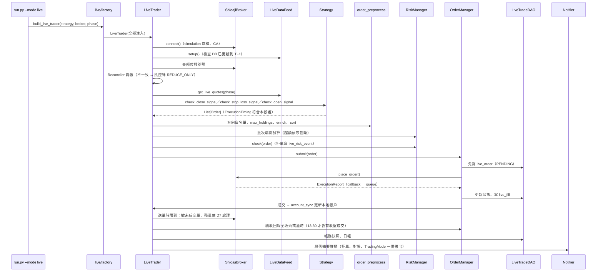

# 實盤下單架構規劃

## Abstract

- **背景／問題**：專案目前已經有「策略開發 → 爬蟲 pipeline → 回測」三段，但**沒有實盤下單**。
  - `run.py --mode live` 呼叫後直接拋 `NotImplementedError`。
  - Shioaji 相關程式只有三支 `core/utils/` 工具，都是早期留下來的：
    - `OrderUtils.place_order()`：只能下股票單，參數用 dict 傳。
    - `Callback.order_callback()`：只印出股票成交回報，而且用 `print`。
    - `ShioajiAccount`：只能登入 production，沒有 CA 憑證啟用，也沒有模擬模式。
  - 缺少的部分：委託狀態追蹤、風控、對帳、紀錄落地、期貨下單、盤中行情迴圈，全部都還沒有。
- **目標**：按量化交易常見的分層，新增四層：
  - 「券商閘道（Broker Gateway）」：`core/broker/`。
  - 「委託管理與風控（OMS／Risk）」：`core/live/oms/`、`core/live/risk/`。
  - 「實盤引擎（Live Trader）」：`core/live/`。
  - 「回測與實盤共用的委託前處理」：`core/execution/`——這一層是兩邊不漂移的關鍵，方向白名單、`max_holdings`、排序只能有一份實作。

  同一支策略類別**不用改寫、也不用 `if live`**，就可以從回測切換到 Shioaji 模擬環境，再切換到正式環境。支援的交易型態：
  - 台股現股、融券／借券、現股當沖、盤中零股（融資做多依 D3，建議第一階段不開放）。
  - 指數期貨、股票期貨。
  - 日頻與盤中兩種執行頻率。
- **範圍界線（不做）**：
  - 不做選擇權。
  - 不做美股。
  - 不做多券商、多帳戶路由。
  - 不做演算法拆單（TWAP／VWAP）。
  - 不做前端下單介面。
  - 不做自動調參。
  - 通知管道只實作一個（Telegram），其餘管道只留 `BaseNotifier` 介面。**存活監控與告警本身要做**：實盤最常見的失效不是下錯單，而是「該跑的段落沒跑、沒人發現」，只寫 log 等於沒有監控（Phase4-7）。
  - **不改變任何既有回測結果**：回歸雙線必須零變動。D2 已定案為逐筆觸發（2026-09-19），不新增切片回放，`Scale.TICK` 的回測語意不動；代價是盤中策略的回測結果無法重現實盤的逐筆順序，只能當量級參考。
- **驗收標準**：
  1. `python run.py --mode live --broker shioaji --simulation` 可以在 Shioaji 模擬環境跑以下兩條路徑，各連續 5 個交易日：
     - 一支股票日頻策略。
     - 一支期貨策略。

     每筆委託、成交、每日部位快照都寫進 `tw_trading.db`，收盤後對帳零差異。
  2. 盤中模式可以在模擬環境跑完整個交易時段。斷線後會自動重連、重新訂閱，而且不會重複下單。
  3. 風控測試案例全部有測試覆蓋：
     - 單筆金額上限、單日金額上限。
     - 價格偏離參考價。
     - 下單頻率。
     - kill switch。
     - 對帳不一致時停止開新倉。
     - 批次送單的總曝險與單一標的集中度上限。
     - `TradingMode` 降級後重啟，模式仍然延續（不會因為重啟而默默恢復送單）。
  4. 每個交易日收盤後，實盤委託與「以當日正式資料重跑同一支策略」的委託清單逐筆比對，差異都能歸因（快照口徑、風控拒單、未成交、段落時點），沒有 `UNEXPLAINED` 項目。
  5. 演練期間關鍵事件（啟動、結束、拒單、對帳不一致、斷線、kill switch）都有推播送達；「排程沒跑」由 LiveTrader 之外的 watchdog 偵測得到。
  6. `python scripts/check_layer_deps.py`、`pytest`、`./scripts/run_regression.sh` 全部通過，回測 baseline 沒有重產。

---

> **2026-09-17：立項後複查。** 對照程式碼修正了幾處規劃錯誤，步驟數不變：
> - D1：台股尾盤段要 13:25 後才送單，否則會在逐筆交易時段成交；期貨時點改由 `InstrumentSpec` 提供。
> - D6 與 Phase3-3：可成交限價的容許滑價（2%）要小於風控的價格偏離上限（3%），原寫法會被自己的風控拒單；重複送單規則改成不擋分批建倉。
> - Phase4-1：開盤段不再把 OHLC 填成參考價（會讓漲幅訊號默默變 0），改成讀取時拋出。
> - Phase3-4：`enrich_orders()` 本來就委派給 CostModel，不搬；`order_preprocess` 只收純參數，並在 Phase0-4 登記預期的同層 import。
> - Phase3-2、Phase3-5、Phase5-2、Phase5-4 等：送出前崩潰的委託沒有 seqno、成交回報不帶手續費、單一事件 queue、`CONVERT_TO_MARGIN` 在實盤不存在、夜盤帳務日與行情查詢日分開。

> **2026-09-17：對照量化交易常見架構的健檢。** 分層（券商閘道／OMS／風控／引擎／資料）、
> 委託狀態機、先寫 DB 再送單、回報去重與重放、對帳、限流、`FakeBroker` 契約測試、`--dry-run`
> 與小額上線這些骨幹都在，缺的集中在**營運面**。本次補上六項，步驟數 40 → 42：
> - **缺告警與存活監控**（新增 Phase4-7）：所有異常只寫 log 與 DB，都是 pull 型；kill switch 也要人先發現不對勁才會去建檔。程式在 09:05 掛掉沒有任何人會知道。
> - **缺實盤與回測的訊號一致性比對**（新增 Phase4-8）：原本只記錄滑價。滑價可以事後校正，訊號漂移不行，而且不比對就看不出來。
> - **未成交殘量沒有政策**（新增 D7）：13:25 送的 ROD 單收盤未成交時怎麼辦沒寫。平倉／停損未成交會默默變成隔夜部位，風險遠大於開倉未成交。
> - **安全模式散在四個元件**（併入 Phase3-3）：風控、對帳、事件迴圈、session 各自會切「只允許平倉」／「全停」，但沒有單一持有者，也沒有落地——重啟等於偷偷解除 halt。
> - **`custom_field` 的用途選錯**（改 D4、Phase3-2、Phase4-1）：D4 已限定同一帳戶同一商品類別只跑一支策略，策略代號在券商端是冗餘的；那 6 個字元應該拿來放 client order id 的壓縮碼，讓重啟接管由屬性猜測變成精確比對。
> - **缺稽核與曝險欄位**（改 Phase3-1、Phase3-3）：`live_run` 沒記 code version 與參數快照，出事查不到當時跑的是哪一版；風控只有逐單上限，一次送多張單時加總可能超額。
>
> 另外補了時區與時鐘偏差檢查（Phase0-3、Phase2-2）、交易日曆來源（Phase4-2）、`live_ready` 的
> 「狀態可重建」契約（Phase4-1）、`tw_trading.db` 的 WAL 與單一寫入者（Phase3-1）。
>
> **同日收尾複查**（不新增步驟）：散在各步驟的「安全模式」措辭統一成 `TradingMode` 的三個值；
> Phase4-3 的段落流程補完——**送單時限與連線關閉時點必須分開**，尾盤段的成交回報要 13:30 收盤
> 集合競價後才會進來，13:29 就關連線會讓當日 `live_fill` 出現空窗、對帳在錯的時點判定不一致；
> Phase4-5 補 `--broker`／`--resume-trading` 與退出碼 `6`（「昨天出事還沒人處理」要和「今天剛
> 出事」分得開）；Phase6-2 補換月兩腿的順序相依與失敗處理（平舊月未成交就不送開新月，否則曝險
> 翻倍）；Phase4-8 的單日回測結果不可覆蓋回歸 baseline；`live_risk_event` 補 `severity`、
> `live_parity_diff` 的建表併回 Phase3-1。

## 進度追蹤表

| 編號 | 步驟名稱 | 產出檔案 | 驗證方式 | 狀態 | 備註／中斷點 |
|------|----------|----------|----------|:----:|--------------|
| Phase0-1 | Shioaji 帳號前置：API 條款、CA 憑證、模擬環境 API 測試 | 本文件（完成紀錄） | 模擬環境股票、期貨各下一筆並 `update_status()` 查得到；正式帳號具下單權限 | ⬜ | **使用者手動**；阻塞 Phase7-2 |
| Phase0-2 | 待裁示事項 D1~D7 定案 | 本文件〈待裁示事項〉 | 每項填入裁示結果與日期 | ✅ | 2026-09-19 全部定案。D1、D3、D4、D5、D7 採建議；**D2 改為逐筆觸發、D6 改為允許市價單**，兩條偏離建議的受影響步驟已同步改寫（Phase1-2、Phase3-3、Phase5-1、Phase5-2）。原本被阻塞的 Phase4-1、Phase5-1、Phase4-6 皆已解除 |
| Phase0-3 | 實盤設定與環境變數 | `core/config/settings.py`、`core/config/schema.py`、`core/config/paths.py`、`.env.example`、`tests/test_config_consistency.py` | `pytest tests/test_config_consistency.py` 通過 | ⬜ | — |
| Phase0-4 | 分層規則登記 `core/broker/`、`core/execution/`、`core/live/` | `scripts/check_layer_deps.py` | `python scripts/check_layer_deps.py` 通過；故意反向 import 會失敗 | ⬜ | 先登記再寫程式：未登記的模組分層為 -1，任何 import 都會被判成反向相依 |
| Phase1-1 | 下單執行參數 Enum | `core/utils/constant.py`、`tests/test_order_state_parity.py` | 與 `shioaji.constant` 同名 Enum 的值逐一比對 | ⬜ | — |
| Phase1-2 | 訂單模型補執行欄位（預設值維持回測行為） | `core/models/base/order.py`、`core/models/stock/order.py`、`core/models/futures/order.py` | `./scripts/run_regression.sh` 零變動 | ⬜ | 相依 Phase1-1、D1、D6 |
| Phase1-3 | 委託單、成交回報、帳務快照模型 | `core/models/base/execution.py`、`core/models/stock/execution.py`、`core/models/futures/execution.py` | 新增單元測試 | ⬜ | 相依 Phase1-1 |
| Phase2-1 | `BaseBroker` 抽象介面與測試用 `FakeBroker` | `core/broker/base.py`、`tests/live/conftest.py` | `FakeBroker` 通過介面契約測試 | ⬜ | 相依 Phase1-3、Phase0-4 |
| Phase2-2 | `ShioajiSession`：登入、CA、模擬旗標、重連、限流 | `core/broker/tw/shioaji_session.py`、`core/broker/rate_limiter.py` | 限流單元測試；模擬環境登入、登出冒煙腳本 | ⬜ | 相依 Phase0-3 |
| Phase2-3 | 合約解析：上市櫃、指數期貨、股票期貨 | `core/broker/tw/shioaji_contract_resolver.py` | 以假合約表單元測試；模擬環境逐類實查一檔 | ⬜ | 相依 Phase2-2 |
| Phase2-4 | 委託轉換與合法組合檢查 | `core/broker/tw/shioaji_order_mapper.py` | 合法組合矩陣的參數化測試 | ⬜ | 相依 Phase1-2、Phase2-3 |
| Phase2-5 | 委託與成交回報正規化（callback → queue） | `core/broker/tw/shioaji_execution_handler.py` | 重放錄下的 callback 訊息：亂序、重複都能得到同一結果 | ⬜ | 相依 Phase1-3 |
| Phase2-6 | 帳務查詢：餘額、交割款、部位、期貨保證金 | `core/broker/tw/shioaji_account_query.py` | 以假回傳物件單元測試；模擬環境冒煙 | ⬜ | 相依 Phase2-2 |
| Phase2-7 | 即時行情：快照與 tick／bidask 訂閱 | `core/broker/tw/shioaji_quote_stream.py` | 轉出的 `StockQuote`／`FuturesQuote` 欄位與回測版一致 | ⬜ | 相依 Phase2-3 |
| Phase2-8 | `ShioajiBroker` 組裝 | `core/broker/tw/shioaji_broker.py` | 通過與 `FakeBroker` 相同的介面契約測試（模擬環境） | ⬜ | 相依 Phase2-2~Phase2-7 |
| Phase3-1 | 實盤紀錄資料庫 `tw_trading.db` 與 DAO | `core/config/schema.py`、`core/dao/tw/live_trade_dao.py`、`tests/test_dao_live_trade.py` | 建表冪等；同一筆成交寫兩次不重複 | ⬜ | 相依 Phase1-3、Phase0-3 |
| Phase3-2 | `OrderManager` 委託狀態機 | `core/live/oms/order_manager.py` | 狀態轉移表的參數化測試；非法轉移會拋出 | ⬜ | 相依 Phase2-1、Phase3-1 |
| Phase3-3 | `PreTradeRiskManager`、`TradingMode` 狀態機與批次曝險檢查 | `core/live/risk/risk_manager.py`、`core/live/risk/risk_config.py`、`core/live/risk/trading_mode.py` | 每條規則一個測試；kill switch 生效後零委託送出；降級後重啟模式仍延續 | ⬜ | 相依 Phase3-2 |
| Phase3-4 | 共用委託前處理：從 `Backtester` 抽出 | `core/execution/order_preprocess.py`、`core/backtest/backtester.py` | 回歸雙線零變動；實盤與回測呼叫同一函式；`order_preprocess` 不 import `core.strategies` | ⬜ | 相依 Phase0-4；**動到引擎，須跑回歸** |
| Phase3-5 | 帳戶同步：成交 → 本地 Account，券商快照覆寫 | `core/live/account_sync.py` | 以 `FakeBroker` 重放一天的成交，本地部位＝券商部位 | ⬜ | 相依 Phase2-6、Phase3-2 |
| Phase3-6 | 對帳器 `Reconciler` | `core/live/reconciler.py` | 刻意製造差異時轉入 `REDUCE_ONLY` 並寫入 `live_risk_event` | ⬜ | 相依 Phase3-5 |
| Phase4-1 | 日頻執行時點契約（`ExecutionTiming`） | `core/strategies/base.py`、`core/models/base/order.py`、`core/models/stock/quote.py`、`core/models/futures/quote.py` | 回歸零變動；未宣告 `live_ready` 的策略拒絕進入實盤；開盤段讀 `quote.close` 會拋出 | ⬜ | 相依 D1、Phase1-2 |
| Phase4-2 | `LiveDataFeed`：歷史到 T−1＋當日快照＋資料新鮮度檢查 | `core/live/datafeed/base.py`、`core/live/datafeed/tw/stock_live_datafeed.py`、`core/live/datafeed/tw/futures_live_datafeed.py` | DB 未更新到 T−1 時拒絕啟動；報價欄位與回測版一致 | ⬜ | 相依 Phase2-7 |
| Phase4-3 | `LiveTrader` 日頻流程（市場無關） | `core/live/trader.py` | `FakeBroker` 端到端：開盤段、尾盤段、盤後段 | ⬜ | 相依 Phase3-3~Phase3-6、Phase4-1、Phase4-2 |
| Phase4-4 | 實盤 factory | `core/live/factory.py` | 未支援的（市場, 商品）組合拋出含兩軸值的 `ValueError` | ⬜ | 相依 Phase4-3 |
| Phase4-5 | `run.py --mode live` 接線與安全旗標 | `run.py`、`tests/test_run_entry.py` | 未加 `--confirm-production` 時不可能連到正式環境 | ⬜ | 相依 Phase4-4 |
| Phase4-6 | 盤後作業：撤未成交單、對帳、快照、日報、未成交殘量 | `core/live/trader.py`、`core/live/report/live_reporter.py` | `results/live/<Strategy>/` 產出日報；對帳結果寫入 DB；平倉單未成交時次日補平 | ⬜ | 相依 Phase4-3、D7 |
| Phase4-7 | 事件通知與存活監控（LiveTrader 之外的 watchdog） | `core/live/notify/{base.py, telegram_notifier.py}`、`scripts/live_watchdog.py` | 通知端拋例外時交易流程不受影響；watchdog 測得出「段落沒跑」與「跑到一半死掉」 | ⬜ | 相依 Phase4-6 |
| Phase4-8 | 實盤與回測每日訊號一致性比對（parity） | `core/live/report/parity_checker.py`、`core/config/schema.py` | 刻意少送一張單時，diff 抓得到並歸類為 `UNEXPLAINED` | ⬜ | 相依 Phase4-6 |
| Phase5-1 | 盤中策略契約（逐筆觸發） | `core/strategies/base.py`、`core/backtest/README.md` | 同一段錄製 tick 餵兩次，訊號一致 | ⬜ | D2 已定案為逐筆觸發（2026-09-19），不做 `bar_builder`；**橫斷面策略要自己維護跨標的狀態**，且回測側無法重現逐筆順序，限制寫進 `core/backtest/README.md` |
| Phase5-2 | 盤中事件迴圈：行情 queue、心跳、報價過期偵測 | `core/live/intraday/event_loop.py` | 注入延遲、斷線事件後轉入 `REDUCE_ONLY`，不送新倉單 | ⬜ | 相依 Phase5-1、Phase4-3 |
| Phase5-3 | 斷線重連、重新訂閱與重啟後恢復狀態 | `core/broker/tw/shioaji_session.py`、`core/live/trader.py` | 在任意時點殺掉行程後重啟：不重複下單、未完成委託重新接管 | ⬜ | 相依 Phase5-2 |
| Phase5-4 | 日終強制動作：當沖回補、期貨夜盤跨日歸屬 | `core/live/intraday/session_guard.py` | 模擬 13:20 仍有當沖部位時觸發回補 | ⬜ | 相依 Phase5-2 |
| Phase5-5 | 常駐部署與排程 | `docker-compose.yml`、`docs/deployment/live-deployment.md` | 容器內跑完一個模擬交易日；SIGTERM 會先撤單再結束 | ⬜ | 相依 Phase5-3 |
| Phase6-1 | 融資融券與現股當沖下單 | `core/broker/tw/shioaji_order_mapper.py`、`core/live/risk/risk_manager.py` | 券源不足或不可當沖的標的在送單前被擋 | ⬜ | 相依 Phase2-4、Phase3-3、D3 |
| Phase6-2 | 指數期貨：開平倉別、換月、保證金 | `core/broker/tw/shioaji_order_mapper.py`、`core/live/trader.py` | 換月日模擬環境實跑一次；保證金不足時不送單 | ⬜ | 相依 Phase2-4、Phase4-3 |
| Phase6-3 | 股票期貨合約與乘數 | `core/broker/tw/shioaji_contract_resolver.py` | 乘數取自合約並與 `futures_stock_universe` 交叉比對 | ⬜ | 相依 Phase6-2；[暫緩工作彙整.md](暫緩工作彙整.md) S4 的行情回補同屬股期 |
| Phase6-4 | 盤中零股 | `core/models/stock/order.py`、`core/broker/tw/shioaji_order_mapper.py` | 數量單位錯配（張當股）在建立委託時就拋出 | ⬜ | 相依 Phase2-4 |
| Phase7-1 | 模擬環境端到端演練（連續 5 個交易日） | 本文件（演練紀錄） | 對應 Abstract 驗收標準 1、2、4、5 | ⬜ | 相依 Phase4-6~Phase4-8、Phase5-5、Phase6-2 |
| Phase7-2 | 正式環境小額上線檢查表 | `docs/live/production-checklist.md` | 使用者逐項勾選 | ⬜ | 相依 Phase0-1、Phase7-1 |
| Phase7-3 | 舊 Shioaji 工具收斂 | `core/utils/order.py`、`core/utils/callback.py`、`core/utils/account.py`、`core/pipeline/tw/updaters/*_tick_updater.py`、`scripts/manual/manual_tick_crawler.py` | `grep -rn "OrderUtils\|Callback.order_callback"` 無結果；tick updater 冒煙通過 | ⬜ | 相依 Phase2-2 |
| Phase7-4 | 文件 | `docs/live/live-trading.md`、`docs/backtest/module-map.md`、`docs/dev/runtime-artifacts.md`、`README.md`、`README_en.md`、`core/strategies/README.md` | `python scripts/check_doc_paths.py` 通過 | ⬜ | 相依 Phase7-1 |

---

## 現況盤點（2026-09-17）

### 可以直接沿用的設計

| 既有設計 | 在實盤的用途 |
|----------|--------------|
| 策略四個鉤子 `check_open_signal`／`check_close_signal`／`check_stop_loss_signal`／`calculate_position_size`，輸入是 `List[BaseQuote]`、輸出是 `List[BaseOrder]` | 實盤引擎呼叫同樣的鉤子，只替換「委託之後的事」 |
| `(market, instrument_type)` 由策略基底宣告，`factory.py` 分派 | 實盤 factory 用同一組分派鍵 |
| `BaseDataFeed`：策略的 `setup_apis(feed)` 只從 feed 取 API | `LiveDataFeed` 繼承它，策略不用改 |
| `StockPositionManager`／`FuturesPositionManager` | 成交回報進來後更新本地帳戶，策略讀到的 `self.account` 結構和回測一樣 |
| `TwStockSpec` 的價格檔位與漲跌停推算 | 送單前把價格對齊檔位、檢查漲跌停區間 |
| `FuturesRollConfig`／`select_near_month()` | 實盤換月和回測共用同一份規則 |
| `SHIOAJI_FUTURES_CATEGORY`（2026-09-02 已實查核對） | 指數期貨的合約解析 |
| `OrderState`／`Status` Enum 與 `tests/test_order_state_parity.py` | 回報狀態和 Shioaji 值對齊的護欄 |
| `core/dao/` 與 `connect_sqlite()` | 實盤紀錄庫沿用同一套 DAO 分層 |

### 必須補上、或語意對不上的地方

1. **日頻 bar 在實盤不存在**。回測的 `Scale.DAY` 是在一次呼叫裡同時拿到當日 OHLC：
   - `ForeignSellShortDayTradeStrategy` 以 `quote.open` 放空，同一根 bar 以 `quote.close` 回補。
   - 實盤在開盤前不知道 `close`，在收盤前也不知道完整 OHLC。

   所以**同一個呼叫不可能在實盤成立**，必須拆成「開盤段」與「尾盤段」兩次呼叫（D1）。
2. **回測的 `Scale.TICK` 不是事件驅動**。`run_tick_backtest()` 一次把整天的 tick 交給 `execute_bar()`，策略拿到的是「全天 tick」。實盤只會一筆一筆收到 tick，兩者訊號語意不同（D2）。[多市場回測引擎架構](../docs/backtest/multi-market-engine.md) §5.1 把事件驅動迴圈列為暫緩，本文件不重寫回測引擎。
3. **訂單模型沒有執行參數**。`StockOrder` 沒有以下欄位，`FuturesOrder` 也沒有 `octype`：
   - `price_type`（限價／市價）。
   - `order_type`（ROD／IOC／FOK）。
   - `order_lot`（整股／零股）。
   - `order_cond`（現股／融資／融券）。
4. **回測沒有融資做多**：`MarginCost` 在程式裡標明「本階段僅定義不啟用」。實盤如果開放融資，回測就對不上（D3）。
5. **委託前處理只寫在 `Backtester` 裡**：方向白名單（`validate_orders()`）、`max_holdings`（`check_max_holdings()`）、`sort_orders()`。實盤如果自己再寫一份，就會漂移（Phase3-4）。補 `short_method`／`is_day_trade` 的 `enrich_orders()` 在引擎裡只是委派給 `CostModel.enrich_orders()`，實盤注入同一個 CostModel 即可共用。
6. **舊 Shioaji 工具**：
   - 用 `print`，違反 Coding Style §2.9。
   - 登入沒有 `simulation` 與 `activate_ca`。
   - `get_settlement_capital()` 用 `loc[1:2]` 依位置取交割款，日後交割日數一變就會算錯。
   - tick updater 與 `scripts/manual/manual_tick_crawler.py` 也依賴這批工具，所以要到 Phase7-3 才收斂，不能直接刪。

### Shioaji 官方限制（2026-09-17 查 sinotrade.github.io）

| 項目 | 限制 | 對設計的影響 |
|------|------|--------------|
| 正式下單前 | 要先以 `simulation=True` 完成股票、期貨 API 測試，並 `activate_ca()` | Phase0-1，使用者手動 |
| 下單類（`place_order`／`update_status`／`update_qty`／`update_price`／`cancel_order`） | 每 10 秒合計 250 次 | `RateLimiter` 分類限流，**`update_status` 也算在內**，不能拿它輪詢 |
| 帳務類（`account_balance`／`list_positions`／`margin`／`list_settlements`…） | 每 5 秒合計 25 次 | 帳務以回報驅動為主，查詢只在對帳時點做 |
| 行情查詢（`snapshots`／`ticks`／`kbars`／`credit_enquires`／`short_stock_sources`） | 每 10 秒合計 50 次；盤中 `ticks` 最多 10 次 | 快照分批、快取 |
| 訂閱 | 每個連線最多 200 檔 | 盤中策略的標的上限要在啟動時檢查 |
| 同帳號連線 | 最多 5 條 | 實盤與 tick 爬蟲共用額度，不要同時開太多 |
| 登入 | 每日 1,000 次 | 重連要退避，不能無限重試 |
| 超限處置 | 查詢超限暫停服務 1 分鐘，重複違規封 IP／ID | 限流器採保守額度（預設用官方上限的 80%） |
| `custom_field` | 英數字，最多 6 字元 | 放不下完整 client order id，只能放策略代號 |
| 期貨 `octype` | `Auto`／`New`／`Cover`／`DayTrade` | 開平倉別由訂單的 `Action` 推導，不交給 `Auto` 猜 |
| 股票 `order_cond` | `Cash`／`MarginTrading`／`ShortSelling`／`SBLShort`／`SBLShortPriceExempt` | 由 `ShortMethod` 推導 |
| 股票 `order_lot` | `Common`／`Fixing`／`Odd`／`IntradayOdd` | `IntradayOdd` 的數量單位是股 |

---

## 目標架構

### 分層（新增部分以粗體標示）

```
入口層        run.py（--mode backtest | live）
                │
策略層        core/strategies/            ← 同一支策略，回測與實盤共用
                │
組裝層        core/backtest/factory.py    **core/live/factory.py**
                │                              │
引擎層        Backtester                  **LiveTrader**（市場無關，無子類）
                ├── backtest/models/          ├── **live/oms/**（OrderManager）
                ├── backtest/datafeed/        ├── **live/risk/**（PreTradeRiskManager）
                ├── managers/  ◄──共用──────┤── **live/account_sync.py、reconciler.py**
                └── backtest/report/          ├── **live/datafeed/**（LiveDataFeed）
                                              ├── **live/intraday/**（盤中迴圈）
                                              └── **live/notify/**（事件推播與存活監控）
                │                              │
共用前處理    **core/execution/**（方向白名單、max_holdings、enrich、sort：兩邊共用）
                │
券商閘道層    **core/broker/**（BaseBroker ＋ tw/Shioaji 實作）
                │
資料層        core/api/ ── core/adapters/
資料存取層    core/dao/（＋ **live_trade_dao.py**）── data/db/（＋ **tw_trading.db**）
領域層        core/models/（＋ **execution.py**：委託單、成交回報、帳務快照）
共用層        core/utils/（＋ 下單執行 Enum）
```

### 目錄

```
core/
├── broker/
│   ├── base.py                         # BaseBroker：市場無關的券商介面
│   ├── rate_limiter.py                 # 分類 token bucket
│   └── tw/
│       ├── shioaji_session.py          # 登入、CA、模擬旗標、重連、事件回呼
│       ├── shioaji_contract_resolver.py
│       ├── shioaji_order_mapper.py     # 領域訂單 ⇄ sj.StockOrder／sj.FuturesOrder
│       ├── shioaji_execution_handler.py# callback → ExecutionReport → queue
│       ├── shioaji_account_query.py
│       ├── shioaji_quote_stream.py     # snapshots／subscribe → StockQuote／FuturesQuote
│       └── shioaji_broker.py           # 組裝上面各元件，實作 BaseBroker
├── execution/
│   └── order_preprocess.py             # 回測與實盤共用的委託前處理（只收純參數，不 import 策略）
└── live/
    ├── trader.py                       # LiveTrader
    ├── factory.py                      # build_live_trader()
    ├── account_sync.py
    ├── reconciler.py
    ├── oms/order_manager.py
    ├── risk/{risk_config.py, risk_manager.py}
    ├── datafeed/{base.py, tw/stock_live_datafeed.py, tw/futures_live_datafeed.py}
    ├── intraday/{bar_builder.py, event_loop.py, session_guard.py}
    ├── notify/{base.py, telegram_notifier.py}
    └── report/{live_reporter.py, parity_checker.py}
```

存活監控刻意放在 `scripts/live_watchdog.py`，**不在 `core/live/` 裡**：它必須是獨立行程，
和 LiveTrader 一起死的心跳等於沒有監控。

目錄軸線沿用[命名軸線](../docs/dev/naming-axes.md)的規則：
- `core/broker/` 與 `core/live/datafeed/` 的子目錄**只承載市場軸**（`tw/`）。
- 券商名稱（shioaji）與商品類別由檔名承載。

### 一次日頻實盤的呼叫序列



**先寫 DB 再送單**：程式在 `place_order()` 前後崩潰時，重啟後可以用 `live_order` 的 PENDING 紀錄，以 `seqno`／`custom_field` 去券商查詢接管，不會因為「不知道送出去了沒」而重送。

---

## 待裁示事項

| 編號 | 問題 | 建議 | 不採建議的代價 | 裁示 |
|------|------|------|----------------|------|
| D1 | 日頻策略在實盤何時執行 | 訂單新增 `ExecutionTiming`：`AT_OPEN`（台股 08:30~09:00 盤前委託，進開盤集合競價）、`AT_CLOSE`（台股 13:20 起取快照算訊號，**13:25:00 之後才送單**，13:29:00 前送完，讓委託進收盤集合競價；13:25 前送出的限價單會在逐筆交易時段就成交，成交價不是收盤價）。期貨的段落時點由 `InstrumentSpec` 提供、不寫死在 LiveTrader，實作前以 TAIFEX 公告核對收盤規則。LiveTrader 依段落只送符合的單。**回測忽略此欄位**（仍用策略給的價），因此回歸零變動。尾盤段只有 13:25~13:29 這 4 分鐘可送單，委託筆數多時要把限流等待算進去（`ORDER` 類 250 筆／10 秒，保守取 80% 即 200 筆／10 秒），Phase7-1 要記錄實際送完的耗時 | 如果改成「一律隔日開盤執行」，所有用 `quote.close` 成交的策略在實盤和回測之間會差一天 | **採建議**（2026-09-19）：雙段 `ExecutionTiming`（`AT_OPEN`／`AT_CLOSE`） |
| D2 | 盤中策略的報價契約 | 採**時間切片**：策略宣告 `live_bar_seconds`（例如 5 秒），每片傳入「每檔最新一筆」`StockQuote`（`scale=TICK`，`tick_quote` 帶 bid/ask）。回測側另立文件新增「tick 切片回放」，讓兩邊走同一契約 | 沿用現行 TICK 回測（整天 tick 一次給）時，盤中策略的回測結果沒辦法拿來預估實盤 | **不採建議，改為逐筆觸發**（2026-09-19）。理由：Shioaji 訂閱後本來就是有報價就 callback 推進來，逐筆最貼近原生語意、延遲最低。**連帶影響（偏離建議，以下三項必須跟著做）**：① 策略鉤子每收到一筆 tick 呼叫一次，傳入的 `List[StockQuote]` 長度為 1，**橫斷面策略（跨標的挑前 N 強）要自己在策略內維護其他標的的最新狀態**，不能再假設一次拿得到全市場；② 不新增 `bar_builder`，也不另立「tick 切片回放」的 backlog；③ **回測側無法重現逐筆觸發**——回測沒有 wall clock，跨股票的到達順序取決於券商推送、本來就不保證，故盤中策略的回測結果只能當量級參考，不能當實盤預估，這點要寫進 `core/backtest/README.md` |
| D3 | 融資做多是否開放 | **第一階段不開放**，只支援現股、融券、借券、現股當沖（回測都有對應的 `ShortMethod`）。融資等回測補上 `MarginCost` 後再開 | 先開放的話，融資策略沒有可信的回測 | **採建議**（2026-09-19）：第一階段不開放融資，只支援現股、融券、借券、現股當沖 |
| D4 | 一個帳戶跑幾支策略 | **第一階段同一帳戶、同一商品類別只跑一支策略**。券商部位沒有策略標記，多策略要做本地歸屬帳，複雜度高。既然同帳戶同商品只有一支策略，策略代號在券商端就是冗餘資訊，**`custom_field` 的 6 個字元改放 client order id 的壓縮碼**（Phase3-2），補回 FIX `ClOrdID` 的角色；`live_tag` 改為只寫本地 DB 與報表，不送券商 | 多策略共用時，對帳無法判斷差異屬於哪一支；`custom_field` 若拿去放策略代號，重啟接管就只能靠屬性模糊比對 | **採建議**（2026-09-19）：同帳戶同商品類別只跑一支；`custom_field` 放 client order id 壓縮碼 |
| D5 | 策略的資金基準 | `init_capital` 在實盤解讀為「本策略的資金額度上限」；可用資金取 `min(額度 − 已用, 券商可用餘額)` | 直接用券商總餘額的話，策略會把帳戶其他資金也壓進去 | **採建議**（2026-09-19）：`init_capital` 為本策略額度上限，可用取 `min(額度 − 已用, 券商可用餘額)` |
| D6 | 市價單政策 | **一律不送市價單**：需要「市價」語意時，改用可成交的限價＝基準價 ×（1 ± 容許滑價），基準價盤前用參考價、盤中用最新成交價，容許滑價預設 2%，對齊檔位後夾在漲跌停區間內。容許滑價必須小於風控的價格偏離上限（Phase3-3，預設 3%），否則自己換算出的價格會被自己的風控拒單。期貨不用 `MKP`，同樣換算成限價 | 台股市價單在流動性差的標的可能吃到極端價格；代價是跳空超過 2% 時可能不成交，成交率要在 Phase7-1 記錄 | **不採建議，允許市價單**（2026-09-19）。**連帶影響（偏離建議）**：① `StockPriceType.MKT`／`FuturesPriceType.MKT`／`MKP` 由策略或 `order_preprocess` 實際送出，不再一律換算成限價；② **風控的「委託價偏離」規則對市價單形同不存在**（沒有價格可檢查），Phase3-3 要改成：市價單改以「下單前的基準價 × 可接受區間」做事前檢查，並在成交後以實際成交價回頭比對、超標寫 `live_risk_event`；③ **回測沒有市價單的對應物**——`TwStockFillModel` 是「成交價 ± 固定 bps」，S1 量到的滑價統計不適用於市價單，實盤成交價會系統性劣於回測，差距要在 Phase7-1 的演練紀錄與 Phase4-8 的 parity 比對中量出來 |
| D7 | 未成交殘量的處理政策 | **依用途分開**：開倉未成交一律**放棄**，不追價（追價等於在偏離訊號價的位置建倉，回測沒有這個行為）；平倉與停損未成交**必須補**——段落時限前 60 秒以 D6 的可成交限價重送一次（追價上限 1 次），仍未成交就寫 `live_risk_event`、推播 `CRITICAL`，並在次日開盤段第一件事補平 | 不定政策的話，回測「以收盤價成交」的假設在實盤只有部分成立；更嚴重的是平倉單漏成交會默默變成隔夜部位，與策略設計不符，而且這個差異不會有任何地方報錯 | **採建議**（2026-09-19）：開倉未成交放棄、平倉與停損必須補。**因 D6 改為允許市價單，重送方式一併調整**：原建議的「以 D6 的可成交限價重送」改為「以市價單重送」（追價上限仍為 1 次）；漲跌停鎖死或流動性枯竭導致市價單仍未成交時，照樣寫 `live_risk_event`、推播 `CRITICAL`，次日開盤段第一件事補平 |

---

## 步驟詳述

### Phase0-1. Shioaji 帳號前置 ⬜

- **目的**：正式環境下單權限要先完成官方流程，程式沒辦法代勞。
- **做法**（使用者手動）：
  1. 在永豐金證券網站簽署 API 使用條款，確認已申請股票與期貨 API 權限。
  2. 下載 CA 憑證（`.pfx`），放在**專案目錄以外**的位置（例如 `~/.alphaedge/ca/`），不要進 git 或容器映像。
  3. 以 `sj.Shioaji(simulation=True)` 登入並 `activate_ca()`，股票、期貨各送一筆 ROD 限價單（數量 1），以 `api.update_status()` 確認狀態。
  4. 在本文件記下完成日期、使用的 shioaji 版本（目前 `requirements.txt` 為 `1.3.3`）。
- **產出**：本步驟章節末尾的完成紀錄。
- **驗證方式**：模擬環境兩筆委託都查得到；正式帳號狀態顯示可下單。
- **相依**：無。

### Phase0-2. 待裁示事項定案 ✅

> **✅ 完成紀錄（2026-09-19）**
> - D1、D3、D4、D5、D7 採建議；**D2 改為逐筆觸發、D6 改為允許市價單**，兩條偏離建議。
> - 偏離建議的受影響步驟已同步改寫：Phase1-2（`price_type` 的 None 語意）、
>   Phase3-3（委託價偏離規則拆成限價／市價兩條）、Phase5-1（改為逐筆觸發、不做 `bar_builder`）、
>   Phase5-2（切片計時器改心跳、報價過期改以每檔最後更新時間判斷）、
>   kill switch 檢查時點（切片邊界改為每 N 筆行情事件）。
> - D7 的重送方式因 D6 一併調整為市價單重送（追價上限仍 1 次）。
> - 原本被阻塞的 Phase4-1、Phase5-1、Phase4-6 皆已解除。

- **目的**：D1~D7 會決定模型欄位與引擎流程，先定案避免返工。
- **做法**：逐項在〈待裁示事項〉表填入裁示與日期；偏離建議時，同步修改受影響步驟的做法。
- **產出**：本文件。
- **驗證方式**：表內沒有「待定」。
- **相依**：無。

### Phase0-3. 實盤設定與環境變數 ⬜

- **目的**：模擬／正式切換、憑證位置、紀錄庫路徑集中管理。
- **做法**：
  - `core/config/settings.py` 新增：
    - `SHIOAJI_CA_PATH`、`SHIOAJI_CA_PASSWORD`。
    - `SHIOAJI_PERSON_ID`：多帳號時才需要。
    - `ALPHAEDGE_LIVE_KILL_SWITCH_PATH`：檔案存在即停止送單。
    - `ALPHAEDGE_LIVE_NOTIFY_CHANNEL`、`ALPHAEDGE_LIVE_NOTIFY_TOKEN`、`ALPHAEDGE_LIVE_NOTIFY_TARGET`：通知管道設定（Phase4-7）。缺值時退化為不推播，但**啟動時要 log 警告並寫 `live_run`**，不可靜默——「以為有告警其實沒有」比「知道沒有告警」危險。
  - 沿用既有 `API_KEY`／`API_SECRET_KEY`。**刻意不提供** `ALPHAEDGE_LIVE_PRODUCTION` 這類環境變數：正式環境只能由命令列 `--confirm-production` 開啟，避免 `.env` 殘留設定讓排程默默連到正式環境。
  - `core/config/schema.py` 新增 `TW_TRADING_DB_NAME = "tw_trading.db"`、`TW_TRADING_DB_PATH`，以及 Phase3-1 的表名常數。
  - `core/config/paths.py` 新增 `LIVE_RESULT_DIR_PATH = RESULTS_DIR_PATH / "live"`。回測結果直接放在 `RESULTS_DIR_PATH/<策略名>/`，實盤日報要另開子目錄，不能和回測輸出混在同一層。
  - `.env.example` 補上各鍵與說明；缺值時為 `None`，由實際使用處 `require_*()`，不在 import 時拋出（沿用 `require_tick_db_path()` 的理由）。
  - **時區**：實盤整份流程由時點驅動（08:30／13:20／13:25／15:00），時間一律用 `Asia/Taipei` 的 aware datetime，**不要用 naive 的 `datetime.now()`**。容器與排程環境設 `TZ=Asia/Taipei`（Phase5-5）。主機是 UTC 而程式讀本地 naive 時間時，尾盤段會整段跑在錯的時刻，而且不會有任何錯誤訊息。
- **產出**：上列檔案。
- **驗證方式**：`pytest tests/test_config_consistency.py`。
- **相依**：無。

### Phase0-4. 分層規則登記 ⬜

- **目的**：新套件從第一行就受分層護欄保護。
- **做法**：在 `scripts/check_layer_deps.py` 做以下調整：
  - `_LAYER_RULES` 新增：
    - `("core.broker", 3, "券商閘道層", False)`：只可 import `core.config`／`core.utils`／`core.models`，**不可 import `core.api`**，券商層不讀歷史資料。
    - `("core.execution", 4, "共用委託前處理", False)`。
    - `("core.live.oms", 4, ...)`、`("core.live.risk", 4, ...)`、`("core.live.datafeed", 4, ...)`、`("core.live.intraday", 4, ...)`、`("core.live.report", 4, ...)`。
    - `("core.live.account_sync", 4, ...)`、`("core.live.reconciler", 4, ...)`、`("core.live.notify", 4, ...)`。
      - `core.live.notify` 只可 import `core.config`／`core.utils`：通知是旁路，不該碰模型或 DAO，這樣它壞掉也不可能拖垮交易主流程。
    - `("core.live.trader", 5, "實盤引擎本體", False)`。
    - `("core.live.factory", 6, "組裝層", False)`。
  - `_MARKET_AXIS_PACKAGES` 加入 `core/broker`、`core/live/datafeed`。
  - 「市場語意洩漏」檢查目前寫死 `core/backtest/backtester.py` 一個路徑，要改成引擎清單並加入 `core/live/trader.py`；`if market ==` 的檢查以檔名 `factory.py` 放行，本來就涵蓋 `core/live/factory.py`。
  - **預期會出現的「同層互相 import」**（腳本只列出、不影響結束碼，但要在本步驟先登記理由，避免之後被當成新問題）：
    - `core.live.datafeed` → `core.backtest.datafeed.base`：`LiveDataFeed` 繼承 `BaseDataFeed`，因為策略的 `setup_apis(feed)` 型別就是它。把 `BaseDataFeed` 移到中立位置不在本文件範圍。
    - `core.live.account_sync` → `core.managers`：沿用 `PositionManager` 更新本地帳戶。
    - `core.live.risk` → `core.backtest.models.instrument_spec`：價格檔位與漲跌停。
  - `core.execution` 刻意設計成**只 import `core.utils`／`core.models`**，由呼叫端傳入 `position_type`、`enable_intraday` 等純參數，不 import `core.strategies.base`，避免新增一條同層邊。
- **產出**：`scripts/check_layer_deps.py`。
- **驗證方式**：腳本通過；寫一個臨時檔讓 `core/broker` import `core/live`，確認腳本會失敗。
- **相依**：無。

### Phase1-1. 下單執行參數 Enum ⬜

- **目的**：專案內部用自己的 Enum，券商值的轉換只發生在 mapper，券商型別不外洩到領域層。
- **做法**：`core/utils/constant.py` 依 §2.7 先定義模組常數，再定義 Enum：
  - 既有 `StockPriceType`（LMT／MKT）沿用；新增 `FuturesPriceType`（LMT／MKT／MKP）。
  - 既有 `OrderType`（ROD／IOC／FOK）沿用；既有 `StockOrderLot` 沿用。
  - 新增 `StockOrderCond`（Cash／MarginTrading／ShortSelling／SBLShort）、`FuturesOCType`（Auto／New／Cover／DayTrade）。
  - 新增 `ExecutionTiming`（`AT_OPEN`／`AT_CLOSE`／`IMMEDIATE`），依 D1 定案。
  - 新增 `LiveOrderStatus`，是本專案的委託狀態：`PENDING_SUBMIT`／`SUBMITTED`／`PARTIALLY_FILLED`／`FILLED`／`CANCELLED`／`REJECTED`／`FAILED`。
    - 與既有 `Status` 分開：`Status` 是券商值的鏡像，`LiveOrderStatus` 是 OMS 狀態機的狀態，兩者由 mapper 轉換。
- **產出**：`core/utils/constant.py`、`core/utils/__init__.py`。
- **驗證方式**：擴充 `tests/test_order_state_parity.py`，逐一比對與 `shioaji.constant` 同名 Enum 的值。
- **相依**：無。

### Phase1-2. 訂單模型補執行欄位 ⬜

- **目的**：策略可以表達「怎麼成交」，回測行為不變。
- **做法**：
  - `BaseOrder` 新增以下欄位，全部有預設值，回測不讀它們：
    - `order_type: OrderType = OrderType.ROD`。
    - `timing: Optional[ExecutionTiming] = None`：None 時由 LiveTrader 依策略 `live_schedule` 決定，D1。
    - `client_order_id: Optional[str] = None`：由 OMS 填入，策略不用填。
  - `StockOrder` 新增 `price_type: Optional[StockPriceType] = None`、`order_lot: StockOrderLot = StockOrderLot.Common`；`FuturesOrder` 新增 `price_type: Optional[FuturesPriceType] = None`。兩種商品的價格類型值域不同（期貨多一個 `MKP`），所以放在子類別，不放 `BaseOrder` 用 `str` 混著裝。None 表示由 `order_preprocess` 依策略意圖決定；D6 已定案為允許市價單（2026-09-19），需要市價語意時直接送 `MKT`／`MKP`，不再一律換算成限價。`order_cond` **不開放策略填寫**，由 `order_preprocess` 依 `position_type` ＋ `short_method` ＋ `is_day_trade` 推導，和回測的成本路徑保證一致。
  - `FuturesOrder` 不新增 `octype` 欄位，由 mapper 依 `Action` 與持倉推導（Phase6-2）。
- **產出**：`core/models/base/order.py`、`core/models/stock/order.py`、`core/models/futures/order.py`。
- **驗證方式**：`./scripts/run_regression.sh` 零變動；`pytest tests/backtest`。
- **相依**：Phase1-1、D1、D6。

### Phase1-3. 委託單、成交回報、帳務快照模型 ⬜

- **目的**：實盤特有的狀態要有領域模型，不要直接傳 Shioaji 物件，也不要傳 dict。
- **做法**：`core/models/base/execution.py`：
  - `OrderTicket`：一張已提交的委託。欄位：
    - `client_order_id`、`strategy_name`、`order: BaseOrder`、`status: LiveOrderStatus`。
    - `broker_order_id`（Shioaji `ordno`）、`broker_seqno`。
    - `filled_volume`、`avg_fill_price`、`created_at`、`updated_at`、`reject_reason`。
  - `ExecutionReport`：一筆成交回報。欄位：
    - `broker_seqno`、`broker_trade_id`、`symbol`、`action`、`price`、`volume`、`ts`。
    - `raw: Dict[str, Any]`：保留原始訊息，方便事後比對。
  - `BrokerPositionSnapshot`、`BrokerAccountSnapshot`：券商查詢結果的正規化版本。
  - `stock/`、`futures/` 各自補商品欄位：股票的 `order_cond`、`order_lot`；期貨的 `product`、`expiry`、`octype`。
- **產出**：上列檔案與 `core/models/__init__.py`。
- **驗證方式**：新增 `tests/live/test_execution_models.py`。
- **相依**：Phase1-1。

### Phase2-1. `BaseBroker` 與 `FakeBroker` ⬜

- **目的**：引擎只認介面，Shioaji 可以替換；測試不用連網。
- **做法**：
  - `core/broker/base.py` 定義抽象方法：
    - `connect()`、`close()`、`is_connected()`。
    - `place_order(order) -> OrderTicket`、`cancel_order(ticket)`、`update_order_price(ticket, price)`。
    - `refresh_order_status() -> List[OrderTicket]`。
    - `get_positions() -> List[BrokerPositionSnapshot]`、`get_account() -> BrokerAccountSnapshot`。
    - `get_snapshots(symbols) -> List[BaseQuote]`、`subscribe_quotes(symbols)`、`unsubscribe_quotes(symbols)`。
    - `execution_queue`：`queue.Queue[ExecutionReport]`。
  - `tests/live/conftest.py` 的 `FakeBroker`：可以腳本化「延遲回報、部分成交、拒單、斷線」。
  - 契約測試 `tests/live/test_broker_contract.py` 同時跑在 `FakeBroker` 上，以及（加 `-m shioaji_sim` 時）模擬環境的 `ShioajiBroker` 上。
- **產出**：上列檔案。
- **驗證方式**：契約測試通過。
- **相依**：Phase1-3、Phase0-4。

### Phase2-2. `ShioajiSession` ⬜

- **目的**：取代 `ShioajiAccount.API_login()`，把登入、模擬旗標、CA、重連、限流收在同一處。
- **做法**：
  - `connect(simulation: bool)`：
    - 建立 `sj.Shioaji(simulation=simulation)`。
    - `login()`，沿用 `CONTRACTS_TIMEOUT_MS`。
    - 正式環境一律 `activate_ca()`；模擬環境預設不啟用，只有 Phase0-1 的官方 API 測試流程要求在模擬環境啟用時，才以 `activate_ca=True` 參數明確開啟。預設不讀憑證，是因為開發機與 CI 不該接觸正式憑證。
    - 以 `api.stock_account`／`api.futopt_account` 確認帳號存在；缺哪一個就在 log 明講，不要到下單時才 `AttributeError`。
    - **時鐘偏差檢查**：登入後取券商端時戳（合約檔更新時間或首筆回報時戳），與本機時鐘比對，超過 5 秒就拒絕啟動。所有段落判定、報價過期偵測、日終強制動作都建立在本機時鐘上，時鐘飄掉的症狀是「訊號時點整個偏移」，很難從結果反推。
  - 註冊 session 事件回呼：斷線、重連事件寫 `logger`，並設定 `self.connected` 旗標。
  - 重連採指數退避（上限 5 分鐘），受每日登入 1,000 次限制，**單日重連次數設上限**，超過就送降級事件給風控轉入 `HALTED`（Phase3-3），停止送單。
  - `core/broker/rate_limiter.py`：分類 token bucket（`ORDER` 250/10s、`ACCOUNT` 25/5s、`MARKET_DATA` 50/10s），預設取官方值的 80%，超過時阻塞等待，並記錄等待時間。
  - 全部使用 `loguru`；API key、CA 密碼不得出現在 log。
- **產出**：`core/broker/tw/shioaji_session.py`、`core/broker/rate_limiter.py`。
- **驗證方式**：
  - 限流器以假時鐘單元測試。
  - `scripts/manual/manual_shioaji_login.py`：模擬環境登入、列出帳號、登出。
- **相依**：Phase0-3。

### Phase2-3. 合約解析 ⬜

- **目的**：從領域識別（`stock_id`、`product`＋`expiry`）拿到 Shioaji `Contract`，查不到就當場拋出。
- **做法**：
  - 股票：依序查 `api.Contracts.Stocks.TSE`、`OTC`；兩邊都查不到拋 `LookupError`，**不回 None**。舊 `OrderUtils` 回 None 之後會傳進 `api.Order`，錯誤訊息完全指不到原因。
  - 指數期貨：`api.Contracts.Futures[SHIOAJI_FUTURES_CATEGORY[product]][f"{category}{expiry}"]`。沿用 `constant.py` 的警告，**不使用 `code` 欄位**。
  - 股票期貨：在登入後掃描 `api.Contracts.Futures`，以合約的標的代號（`underlying_code`）建立 `stock_id → category` 對照表並快取。實作前先以實際登入核對欄位名稱，不要照文件猜；核對結果寫進程式註解。
  - 啟動時一次解析策略宣告的所有標的，解析失敗就拒絕啟動，不要在盤中才發現。
- **產出**：`core/broker/tw/shioaji_contract_resolver.py`。
- **驗證方式**：以假 `Contracts` 物件單元測試三類；模擬環境各實查一檔。
- **相依**：Phase2-2。

### Phase2-4. 委託轉換與合法組合檢查 ⬜

- **目的**：不合法的參數組合在本地擋下，不要送到券商才被拒。
- **做法**：
  - `to_shioaji_stock_order(order, contract)`：
    - 價格用 `TwStockSpec` 的檔位表對齊。**方向要保守**：買單往下對齊、賣單往上對齊，不讓價格變得更差。
    - `order_cond` 推導表：

      | position_type | short_method | action | order_cond | daytrade_short |
      |---------------|--------------|--------|------------|:--------------:|
      | LONG | — | BUY／SELL | Cash | False |
      | SHORT | DAY_TRADE | SELL（開） | Cash | True |
      | SHORT | DAY_TRADE | BUY（平） | Cash | False |
      | SHORT | MARGIN | SELL／BUY | ShortSelling | False |
      | SHORT | SBL | SELL／BUY | SBLShort | False |

    - 數量單位：`Common` 時 `volume` 是張；`IntradayOdd` 時是股（Phase6-4），組合錯配就拋出。
  - `to_shioaji_futures_order(order, contract, octype)`：`price_type` 依 D6。
  - 合法組合矩陣寫成資料表，由參數化測試逐格驗證。
- **產出**：`core/broker/tw/shioaji_order_mapper.py`。
- **驗證方式**：`tests/live/test_shioaji_order_mapper.py`，不需要連網（假 contract）。
- **相依**：Phase1-2、Phase2-3。

### Phase2-5. 委託與成交回報正規化 ⬜

- **目的**：回報是實盤唯一可信的成交來源，必須做到不遺漏、不重複、可重放。
- **做法**：
  - `api.set_order_callback(cb)` 的 `cb` **只做兩件事**：轉成 `ExecutionReport`／訂單狀態事件，然後 `put` 進 queue。
    - 回呼跑在 Shioaji 的內部執行緒，在裡面查 DB、下單或做重運算會拖住回報接收。
  - 四種 `OrderState`（`StockOrder`、`StockDeal`、`FuturesOrder`、`FuturesDeal`）各有 parser。
  - 去重鍵：成交用 `(broker_seqno, broker_trade_id)`；委託事件用 `(broker_seqno, op_type, exchange_ts)`。
  - **不假設順序**：成交回報可能比委託確認先到，OMS 以「成交即代表已提交」處理。
  - 原始訊息寫進 `live_fill.raw_json`，另提供錄製模式，把一天的回報存成 JSONL 供重放測試。
- **產出**：`core/broker/tw/shioaji_execution_handler.py`。
- **驗證方式**：重放測試：同一份 JSONL 打亂順序、每筆重複兩次，最後的委託狀態與成交彙總不變。
- **相依**：Phase1-3。

### Phase2-6. 帳務查詢 ⬜

- **目的**：對帳與資金基準需要券商端的真實數字。
- **做法**：
  - 股票：`account_balance()`、`list_settlements()`、`list_positions(api.stock_account)`，轉成 `BrokerAccountSnapshot`／`BrokerPositionSnapshot`。
    - **交割款依交割日期欄位加總**，不用位置索引。舊 `get_settlement_capital()` 的 `loc[1:2]` 就是反例。
  - 期貨：`margin(api.futopt_account)`（權益數、可用保證金）、`list_positions(api.futopt_account)`。
  - 全部查詢經過 `ACCOUNT` 類限流。
- **產出**：`core/broker/tw/shioaji_account_query.py`。
- **驗證方式**：以假回傳物件單元測試；模擬環境冒煙。
- **相依**：Phase2-2。

### Phase2-7. 即時行情 ⬜

- **目的**：日頻實盤要當日快照，盤中實盤要逐筆行情，兩者都轉成回測同款的報價物件。
- **做法**：
  - `get_snapshots(symbols)`：依官方單次上限分批呼叫 `api.snapshots()`，轉成 `StockQuote`（`scale=DAY`，`open/high/low` 取快照值，`close` 取最新成交價）。**`cur_price` 與 `close` 同值**，並在 docstring 註明「盤中的 close 是暫定值」。
  - `subscribe_quotes(symbols)`：股票訂閱 `QuoteType.Tick`＋`BidAsk`（`QuoteVersion.v1`），期貨訂閱 fop 版本。回呼一樣只 `put` 進 queue。
    - 超過 200 檔時在訂閱前拋出，不要讓後面的標的默默訂不到。
  - 期貨快照要帶 `session`：依時間判定日盤或夜盤；`multiplier` 取 `FUTURES_MULTIPLIER`，股票期貨取合約。
- **產出**：`core/broker/tw/shioaji_quote_stream.py`。
- **驗證方式**：轉出的報價物件和 `StockQuoteAdapter`／`FuturesQuoteAdapter` 產出的物件做欄位集合比對測試。
- **相依**：Phase2-3。

### Phase2-8. `ShioajiBroker` 組裝 ⬜

- **目的**：把 Phase2-2~Phase2-7 組成 `BaseBroker` 實作。
- **做法**：只做委派與限流套用，不寫業務邏輯。
- **產出**：`core/broker/tw/shioaji_broker.py`。
- **驗證方式**：`pytest -m shioaji_sim tests/live/test_broker_contract.py`（需模擬環境帳號；CI 不跑）。
- **相依**：Phase2-2~Phase2-7。

### Phase3-1. 實盤紀錄資料庫 ⬜

- **目的**：委託、成交、對帳、風控事件要可以查詢，也要可以在重啟後接管。
- **做法**：
  - 獨立檔案 `data/db/tw_trading.db`，**不放進 `tw_stock.db`**：研究資料可以重建，交易紀錄不能。分庫之後，重建研究庫、刪價格資料時不會誤傷交易紀錄。
  - 資料表：

    | 表 | 主鍵 | 用途 |
    |----|------|------|
    | `live_run` | `run_id` | 每次啟動一筆：策略、模式（simulation／production）、`dry_run`、phase、起訖時間、結束原因、結束時的 `TradingMode`（啟動時讀回，Phase3-3）、稽核欄位 `git_commit`／`shioaji_version`／`strategy_params_json`／`risk_config_json` |
    | `live_order` | `client_order_id` | `OrderTicket` 全欄位＋`dry_run`；`broker_seqno` 建唯一索引（允許 NULL：送出前崩潰的委託沒有 seqno） |
    | `live_order_event` | `(client_order_id, seq)` | 狀態轉移歷史（append-only） |
    | `live_fill` | `(broker_seqno, broker_trade_id)` | 成交明細；手續費與稅先存 cost model 估算值，盤後回填券商實際值（Phase3-5），兩者分欄保存 |
    | `live_position_snapshot` | `(date, strategy_name, symbol, source)` | `source` 為 `local`／`broker` |
    | `live_account_snapshot` | `(date, strategy_name, source)` | 餘額、權益、已實現與未實現損益 |
    | `live_risk_event` | 自增 | 風控拒單、kill switch、對帳差異、`TradingMode` 轉移、斷線。**要有 `severity` 欄**（`INFO`／`WARN`／`CRITICAL`），Phase4-7 的推播分級直接讀它，不要在推播端再寫一份判斷 |
    | `live_parity_diff` | `(date, strategy_name, seq)` | 實盤與回測的委託 diff 與歸因類別（Phase4-8 使用；schema 集中在本步驟定義，不要散到 Phase4-8 再補建表） |

  - **稽核欄位不是可有可無**：實盤出事時第一個要回答的是「那天那張單是哪一版程式、哪一組參數送出的」。專案目前沒有任何地方記錄 code version，本步驟是第一處。`git_commit` 以 `git rev-parse HEAD` 取得，取不到（例如容器內沒有 `.git`）時記為 `unknown` 並警告，不阻擋啟動。
  - `core/dao/tw/live_trade_dao.py` 沿用 `BaseDAO`、`insert_or_ignore()`；SQL 只寫在 DAO 裡。
  - **連線設定**：`journal_mode=WAL`（日報與前端會在實盤行程寫入的同時讀取），但 `synchronous=FULL`——「先寫 DB 再送單」的恢復保證建立在那一筆 commit 真的落地，WAL 預設的 `NORMAL` 在主機斷電時可能丟掉最後一次 commit，剛好就是還沒送出去的那張單。實盤行程是**唯一寫入者**，其他程式一律唯讀開啟。
  - [PostgreSQL遷移計畫.md](PostgreSQL遷移計畫.md) 動工時，本庫要一併列入盤點。
- **產出**：`core/config/schema.py`、`core/dao/tw/live_trade_dao.py`。
- **驗證方式**：`tests/test_dao_live_trade.py`：建表重跑兩次、同一成交寫兩次列數不變。
- **相依**：Phase1-3、Phase0-3。

### Phase3-2. `OrderManager` ⬜

- **目的**：每張委託都有明確狀態，重啟可以接管，而且不會重送。
- **做法**：
  - 狀態轉移表寫成資料結構：
    - `PENDING_SUBMIT → SUBMITTED | REJECTED | FAILED`。
    - `SUBMITTED → PARTIALLY_FILLED | FILLED | CANCELLED`。
    - `PARTIALLY_FILLED → FILLED | CANCELLED`。

    非法轉移拋出，並寫 `live_risk_event`。
  - `submit()`：產生 `client_order_id`（`{run_id}-{序號}`），**先寫 DB 再呼叫 broker**。
    - `custom_field` 放的是 **client order id 的 6 字元壓縮碼**（base36 的「run 序號 2 碼＋委託序號 4 碼」，容量 1,296 次 run × 1,679,616 張委託），**不是策略代號**：D4 已限定同一帳戶同一商品類別只跑一支策略，策略代號在券商端沒有辨識價值，而這 6 個字元是唯一能讓委託帶著自己的識別碼往返券商的欄位（FIX 的 `ClOrdID`）。
    - 壓縮碼在 `live_order` 上建唯一索引；`live_tag` 只寫本地 DB 與報表（Phase4-1）。
    - 實作前在模擬環境確認一件事：`custom_field` 會原樣出現在**委託查詢結果**與回報上。確認不了就退回下方的模糊比對，並在文件列為已知限制。
  - `drain_executions()`：消化 broker queue、更新 ticket、寫 `live_fill`，回傳本次新成交，交給 `account_sync`。
  - `recover(run_date)`：啟動時讀取當日未終結的委託，以 `refresh_order_status()` 比對後接管。
    - 有 `broker_seqno` 的委託直接以 seqno 對應。
    - `PENDING_SUBMIT` 且沒有 seqno（在 `place_order()` 回傳前崩潰）的委託，先以 `custom_field` 的壓縮碼到券商當日委託中**精確比對**，一碼只會對到一張單。
      - 壓縮碼查不到時，才退回「標的＋買賣別＋價格＋數量＋送單時間窗」的模糊比對；模糊比對到多筆時**不猜**，標為需人工確認並轉入 `REDUCE_ONLY`（Phase3-3）。
    - 完整刷新一次後仍查不到的才標為 `FAILED`，**不自動重送**。
  - `cancel_open_orders(timing)`：段落結束時撤未成交單。
- **產出**：`core/live/oms/order_manager.py`。
- **驗證方式**：參數化狀態轉移測試；用 `FakeBroker` 模擬「送出後崩潰」再 `recover()`。
- **相依**：Phase2-1、Phase3-1。

### Phase3-3. `PreTradeRiskManager` 與 `TradingMode` ⬜

- **目的**：策略或程式出錯時，損失要有硬上限。
- **做法**：`RiskConfig`（class 層級常數作預設，策略可以覆寫但**不能超過全域上限**）：

  | 規則 | 預設 | 觸發時 |
  |------|------|--------|
  | 單筆委託金額上限（股票：價 × 股數；期貨：保證金 × 口數） | 策略 `init_capital` 的 20% | 拒單 |
  | 單日累計委託金額上限 | `init_capital` 的 100% | 拒單 |
  | 單筆張數／口數上限 | 股票 50 張、期貨 5 口 | 拒單 |
  | 委託價偏離 | **限價單**：超出當日漲跌停區間，或偏離基準價（盤前參考價、盤中最新成交價）> 3%。**市價單沒有價格可檢查**（D6 已定案為允許市價單），改以送單前的基準價 × 可接受區間做事前檢查，成交後再以實際成交價回頭比對，超標寫 `live_risk_event` | 拒單／事後告警 |
  | 重複送單 | 同段落、同標的、同方向的累計委託量超過策略本段輸出的總量（防重啟或迴圈 bug 重送）。**不是**「已有未終結委託就拒單」：回測支援同一標的分批建倉，那樣擋會讓實盤和回測不一致 | 拒單 |
  | 下單頻率 | 每分鐘 30 筆 | 拒單並轉入 `REDUCE_ONLY` |
  | 單日已實現＋未實現虧損 | `init_capital` 的 3% | 轉入 `REDUCE_ONLY`（只允許平倉） |
  | kill switch 檔案存在 | — | 轉入 `HALTED`：拒絕所有新委託，並撤掉未成交單 |
  | 標的限制 | 合約標示不可當沖時禁止當沖；全額交割、處置股先核對 Shioaji 合約檔或其他來源是否有欄位可判斷，**查不到就列為已知限制**（`ForeignSellShortDayTradeStrategy` 的 docstring 已記載這兩類沒有資料源），不假裝有擋 | 拒單 |

  - **批次層曝險檢查**（逐單檢查都過、加總超額，是日頻一次送多張單時的典型破口）。在 `order_preprocess` 之後、逐單送出之前，先以整批試算：

    | 規則 | 預設 | 觸發時 |
    |------|------|--------|
    | 送出後的預估總曝險（股票：持倉市值＋在途委託金額；期貨：保證金占用） | ≤ `init_capital` 的 100%（D5 的額度） | 依 `sort_orders()` 的順序截斷後面的單 |
    | 單一標的曝險占比 | ≤ `init_capital` 的 25% | 截斷該標的超額的部分 |

    超額時**截斷而非整批拒絕**：整批拒會讓平倉單也被擋掉，那比超額更危險。截斷結果寫 `live_risk_event`。`max_holdings` 只管檔數不管金額，兩者是不同維度，都要有。

  - **兩條金額上限管的是不同東西**，不要合併：「單日累計委託金額」是**流量**（防迴圈 bug 或重啟造成的反覆送單），批次曝險是**存量**（防持倉超過資金額度）。只留其中一條都有破口。
  - **kill switch 的檢查時點要寫死在送單路徑上**：`submit()` 每張單送出前檢查一次，盤中模式另外在事件迴圈每處理 N 筆行情事件檢查一次（逐筆觸發沒有切片邊界可掛）。只在啟動時檢查等於沒有 kill switch——真正需要它的時候，程式早就已經在跑了。
  - **日頻模式下「單日虧損」的粒度只有段落級**：一天只在開盤段與尾盤段各算一次未實現損益，盤中跌破 3% 不會即時觸發。這是日頻策略本來就有的性質（回測也是 bar 級停損），但要寫進 `docs/live/live-trading.md` 的〈已知限制〉，不要讓人誤以為有盤中保護。

- **`TradingMode` 交易模式狀態機**：`NORMAL`／`REDUCE_ONLY`（只允許平倉）／`HALTED`（全停）。
  - **由風控單一持有**。`Reconciler`、盤中事件迴圈、`ShioajiSession` 不自己改模式，只送降級事件給風控，由風控決定轉移並寫 `live_risk_event`。散在各元件各自切換的話，沒有任何一處知道「現在到底能不能送單」。
  - 轉移**只能單向降級**（`NORMAL → REDUCE_ONLY → HALTED`）。恢復一律人工介入（`--resume-trading` 或清掉 kill switch 檔），程式不自動解除：會自動降級的條件多半是偵測不完整的異常，自動恢復等於賭它已經好了。
  - **模式要落地 `live_run` 並在啟動時讀回**。否則「重啟」就等於偷偷解除 halt——這是實盤最常見的事故型態：程式因對帳不一致停下來，值班的人直接重啟，於是帶著錯誤部位繼續交易。
  - `REDUCE_ONLY` 與 `HALTED` 的差別要守住：`HALTED` 連平倉都不送，部位會失去停損能力，因此只用在「連部位都不可信」的情況（對帳差異、kill switch）；行情中斷、報價過期這類只降到 `REDUCE_ONLY`。
  - 兩種模式下仍照常跑對帳與快照，只是不送（或只送平倉）委託。
  - 每次拒單寫 `live_risk_event`，內容包含訂單內容與觸發規則。
- **產出**：`core/live/risk/risk_config.py`、`core/live/risk/risk_manager.py`、`core/live/risk/trading_mode.py`。
- **驗證方式**：`tests/live/test_risk_manager.py`，每條規則各一個觸發與未觸發案例；`tests/live/test_trading_mode.py`：非法轉移（自動升級）拋出、降級後重啟仍是降級狀態。
- **相依**：Phase3-2。

### Phase3-4. 共用委託前處理 ⬜

- **目的**：回測與實盤的委託前處理只能有一份，否則兩邊會漂移。
- **做法**：
  - 把 `Backtester` 中「和撮合無關」的純邏輯抽成函式，放到 `core/execution/order_preprocess.py`：
    - `get_allowed_directions()`、`get_execution_order()`、`resolve_open_action()`、`resolve_close_action()`。
    - `validate_orders()` 的方向與動作檢查、`sort_orders()`。
    - `check_max_holdings()` 的判定部分。
  - 函式只收純參數（`position_type`、`enable_intraday`、`bar_execution_order`、`allowed_directions`、目前持倉檔數），不收策略物件，理由見 Phase0-4。
  - `enrich_orders()` **不搬**：它本來就委派給 `CostModel.enrich_orders()`，實盤 factory 注入同一個 CostModel 即可。
  - `Backtester` 改呼叫這些函式，行為與 log 訊息不變；`LiveTrader` 也呼叫同一批函式。
  - 事件計數仍由呼叫端傳入 `event_counts`，key 不可更名（報表相容）。
- **產出**：`core/execution/order_preprocess.py`、`core/backtest/backtester.py`。
- **驗證方式**：`./scripts/run_regression.sh` 零變動；`pytest tests/backtest`；`check_layer_deps.py` 通過。
- **相依**：Phase0-4。
- **注意**：這是本文件唯一會動到回測引擎的步驟，建議單獨一個 commit，方便回退。

### Phase3-5. 帳戶同步 ⬜

- **目的**：策略讀到的 `self.account` 要反映真實部位，而且結構和回測一樣。
- **做法**：
  - 成交回報 → 組成已成交的 `StockOrder`／`FuturesOrder` → 呼叫既有 `StockPositionManager.open_position()`／`close_position()` 更新本地帳戶。`StockPositionManager` 建構時本來就吃 `cost_model`，實盤 factory 注入同一個。
  - **成本分兩段**：成交回報（`StockDeal`／`FuturesDeal`）不帶手續費與稅，盤中先用 cost model 估算；盤後（Phase4-6）以券商的損益明細查詢回填實際值，並記錄估算與實際的差額，作為校正 `CostConfig` 的依據。回填用的查詢方法與欄位，實作前以模擬環境核對。
  - 啟動時：以券商部位重建本地 `StockAccount`／`FuturesAccount`。重建出來的部位沒有原始開倉日，要從 `live_fill` 回推，推不出來時記為啟動日並寫警告。
    - **「啟動時以券商為準」和 Phase3-6 的「運行中不自動修正」不衝突，但界線要守住**：啟動時本地沒有任何狀態，只能以券商為準；一旦開始運行，本地狀態是由回報推導出來的，這時候的差異本身就是訊號，蓋掉它等於把 bug 藏起來。實作時這兩條路徑要是**不同的函式**，不要共用一個「同步」函式再用旗標切換——那個旗標遲早會在錯的時機被打開。
  - 資金基準依 D5。
- **產出**：`core/live/account_sync.py`。
- **驗證方式**：`FakeBroker` 重放一天成交後，本地部位＝券商部位，已實現損益誤差 < 1 元。
- **相依**：Phase2-6、Phase3-2。

### Phase3-6. `Reconciler` ⬜

- **目的**：本地與券商不一致時，要在下一張委託之前發現。
- **做法**：
  - 時點：啟動時、每個段落開始前、盤後。
  - 比對 `(symbol, direction, volume)`；股票另外比對融資券別。
  - 不一致時：寫 `live_risk_event` 與兩邊的 `live_position_snapshot`，**送降級事件給風控**（由風控轉入 `REDUCE_ONLY`，`Reconciler` 自己不改模式，見 Phase3-3）。**不自動修正本地部位**：自動修正會把真正的 bug（例如回報漏接）蓋掉。
  - 使用者確認後，以 `--resync-from-broker` 旗標重建。
- **產出**：`core/live/reconciler.py`。
- **驗證方式**：刻意讓 `FakeBroker` 多一筆部位，確認開倉單被擋、平倉單可以送出。
- **相依**：Phase3-5。

### Phase4-1. 日頻執行時點契約 ⬜

- **目的**：解決「日 K 在實盤不存在」的語意落差（D1）。
- **做法**（以 D1 建議方案為準）：
  - `BaseStrategy` 新增：
    - `live_ready: bool = False`：**預設不可上實盤**。策略作者確認過實盤語意後才手動改為 True，LiveTrader 遇到 False 就拒絕啟動。
    - `live_schedule: Dict[str, ExecutionTiming]`：例如 `{"open": AT_OPEN, "close": AT_CLOSE, "stop_loss": AT_CLOSE}`，宣告各鉤子在哪一段被呼叫。
    - `live_tag: str`：策略代號，**只寫本地 `live_order` 與報表，不送券商**（`custom_field` 讓給 client order id 的壓縮碼，見 D4、Phase3-2），因此不再受 6 字元與英數字的限制。
  - **`live_ready` 不只是一個旗標，還帶一條「狀態可重建」契約**：策略的內部狀態必須能由「歷史資料 ＋ 當前帳戶部位」重建，不可依賴回測逐日跑出來的累積（例如自行累計的持有天數、只在 `setup()` 算一次而盤中會過期的清單）。實盤會在任意時點重啟，重建不出來的狀態就會產生錯訊號，而且不會報錯。現有策略的內部狀態只有 `MomentumStrategy1.trading_days`（`setup()` 時由 `price` API 建立），符合這條；新策略在標 `live_ready` 前要逐項確認並寫進〈實盤執行〉區塊。
  - 開盤段（08:30 起）的報價：盤前根本沒有當日 OHLC。**不可以把 OHLC 填成參考價**——例如以 `quote.close / 昨收 - 1` 算漲幅的策略會永遠算出 0%，訊號默默不成立，也不會報錯。
    - 新增 `PreOpenQuote`（繼承 `StockQuote`／`FuturesQuote` 對應類別），`open`／`high`／`low`／`close` 以 property 覆寫，**讀取時拋出 `LiveDataUnavailableError`**；只提供 `reference_price` 與 `cur_price`（＝參考價）。
    - 策略若在開盤段讀了 OHLC（例如 `ForeignSellShortDayTradeStrategy` 以 `quote.open` 當放空價），會在 dry-run 時當場炸掉，逼策略作者明確改寫成「以參考價為基準、依 D6 換算」，並在 docstring〈實盤執行〉區塊說明和回測的差異。
  - 尾盤段（13:20 起）傳入快照報價。
  - 回測完全不讀這些欄位，因此回歸零變動。
  - 每支要上實盤的策略，要在 class docstring 新增〈實盤執行〉區塊，說明每個鉤子的段落與和回測的差異。
- **產出**：`core/strategies/base.py`、`core/models/base/order.py`、`core/models/stock/quote.py`、`core/models/futures/quote.py`（`PreOpenQuote` 放各商品類別的 quote 模組，因為它繼承的是 `StockQuote`／`FuturesQuote`）。
- **驗證方式**：回歸零變動；`tests/live/test_live_ready_guard.py`。
- **相依**：D1、Phase1-2。

### Phase4-2. `LiveDataFeed` ⬜

- **目的**：策略用同一組 API 讀歷史資料，今天的報價則由券商提供。
- **做法**：
  - 繼承 `BaseDataFeed`，`setup(strategy)` 建立和回測相同的 API 物件（`StockPriceAPI` 等），以唯讀模式連 `tw_stock.db`。
  - **資料新鮮度檢查**：`price` 表最新交易日必須等於「今天的前一交易日」，否則拒絕啟動，並提示先跑 `python -m tasks.update_db`。沒有這道檢查，策略會拿前天的資料當昨天用，訊號錯了也不會報錯。
  - `is_market_open(today)`：盤前沒有今天的 DB 資料，既有 `MarketCalendar` 的兩種判斷（查 `price` 表、查當日 tick）都用不上。
    - **主來源用官方休市日曆**：TWSE／TAIFEX 每年公告開休市日期，爬一次落地成一張交易日曆表（一年數十列），啟動時查表。專案目前完全以「爬不到資料」反推休市（見 `date_planner` 的 `NO_DATA` 同時代表休市與失敗），盤前沒有這個訊號可用。
    - 券商端資訊（合約檔更新日期）當**交叉驗證**，不當主來源：那是副作用不是契約，休市日也可能因為系統作業而更新。
    - 兩個來源不一致、或任一個判斷不出來時**拒絕啟動**，不預設為開市。本階段若不做日曆表，要在文件列為已知限制，並在 Phase7-1 的演練中至少跨一個休市日驗證。
  - `get_quotes(date, scale)` 依段落回傳 Phase4-1 定義的報價。
  - `get_price_limit_basis()`：取 Shioaji 合約檔每日更新的參考價與漲跌停價（`reference`／`limit_up`／`limit_down`，實作前核對欄位名），**用交易所公告值取代 `TwStockSpec` 的公式推算**。
- **產出**：`core/live/datafeed/base.py`、`core/live/datafeed/tw/stock_live_datafeed.py`、`core/live/datafeed/tw/futures_live_datafeed.py`。
- **驗證方式**：以過期 DB 啟動會拒絕；報價欄位集合測試。
- **相依**：Phase2-7。

### Phase4-3. `LiveTrader` 日頻流程 ⬜

- **目的**：實盤引擎本體，市場無關、沒有子類，對應 `Backtester`。
- **做法**：
  - `run(phase)`：依序執行：
    1. `broker.connect()`。
    2. **讀回上次的 `TradingMode`**（Phase3-3）。非 `NORMAL` 且沒有 `--resume-trading` 時，仍跑完對帳與快照，但不進入送單路徑。
    3. `order_manager.recover()`。
    4. `account_sync` 重建帳戶。
    5. `reconciler.check()`。
    6. 依 `live_schedule` 呼叫本段的鉤子，順序依 `get_execution_order()`，和回測一致。
    7. `order_preprocess`。
    8. **批次曝險檢查**（Phase3-3）：整批試算後截斷超額的單。
    9. `risk.check()` 逐單檢查、`order_manager.submit()` 逐單送出。
    10. 在段落時限內循環 `drain_executions()` 並同步帳戶。
    11. 段落結束時依設定撤單；未成交殘量依 D7 處理。
    12. 寫快照、推播段落摘要（Phase4-7）。
  - **段落結束不等於回報結束**：尾盤段 13:25~13:29 送出的單，成交回報要等 13:30 收盤集合競價撮合後才會進來。「送單時限」與「連線關閉時點」必須分開——送完單後要維持連線繼續 `drain_executions()` 直到回報收齊或逾時（預設 13:35），否則當天成交全得靠盤後查詢補，`live_fill` 會出現一段空窗，對帳也會在錯的時點判定不一致。
  - `try/finally` 保證 `broker.close()` 與 `data_feed.close()` 一定會執行。
  - 市場語意全部由注入物件決定，檔案內不出現 Stock／Futures／Tw 字樣（Phase0-4 的檢查）。
  - `--dry-run`：走完整流程，但 broker 替換成只記錄不送出的包裝器，委託寫入 `live_order` 並標記 `dry_run=1`。
- **產出**：`core/live/trader.py`。
- **驗證方式**：`tests/live/test_live_trader_day.py`，以 `FakeBroker` 跑開盤段、尾盤段、盤後段。
- **相依**：Phase3-3~Phase3-6、Phase4-1、Phase4-2。

### Phase4-4. 實盤 factory ⬜

- **目的**：組裝與分派只寫在 factory。
- **做法**：`build_live_trader(strategy, broker_kind, simulation, dry_run)`：
  - 以 `(strategy.market, strategy.instrument_type)` 分派，組出 `LiveDataFeed`、`PositionManager`、`InstrumentSpec`（價格檔位與漲跌停）、`RiskConfig`。
  - `broker_kind` 為 `shioaji` 或 `fake`；`fake` 只在測試使用。
- **產出**：`core/live/factory.py`。
- **驗證方式**：未支援組合的 `ValueError` 測試。
- **相依**：Phase4-3。

### Phase4-5. `run.py --mode live` ⬜

- **目的**：CLI 入口本身要防呆，不能一個參數打錯就連到正式環境。
- **做法**：
  - 新增參數：
    - `--phase {open,close,after_close,intraday}`。
    - `--broker {shioaji,fake}`：預設 `shioaji`；`fake` 只給測試用，正式環境（`--production`）一律拒絕。
    - `--simulation`：**預設**。
    - `--production` 必須搭配 `--confirm-production`，並在啟動時 log 帳號末四碼。
    - `--dry-run`、`--resync-from-broker`。
    - `--resume-trading`：把 `TradingMode` 從 `REDUCE_ONLY`／`HALTED` 拉回 `NORMAL`（Phase3-3 規定只能人工恢復）。**不可與 `--production` 以外的旗標混用成預設**，也不要放進排程指令，它一旦寫進 crontab 就等於自動恢復。
  - 退出碼沿用 `run.py` 的慣例，新增：
    - `3`：資料未更新。
    - `4`：對帳不一致。
    - `5`：kill switch。
    - `6`：上次結束時 `TradingMode` 非 `NORMAL`，本次未帶 `--resume-trading`。

    讓排程可以區分失敗原因。`6` 要和 `4`、`5` 分開：排程看到 `4`／`5` 是「今天剛出事」，看到 `6` 是「昨天出的事還沒有人處理」，兩者的處理急迫性不同。
  - 移除 `NotImplementedError` 分支與對應說明。
- **產出**：`run.py`、`tests/test_run_entry.py`。
- **驗證方式**：只給 `--production` 而沒有 `--confirm-production` 時退出碼為 2，而且沒有建立任何 broker 連線。
- **相依**：Phase4-4。

### Phase4-6. 盤後作業 ⬜

- **目的**：每天收盤後留下可稽核的結果。
- **做法**：`--phase after_close`：
  1. 刷新委託狀態，把 ROD 未成交單標為 `CANCELLED`（券商日終自動失效）。
  2. 查券商部位與帳務，完成對帳並寫快照。
  3. 輸出 `LIVE_RESULT_DIR_PATH/<Strategy>/<date>_orders.csv`、`_fills.csv`、`_positions.csv`（預設即 `results/live/…`）。**欄位名和回測報表對齊**，前端之後可以沿用。
  4. 回填當日成交的實際手續費與稅（Phase3-5）。
  5. 比對「當日實際成交價」和「策略委託價」，計算實際滑價並記錄。這是之後校正回測 `FillConfig` 的依據。
  6. **未成交殘量依 D7 處理**：開倉單放棄；平倉與停損單若仍有殘量，寫 `live_risk_event`、推播 `CRITICAL`（Phase4-7），並在 `live_run` 記下「次日開盤段要補平」的待辦，由次日 `--phase open` 第一件事讀取執行。未成交的平倉單就是預期外的隔夜部位，不能只記錄不處理。
- **產出**：`core/live/trader.py`、`core/live/report/live_reporter.py`。
- **驗證方式**：`FakeBroker` 一天流程後三份 CSV 存在，而且筆數和 DB 一致；平倉單未成交時次日開盤段確實補平。
- **相依**：Phase4-3、D7。

### Phase4-7. 事件通知與存活監控 ⬜

- **目的**：實盤最常見的失效不是下錯單，而是**該跑的沒跑、沒人發現**。目前規劃裡所有異常都只寫 log 與 `live_risk_event`，兩者都是 pull 型：人要先去看才知道。kill switch 也一樣——要先察覺不對勁，才會有人去建那個檔案。程式在 09:05 因為登入失敗退出，到收盤都不會有人知道。
- **做法**：
  - `core/live/notify/base.py`：`BaseNotifier.send(level, title, body)`；`NullNotifier`（預設）與 `TelegramNotifier`（本階段唯一實作的通道）。
    - **推播失敗只記 log，絕不可讓通知失敗影響交易主流程**：`send()` 內部吞掉所有例外，並且不阻塞（送進背景執行緒或設短 timeout）。監控拖垮被監控的東西是典型反例。
  - 推播事件分級：

    | 等級 | 事件 |
    |------|------|
    | `INFO` | 段落啟動、段落正常結束、日終摘要（委託數、成交數、拒單數、對帳結果、當日損益、parity 結果） |
    | `WARN` | 風控拒單、批次曝險截斷、報價過期、斷線重連 |
    | `CRITICAL` | 對帳不一致、`TradingMode` 降級、kill switch 生效、登入失敗、平倉單未成交、段落未在時限內完成 |

  - **存活監控必須在 LiveTrader 之外**：`scripts/live_watchdog.py` 獨立排程（例如每 5 分鐘），比對「當日應執行的段落表」與 `live_run` 實際紀錄，發現「該跑而沒有紀錄」或「有開始紀錄但停在未正常結束」就推播。和 LiveTrader 同一個行程的心跳會跟著行程一起死，等於沒有監控。
  - watchdog **只以唯讀開啟 `tw_trading.db`，不連券商**（Phase3-1 的單一寫入者規則），因此不佔用同帳號連線數與任何一類限流額度。
  - 推播內容不得包含 API key、CA 密碼、完整帳號（只帶末四碼），沿用 Phase2-2 的規則。
- **產出**：`core/live/notify/{base.py, telegram_notifier.py}`、`scripts/live_watchdog.py`、`core/live/trader.py`。
- **驗證方式**：`tests/live/test_notifier.py`：notifier 拋例外時 `LiveTrader` 流程不受影響、委託照送；watchdog 以假 `live_run` 資料測「段落完全沒跑」與「跑到一半死掉」兩種情境。
- **相依**：Phase4-6。

### Phase4-8. 實盤與回測每日訊號一致性比對 ⬜

- **目的**：驗證整份規劃的核心假設——「同一支策略在回測與實盤產生相同訊號」。滑價與成本可以事後校正，**訊號漂移不行**：它會讓回測績效完全失去參考價值，而且不主動比對就看不出來（策略少下一張單不會有任何錯誤訊息）。
- **做法**：
  - 盤後（Phase4-6 之後）以當日正式資料對同一支策略跑一天回測（`start_date = end_date = 當日`），取出「回測會送出的委託清單」。
    - **輸出一律寫到 `LIVE_RESULT_DIR_PATH` 底下，不可寫進 `RESULTS_DIR_PATH/<策略名>/`**：那裡是回歸雙線的比對基準，被每日 parity 跑出來的單日結果覆蓋掉，`run_regression.sh` 就失去意義了。
  - 與當日 `live_order` 逐筆 diff，每筆差異必須落在可歸因的類別：

    | 類別 | 例 |
    |------|-----|
    | `SNAPSHOT_GAP` | 13:20 快照的成交量不含收盤集合競價，門檻型訊號兩邊判定不同（Phase7-1 已知差異） |
    | `RISK_REJECTED` | 風控拒單或批次曝險截斷 |
    | `UNFILLED` | 送出但未成交（D7） |
    | `TIMING` | `ExecutionTiming` 造成的段落差異 |
    | `UNEXPLAINED` | 以上皆非 → 推播 `CRITICAL`，列為隔日第一優先 |

  - 結果寫 `live_parity_diff` 表與 `LIVE_RESULT_DIR_PATH/<Strategy>/<date>_parity.csv`。
  - **這件事要在模擬環境演練期間就做**，不是上線後才補：Phase7-1 的 5 個交易日，每天 `UNEXPLAINED` 都要歸零才算通過。
- **產出**：`core/live/report/parity_checker.py`、`core/config/schema.py`（`live_parity_diff`）。
- **驗證方式**：刻意讓 `FakeBroker` 少送一張單，確認 diff 抓得到並歸類為 `UNEXPLAINED`；已知的快照口徑差異被正確歸為 `SNAPSHOT_GAP`。
- **相依**：Phase4-6。

### Phase5-1. 盤中策略契約 ⬜

- **目的**：定義盤中策略被呼叫的時機與每次拿到的報價（D2 已定案為**逐筆觸發**，2026-09-19）。
- **做法**：
  - `BaseStrategy` 新增 `is_intraday: bool = False`。為 True 時，LiveTrader **每收到一筆 tick 就呼叫一次策略鉤子**，傳入的 `List[StockQuote]` 只含該檔那一筆（`scale=TICK`，`tick_quote` 帶 bid/ask）。
  - **不做 `bar_builder`、不做時間切片**：Shioaji 訂閱後本來就是有報價就 callback 推進來，逐筆最貼近原生語意、延遲最低。
  - **橫斷面策略要自己維護狀態**：現行 `check_open_signal(stock_quotes: List[StockQuote])` 一次拿一批，是為了跨標的比較（挑最強的前 N 檔）。逐筆之下每次只有一檔，需要橫斷面的策略必須在策略內自行保存其他標的的最新報價。這條限制要寫進 `core/strategies/README.md`，否則盤中策略會誤以為拿得到全市場。
  - **回測側無法重現逐筆順序**：回測沒有 wall clock，跨股票的到達順序取決於券商推送、本來就不保證。故盤中策略的回測結果只能當量級參考，不能當實盤預估——這點寫進 `core/backtest/README.md`。`Scale.TICK` 的既有回測語意不動，回歸零變動。
- **產出**：`core/strategies/base.py`、`core/strategies/README.md`、`core/backtest/README.md`。
- **驗證方式**：同一份錄製 tick 餵兩次，訊號一致；策略鉤子被呼叫的次數等於 tick 筆數。
- **相依**：D2（已定案）。

### Phase5-2. 盤中事件迴圈 ⬜

- **目的**：行情、回報、切片計時在單一主執行緒中依序處理，避免競態。
- **做法**：
  - 行情回呼、回報回呼、心跳計時器都把事件 `put` 進**同一個**事件 queue（事件帶類型與時間戳），主迴圈只從這一個 queue 取事件依序處理。Python 的 `queue.Queue` 不能像 socket 一樣 `select` 多個，分開三個 queue 就得輪詢，還會讓回報與行情的處理順序不確定。策略鉤子只在主執行緒呼叫。
  - 心跳：超過 N 秒（預設 30 秒）沒有任何行情，就判定為行情中斷，送降級事件給風控轉入 `REDUCE_ONLY`。行情中斷時部位還在場上，降到 `HALTED` 會連停損都送不出去。
  - 報價過期偵測：某檔最新 tick 距今超過 N 秒時，不對該檔送新倉單（逐筆觸發沒有「片」，改以每檔的最後更新時間判斷）。
- **產出**：`core/live/intraday/event_loop.py`。
- **驗證方式**：注入延遲與中斷事件的單元測試。
- **相依**：Phase5-1、Phase4-3。

### Phase5-3. 斷線重連與重啟恢復 ⬜

- **目的**：常駐程式一定會遇到斷線與重啟。
- **做法**：
  - 重連成功後：重新訂閱行情，再執行 `order_manager.recover()` 與對帳，都完成後才恢復送單。
  - 行程崩潰重啟：`live_run` 標記前一次為非正常結束，走相同的恢復流程。
- **產出**：`core/broker/tw/shioaji_session.py`、`core/live/trader.py`。
- **驗證方式**：`FakeBroker` 在送單後、回報前斷線；重啟後不重複下單，成交有正確歸戶。
- **相依**：Phase5-2。

### Phase5-4. 日終強制動作 ⬜

- **目的**：對應回測 `SettlementModel` 的強制動作，實盤要真的執行。
- **做法**：
  - 現股當沖：13:20 起仍有未回補部位時，依 `day_trade_uncovered_policy` 送出回補單。
    - `FORCE_COVER_AT_CLOSE` 在實盤改成送可成交的限價單（D6）。
    - `CONVERT_TO_MARGIN` **在實盤不存在**：現股當沖先賣未回補不會自動變成融券部位，而是由券商處理（可能標借或違約）。實盤遇到這個設定一律改走強制回補，並寫 `live_risk_event` 警告。
    - `RAISE` 在實盤同樣改成先強制回補再停止程式，不可只拋例外而讓部位留在場上。
  - 期貨夜盤有兩種日期，不可混用：
    - **帳務日**：15:00~次日 05:00 的成交屬於 TAIFEX 的次一交易日，損益與快照歸到次一交易日；程式跨午夜時帳務日不變。
    - **行情查詢日**：`futures_price_daily` 把夜盤存在開盤當天的日曆日（見 `FuturesSession` 的說明），查歷史行情時要用開盤當天。
- **產出**：`core/live/intraday/session_guard.py`。
- **驗證方式**：假時鐘測試 13:20 觸發，以及 23:59→00:01 交易日不變。
- **相依**：Phase5-2。

### Phase5-5. 常駐部署與排程 ⬜

- **目的**：日頻段落用排程觸發，盤中模式常駐。
- **做法**：
  - `docker-compose.yml` 新增 `live` service：CA 憑證以唯讀 volume 掛入，`data/db` 與 `results` 共用。
  - SIGTERM 處理：先撤未成交單、寫 `live_run` 結束原因，再結束程式，可參考 `core/pipeline/shared/graceful_stop.py`。
  - 容器與排程環境一律設 `TZ=Asia/Taipei`（Phase0-3）。
  - `docs/deployment/live-deployment.md` 說明 launchd／cron 的排程範例：
    - 08:00 `update_db` 檢查。
    - 08:30 `--phase open`。
    - 13:20 `--phase close`。
    - 14:30 `--phase after_close`。
    - 08:00~15:00 每 5 分鐘 `scripts/live_watchdog.py`（Phase4-7），**和 `live` service 分開排程**。
- **產出**：上列檔案。
- **驗證方式**：容器內以模擬環境跑一個完整交易日。
- **相依**：Phase5-3。

### Phase6-1. 融資融券與現股當沖 ⬜

- **目的**：支援回測已有的三種放空管道。
- **做法**：
  - 送融券單前以 `api.short_stock_sources()` 查券源，不足時拒單，對應回測的 `rejected_no_borrow`。
  - 當沖前檢查合約的可當沖欄位（Shioaji 合約的 `day_trade`，值域實作前核對），只能先買後賣的標的禁止放空當沖。
  - 融資做多依 D3。
- **產出**：`core/broker/tw/shioaji_order_mapper.py`、`core/live/risk/risk_manager.py`。
- **驗證方式**：模擬環境各送一筆；以假回傳測試券源不足。
- **相依**：Phase2-4、Phase3-3、D3。

### Phase6-2. 指數期貨 ⬜

- **目的**：支援 `BaseFuturesStrategy` 的實盤。
- **做法**：
  - `octype` 推導：開倉用 `New`，平倉用 `Cover`；策略 `enable_intraday=True` 且該筆部位當日開、當日平時用 `DayTrade`（當沖保證金減收的規則實作前以期貨商公告核對）。**不使用 `Auto`**：`Auto` 在同時有多空部位或換月時的行為不透明。
  - 換月：`select_near_month()` 與 `roll_config` 決定的當家契約變更時，LiveTrader 產生「平舊月＋開新月」兩張單，順序是先平後開，兩張都要經過風控。
    - **兩腿有順序相依，不可獨立送出**：平舊月未成交前不送開新月，否則會同時持有兩個月份、曝險加倍。平倉腿若到段落時限仍未成交，開倉腿**放棄**（次日再換），並寫 `live_risk_event` 與推播；換月失敗的代價只是晚一天，兩腿都在場上的代價是曝險翻倍。
    - **回測的換月兩腿已於 2026-09-18 起各吃一次滑價**（口徑見 [回測引擎的成交假設](../core/backtest/README.md)），實盤這兩張單因此要與回測對得起來；Phase7-1 要記錄實際差異，並以 [滑價模型後續優化.md](滑價模型後續優化.md) S5 回頭校準滑價參數。
  - 保證金：送單前以 `margin()` 的可用保證金檢查，不足就拒單。
- **產出**：`core/broker/tw/shioaji_order_mapper.py`、`core/live/trader.py`。
- **驗證方式**：模擬環境在換月前後各跑一次。
- **相依**：Phase2-4、Phase4-3。

### Phase6-3. 股票期貨 ⬜

- **目的**：個股期貨的合約與乘數會隨除權息調整，不能寫死。
- **做法**：
  - 合約解析見 Phase2-3。
  - 乘數取自合約的單位欄位，並與 `futures_stock_universe` 最新紀錄交叉比對，不一致就拒絕交易該標的，並寫 `live_risk_event`。
- **產出**：`core/broker/tw/shioaji_contract_resolver.py`。
- **驗證方式**：模擬環境實查 3 檔（標準型、小型、ETF 期貨各一）。
- **相依**：Phase6-2。

### Phase6-4. 盤中零股 ⬜

- **目的**：支援股數小於一張的委託，而且單位不能混淆。
- **做法**：
  - `StockOrder` 的 `volume` 在 `order_lot=IntradayOdd` 時單位為股。建構時檢查 `IntradayOdd` 的 `volume < 1000`、`Common` 的 `volume` 單位為張，組合錯配就拋出。
  - 回測不支援零股：`live_ready` 的策略若會產生零股單，要在 docstring〈實盤執行〉區塊註明與回測的差異。
- **產出**：`core/models/stock/order.py`、`core/broker/tw/shioaji_order_mapper.py`。
- **驗證方式**：錯配單元測試；模擬環境送一筆零股。
- **相依**：Phase2-4。

### Phase7-1. 模擬環境端到端演練 ⬜

- **目的**：正式上線前，在模擬環境連續跑一段時間。
- **做法**：
  - 選一支股票日頻策略（建議 `MomentumStrategy1`，只做多、邏輯最單純）與 `MomentumFuturesStrategy`，標為 `live_ready`，連續 5 個交易日跑 open／close／after_close。
    - `MomentumStrategy1` 的開倉、平倉都依收盤資料判斷，兩個鉤子都宣告 `AT_CLOSE`。
    - 已知差異：13:20 的快照成交量不含收盤集合競價的量，「當日成交量 ≥ 5000 張」的門檻在實盤會比回測稍難達到；演練時記錄被這條擋掉、但收盤後其實達標的檔數。
  - 盤中模式跑 1 個完整交易日，期間手動斷網一次。
  - 每日記錄：委託數、成交數、拒單原因、對帳結果、實際滑價、**parity diff 的分類統計（`UNEXPLAINED` 必須為 0）**、推播是否送達。
  - 演練期間至少跨一個休市日，驗證 `is_market_open()` 與 watchdog 不會誤報（Phase4-2、Phase4-7）。
- **產出**：本文件演練紀錄。
- **驗證方式**：Abstract 驗收標準 1、2。
- **相依**：Phase4-6、Phase5-5、Phase6-2。

### Phase7-2. 正式環境小額上線檢查表 ⬜

- **目的**：把「上線前要確認的事」寫成可以逐項勾選的清單。
- **做法**：檢查表至少包含：
  - CA 憑證位置與權限。
  - `RiskConfig` 上限調到小額。
  - kill switch 演練，以及 `TradingMode` 降級後重啟仍維持降級的驗證。
  - 通知管道實際送達測試、watchdog 已排程且和交易行程分開。
  - 首日只跑 `--dry-run` 並比對委託。
  - 次日才送真單。
  - 監看 log 與 `live_risk_event` 的方式。
- **產出**：`docs/live/production-checklist.md`。
- **驗證方式**：使用者逐項勾選。
- **相依**：Phase0-1、Phase7-1。

### Phase7-3. 舊 Shioaji 工具收斂 ⬜

- **目的**：同一件事只留一套實作。
- **做法**：
  - `core/utils/order.py`（`OrderUtils`）、`core/utils/callback.py`（`Callback`）：由 `core/broker/tw/` 取代，刪除。
  - `core/utils/account.py`：
    - 登入與登出改由 `ShioajiSession` 提供。
    - `ShioajiAPI`（金鑰容器）保留給 tick updater 的多帳號輪替。
    - `get_*_capital`／`get_*_pnl`／`generate_trade_record` 由 `shioaji_account_query` 與 `live_reporter` 取代，刪除。
  - tick updater 與 `scripts/manual/manual_tick_crawler.py` 改用 `ShioajiSession`。
  - `core/backtest/datafeed/tw/market_calendar.py` 的 `check_shioaji_has_tick()` 會實際呼叫 Shioaji 查 tick，**不在本步驟範圍**，維持原樣。
- **產出**：上列檔案。
- **驗證方式**：`grep` 無殘留；`pytest` 通過；tick updater 冒煙一次。
- **相依**：Phase2-2。

### Phase7-4. 文件 ⬜

- **目的**：完成後依 `manage-backlog` §5，把現行設計寫進 `docs/`。
- **做法**：
  - 新增 `docs/live/live-trading.md`：架構、流程、風控與 `TradingMode`、對帳、告警與存活監控、parity 比對、已知限制。
  - 更新 `docs/backtest/module-map.md` 與 `multi-market-engine.md` 的 `--mode live` 描述（§五〈已知簡化〉那一列要改寫或刪除）。
  - `docs/dev/runtime-artifacts.md` 補上 `tw_trading.db` 與 `results/live/`。
  - 在 README 兩種語言版本的文件索引加上連結。
  - `core/strategies/README.md` 補「策略如何標為 `live_ready`」。
- **產出**：上列檔案。
- **驗證方式**：`python scripts/check_doc_paths.py` 通過。
- **相依**：Phase7-1。

---

## 建議施作順序

```
Phase0-1（使用者手動，可與以下並行）
Phase0-2 ─┬─ Phase0-3 ─ Phase0-4
          │
          ├─ Phase1-1 → Phase1-2、Phase1-3
          │
          ├─ Phase2-1 ─ Phase2-2 → Phase2-3 → Phase2-4
          │                       ├→ Phase2-5
          │                       ├→ Phase2-6
          │                       └→ Phase2-7 → Phase2-8
          │
          ├─ Phase3-1 → Phase3-2 → Phase3-3
          │  Phase3-4（獨立 commit、跑回歸）
          │  Phase3-5 → Phase3-6
          │
          ├─ Phase4-1 → Phase4-2 → Phase4-3 → Phase4-4 → Phase4-5 → Phase4-6 ─┬─ Phase4-7
          │                                       │                             └─ Phase4-8
          │                   ┌───────────────────┤
          ├─ Phase6-1、Phase6-2 → Phase6-3、Phase6-4
          │
          └─ Phase5-1 → Phase5-2 → Phase5-3 → Phase5-4 → Phase5-5
                                                            │
                                            Phase7-1 → Phase7-2
                                            Phase7-3（Phase2-2 後即可）
                                            Phase7-4
```

**第一個可交付的里程碑**是 Phase0~Phase4（含 Phase4-7、Phase4-8）加上 Phase6-2：在模擬環境跑股票日頻與指數期貨日頻。盤中（Phase5）與其他商品（Phase6-1、6-3、6-4）可以在里程碑之後逐項加入。

**Phase4-7（告警）與 Phase4-8（parity 比對）不可以延後到上線後補。** 它們是 Phase7-1 演練能不能驗出問題的前提：沒有 parity 比對，5 個交易日跑完只知道「沒炸」，不知道訊號有沒有漂；沒有告警，演練期間的異常要隔天翻 log 才看得到。
