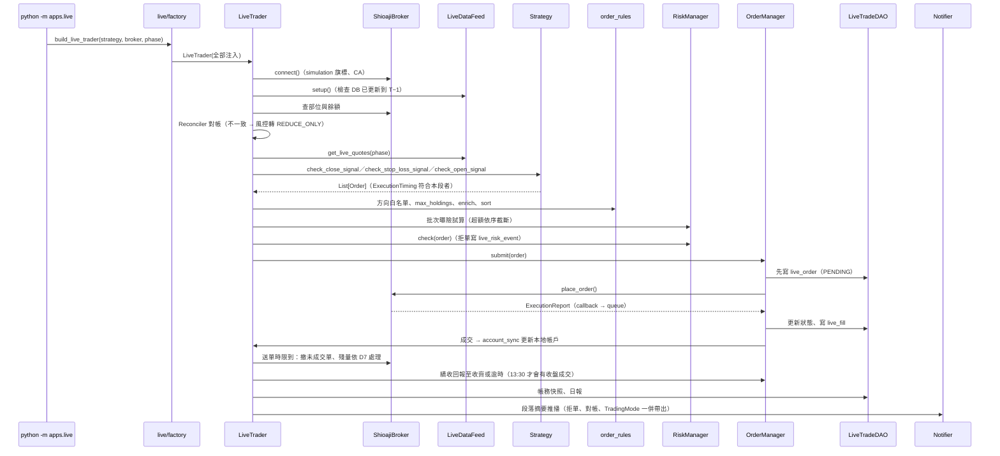

# 實盤下單架構規劃

## Abstract

- **背景／問題（立項當時，2026-09-17；下列各點現已全部解除，保留是為了說明本文件為何存在）**：
  專案當時已經有「策略開發 → 爬蟲 pipeline → 回測」三段，但**沒有實盤下單**：`run.py --mode live` 直接拋
  `NotImplementedError`；Shioaji 相關程式只有三支早期留下的 `core/utils/` 工具（只能下股票單、用 `print` 印回報、
  只能登入 production，已於 Phase7-3 刪除）；委託狀態追蹤、風控、對帳、紀錄落地、期貨下單、盤中行情迴圈全部都還沒有。
- **目標**：按量化交易常見的分層，新增四層：
  - 「券商閘道（Broker Gateway）」：`core/broker/`。
  - 「委託管理與風控（OMS／Risk）」：`core/live/oms/`、`core/live/risk/`。
  - 「實盤引擎（Live Trader）」：`core/live/`。
  - 「回測與實盤共用的委託前處理」：方向白名單、`max_holdings`、排序只能有一份實作——這一層是兩邊不漂移的關鍵。
    原本放 `core/execution/order_preprocess.py`，2026-10-07 併入部位建構層成為 `core/portfolio/order_rules.py`（`8604296`）。

  同一支策略類別**不用改寫、也不用 `if live`**，就可以從回測切換到 Shioaji 模擬環境，再切換到正式環境。支援的交易型態：
  - 台股現股、融券／借券、現股當沖、盤中零股（融資做多依 D3，第一階段不開放）。
  - 指數期貨、股票期貨。
  - 日頻與盤中兩種執行頻率。

- **範圍界線（不做）**：
  - 不做選擇權、美股、多券商與多帳戶路由、演算法拆單（TWAP／VWAP）、前端下單介面、自動調參。
  - 通知管道只實作 Telegram 與 Discord（Discord 於 2026-10-04 新增，`14a3e29`），其餘管道只留 `BaseNotifier` 介面。
    **存活監控與告警本身要做**：實盤最常見的失效不是下錯單，而是「該跑的段落沒跑、沒人發現」，只寫 log 等於沒有監控（Phase4-7）。
  - **不改變任何既有回測結果**：回歸雙線必須零變動。D2 已定案為逐筆觸發（2026-09-19），不新增切片回放，`Scale.TICK` 的回測語意不動；
    代價是盤中策略的回測結果無法重現實盤的逐筆順序，只能當量級參考。
- **驗收標準**：
  1. 以**實盤入口**（`python -m apps.live --broker shioaji --simulation`，2026-09-30 由 `run.py --mode live` 拆出，見
     [回測與實盤入口拆分及架構收斂.md](回測與實盤入口拆分及架構收斂.md)；**本條驗收不綁入口名稱**）可以在 Shioaji 模擬環境跑以下兩條路徑，每條線各自通過兩項：

     - **1a 穩定性**：累計 5 個交易日（**不必連續**），當天該線的開盤、尾盤、盤後段全部正常結束（退出碼 0），盤後對帳零差異，
       且**當天沒有未歸因的 CRITICAL 風控事件**（2026-10-07 使用者裁示補上：退出碼與對帳都會在本地狀態與券商不一致時照樣通過）。
     - **1b 下單路徑**：至少一組**連續**交易日，涵蓋「開倉委託成交 → 次一交易日平倉委託成交」；每筆委託、成交、
       每日部位快照都寫進 `tw_trading.db`，兩天盤後對帳零差異，且兩天的 parity（驗收標準 4）沒有 `UNEXPLAINED`。

     **2026-10-02 使用者裁示改為上述兩項，取代原本的「各連續 5 個交易日」**：原標準把兩件事綁在一起——排程、資料、
     對帳能不能自己穩定運作，與跨日的下單鏈（開倉 → 留倉 → 隔日平倉 → 對帳）有沒有走通。前者只要累積天數就看得出來；
     後者真正需要連續的只有開倉日與平倉日兩天。綁在一起時，任何一天出外部事故（VPN、睡眠、網路）就連已驗過的穩定天數一起歸零，
     而下單路徑又受訊號價位限制、不是每天都有單——演練會一直延長，卻沒有多驗到東西。

     **兩條線各自獨立宣告通過，不必互相等**（2026-09-25 裁示，理由見〈附：股票線與期貨線的分線〉）：
     **1S（股票線）** 一支股票日頻策略；**1F（期貨線）** 一支期貨策略。兩線的行程本來就是分開的——每個交易日六個獨立行程
     （股票／期貨 × 開盤／尾盤／盤後），期貨行程崩潰不會影響股票行程。**但程式碼是共用的**，故分線只解除「進度互卡」，
     不解除「改動互相影響」（見該附錄）。

  2. 盤中模式可以在模擬環境跑完整個交易時段。斷線後會自動重連、重新訂閱，而且不會重複下單。
  3. 風控測試案例全部有測試覆蓋：單筆金額上限、單日金額上限、價格偏離參考價、下單頻率、kill switch、對帳不一致時停止開新倉、
     批次送單的**策略層**總曝險與單一標的集中度上限（帳戶層總曝險上限從未接上執行端，見 Phase3-3）、
     `TradingMode` 降級後重啟模式仍然延續（不會因為重啟而默默恢復送單）。
  4. 每個交易日的實盤委託與「以當日正式資料重跑同一支策略」的委託清單逐筆比對，差異都能歸因（快照口徑、風控拒單、未成交、
     段落時點、跨策略守門、執行差異），沒有 `UNEXPLAINED` 項目。**多策略時逐策略各比一份**。2026-10-08 起改在次一交易日
     資料更新後補比（Phase7-14）。
  5. 演練期間關鍵事件（啟動、結束、拒單、對帳不一致、斷線、kill switch）都有推播送達；「排程沒跑」由 LiveTrader 之外的 watchdog 偵測得到。
  6. `python scripts/check_layer_deps.py`、`pytest`、`./scripts/run_regression.sh` 全部通過，回測 baseline 沒有重產。

- **現況（2026-10-10）**：程式面除 Phase6-3、Phase6-4 兩個暫緩項外都已實作；剩下的是演練驗收（Phase7-1 的 1b、盤中、推播）、
  幾項要在特定交易日實跑的驗證（Phase4-9、Phase5-5、Phase6-1、Phase6-6），以及一批已在 `feature/post-rehearsal` 實作、
  **等演練結束才部署**的修正（Phase7-2S、Phase7-7、Phase7-9、Phase7-10、Phase7-11）。剩餘順序見〈剩餘工作順序〉。

> **名稱對照（完成後陸續改名，下方完成摘要一律用現行名稱，舊名只在引述原規格時出現）**：
> - main 已改：`core/execution/order_preprocess.py` → `core/portfolio/order_rules.py`（`get_execution_order()` → `get_execution_sequence()`）；
>   `core/managers/` → `core/position/`；`InstrumentSpec`／`CostModel` 由 `core/backtest/models/` 下沉到 `core/market/`；
>   策略屬性 `position_type`／`allowed_directions` → `direction`、`enable_intraday` → `allow_day_trade`、`is_intraday` → `is_tick_triggered`，
>   `bar_execution_order` 移除（順序一律由 `allow_day_trade` 推導，2026-10-05 `bca33be`、`a2b991b`）；`run.py` 已刪除（2026-10-01 `cf23b72`），入口為 `python -m apps.live`。
> - **只在 `feature/post-rehearsal`、演練後才部署**：`tasks/` 併入 `apps/`（資料更新改 `python -m apps.update_db`）；具體策略與
>   `StrategyLoader` 搬到頂層 `strategies/`、`core/strategies/` 只剩契約；`MomentumStrategy1` 改名 `VolumeBreakoutMomentumStrategy`（Phase7-10）。
>   在那之前，main 上的路徑與名稱（`core/strategies/stock/`、`MomentumStrategy1`、`python -m tasks.update_db`）才是現況。

---

## 進度追蹤表

| 編號 | 步驟名稱 | 產出檔案 | 驗證方式 | 狀態 | 備註／中斷點 |
| ---- | -------- | -------- | -------- | :--: | ------------ |
| Phase0-1 | Shioaji 帳號前置：API 條款、CA 憑證、模擬環境 API 測試 | 本文件（完成紀錄） | 模擬環境股票、期貨各下一筆並 `update_status()` 查得到；正式帳號具下單權限 | ✅ | **使用者手動**｜2026-09-21 完成（股票與期貨各一筆委託並撤單，皆查得到 `Cancelled`），2026-09-22 以 shioaji 1.7.5 重驗 |
| Phase0-2 | 待裁示事項 D0~D8 定案 | 本文件〈待裁示事項〉 | 每項填入裁示結果與日期 | ✅ | 2026-09-19 全部定案（D2、D4、D6 偏離建議）；**2026-10-06 D6 重新裁示**為「執行層換算、一律有保護價」，D7 重送改以 `MARKET` 意圖（見 `實盤委託價格類型設計.md`） |
| Phase0-3 | 實盤設定與環境變數 | `core/config/settings.py`、`core/config/schema.py`、`core/config/paths.py`、`.env.example`、`tests/test_config_consistency.py`、`tests/test_config_paths.py` | `pytest tests/test_config_consistency.py` 通過 | ✅ | 2026-09-19 完成，34 passed（`7d9504b`） |
| Phase0-4 | 分層規則登記 `core/broker/`、`core/live/` 與共用前處理 | `scripts/check_layer_deps.py` | `python scripts/check_layer_deps.py` 通過；故意反向 import 會失敗 | ✅ | 2026-09-19 完成，違規 0，兩種負向情境實測會失敗（`7d9504b`）；共用前處理併入 `core.portfolio` 後原 `core.execution` 登記隨之移除，另登記 `core.live.execution` |
| Phase1-1 | 下單執行參數 Enum | `core/utils/constant/`、`core/utils/__init__.py`、`tests/test_order_state_parity.py` | 與 `shioaji.constant` 同名 Enum 的值逐一比對 | ✅ | 2026-09-19 完成（`7d9504b`）；1.3.3 缺 `SBLShort` 的落差已於 2026-09-21 升 1.7.5 後解除 |
| Phase1-2 | 訂單模型補執行欄位（預設值維持回測行為） | `core/models/base/order.py`、`core/models/stock/order.py`、`core/models/futures/order.py` | `./scripts/run_regression.sh` 零變動 | ✅ | 2026-09-19 完成，回歸雙線零變動（`7d9504b`） |
| Phase1-3 | 委託單、成交回報、帳務快照模型 | `core/models/base/execution.py`、`core/models/stock/execution.py`、`core/models/futures/execution.py`、`tests/live/test_execution_models.py` | 新增單元測試 | ✅ | 2026-09-19 完成，17 passed（`7d9504b`） |
| Phase2-1 | `BaseBroker` 抽象介面與測試用 `FakeBroker` | `core/broker/base.py`、`tests/live/conftest.py`、`tests/live/test_broker_contract.py` | `FakeBroker` 通過介面契約測試 | ✅ | 2026-09-19 完成，契約測試 30 條（`7d9504b`） |
| Phase2-2 | `ShioajiSession`：登入、CA、模擬旗標、重連、限流 | `core/broker/rate_limiter.py`、`core/broker/tw/shioaji_session.py`、`scripts/manual/manual_shioaji_login.py`、`tests/live/test_rate_limiter.py`、`tests/live/test_shioaji_session.py` | 限流單元測試；模擬環境登入、登出冒煙 | ✅ | 2026-09-19 程式（`ddc2fba`）；2026-09-22 模擬環境冒煙完成。限流改滑動視窗、時鐘檢查拆成三層（偏離原規格） |
| Phase2-3 | 合約解析：上市櫃、指數期貨、股票期貨 | `core/broker/tw/shioaji_contract_resolver.py`、`tests/live/test_shioaji_contract_resolver.py` | 以假合約表單元測試；模擬環境逐類實查一檔 | ✅ | 2026-09-22 三類各實查一檔（2330、TXFJ6、股期 CDFJ6） |
| Phase2-4 | 委託轉換與合法組合檢查 | `core/broker/tw/shioaji_order_mapper.py`、`tests/live/test_shioaji_order_mapper.py` | 合法組合矩陣的參數化測試 | ✅ | 2026-09-19 完成，37 passed |
| Phase2-5 | 委託與成交回報正規化（callback → queue） | `core/broker/tw/shioaji_execution_handler.py`、`core/broker/execution_dedup.py`、`tests/live/test_shioaji_execution_handler.py` | 重放錄下的 callback 訊息：亂序、重複都能得到同一結果 | ✅ | 2026-09-22 委託、撤單、成交回報皆以模擬環境實際回報核對（股票與期貨各一組成交） |
| Phase2-6 | 帳務查詢：餘額、交割款、部位、期貨保證金 | `core/broker/tw/shioaji_account_query.py`、`tests/live/test_shioaji_account_query.py` | 以假回傳物件單元測試；模擬環境冒煙 | ✅ | 2026-09-22 模擬環境冒煙完成，並修正持倉成本少乘 1000（`5706881`） |
| Phase2-7 | 即時行情：快照與 tick／bidask 訂閱 | `core/broker/tw/shioaji_quote_stream.py`、`tests/live/test_shioaji_quote_stream.py` | 轉出的 `StockQuote`／`FuturesQuote` 欄位與回測版一致 | ✅ | 2026-09-22 模擬環境冒煙完成（快照 250 檔分批、逐筆訂閱），並修正快照時間偏 8 小時 |
| Phase2-8 | `ShioajiBroker` 組裝 | `core/broker/tw/shioaji_broker.py`、`tests/live/test_shioaji_broker.py`、`tests/live/test_shioaji_sim.py` | 以真 `ShioajiBroker` 在模擬環境驗介面承諾 | ✅ | 2026-09-22 模擬環境實連測試 10 條全過（另立 `test_shioaji_sim.py`，偏離原規格） |
| Phase3-1 | 實盤紀錄資料庫 `tw_trading.db` 與 DAO | `core/config/schema.py`、`core/dao/connection.py`、`core/dao/tw/live_trade_dao.py`、`tests/test_dao_live_trade.py` | 建表冪等；同一筆成交寫兩次不重複 | ✅ | 2026-09-20 完成，26 passed（`ddc2fba`）；維持 SQLite、不隨 PostgreSQL 遷移 |
| Phase3-2 | `OrderManager` 委託狀態機 | `core/live/oms/order_manager.py`、`tests/live/test_order_manager.py` | 狀態轉移表的參數化測試；非法轉移會拋出 | ✅ | 2026-09-20 完成，32 passed（`307acfb`） |
| Phase3-3 | `PreTradeRiskManager`、`TradingMode` 狀態機與批次曝險檢查 | `core/live/risk/`、`tests/live/test_risk_manager.py`、`tests/live/test_trading_mode.py` | 每條規則一個測試；kill switch 生效後零委託送出；降級後重啟模式仍延續 | ✅ | 2026-09-20 完成，45 passed（`307acfb`）。**帳戶層總曝險上限從未接上執行端**：`feature/post-rehearsal` 已移除該欄位（`4d4cc60`，`重構後全專案健檢.md` Phase1-1），見步驟章節 |
| Phase3-4 | 共用委託前處理：從 `Backtester` 抽出 | `core/portfolio/order_rules.py`（原 `core/execution/`）、`core/backtest/backtester.py`、`tests/portfolio/test_order_rules.py` | 回歸雙線零變動；實盤與回測呼叫同一函式 | ✅ | 2026-09-20 完成，回歸雙線零變動（`370e5bd`）；2026-10-07 搬到 `core/portfolio/` |
| Phase3-5 | 帳戶同步：成交 → 本地 Account，券商快照覆寫 | `core/live/account_sync.py`、`tests/live/test_account_sync.py` | 以 `FakeBroker` 重放一天的成交，本地部位＝券商部位 | ✅ | 2026-09-20 完成（`370e5bd`） |
| Phase3-6 | 對帳器 `Reconciler` | `core/live/reconciler.py`、`tests/live/test_account_sync.py` | 刻意製造差異時轉入 `REDUCE_ONLY` 並寫入 `live_risk_event` | ✅ | 2026-09-20 完成（`370e5bd`） |
| Phase3-7 | 策略部位歸屬帳 `PositionAttributionLedger` | `core/live/attribution/position_ledger.py`、`tests/live/test_position_ledger.py` | 兩支策略互不影響；加總等於券商部位；沖銷順序與 `PositionManager` 逐筆相同 | ✅ | 2026-09-20 完成，16 passed（`370e5bd`） |
| Phase3-8 | 資金額度分配 `CapitalAllocator` | `core/live/capital_allocator.py`、`core/portfolio/aggregation.py`、`tests/live/test_capital_allocator.py` | 額度總和超過總權益時拒絕啟動；持倉續跑不誤判；併發保留互相扣除；降級釋放 | ✅ | 2026-09-20 完成（`370e5bd`）；2026-10-02 模擬環境改用虛擬資金（`901556f`） |
| Phase3-9 | 跨策略衝突守門（D8 同標的只允許一支持有） | `core/live/attribution/conflict_guard.py`、`core/portfolio/aggregation.py`、`tests/live/test_capital_allocator.py` | A 持有時 B 的新倉被擋、平倉照過；被擋的單歸 `CROSS_STRATEGY_BLOCKED` | ✅ | 2026-09-20 完成（`370e5bd`） |
| Phase4-1 | 日頻執行時點契約（`ExecutionTiming`） | `core/strategies/base.py`、`core/models/base/quote.py`、`core/live/strategy_guard.py`、`tests/live/test_live_ready_guard.py` | 回歸零變動；未宣告 `live_ready` 拒絕上實盤；開盤段讀 OHLC 會拋出；段落先後矛盾拒絕啟動 | ✅ | 2026-09-20 完成，25 passed（`89e8769`） |
| Phase4-2 | `LiveDataFeed`：歷史到 T−1＋當日快照＋資料新鮮度檢查 | `core/live/datafeed/`、`tests/live/test_live_datafeed.py` | DB 未更新到 T−1 時拒絕啟動；報價欄位與回測版一致 | ✅ | 2026-09-20 完成（`89e8769`）；2026-09-22 官方開休市日曆入庫成為主來源（`5a52846`），9/25 中秋休市日實測正確 |
| Phase4-3 | `LiveTrader` 日頻流程（市場無關） | `core/live/trader.py`、`core/live/segment.py`、`tests/live/test_live_trader_day.py` | `FakeBroker` 端到端：開盤段、尾盤段、盤後段 | ✅ | 2026-09-20 完成，14 passed（`24ab182`） |
| Phase4-4 | 實盤 factory | `core/live/factory.py`、`tests/live/test_live_factory_and_entry.py` | 未支援的（市場, 商品）組合拋出含兩軸值的 `ValueError` | ✅ | 2026-09-20 完成（`24ab182`）；台股與期貨尾盤時窗不重疊，同一次執行不可混跑 |
| Phase4-5 | 實盤入口接線與安全旗標（原 `run.py --mode live`，現 `python -m apps.live`） | `apps/live.py`、`tests/live/test_live_factory_and_entry.py` | 未加 `--confirm-production` 時不可能連到正式環境 | ✅ | 2026-09-20 完成，19 passed（`24ab182`）；2026-09-30 拆成 `apps/live.py`、2026-10-01 刪除 `run.py`（`cf23b72`） |
| Phase4-6 | 盤後作業：撤未成交單、對帳、快照、日報、未成交殘量 | `core/live/after_close.py`、`core/live/report/live_reporter.py`、`core/live/oms/order_manager.py`、`core/dao/tw/live_trade_dao.py`、`tests/live/test_after_close.py` | `results/live/<Strategy>/` 產出日報；對帳結果寫入 DB；平倉單未成交時次日補平 | ✅ | 2026-09-20 完成（`d885e86`）；券商不提供逐筆費用，成本校正另立 Phase4-9 |
| Phase4-7 | 事件通知與存活監控（LiveTrader 之外的 watchdog） | `core/live/notify/`、`scripts/live_watchdog.py`、`tests/live/test_notifier.py` | 通知端拋例外時交易流程不受影響；watchdog 測得出「段落沒跑」與「跑到一半死掉」 | ✅ | 2026-09-20 完成，28 passed（`ed8a849`）；2026-10-04 新增 Discord 管道（`14a3e29`）。**演練環境仍未設定通知管道**，推播送達屬 Phase7-1 驗收 5 |
| Phase4-8 | 實盤與回測每日訊號一致性比對（parity） | `core/live/report/parity_checker.py`、`core/live/factory.py` | 刻意少送一張單時，diff 抓得到並歸類為 `UNEXPLAINED` | 🔄 | 2026-09-20 程式與 13 條測試完成（`cfbbc36`）；演練中已改為次日補比並補齊歸類（Phase7-12～7-15），10/6～10/8 補比皆無 `UNEXPLAINED`。**剩 Phase7-1 的 1b 兩天實測**（開倉日與平倉日 parity 無 `UNEXPLAINED`）。相依 Phase4-6 |
| Phase4-9 | 盤後以券商已實現損益校正成本估算 | `core/broker/tw/shioaji_account_query.py`、`core/broker/tw/shioaji_broker.py`、`core/live/after_close.py`、`core/live/factory.py`、`core/dao/tw/live_trade_dao.py`、`tests/live/test_cost_calibration.py` | 期貨 fee＋tax 與股票推得的實際成本，與本地估算逐日比對並落地 | 🔄 | 2026-09-22 程式與 11 條測試完成（`e6ea95d`），期貨以真實交易驗證一致（243 對 243）；**剩股票側實跑**——要有經 OMS 寫入 `live_fill` 的開平倉成交，至 2026-10-08 演練尚無任何成交。相依 Phase4-6 |
| Phase5-1 | 盤中策略契約（逐筆觸發） | `core/strategies/base.py`、`core/backtest/backtester.py`、`core/backtest/README.md`、`tests/backtest/test_intraday_contract.py` | 同一段錄製 tick 餵兩次訊號一致；逐筆策略跑 `Scale.TICK` 回測時拒絕啟動 | ✅ | 2026-09-20 契約與守門、2026-09-21 錄製重放（`3c1bc37`）；旗標現名 `is_tick_triggered` |
| Phase5-2 | 盤中事件迴圈：行情 queue、心跳、報價過期偵測 | `core/live/intraday/event_loop.py`、`tests/live/test_intraday_event_loop.py` | 注入延遲、斷線事件後轉入 `REDUCE_ONLY`，不送新倉單 | ✅ | 2026-09-20 迴圈（`f24c3f6`）、2026-09-21 接線（`805acf5`）。相依 Phase5-1、Phase4-3 |
| Phase5-3 | 斷線重連、重新訂閱與重啟後恢復狀態 | `core/broker/tw/shioaji_session.py`、`core/live/trader.py`、`tests/live/test_reconnect_recovery.py` | 在任意時點殺掉行程後重啟：不重複下單、未完成委託重新接管 | ✅ | 2026-09-20 恢復流程（`4136329`）、2026-09-21 接線。相依 Phase5-2 |
| Phase5-4 | 日終強制動作：當沖回補、期貨夜盤跨日歸屬 | `core/live/intraday/session_guard.py`、`tests/live/test_session_guard.py` | 模擬 13:20 仍有當沖部位時觸發回補 | ✅ | 2026-09-21 完成（`91fc7d0`）；夜盤日期函式不接呼叫端（實盤沒有夜盤段落，偏離原規格），新增夜盤段落時必須先接上 |
| Phase5-5 | 常駐部署與排程 | `docker-compose.yml`、`docs/deployment/live-deployment.md`、`core/live/termination.py`、`apps/live.py`、`tests/live/test_termination.py`、`tests/test_compose_live_service.py` | 容器內跑完一個模擬交易日；SIGTERM 會先撤單再結束 | 🔄 | 2026-09-22 compose `live` service、SIGTERM 收尾（退出碼 143）、部署與排程文件完成（`f515f5e`）；**剩容器內以模擬環境跑一個完整交易日**（演練走 launchd、不經容器，至今未跑）。相依 Phase5-3 |
| Phase6-1 | 融資融券與現股當沖下單 | `core/broker/tw/shioaji_broker.py`、`tests/live/test_stock_order_eligibility.py` | 券源不足或不可當沖的標的在送單前被擋 | 🔄 | **股票線**｜2026-09-22 送單前資格檢查與 15 條測試完成（`3cc1fc3`）；**剩模擬環境盤中各送一筆**（融券、借券、當沖先賣），原訂 9/23 的一次性排程沒有跑成、2026-10-07 已從排程移除，要手動執行。**待評估**：以 `api.contracts.info()` 的券賣資格旗標取代「用券源張數推資格」。相依 Phase2-4、Phase3-3、D3 |
| Phase6-2 | 指數期貨：代號轉換與開平倉別 | `core/broker/tw/` 的 contract resolver、execution handler、account query、quote stream、order mapper、broker | 四條路徑都是 `{商品}{YYYYMM}`；平倉單送 `Cover`；模擬環境期貨成交回報代號等於訂單代號 | ✅ | **期貨線**｜2026-09-22 完成（`9c299c3`）；`DayTrade` 開平倉別未推導（偏離原規格，結果正確只少了當沖保證金減收） |
| Phase6-3 | 股票期貨合約與乘數 | `core/broker/tw/shioaji_contract_resolver.py` | 乘數取自合約並與 `futures_stock_universe` 交叉比對 | ⏸ | **期貨線**｜2026-09-22 暫緩：股期沒有送單路徑，也沒有策略交易股期。**解除條件：開始開發股期策略時**（與 [暫緩工作彙整.md](暫緩工作彙整.md) S4 同一個條件）。相依 Phase6-2 |
| Phase6-4 | 盤中零股 | `core/models/stock/order.py`、`core/broker/tw/shioaji_order_mapper.py` | 數量單位錯配（張當股）在建立委託時就拋出 | ⏸ | **股票線**｜2026-09-22 暫緩：建構檢查與送單前拒絕已做（`3cc1fc3`）；下游全以張為單位，回測也不支援零股。**解除條件：有策略需要零股時**。相依 Phase2-4 |
| Phase6-5 | 送單前的期貨保證金檢查 | `core/live/risk/margin_gate.py`、`core/live/trader.py`、`core/live/factory.py`、`tests/live/test_margin_gate.py` | 可用保證金不足時不送單並寫事件；足夠時照常送出 | ✅ | **期貨線**｜2026-09-22 完成（`f08b430`）：策略層＋帳戶層兩層檢查（使用者裁示，偏離原規格） |
| Phase6-6 | 期貨換月：平舊月＋開新月兩腿 | `core/live/trader.py`、`core/live/datafeed/base.py`、`core/live/datafeed/tw/futures_live_datafeed.py`、`core/live/factory.py`、`tests/live/test_futures_roll.py` | 換月日模擬環境實跑一次；平倉腿未成交時開倉腿放棄並寫事件 | 🔄 | **期貨線**｜2026-09-22 程式與 17 條測試完成（`7b81452`）；**剩換月日實跑**：10 月契約最後交易日 2026-10-21，換月日 **2026-10-20** 尾盤段。**前提是 `MomentumFuturesStrategy` 當時持有 10 月部位**——至 2026-10-08 期貨線尚無任何委託，屆時沒有部位就驗不到，下一次是 11 月契約換月日 2026-11-17。**2026-10-10 使用者裁示要想辦法建倉**：提案為演練專用期貨策略 10/14 起建 1 口近月、撐過換月後平倉（見步驟章節，待確認後實作，須 10/13 晚間前部署）。相依 Phase6-2、Phase6-5 |
| Phase7-1 | 模擬環境端到端演練（1a 穩定 5 日＋1b 下單路徑一組） | 本文件（演練紀錄） | 對應 Abstract 驗收標準 1、2、4、5 | 🔄 | **1a 兩線各 5 日 ✅**（9/24、10/1、10/5、10/6、10/8；2026-10-09 使用者確認）；**1b 兩線皆未發生**——10/8 三張漲停限價＋ROD 撐到收盤撮合仍 0 成交，其中 4157 收盤未鎖漲停，疑似模擬環境不撮合收盤集合競價，**1b 的驗法待使用者裁示**（擬 2026-10-12 交易時段重跑撮合探測）；盤中（驗收 2）待 `feature/post-rehearsal` 部署；推播（驗收 5）通知管道仍未設定（2026-10-10 使用者：之後再設定）。逐日紀錄見步驟章節。相依 Phase4-6～Phase4-8、Phase5-5；1S 另相依 Phase6-1，1F 另相依 Phase6-2、Phase6-5、Phase6-6 |
| Phase7-2S | 正式環境小額上線檢查表（股票） | `docs/live/production-checklist-stock.md` | 使用者逐項勾選 | 🔄 | **股票線**｜2026-10-09 草稿完成（`feature/post-rehearsal` 的 `1e90202`，待演練後部署）；**剩 Phase7-1 的 1S 通過後使用者逐項勾選**。無硬日期 |
| Phase7-2F | 正式環境小額上線檢查表（期貨） | `docs/live/production-checklist-futures.md` | 使用者逐項勾選 | ⬜ | **期貨線**｜相依 Phase0-1（已完成）、Phase7-1 的 1F，以及 Phase6-6 換月實跑通過 |
| Phase7-3 | 舊 Shioaji 工具收斂 | `core/utils/account.py`、`core/pipeline/tw/updaters/*_tick_updater.py`、`scripts/manual/manual_tick_crawler.py` | `grep -rn "OrderUtils\|Callback.order_callback"` 無結果；tick updater 冒煙通過 | ✅ | 2026-09-22 完成（`dbecf40`）：`OrderUtils`、`Callback`、`ShioajiAccount` 刪除，tick 爬蟲改用 `ShioajiSession`；2203 passed、tick 冒煙 2330 單日 4,824 筆 |
| Phase7-4 | 文件 | `docs/live/live-trading.md`、`docs/backtest/module-map.md`、`docs/dev/runtime-artifacts.md`、`README.md`、`README_en.md`、策略 README | `python scripts/check_doc_paths.py` 通過 | ⬜ | 相依 Phase7-1；部分內容已由 `docs/live/execution-layer.md`、`docs/deployment/live-deployment.md` 先行涵蓋 |
| Phase7-5 | 並行段落互相標記 CRASHED，並靜默解除帳戶層 halt | `core/dao/tw/live_trade_dao.py`、`core/live/risk/trading_mode.py`、`core/live/trader.py`、`tests/live/test_concurrent_runs.py` | 兩個段落時窗重疊時，後啟動者不得標記前者為 CRASHED；前次 `REDUCE_ONLY` 必須讀得回來 | ✅ | 2026-09-24 完成（`3b4fa68`），9/25 兩對重疊排程實測不再誤標 |
| Phase7-6 | 日線報價的 `date` 在實盤與回測型別不同 | `core/broker/tw/shioaji_quote_stream.py`、`core/live/datafeed/tw/futures_live_datafeed.py`、`tests/live/test_quote_date_parity.py` | 8 條新測試；回歸雙線逐筆相同 | ✅ | 2026-09-24 完成（`e5f9ee7`），修 9/24 演練尾盤段的實際崩潰 |
| Phase7-7 | 實盤風控的額度基準改用 `live_capital` | `core/live/trader.py`、`core/live/risk/risk_manager.py`、測試 | 宣告 `live_capital` 的策略以它為風控基準；`tests/live/` 全數通過 | 🔄 | **已實作、待演練後部署**（`feature/post-rehearsal` 的 `3768672`）：基準改 `StrategyContext.capital_limit`、參數改名 `capital_limit`、單筆比率 0.20 → 0.35。剩 merge 後比對被擋筆數；**須在 Phase7-2S／7-2F 上線前完成** |
| Phase7-8 | 演練結束後移除 launchd 排程 | `~/Library/LaunchAgents/com.alphaedge.live.*.plist`、`scripts/launchd/rehearsal_schedule.py` | `--status` 只剩決定保留的排程；`launchctl list \| grep alphaedge` 與之相符 | 🔄 | 做法 1 已完成：`sim-short-sell` 已卸載，`_ONE_OFF_JOBS` 清空並加護欄（2026-10-07 `265f70c`，隨 Phase7-14）；**剩 Phase7-1 結束後移除演練段落**，`update-db` 去留待使用者裁示。**若 2026-11-01（美東改回標準時間）仍有排程在跑，要先重新安裝**。相依 Phase7-1 |
| Phase7-9 | 啟動前設定錯誤不留下未結束的 `live_run` | `core/live/factory.py`、測試 | 混帶股票與期貨策略時 `live_run` 不新增未結束的列；下一次執行不再出現 CRASHED | 🔄 | **已實作、待演練後部署**（`feature/post-rehearsal` 的 `3de6af0`）：`LiveTrader` 組完才寫 `live_run`，`apps/live.py` 不必改。剩 merge 部署。相依 Phase7-1 |
| Phase7-10 | `MomentumStrategy1` 改名為 `VolumeBreakoutMomentumStrategy` | 策略檔與測試、排程、`docker-compose.yml`、`.env.example`、文件、`tw_trading.db` 的 `strategy_name` | `git grep MomentumStrategy1` 只剩歷史紀錄；回歸雙線通過；新名冒煙；紀錄庫遷移前後各表筆數相同 | 🔄 | **已實作、待演練後部署**（`feature/post-rehearsal` 的 `8cd350c`，與 `core目錄邊界收斂.md` Phase2-2 同一批、先搬家再改名）；遷移腳本以真實紀錄庫副本實跑通過。**剩演練結束後**：停排程 → 合併 → 遷移 `--apply` → 重裝 launchd → `--resync-from-broker` 確認歸屬帳一致。相依 Phase7-1 |
| Phase7-11 | 等待回報的安全上限依時窗長度計算 | `core/live/trader.py`、`tests/live/test_live_trader_day.py` | 股票開盤段不再於收線前撞到上限並記 ERROR；時鐘卡住時仍會跳出 | 🔄 | **已實作、待演練後部署**（`feature/post-rehearsal` 的 `1f71f73`）：上限改為「離目標時點的秒數＋寬限 300 秒」。剩 merge 後確認開盤段不再出現「請確認系統時鐘」。相依 Phase7-1 |
| Phase7-12 | 盤後 parity 只比對本次行程載入的策略 | `core/live/report/parity_checker.py`、`core/live/factory.py`、測試 | 3 條新測試＋兩種突變各自轉紅 | ✅ | 2026-10-06 完成（`004e5b9`，使用者裁示演練期間修）；2026-10-07 起範圍再擴為本行程載入的全部策略 |
| Phase7-13 | 委託生命週期：收線後才撤單、套用新單確認、接管只限本行程 | `core/live/trader.py`、`core/live/oms/order_manager.py`、`core/live/factory.py`、`core/live/report/parity_checker.py`、`tests/live/` | 新測試＋五種突變各自轉紅；演練中集合競價委託撐到撮合、狀態與券商一致 | ✅ | 2026-10-07 完成並部署（`bfeb84e`，merge `b911532`）；**10/8 尾盤段演練實測通過** |
| Phase7-14 | parity 改於次日資料更新後補比前一交易日 | `scripts/launchd/rehearsal_schedule.py`、`core/live/after_close.py`、`core/live/report/parity_checker.py`、`apps/live.py`、`tests/live/` | 當日行情入庫後才比對；盤後段不再誤歸 `SNAPSHOT_GAP`；演練中次日早上產出前一交易日的 parity | ✅ | 2026-10-07 完成並部署（`0fe9596`、`e9d93c4`、`265f70c`、`5c548cc`、`c46658b`）；**10/7、10/8 由 06:00 排程自動補比、兩線無 `UNEXPLAINED`，演練實測通過** |
| Phase7-15 | parity 判定鎖漲跌停前先比對收盤價 | `core/live/report/parity_checker.py`、`core/live/factory.py`、`tests/live/` | 收盤未鎖住的集合競價未成交單歸 `UNFILLED` 並寫出收盤與漲跌停價；以 10/8 實際資料驗證 | ✅ | 2026-10-09 完成（`374563a`），以 10/8 研究庫資料驗證 4157 改歸 `UNFILLED` |

---

## 現況盤點（立項時，2026-09-17）

立項時盤點的沿用設計與缺口，現已全數由後續步驟處理，只留結論：

- **沿用**：策略鉤子與 `(market, instrument_type)` 分派、`BaseDataFeed`（現位於 `core/datafeed/base.py`）、部位管理器、
  `TwStockSpec` 的檔位與漲跌停推算、`FuturesRollConfig`／`select_near_month()`、`SHIOAJI_FUTURES_CATEGORY`、
  `OrderState`／`Status` 與 `tests/test_order_state_parity.py`、`core/dao/` 的 DAO 分層。
- **缺口與對應步驟**：
  1. 日 K 在實盤不存在（開盤前不知道 `close`）→ D1 雙段 `ExecutionTiming`、Phase4-1。
  2. 回測的 `Scale.TICK` 是整天一次給、不是事件驅動 → D2 逐筆觸發、Phase5-1（回測側不重寫，見
     [多市場回測引擎架構](../docs/backtest/multi-market-engine.md) §5.1）。
  3. 訂單模型沒有 `price_type`／`order_type`／`order_lot`／`order_cond`／`octype` → Phase1-2、Phase2-4、Phase6-2。
  4. 回測沒有融資做多 → D3 第一階段不開放。
  5. 委託前處理只寫在 `Backtester` 裡 → Phase3-4。
  6. 舊 Shioaji 工具（`print`、不支援模擬與 CA、交割款依位置取值）→ Phase7-3。

### Shioaji 官方限制（2026-09-17 查 sinotrade.github.io）

| 項目                                                                                   | 限制                                                                                                                                                         | 對設計的影響                                                                                                                    |
| -------------------------------------------------------------------------------------- | ------------------------------------------------------------------------------------------------------------------------------------------------------------ | ------------------------------------------------------------------------------------------------------------------------------- |
| 正式下單前                                                                             | 要先以 `simulation=True` 完成股票、期貨 API 測試，並 `activate_ca()`                                                                                         | Phase0-1，使用者手動                                                                                                            |
| 下單類（`place_order`／`update_status`／`update_qty`／`update_price`／`cancel_order`） | 每 10 秒合計 250 次                                                                                                                                          | `RateLimiter` 分類限流，**`update_status` 也算在內**，不能拿它輪詢                                                              |
| 帳務類（`account_balance`／`list_positions`／`margin`／`list_settlements`…）           | 每 5 秒合計 25 次                                                                                                                                            | 帳務以回報驅動為主，查詢只在對帳時點做                                                                                          |
| 行情查詢（`snapshots`／`ticks`／`kbars`／`credit_enquires`／`short_stock_sources`）    | 每 10 秒合計 50 次；盤中 `ticks` 最多 10 次                                                                                                                  | 快照分批、快取                                                                                                                  |
| 訂閱                                                                                   | 每個連線最多 200 檔                                                                                                                                          | 盤中策略的標的上限要在啟動時檢查                                                                                                |
| 同帳號連線                                                                             | 最多 5 條                                                                                                                                                    | 實盤與 tick 爬蟲共用額度，不要同時開太多                                                                                        |
| 登入                                                                                   | 每日 1,000 次                                                                                                                                                | 重連要退避，不能無限重試                                                                                                        |
| 超限處置                                                                               | 查詢超限暫停服務 1 分鐘，重複違規封 IP／ID                                                                                                                   | 限流器採保守額度（預設用官方上限的 80%）                                                                                        |
| `custom_field`                                                                         | 英數字，最多 6 字元                                                                                                                                          | 放不下完整 client order id，故放 base36 壓縮碼（D4、Phase3-2）；**不放策略代號**，壓縮碼反查得到策略，反之不然                  |
| 期貨 `octype`                                                                          | `Auto`／`New`／`Cover`／`DayTrade`                                                                                                                           | 開平倉別由訂單的 `Action` 推導，不交給 `Auto` 猜                                                                                |
| 股票 `order_cond`                                                                      | 文件寫 `Cash`／`MarginTrading`／`ShortSelling`／`SBLShort`／`SBLShortPriceExempt`，1.3.3 的 Enum 只有前三個（2026-09-19 Phase1-1 實測）；**1.7.2 起五個都有**（2026-09-21 升 1.7.5 重驗） | 由 `ShortMethod` 推導；借券照常轉成 `SBLShort`。mapper 查不到對應值時仍一律拋出，不可退回 `ShortSelling` |
| 股票 `order_lot`                                                                       | `Common`／`Fixing`／`Odd`／`IntradayOdd`                                                                                                                     | `IntradayOdd` 的數量單位是股                                                                                                    |

---

## 目標架構

### 分層（新增部分以粗體標示）

```
入口層        apps/backtest.py、apps/live.py
                │
策略層        具體策略（main：core/strategies/{stock,futures}/；feature/post-rehearsal 部署後：頂層 strategies/）
              core/strategies/base.py 等契約   ← 同一支策略，回測與實盤共用
                │
組裝層        core/backtest/factory.py    **core/live/factory.py**
                │                              │
引擎層        Backtester                  **LiveTrader**（市場無關，無子類）
                ├── backtest/models/          ├── **live/oms/**（OrderManager）
                ├── backtest/datafeed/        ├── **live/risk/**（PreTradeRiskManager、TradingMode、MarginGate）
                ├── position/  ◄──共用──────┤── **live/account_sync.py、reconciler.py**
                └── backtest/report/          ├── **live/execution/**（執行層：MARKET／LIMIT 意圖 → 券商委託）
                                              ├── **live/datafeed/**（LiveDataFeed）
                                              ├── **live/intraday/**（盤中迴圈）
                                              └── **live/notify/**（事件推播與存活監控）
                │                              │
部位建構層    core/portfolio/（signal.py／sizing.py／construction.py）
                ├── **order_rules.py**        回測與實盤共用的委託前處理：方向白名單、max_holdings、sort
                └── **aggregation.py**        跨策略：資金分配、同標的仲裁（判定，純函式）
                │
券商閘道層    **core/broker/**（BaseBroker ＋ tw/Shioaji 實作）
                │
市場結構層    core/market/（InstrumentSpec、CostModel、期貨日曆與換月）
資料層        core/api/ ── core/adapters/
資料存取層    core/dao/（＋ **live_trade_dao.py**）── data/db/（＋ **tw_trading.db**）
領域層        core/models/（＋ **execution.py**：委託單、成交回報、帳務快照）
共用層        core/utils/（＋ 下單執行 Enum）
```

### 目錄

```
core/
├── broker/
│   ├── base.py                         # BaseBroker：市場無關的券商介面
│   ├── rate_limiter.py                 # 分類限流（滑動視窗）
│   ├── execution_dedup.py              # 回報去重
│   └── tw/
│       ├── shioaji_session.py          # 登入、CA、模擬旗標、重連、事件回呼
│       ├── shioaji_contract_resolver.py
│       ├── shioaji_order_mapper.py     # 領域訂單 ⇄ sj.StockOrder／sj.FuturesOrder
│       ├── shioaji_execution_handler.py# callback → ExecutionReport → queue
│       ├── shioaji_account_query.py
│       ├── shioaji_quote_stream.py     # snapshots／subscribe → StockQuote／FuturesQuote
│       ├── quote_replay.py             # 錄製行情重放
│       └── shioaji_broker.py           # 組裝上面各元件，實作 BaseBroker
├── portfolio/
│   ├── order_rules.py                  # 方向白名單、max_holdings、排序（只收純參數，不 import 策略）
│   └── aggregation.py                  # 跨策略：資金分配與同標的仲裁的**判定**（純函式，不碰 broker／DB）
└── live/
    ├── trader.py                       # LiveTrader
    ├── factory.py                      # build_live_trader()
    ├── segment.py                      # 段落定義（open／close／after_close／intraday）
    ├── after_close.py                  # 盤後：報表、成本校正
    ├── account_sync.py
    ├── reconciler.py
    ├── strategy_guard.py               # 策略層的啟動與降級守門
    ├── termination.py                  # LiveTerminated（SIGTERM 收尾，繼承 BaseException）
    ├── capital_allocator.py            # 多策略資金額度保留／釋放
    ├── attribution/                    # 多策略歸屬
    │   ├── position_ledger.py          # live_position_lot 讀寫、策略 ⇄ 部位
    │   ├── conflict_guard.py           # D8 同標的守門
    │   └── resync.py                   # --resync-from-broker：以券商部位重建歸屬帳
    ├── execution/{base.py, stock.py, futures.py}   # 執行層（2026-10-06，見 docs/live/execution-layer.md）
    ├── oms/order_manager.py
    ├── risk/{risk_config.py, risk_manager.py, trading_mode.py, margin_gate.py, event_log.py}
    ├── datafeed/{base.py, calendar.py, tw/stock_live_datafeed.py, tw/futures_live_datafeed.py}
    ├── intraday/{event_loop.py, session_guard.py}
    ├── notify/{base.py, telegram_notifier.py, discord_notifier.py, factory.py}
    └── report/{live_reporter.py, parity_checker.py}
```

**`intraday/` 沒有 `bar_builder.py`**，這是 D2 的裁示（逐筆觸發，不自建 K 棒）——
盤中策略直接吃 tick，要聚合就自己在策略內做。

存活監控刻意放在 `scripts/live_watchdog.py`，**不在 `core/live/` 裡**：它必須是獨立行程，
和 LiveTrader 一起死的心跳等於沒有監控。

目錄軸線沿用[命名軸線](../docs/dev/naming-axes.md)的規則：

- `core/broker/` 與 `core/live/datafeed/` 的子目錄**只承載市場軸**（`tw/`）。
- 券商名稱（shioaji）與商品類別由檔名承載。

### 多策略：歸屬與衝突

> D4 已定案為**直接支援一個帳戶跑多支策略**（2026-09-19）。本節是那個決定的完整設計，
> Phase3-1、Phase3-2、Phase3-3、Phase3-5~Phase3-9、Phase4-3、Phase4-4 都依它施作。

**所有難題都來自同一件事：券商端只有一本合併帳。** 一個帳戶、一組部位、一筆餘額，
券商完全不知道「策略」是什麼。策略是純本地概念，所以多策略要做的就是：
維護一本**本地歸屬帳**，並在它與券商合併帳之間保持隨時可對帳。

#### 1. 行程形狀：單一行程、單一 session

| 元件                         | 數量 | 理由                                                                                                                                           |
| ---------------------------- | :--: | ---------------------------------------------------------------------------------------------------------------------------------------------- |
| 作業系統行程                 |  1   | 下面三項的必然結果                                                                                                                             |
| `ShioajiSession`（登入／CA） |  1   | 一個帳戶一組憑證；多重登入的行為未定義                                                                                                         |
| `RateLimiter`                |  1   | **限流是帳戶級的**（`ORDER` 250 筆／10 秒）。多行程各自持有 limiter 時，每個都以為自己還有額度，合起來必然超額，而且誰都不知道是誰把額度用掉的 |
| `OrderManager`               |  1   | 回報 callback 是 session 級的；分成多個 OMS 就得先把回報分派出去，那等於在更下層再做一次歸屬                                                   |
| `Strategy`                   |  N   | 多策略的本體                                                                                                                                   |
| `Account`（本地）            | N＋1 | 每策略一份（歸屬帳）＋帳戶層一份（與券商對帳用）                                                                                               |

`build_live_trader()` 因此由收一支策略改為收一份策略清單（Phase4-4）。

#### 2. 委託歸屬：`custom_field` 仍放 client order id

多策略下**更**應該把那 6 個字元留給 client order id，而不是策略代號：

- 壓縮碼 → 本地 `live_order` → 該列的 `strategy_name`，**反查得到策略**。
- 策略代號只能知道「哪一支策略」，**無法知道是哪一張單**；重啟接管仍得靠屬性模糊比對，
  而模糊比對正是多策略下最容易對錯的地方——兩支策略可能在同一秒對不同標的送出相似的單。

`live_order` 新增 `strategy_name` 欄（不可為空），是歸屬鏈的起點。

#### 3. 部位歸屬：`live_position_lot`

券商合併部位無法拆回策略，所以本地自己記：

- 每次**開倉成交**新增一筆 lot（`strategy_name`、`symbol`、`direction`、`volume`、
  `open_date`、`open_price`、來源 `client_order_id`）。
- 平倉成交時**只沖銷該策略自己的 lot**，沖銷順序與回測的 `PositionManager` 一致。
- 不變式：**Σ 各策略 lot 淨額（依 symbol、direction）＝ 券商部位**。這條就是 Phase3-6 的對帳式。

#### 4. 資金歸屬：`CapitalAllocator`

D5 定了「`init_capital` 是本策略的額度上限」，多策略下必須再加兩件事，否則兩支策略會同時
看到「帳戶還有 100 萬」而各自下 80 萬，第二張單被券商退：

- **啟動時檢查**：Σ 各策略額度 ≤ 帳戶可用資金 × 安全係數（預設 0.95）。不滿足就**拒絕啟動**，
  不要等到盤中被券商退單才發現。
- **送單前保留、終結時釋放**：委託送出前向 allocator 保留金額，成交、拒單、撤單、逾時各自釋放。
  策略可用資金 ＝ `min(本策略額度 − 本策略已用, 帳戶可用餘額 − 其他策略已保留)`。

#### 5. 跨策略衝突：同一標的只允許一支策略持有（D8）

- 守門在委託前處理（`order_rules`）之後、風控之前：新倉單的標的若已被其他策略持有或掛單，直接擋下，
  寫 `live_risk_event`（`severity=WARN`）。**平倉單不受限**——擋平倉會讓部位失去出場能力。
- 這道守門同時解掉三個問題：券商端反向沖銷、台股同日一買一賣被**判成當沖**（稅率與成本和回測不同、
  還會吃掉當沖額度）、以及歸屬帳一對多的拆分。
- 代價是策略選股重疊時會有一支吃不到，實盤績效低於各自單跑的回測。這個差異**是預期的**，
  Phase4-8 的 parity 要把它歸類為 `CROSS_STRATEGY_BLOCKED`，不可混進 `UNEXPLAINED`。

#### 6. 風控分層

| 層級   | 規則                                              | 觸發時                                      |
| ------ | ------------------------------------------------- | ------------------------------------------- |
| 帳戶層 | kill switch、當日最大虧損、對帳不一致、券商強制平倉 | **全體**策略降級（`REDUCE_ONLY`／`HALTED`） |
| 策略層 | `max_holdings`、批次總曝險、單一標的上限、該策略當日虧損上限 | 只降該策略（或截斷該策略的單），其他照常 |

原規劃的帳戶層「總曝險上限」只定義了欄位、從未接上執行端，`feature/post-rehearsal` 已將它移除（見 Phase3-3）。

**對帳差異一律走帳戶層**：差異無法歸因到單支策略，猜錯的代價是讓真正有問題的那支繼續交易。
`TradingMode` 因此要能同時表達「帳戶層模式」與「各策略模式」，實際可否送單取兩者的嚴格者。

#### 7. 這樣做的已知限制

- 融券張數、當沖額度、單一標的集中度都是**帳戶級**資源，D8 的守門只擋同標的，
  不同標的之間仍可能互相排擠額度；第一階段不處理。原本寫「由帳戶層曝險上限兜底」，但那道上限從未接上執行端（見 Phase3-3），
  實際的兜底只有「啟動時 Σ 額度 ≤ 總權益 × 0.95」與各策略的總曝險上限，且不同行程的策略不互相計入。
- 券商因追繳或違約造成的強制平倉**無法歸屬**，一律記為帳戶層事件並轉 `REDUCE_ONLY`，由人工判斷。
- **帳戶層的組合績效在回測端無法重現**（2026-09-19 補，本節最大的一條）：D0 保證了「單支策略」
  在兩邊一致，但多策略新增的三件事——資金排擠（Phase3-8）、同標的仲裁（Phase3-9）、
  帳戶層風控降級（§6）——**只存在於實盤**，回測沒有對應物。後果是：各策略單獨回測的績效
  **不能相加**當成帳戶預期績效，而 parity 的 `CROSS_STRATEGY_BLOCKED` 與 `CAPITAL_EXHAUSTED`
  兩類差異，只量得出「差多少」，量不出「本來該是多少」。
  第一階段接受這個限制，並在 Phase7-1 的演練紀錄中把兩類差異的筆數與金額佔比記下來，
  作為日後要不要補「多策略組合回測」的依據。**要補的話，前置條件是這三件事的判定邏輯
  必須是不依賴 broker 與 DB 的純函式**——所以 Phase3-8、Phase3-9 實作時就要把
  「判定」與「讀寫」分開（判定放 `core/portfolio/aggregation.py`，讀寫留在 `core/live/`），
  等實盤跑起來再搬，等於把已經在線上的邏輯動手術。

### 一次日頻實盤的呼叫序列


```mermaid
sequenceDiagram
    participant CLI as python -m apps.live
    participant F as live/factory
    participant T as LiveTrader
    participant B as ShioajiBroker
    participant Feed as LiveDataFeed
    participant S as Strategy
    participant Pre as order_rules
    participant R as RiskManager
    participant O as OrderManager
    participant DB as LiveTradeDAO
    participant N as Notifier

    CLI->>F: build_live_trader(strategy, broker, phase)
    F->>T: LiveTrader(全部注入)
    T->>B: connect()（simulation 旗標、CA）
    T->>Feed: setup()（檢查 DB 已更新到 T−1）
    T->>B: 查部位與餘額
    T->>T: Reconciler 對帳（不一致 → 風控轉 REDUCE_ONLY）
    T->>Feed: get_live_quotes(phase)
    T->>S: check_close_signal／check_stop_loss_signal／check_open_signal
    S-->>T: List[Order]（ExecutionTiming 符合本段者）
    T->>Pre: 方向白名單、max_holdings、enrich、sort
    T->>R: 批次曝險試算（超額依序截斷）
    T->>R: check(order)（拒單寫 live_risk_event）
    T->>O: submit(order)
    O->>DB: 先寫 live_order（PENDING）
    O->>B: place_order()
    B-->>O: ExecutionReport（callback → queue）
    O->>DB: 更新狀態、寫 live_fill
    O->>T: 成交 → account_sync 更新本地帳戶
    T->>B: 送單時限到：撤未成交單、殘量依 D7 處理
    T->>O: 續收回報至收齊或逾時（13:30 才會有收盤成交）
    T->>DB: 帳務快照、日報
    T->>N: 段落摘要推播（拒單、對帳、TradingMode 一併帶出）
```

**先寫 DB 再送單**：程式在 `place_order()` 前後崩潰時，重啟後可以用 `live_order` 的 PENDING 紀錄，以 `seqno`／`custom_field` 去券商查詢接管，不會因為「不知道送出去了沒」而重送。

---

## 待裁示事項

| 編號 | 問題                                                                                | 建議                                                                                                                                                                                                                                                                                                                                                                                                                                                                                                                                                                                                          | 不採建議的代價                                                                                                                                                                                                                                         | 裁示                                                                                                                                                                                                                                                                                                                                                                                                                                                                                                                                                                                                                                                                                                                                                                                                                                             |
| ---- | ----------------------------------------------------------------------------------- | ------------------------------------------------------------------------------------------------------------------------------------------------------------------------------------------------------------------------------------------------------------------------------------------------------------------------------------------------------------------------------------------------------------------------------------------------------------------------------------------------------------------------------------------------------------------------------------------------------------- | ------------------------------------------------------------------------------------------------------------------------------------------------------------------------------------------------------------------------------------------------------ | ------------------------------------------------------------------------------------------------------------------------------------------------------------------------------------------------------------------------------------------------------------------------------------------------------------------------------------------------------------------------------------------------------------------------------------------------------------------------------------------------------------------------------------------------------------------------------------------------------------------------------------------------------------------------------------------------------------------------------------------------------------------------------------------------------------------------------------------------ |
| D0   | 策略層是否與實盤分家（2026-09-19 補記；整份規劃一直以它為前提，但先前未列為裁示項） | **不分家**：一支策略類別同時供回測與實盤使用。分界線是 `check_*_signal()` 回傳的 `List[BaseOrder]`——上游（訊號）共用，下游才分開：回測走成交／成本模型，實盤走跨策略守門／風控／OMS／券商。實盤獨有的語意一律以**報價子類**（`PreOpenQuote`，Phase4-1）、**執行時點**（`ExecutionTiming`，D1）與**啟動守門**（`live_ready`，Phase4-1）表達，不用 `if live` 分支，也不開平行的 `Live`\* 策略類別。某支策略的實盤語意真的不同時（例如 `ForeignSellingReversalShortStrategy` 以 `quote.open` 當放空價，盤前拿不到），分歧落在**策略上一個具名的可覆寫方法**，不落在平行類別——這樣 parity 才歸因得到                 | ① **驗收標準 4 當場失效**：parity 的 diff 會變成比對兩份不同的程式碼，`UNEXPLAINED` 永遠歸因不完，而它是「訊號有沒有漂」的唯一護欄；② 回測績效不再屬於實際在跑的那支策略；③ 兩份交易邏輯必然漂移，且漂移**不會報錯**（策略少下一張單沒有任何地方會叫） | **採建議**（2026-09-19）：不分家。D1（執行時點）、D2（逐筆觸發）、D6（市價單）三條的設計都是在承接這個決定的代價——**不分家不是沒有代價，是把代價收斂到看得見、量得到的地方**                                                                                                                                                                                                                                                                                                                                                                                                                                                                                                                                                                                                                                                                     |
| D1   | 日頻策略在實盤何時執行                                                              | 訂單新增 `ExecutionTiming`：`AT_OPEN`（台股 08:30~09:00 盤前委託，進開盤集合競價）、`AT_CLOSE`（台股 13:20 起取快照算訊號，**13:25:00 之後才送單**，13:29:00 前送完，讓委託進收盤集合競價；13:25 前送出的限價單會在逐筆交易時段就成交，成交價不是收盤價）。期貨的段落時點由 `InstrumentSpec` 提供、不寫死在 LiveTrader，實作前以 TAIFEX 公告核對收盤規則。LiveTrader 依段落只送符合的單。**回測忽略此欄位**（仍用策略給的價），因此回歸零變動。尾盤段只有 13:25~13:29 這 4 分鐘可送單，委託筆數多時要把限流等待算進去（`ORDER` 類 250 筆／10 秒，保守取 80% 即 200 筆／10 秒），Phase7-1 要記錄實際送完的耗時 | 如果改成「一律隔日開盤執行」，所有用 `quote.close` 成交的策略在實盤和回測之間會差一天                                                                                                                                                                  | **採建議**（2026-09-19）：雙段 `ExecutionTiming`（`AT_OPEN`／`AT_CLOSE`）                                                                                                                                                                                                                                                                                                                                                                                                                                                                                                                                                                                                                                                                                                                                                                        |
| D2   | 盤中策略的報價契約                                                                  | 採**時間切片**：策略宣告 `live_bar_seconds`（例如 5 秒），每片傳入「每檔最新一筆」`StockQuote`（`scale=TICK`，`tick_quote` 帶 bid/ask）。回測側另立文件新增「tick 切片回放」，讓兩邊走同一契約                                                                                                                                                                                                                                                                                                                                                                                                                | 沿用現行 TICK 回測（整天 tick 一次給）時，盤中策略的回測結果沒辦法拿來預估實盤                                                                                                                                                                         | **不採建議，改為逐筆觸發**（2026-09-19）。理由：Shioaji 訂閱後本來就是有報價就 callback 推進來，逐筆最貼近原生語意、延遲最低。**連帶影響（偏離建議，以下三項必須跟著做）**：① 策略鉤子每收到一筆 tick 呼叫一次，傳入的 `List[StockQuote]` 長度為 1，**橫斷面策略（跨標的挑前 N 強）要自己在策略內維護其他標的的最新狀態**，不能再假設一次拿得到全市場；② 不新增 `bar_builder`，也不另立「tick 切片回放」的 backlog；③ **回測側無法重現逐筆觸發**——回測沒有 wall clock，跨股票的到達順序取決於券商推送、本來就不保證，故盤中策略的回測結果只能當量級參考，不能當實盤預估，這點要寫進 `core/backtest/README.md`                                                                                                                                                                                                                                    |
| D3   | 融資做多是否開放                                                                    | **第一階段不開放**，只支援現股、融券、借券、現股當沖（回測都有對應的 `ShortMethod`）。融資等回測補上 `MarginCost` 後再開                                                                                                                                                                                                                                                                                                                                                                                                                                                                                      | 先開放的話，融資策略沒有可信的回測                                                                                                                                                                                                                     | **採建議**（2026-09-19）：第一階段不開放融資，只支援現股、融券、借券、現股當沖                                                                                                                                                                                                                                                                                                                                                                                                                                                                                                                                                                                                                                                                                                                                                                   |
| D4   | 一個帳戶跑幾支策略                                                                  | **第一階段同一帳戶、同一商品類別只跑一支策略**。券商部位沒有策略標記，多策略要做本地歸屬帳，複雜度高                                                                                                                                                                                                                                                                                                                                                                                                                                                                                                          | 多策略共用時，對帳無法判斷差異屬於哪一支                                                                                                                                                                                                               | **不採建議，直接規劃多策略**（2026-09-19）。理由：單策略是暫時狀態，架構若以它為前提，歸屬帳、資金分配、風控分層三件事日後都要重做，而這三件事一旦有部位在場上就很難改。**設計見〈多策略：歸屬與衝突〉**，重點：① 單一行程、單一 Shioaji session、單一 `OrderManager`、單一 `RateLimiter`——**限流是帳戶級的**（`ORDER` 250 筆／10 秒），多行程各自登入必然超額且互相不知情；② `custom_field` **仍放 client order id 壓縮碼**，但理由改了——壓縮碼可經本地 `live_order` 反查策略，策略代號卻無法反查是哪一張單，多策略下 order id 的資訊量嚴格較多；③ 新增 `live_position_lot` 歸屬帳，券商合併部位 ＝ Σ 各策略 lot；④ 資金由 `CapitalAllocator` 保留／釋放，啟動時檢查 Σ 各策略額度 ≤ 帳戶可用資金 × 安全係數；⑤ 風控分帳戶層與策略層，帳戶層任一觸發則**全體**降級；⑥ 對帳差異無法歸因到單支策略，故一律**全體**轉 `REDUCE_ONLY`，不嘗試猜是誰的 |
| D5   | 策略的資金基準                                                                      | `init_capital` 在實盤解讀為「本策略的資金額度上限」；可用資金取 `min(額度 − 已用, 券商可用餘額)`                                                                                                                                                                                                                                                                                                                                                                                                                                                                                                              | 直接用券商總餘額的話，策略會把帳戶其他資金也壓進去                                                                                                                                                                                                     | **採建議**（2026-09-19）：`init_capital` 為本策略額度上限，可用取 `min(額度 − 已用, 券商可用餘額)`                                                                                                                                                                                                                                                                                                                                                                                                                                                                                                                                                                                                                                                                                                                                               |
| D6   | 市價單政策                                                                          | **一律不送市價單**：需要「市價」語意時，改用可成交的限價＝基準價 ×（1 ± 容許滑價），基準價盤前用參考價、盤中用最新成交價，容許滑價預設 2%，對齊檔位後夾在漲跌停區間內。容許滑價必須小於風控的價格偏離上限（Phase3-3，預設 3%），否則自己換算出的價格會被自己的風控拒單。期貨不用 `MKP`，同樣換算成限價                                                                                                                                                                                                                                                                                                        | 台股市價單在流動性差的標的可能吃到極端價格；代價是跳空超過 2% 時可能不成交，成交率要在 Phase7-1 記錄                                                                                                                                                   | **不採建議，允許市價單**（2026-09-19）。**連帶影響（偏離建議）**：① `StockPriceType.MKT`／`FuturesPriceType.MKT`／`MKP` 由策略或 `order_preprocess` 實際送出，不再一律換算成限價；② **風控的「委託價偏離」規則對市價單形同不存在**（沒有價格可檢查），Phase3-3 要改成：市價單改以「下單前的基準價 × 可接受區間」做事前檢查，並在成交後以實際成交價回頭比對、超標寫 `live_risk_event`；③ **回測沒有市價單的對應物**——`TwStockFillModel` 是「成交價 ± 固定 bps」，`滑價模型後續優化.md` S1 量到的滑價統計不適用於市價單，實盤成交價會系統性劣於回測，差距要在 Phase7-1 的演練紀錄與 Phase4-8 的 parity 比對中量出來<br>**2026-10-06 重新裁示**：改為「策略不直接送市價單；`MARKET` 意圖由執行層依時段換算、一律有保護價」——集合競價掛漲跌停限價，連續時段股票保護價限價＋`IOC`、期貨 `MKP`＋`IOC`。上方 2026-09-19 的連帶影響①②作廢（設計見 `實盤委託價格類型設計.md`） |
| D7   | 未成交殘量的處理政策                                                                | **依用途分開**：開倉未成交一律**放棄**，不追價（追價等於在偏離訊號價的位置建倉，回測沒有這個行為）；平倉與停損未成交**必須補**——段落時限前 60 秒以 D6 的可成交限價重送一次（追價上限 1 次），仍未成交就寫 `live_risk_event`、推播 `CRITICAL`，並在次日開盤段第一件事補平                                                                                                                                                                                                                                                                                                                                      | 不定政策的話，回測「以收盤價成交」的假設在實盤只有部分成立；更嚴重的是平倉單漏成交會默默變成隔夜部位，與策略設計不符，而且這個差異不會有任何地方報錯                                                                                                   | **採建議**（2026-09-19）：開倉未成交放棄、平倉與停損必須補。**因 D6 改為允許市價單，重送方式一併調整**：原建議的「以 D6 的可成交限價重送」改為「以市價單重送」（追價上限仍為 1 次）；漲跌停鎖死或流動性枯竭導致市價單仍未成交時，照樣寫 `live_risk_event`、推播 `CRITICAL`，次日開盤段第一件事補平<br>**2026-10-06 調整**：政策不變；重送改為「以 `MARKET` 意圖重送，由執行層換算」。集合競價掛漲跌停仍未成交代表鎖死，不在同段重送，直接次日補平 |
| D8   | 兩支策略同時碰到同一標的、方向相反時怎麼辦（2026-09-19 因 D4 改為多策略而新增）     | **同一標的同時只允許一支策略持有**（先搶先贏）：該標的已被一支策略持有或掛單時，其他策略對它的**新倉單**直接擋下並寫 `live_risk_event`；平倉單不受限                                                                                                                                                                                                                                                                                                                                                                                                                                                          | 允許反向的話，台股同日同標的一買一賣會被券商**判成當沖**——稅率與成本跟回測不同、還會吃掉當沖額度，而且兩邊部位在券商端互相沖銷，本地卻各自以為持有                                                                                                     | **採建議**（2026-09-19）：同一標的只允許一支策略持有。歸屬帳因此永遠是一對一，對帳、當沖判定與成本都與回測一致。**已知代價**：策略選股重疊時會有一支吃不到，實盤績效會低於各自單跑的回測，此差異要在 Phase4-8 的 parity 比對中歸類為 `CROSS_STRATEGY_BLOCKED`，不可混進 `UNEXPLAINED`                                                                                                                                                                                                                                                                                                                                                                                                                                                                                                                                                            |

---

## 步驟詳述

> **已完成步驟只留完成摘要**：目的、結果（以現行名稱）、仍有效的設計決策與已知限制、驗證結論與 commit。
> 實作當時的完整過程（撞到的坑、測試替身怎麼改、逐條測試清單）留在 git 歷史，可依摘要裡的 commit 回查。
> 現行設計的使用說明見 `docs/deployment/live-deployment.md`、`docs/live/execution-layer.md`，完整的現行架構文件屬 Phase7-4。

### Phase0-1. Shioaji 帳號前置 ✅

- **目的**：正式環境下單權限要先完成官方流程，程式沒辦法代勞（使用者手動）。
- **結果**：條款簽署、股票與期貨 API 權限、模擬環境登入皆完成；CA 憑證放專案目錄以外（例如 `~/.alphaedge/ca/`），不進 git 或映像。
  模擬環境股票 2330、期貨 TXFJ6 各以跌停價送一筆 ROD 限價單並撤單，`update_status()` 皆查得到 `Cancelled`
  （`scripts/manual/manual_shioaji_test_order.py`）。
- **實連要點（仍有效）**：
  - 測試委託價取合約的 `limit_down`：手寫一個遠離現價的價格會被交易所退單，退單訊息看起來像權限問題。
  - `place_order(timeout=0)` 在券商回覆前就回傳，狀態一律 `Inactive`、序號為空——看起來像被拒，其實只是還沒收到回覆。
  - `401 Token is expired` 是**同一帳號在另一處登入的 session 衝突**，不是權限或時效（JWT 有效期 24 小時）。
  - shioaji 1.7.5 的合約欄位：`update_date` 為 `datetime.date`、`unit` 為 `float`，股票不再有 `multiplier`／`underlying_code`。
- **驗證**：2026-09-21 台北 13:13 完成（shioaji 1.3.3）；2026-09-22 以 1.7.5 重驗通過。實連時抓到並修正兩個缺陷
  （合約檔日期檢查從未生效、手動腳本把本機時間標成台北時間，`80749f4`）與一個憑證外洩（`ShioajiSession.close()` 把 session token 寫進 log，`a2b6f53`）。
- **相依**：無。

### Phase0-2. 待裁示事項定案 ✅

- **目的**：D0~D8 會決定模型欄位與引擎流程，先定案避免返工。
- **結果**：2026-09-19 全部定案，見〈待裁示事項〉。D1、D3、D5、D7、D8 採建議；**D2 改為逐筆觸發、D4 改為直接支援多策略、
  D6 改為允許市價單**，受影響步驟已同步改寫；D0（策略層不分家）為同日補記——它是整份規劃一直在用、卻未曾寫下理由的前提。
  D4 另帶出 D8 與 Phase3-7～Phase3-9。
- **2026-10-06 D6 重新裁示**：演練第一次送單時發現股票委託的 `price_type` 沒有任何程式填寫，且集合競價時段交易所不接受市價單、
  期交所不接受「市價＋ROD」。改為「策略不直接送市價單，`MARKET` 意圖由執行層依時段換算、一律有保護價」；D7 政策不變，
  重送改以 `MARKET` 意圖由執行層換算（設計見 `實盤委託價格類型設計.md`）。
- **驗證**：〈待裁示事項〉表內沒有「待定」。
- **相依**：無。

### Phase0-3. 實盤設定與環境變數 ✅

- **目的**：模擬／正式切換、憑證位置、紀錄庫路徑集中管理。
- **結果**：`settings.py` 的 `SHIOAJI_CA_PATH`／`SHIOAJI_CA_PASSWORD`／`SHIOAJI_PERSON_ID` 與 `require_shioaji_ca()`、
  `get_live_timezone()`／`now_live()`、`LIVE_NOTIFY_CHANNEL`／`_TOKEN`／`_TARGET`；`paths.py` 的 `LIVE_RESULT_DIR_PATH`（`results/live/`）
  與 `LIVE_KILL_SWITCH_PATH`（預設 `data/live/KILL_SWITCH`）；`schema.py` 的 `TW_TRADING_DB_PATH` 與表名常數；`.env.example` 同步。
- **設計決策（仍有效）**：
  - **刻意不提供** `ALPHAEDGE_LIVE_PRODUCTION` 這類環境變數：正式環境只能由命令列 `--confirm-production` 開啟，避免 `.env` 殘留讓排程默默連到正式環境（有測試掃 `PRODUCTION` 字樣）。
  - 時間一律用 `Asia/Taipei` 的 aware datetime；時區物件惰性取得——精簡映像沒裝 tzdata 時，模組層級建 `ZoneInfo()` 會讓連回測都啟動不了。
  - kill switch 用「檔案存在」而不是環境變數：值班的人要能不重啟、不改設定，從宿主機 `touch` 一行就到位。
  - 通知設定缺值時退化為不推播，但要 log 警告並落地成 `live_run.notify_enabled`。
- **驗證**：`pytest tests/test_config_consistency.py tests/test_config_paths.py` 34 passed（2026-09-19，`7d9504b`）。
- **相依**：無。

### Phase0-4. 分層規則登記 ✅

- **目的**：新套件從第一行就受分層護欄保護。
- **結果**：`scripts/check_layer_deps.py` 的 `_LAYER_RULES` 登記 `core.broker`（3，不可 import `core.api`）、`core.live` 各子套件（4）、
  **`core.live` 套件本身**（5）、`core.live.trader`（5）、`core.live.after_close`（5）、`core.live.factory`（6），以及之後的 `core.live.execution`（4）；
  `_MARKET_AXIS_PACKAGES` 加入 `core/broker`、`core/live/datafeed`；市場語意洩漏檢查改為 `_ENGINE_FILES` 清單並加入 `core/live/trader.py`。
  共用前處理原登記為 `core.execution`（4），2026-10-07 併入 `core.portfolio` 後隨之移除。
- **設計決策（仍有效）**：
  - 未登記的模組分層為 -1，**任何 import 都會被判成反向相依**——新增 `core/live/` 子套件一律要先登記。
  - `core.live.notify` 只可 import `core.config`／`core.utils`：通知是旁路，壞掉也不可能拖垮交易主流程。
  - 套件層 `core/live/__init__.py` 不 eager import，否則 `core.live` → `factory` → 策略會湊出循環。
  - 共用前處理只收純參數、不 import 策略基底，避免多一條同層邊。
- **驗證**：違規 0；負向情境 ① 臨時讓 `core/broker/` import `core.live.trader`、② 拿掉 `core.live` 套件本身的登記，兩者都實測退出碼 1（2026-09-19，`7d9504b`）。
- **相依**：無。

### Phase1-1. 下單執行參數 Enum ✅

- **目的**：專案內部用自己的 Enum，券商值的轉換只發生在 mapper，券商型別不外洩到領域層。
- **結果**：`core/utils/constant/` 新增 `FuturesPriceType`（LMT／MKT／MKP）、`StockOrderCond`、`FuturesOCType`、`ExecutionTiming`（`AT_OPEN`／`AT_CLOSE`／`IMMEDIATE`）、
  `LiveOrderStatus`（7 個狀態）；既有 `StockPriceType`／`OrderType`／`StockOrderLot` 沿用。
- **設計決策（仍有效）**：`LiveOrderStatus`（OMS 狀態機）與 `Status`（券商值鏡像）分開，且**值域不得相交**——兩者都是 `str` Enum，
  值撞上時 `local == broker` 會安靜地成立，而重啟接管靠的正是兩者的差別。券商 Enum 缺成員時 mapper 必須拋出、不可退回（以替身 Enum 驗證，不依賴安裝版本）。
- **驗證**：`tests/test_order_state_parity.py` 同名 Enum 逐值比對（2026-09-19，`7d9504b`）；1.3.3 缺 `SBLShort` 的 ratchet 於 2026-09-21 升 1.7.5 後移除。
- **相依**：無。

### Phase1-2. 訂單模型補執行欄位 ✅

- **目的**：策略可以表達「怎麼成交」，回測行為不變。
- **結果**：`BaseOrder` 新增 `order_type`（預設 ROD）、`timing`（預設 None，由 `live_schedule` 決定）、`client_order_id`（OMS 填）；
  `StockOrder` 另加 `price_type`、`order_lot`，`FuturesOrder` 另加 `price_type`（期貨多一個 `MKP`，故放子類別）。
  `price_type` 為 None 時由實盤執行層（`core/live/execution/`）依策略的 `live_execution` 與段落決定（2026-10-06 起）。
  `order_cond` 不開放策略填寫（由 `position_type`＋`short_method`＋`is_day_trade` 推導，與回測成本路徑一致），`octype` 由 mapper 推導。
- **驗證**：回歸雙線零變動（兩條線都實際執行、無 skip）；成交路徑用淺複製，新欄位會原樣跟著走（2026-09-19，`7d9504b`）。
- **相依**：Phase1-1、D1、D6。

### Phase1-3. 委託單、成交回報、帳務快照模型 ✅

- **目的**：實盤特有的狀態要有領域模型，不直接傳 Shioaji 物件或 dict。
- **結果**：`core/models/base/execution.py` 的 `OrderTicket`、`ExecutionReport`（含 `dedup_key`）、`OrderStatusEvent`（Phase2-5 補）、
  `BrokerPositionSnapshot`、`BrokerAccountSnapshot`、`RealizedTradeSnapshot`（Phase4-9 補）；商品子類補 `StockOrderTicket.day_trade_short`
  （現股當沖先賣要與 `order_cond=Cash` 併用）、股票／期貨部位快照（比對融資券別與換月期間兩個月份）、`FuturesAccountSnapshot`（看可用保證金）。
- **設計決策（仍有效）**：成交（部位真的動了）與狀態事件（券商對這張單做了什麼）分成兩種類別；`raw` 一律在 `__init__` 內建新 dict。
- **驗證**：`tests/live/test_execution_models.py`，`tests/live/` 17 passed（2026-09-19，`7d9504b`）。
- **相依**：Phase1-1。

### Phase2-1. `BaseBroker` 與 `FakeBroker` ✅

- **目的**：引擎只認介面，Shioaji 可以替換；測試不用連網。
- **結果**：`core/broker/base.py` 的 `BaseBroker`（連線、送單／撤單／改價、刷新委託、部位與帳務、快照與訂閱、`execution_queue`，
  另有預設實作的 `reconnect()` hook）；`tests/live/conftest.py` 的 `FakeBroker` 可腳本化拒單、部分成交、回報晚到／亂序、斷線，
  以及「送單回應只到 PendingSubmit、確認晚到」（`ack_on_submit`，Phase7-13 補）。
- **設計決策（仍有效）**：`place_order()` 收 `OrderTicket` 而不是訂單——`client_order_id` 必須在送出前就存在（先寫 DB 再送單），而它由 OMS 產生。
  契約測試逐一比對每個方法的**參數名**（引擎一律以關鍵字傳參，改名只會在真的送單時才炸）。
- **驗證**：契約測試 30 條（2026-09-19，`7d9504b`）。
- **相依**：Phase1-3、Phase0-4。

### Phase2-2. `ShioajiSession` ✅

- **目的**：取代舊的 `ShioajiAccount.API_login()`，把登入、模擬旗標、CA、重連、限流收在同一處。
- **結果**：`core/broker/tw/shioaji_session.py`（登入、正式環境一律 `activate_ca()`、帳號存在檢查、斷線回呼、指數退避重連上限 5 分鐘、
  單日重連 20 次後降級、登出冪等、`redact_credentials()`）；`core/broker/rate_limiter.py`（`ORDER` 250/10s、`ACCOUNT` 25/5s、`MARKET_DATA` 50/10s，預設取 80%）。
- **偏離原規格（仍有效）**：
  1. **限流改用滑動視窗而非 token bucket**：券商規則原文就是「任意連續 N 秒合計 M 次」，滑動視窗逐字對應；固定視窗會允許跨視窗的雙倍突發。
  2. **時鐘偏差檢查拆成三層**（登入當下拿不到秒級的券商時間）：伺服器端 `login(receive_window=...)` 把關秒級偏差；
     登入時以合約檔 `update_date` 擋「差 3 天以上」（取不到只記 warning）；收到第一筆回報時 `check_report_clock_skew()` 做 5 秒檢查並送降級事件。
- **設計決策（仍有效）**：憑證刮除在**進入 logger 之前**做（`redact_credentials()`），登入例外轉成 `ConnectionError` 並切斷例外鏈——
  訊息一旦被 logger 收下就同時進終端、檔案與推播。
- **驗證**：限流與 session 假 API 單元測試 33 條（2026-09-19，`ddc2fba`）；2026-09-22 台北盤中以 1.7.5 模擬環境冒煙通過（登入、兩個帳號、合約檔日期檢查、登出）。
- **相依**：Phase0-3。

### Phase2-3. 合約解析 ✅

- **目的**：從領域識別（`stock_id`、`product`＋`expiry`）拿到 Shioaji 合約，查不到就當場拋出，不回 None。
- **結果**：`core/broker/tw/shioaji_contract_resolver.py`。1.7.5 起股票一律 `api.Contracts.Stocks.get()`（一層涵蓋上市與上櫃）、
  期貨以分類屬性取並比對 `delivery_month`、排除連續月別名（`TXFR1`）；股期以 `underlying_code` 建對照表並快取（分類讀合約的 `root`）。
- **已知限制（仍有效）**：**68 檔標的同時有標準型與小型股期**（含 2330、2454、0050），對照表取先掃到的並記 warning——
  兩者乘數差 20 倍，要下哪一種必須由呼叫端明確指定分類，屬 Phase6-3。
- **驗證**：14 條單元測試（2026-09-19）；2026-09-22 模擬環境三類各實查一檔：2330／6488、`resolve_index_futures("TX", "202610")` → `TXFJ6`、
  `resolve_stock_futures("2330", "202610")` → `CDFJ6`（`multiplier` 2000.0），股期對照表 281 檔。
- **相依**：Phase2-2。

### Phase2-4. 委託轉換與合法組合檢查 ✅

- **目的**：不合法的參數組合在本地擋下，不要送到券商才被拒。
- **結果**：`core/broker/tw/shioaji_order_mapper.py`，`order_cond` 推導表：

  | position_type | short_method | action     | order_cond   | daytrade_short |
  | ------------- | ------------ | ---------- | ------------ | :------------: |
  | LONG          | —            | BUY／SELL  | Cash         |     False      |
  | SHORT         | DAY_TRADE    | SELL（開） | Cash         |      True      |
  | SHORT         | DAY_TRADE    | BUY（平）  | Cash         |     False      |
  | SHORT         | MARGIN       | SELL／BUY  | ShortSelling |     False      |
  | SHORT         | SBL          | SELL／BUY  | SBLShort     |     False      |

- **設計決策（仍有效）**：
  - 價格對齊方向要保守（買單往下、賣單往上），用 `StockUtils.round_to_tick()`——與 `TwStockSpec` 同一張檔位表，但不跨層 import。
  - Enum 轉換依「值」不依「名」（本專案 `BUY`、Shioaji `Buy`）。
  - **借券查不到對應券商值時當場拋出、絕不退回 `ShortSelling`**：那會用融券的券源與成本送出一張以為是借券的單，回測算的是議定費率，兩邊成本從此對不上且不報錯。
  - 帳號缺席時整個 `account` 欄位不帶（傳 None 會被 pydantic 拒絕且訊息指不到原因）；`custom_field` 最多 6 字元、本專案側先擋一次。
- **驗證**：`tests/live/test_shioaji_order_mapper.py` 37 passed（含 8 列委託條件矩陣，2026-09-19）。
- **相依**：Phase1-2、Phase2-3。

### Phase2-5. 委託與成交回報正規化 ✅

- **目的**：回報是實盤唯一可信的成交來源，必須做到不遺漏、不重複、可重放。
- **結果**：`core/broker/tw/shioaji_execution_handler.py` 把四種 `OrderState` 分派成 `ExecutionReport`（成交）與 `OrderStatusEvent`（委託事件），
  只做轉換與入列；去重規則只寫一份在 `core/broker/execution_dedup.py`（鍵值帶事件型別，否則一筆成交會讓同序號的委託事件被當重複丟掉）；錄製模式存 JSONL。
- **設計決策（仍有效）**：回呼**吞掉所有例外**——它跑在 Shioaji 的執行緒上，拋出去那條執行緒就死了，之後所有回報靜默消失；錄製失敗只記 log。
  不假設順序：成交回報可能比委託確認先到。
- **實測要點（2026-09-22 模擬環境）**：成交回報欄位是平的一層、`ts` 是真正的 epoch 秒（與快照的 `Snapshot.ts` 不同）；
  **期貨的委託與成交回報都沒有 `custom_field`**，OMS 以 seqno 比對；期貨代號格式落差交由 Phase6-2 處理。
- **驗證**：18 條單元測試（含亂序＋重複重放，2026-09-19）；模擬環境股票（2330）與期貨（TXFJ6）各一組成交與撤單回報核對通過（`test_stock_fill_report`／`test_futures_fill_report`）。
- **相依**：Phase1-3。

### Phase2-6. 帳務查詢 ✅

- **目的**：對帳與資金基準需要券商端的真實數字。
- **結果**：`core/broker/tw/shioaji_account_query.py`：股票餘額、交割款、部位；期貨 `margin()`（權益數、可用保證金）與部位；全部經 `ACCOUNT` 類限流。
  欄位名離線自 shioaji 的 pydantic 模型核對；**交割款一律依欄位名取值**（舊寫法依列位置取 T+1／T+2，列數一變就安靜地算錯）。
- **已知限制（仍有效）**：**模擬環境的帳務是假的**——`account_balance()` 一律回 0、`list_settlements()` 回空、期貨保證金欄位一律為 0，
  只有持倉與損益走模擬伺服器（Shioaji 1.7.5 隨附文件 `ACCOUNTING.md`，2026-10-02 查證）。因此模擬環境以宣告額度為虛擬資金（見 Phase3-8）。
- **驗證**：15 條單元測試（2026-09-19）；2026-09-22 模擬環境冒煙通過，並修正持倉成本少乘 1000（張 × 每股價，`5706881`）。
- **相依**：Phase2-2。

### Phase2-7. 即時行情 ✅

- **目的**：日頻實盤要當日快照，盤中實盤要逐筆行情，兩者都轉成回測同款的報價物件。
- **結果**：`core/broker/tw/shioaji_quote_stream.py`：快照分批（`SNAPSHOT_BATCH_SIZE` 100）轉 `StockQuote`／`FuturesQuote`；
  逐筆訂閱轉 `StockQuote`（`to_tick_quote()`，在券商層就轉好，是 anti-corruption layer）；超過 200 檔在訂閱前拋出。
- **取值陷阱（已釘進測試，仍有效）**：`volume` 要取 `total_volume`（`volume` 是該筆量，取錯的話量能門檻永遠不成立）；
  `Snapshot.ts` 是**把台北牆上時間當 UTC 編碼的奈秒**（`5706881` 修正偏 8 小時）；逐筆的 `simtrade`（試撮，假成交）要排除、
  `intraday_odd` 的 `volume` 單位是股；四個 tick／bidask 回呼都要掛，少掛一個不會報錯；期貨乘數查不到時拋出並略過該契約
  （`feature/post-rehearsal` 的 `9db1b0e`，`重構後全專案健檢.md` Phase3-7；main 上仍是回 0 並 warning）。
- **驗證**：24 條單元測試（2026-09-19）；2026-09-22 模擬環境快照 250 檔分 3 批全取回、逐筆訂閱 2330 收得到並轉成報價、錄製 28 筆重放兩次逐筆相同。
- **相依**：Phase2-3。

### Phase2-8. `ShioajiBroker` 組裝 ✅

- **目的**：把 Phase2-2～Phase2-7 組成 `BaseBroker` 實作，只做委派與限流套用。
- **結果**：`core/broker/tw/shioaji_broker.py`。唯一的狀態是保管 Shioaji 的 `Trade` 物件（撤單與改價要傳回原本那個，重啟後須先 `refresh_order_status()` 接管）。
- **設計決策（仍有效）**：限流在**送出前**才取（轉換失敗不白吃額度）；`update_status` 歸 `ORDER` 類；**未知的券商狀態一律當 `FAILED`**；
  行情與回報分兩個佇列（行情可丟、回報一筆都不能丟）。
- **偏離原規格**：另立 `tests/live/test_shioaji_sim.py` 對真 `ShioajiBroker` 驗介面承諾（`FakeBroker` 的契約測試靠腳本開關、無法原樣對真券商跑）；
  `shioaji_sim`（唯讀）與 `shioaji_sim_order`（會送委託）兩個 marker 只在 `-m` 明確點名時執行，平常的 `pytest` 與 CI 跳過。
- **驗證**：37 條單元測試（2026-09-19）；2026-09-22 模擬環境 10 條實連測試全過（股票與期貨各以跌停價送出 → `New` → 撤單 → `Cancel` → 刷新為 CANCELLED 且帶回 `custom_field`）。
- **相依**：Phase2-2～Phase2-7。

### Phase3-1. 實盤紀錄資料庫 ✅

- **目的**：委託、成交、對帳、風控事件要可以查詢，也要可以在重啟後接管。
- **結果**：獨立檔案 `data/db/tw_trading.db`（研究資料可以重建，交易紀錄不能），`core/dao/tw/live_trade_dao.py` 管下表：

  | 表 | 主鍵 | 用途 |
  | -- | ---- | ---- |
  | `live_run` | `run_id` | 每次啟動一筆：策略、模式、`dry_run`、phase、起訖、結束原因、帳戶層 `TradingMode`、`pid`（Phase7-5）、稽核欄位 `git_commit`／`shioaji_version`／`strategy_params_json`（2026-10-08 起寫入本次載入的策略清單）／`risk_config_json` |
  | `live_order` | `client_order_id` | `OrderTicket` 全欄位＋`dry_run`＋**`strategy_name`（NOT NULL，多策略歸屬鏈的起點）**；`broker_seqno` 唯一索引（允許多個 NULL） |
  | `live_order_event` | `(client_order_id, seq)` | 狀態轉移歷史（append-only） |
  | `live_fill` | `(broker_seqno, broker_trade_id)` | 成交明細；費用估算值與實際值分欄 |
  | `live_position_lot` | `lot_id` | 策略層部位歸屬帳（D4） |
  | `live_position_snapshot` | `(date, strategy_name, symbol, source)` | `source` 為 `local`／`broker`／`account` |
  | `live_account_snapshot` | `(date, strategy_name, source)` | 餘額、權益、損益 |
  | `live_risk_event` | 自增 | 風控與系統事件，帶 `severity`（推播分級直接讀它） |
  | `live_strategy_mode` | `strategy_name` | 策略層 `TradingMode`（日頻三段是三個獨立行程，不落地的話降級會在下一段靜默回到 `NORMAL`） |
  | `live_pending_action` | `action_id` | 跨日待辦（次日補平），有狀態才冪等，否則重啟會重複送補平單、把部位做反 |
  | `live_parity_diff` | `(date, strategy_name, seq)` | 實盤與回測的委託 diff 與歸因類別 |

- **設計決策（仍有效）**：
  - 連線 `connect_live_trading()`：`journal_mode=WAL` ＋ `synchronous=FULL`（「先寫 DB 再送單」建立在那一筆 commit 真的落地）；實盤行程是唯一寫入者，其他一律唯讀開啟、唯讀連線不下 PRAGMA。
  - upsert 一律 `ON CONFLICT(<主鍵>) DO UPDATE`，**不用 `INSERT OR REPLACE`**——後者在任何 unique 衝突時先刪舊列，`broker_seqno` 撞號會讓第一張委託紀錄直接消失。
  - 欄位刻意不加 CHECK：出事時最需要把當下狀態原樣記下來；值域檢查留在程式層，才能一併寫 `live_risk_event`。
  - 補欄位走 `_add_missing_columns()`（專案只有 `CREATE TABLE IF NOT EXISTS`，對既有表什麼都不做）。
  - **本庫維持 SQLite、不隨 [PostgreSQL遷移計畫.md](PostgreSQL遷移計畫.md) 遷移**（2026-09-25 定案）：唯一寫入者用不到網路資料庫的並發寫入，而資料庫斷線就不能送單，平白多一個故障點。
- **驗證**：`tests/test_dao_live_trade.py` 26 passed：建表冪等、同一成交寫兩次列數不變、PRAGMA 為 `wal`／`2`（2026-09-20，`ddc2fba`）。
- **相依**：Phase1-3、Phase0-3。

### Phase3-2. `OrderManager` ✅

- **目的**：每張委託都有明確狀態，重啟可以接管，而且不會重送。
- **結果**：`core/live/oms/order_manager.py`：狀態轉移表 `Dict[狀態, Set[狀態]]`（只往前不回頭；`PENDING_SUBMIT → PARTIALLY_FILLED／FILLED／CANCELLED`
  合法，因為成交與撤單回報可能比確認先到）；`submit()` 先寫 DB 再送；`custom_field` 放 client order id 的 6 字元 base36 壓縮碼
  （run 序號 2 碼＋委託序號 4 碼，只由 OMS 產生一次）；`recover()` 依 seqno → 壓縮碼 → 模糊比對接管，**模糊比對到多筆時不猜**、
  標為需人工確認並送降級事件；套用 `New` 確認、接管只限本行程的策略（Phase7-13）。
- **設計決策（仍有效）**：送單失敗不自動重送（分不出「沒送到」與「送到了但回應丟了」）；`drain_executions()` 裡單筆非法轉移**跳過並寫事件**，
  不讓後面正常的成交一起丟掉；直接呼叫 `transition()` 時照樣拋出（那是程式錯誤）。
- **驗證**：`tests/live/test_order_manager.py` 32 passed（2026-09-20，`307acfb`）；壓縮碼與 broker 不一致的問題於 2026-09-21 修正（`6ef86e2`）。
- **相依**：Phase2-1、Phase3-1。

### Phase3-3. `PreTradeRiskManager` 與 `TradingMode` ✅

- **目的**：策略或程式出錯時，損失要有硬上限。
- **結果**：`core/live/risk/`（`risk_config.py`、`risk_manager.py`、`trading_mode.py`、`event_log.py`、`margin_gate.py`）。
  `RiskConfig` 為 frozen，全域上限是純字典 `RISK_LIMIT_CAPS`，每個欄位都要有上限。現行規則與預設（額度基準 main 上是策略的 `init_capital`，
  Phase7-7 部署後改為實盤額度 `capital_limit`）：

  | 層級 | 規則 | 預設 | 觸發時 |
  | ---- | ---- | ---- | ------ |
  | 策略層 | 單筆委託金額上限 | 額度的 20%（Phase7-7 部署後 35%） | 拒單 |
  | 策略層 | 單日累計委託金額（流量） | 額度的 100% | 拒單 |
  | 策略層 | 單筆張數／口數上限 | 股票 50 張、期貨 5 口 | 拒單 |
  | 策略層 | 委託價偏離 | 比對**決策價**（`decision_price`）：超出漲跌停或偏離基準價 > 3%；執行層產生的保護價不比對（2026-10-06 起） | 拒單 |
  | 策略層 | 重複送單 | 同段落、同標的、同方向累計量超過策略本段輸出總量 | 拒單 |
  | 策略層 | 下單頻率 | 每分鐘 30 筆 | 拒單並轉 `REDUCE_ONLY` |
  | 策略層 | 當日已實現＋未實現虧損 | 額度的 3% | 該策略轉 `REDUCE_ONLY` |
  | 策略層（批次） | 送出後預估總曝險（存量） | ≤ 額度的 100% | 依 `sort_orders()` 順序截斷 |
  | 策略層（批次） | 單一標的曝險占比 | ≤ 額度的 35%（2026-10-05 由 25% 放寬，`b26a9e6`） | 截斷該標的超額部分 |
  | 帳戶層 | kill switch 檔案存在（讀不到也當成生效） | — | 全體轉 `HALTED` |
  | 帳戶層 | 帳戶當日虧損 | 帳戶權益的 3%（2026-09-24 起取券商端損益，`663ec80`） | 全體轉 `REDUCE_ONLY` |
  | 帳戶層 | 對帳不一致（Phase3-6） | — | 全體轉 `REDUCE_ONLY`（差異無法歸因到單支策略） |
  | 帳戶層 | 券商強制平倉（追繳／違約） | — | 全體轉 `REDUCE_ONLY`，由人工判斷歸屬 |

- **⚠️ 帳戶層總曝險上限從未接上執行端**：原規劃的「帳戶總曝險 ≤ 帳戶可用資金 × 0.95，截斷超額的單」只定義了欄位
  （`RiskConfig.account_exposure_ratio`），全庫沒有任何地方用它擋單（`重構後全專案健檢.md` Phase1-1）。`feature/post-rehearsal` 已移除該欄位（`4d4cc60`，待演練後部署），
  改為在 `CAPITAL_SAFETY_RATIO` 的註解寫明：帳戶總曝險由「啟動時 Σ 額度 ≤ 總權益 × 0.95」與「各策略總曝險上限」間接保證，
  空隙是盤中權益縮水、模擬環境略過額度檢查、啟動後才出現的未知部位，以及**不同行程的策略不互相計入**。
- **設計決策（仍有效）**：
  - 兩條金額上限管的是不同東西：單日累計是**流量**（防迴圈 bug 反覆送單），批次曝險是**存量**；超額時**截斷而非整批拒絕**（整批拒會連平倉單一起擋），平倉單不計入也不被截斷。
  - 被拒的單不計入當日累計與頻率；頻率超標是降級不是拒單（迴圈 bug 不會因為被拒一次就停）。
  - kill switch 寫死在送單路徑上：每張單送出前檢查，盤中另在事件迴圈每 N 筆行情事件檢查。
  - **`TradingMode` 由風控單一持有**、只能單向降級（`NORMAL → REDUCE_ONLY → HALTED`）、恢復一律人工（`--resume-trading`）；
    帳戶層寫 `live_run`、策略層寫 `live_strategy_mode`，啟動時讀回——否則「重啟」就等於偷偷解除 halt。`HALTED` 連平倉都不送，只用在連部位都不可信時；行情中斷只降 `REDUCE_ONLY`。
  - 金額與曝險類寫成**模組層級純函式**（`check_single_order_amount`、`truncate_batch_by_exposure` 等），不建實例就測得動，日後回測事前評估可直接重用。
- **已知限制**：日頻的單日虧損只有段落級粒度（開盤段與尾盤段各算一次），盤中跌破不會即時觸發——要寫進 Phase7-4 的〈已知限制〉。
- **驗證**：風控 31 ＋ 交易模式 14，45 passed（2026-09-20，`307acfb`）。
- **相依**：Phase3-2。

### Phase3-4. 共用委託前處理 ✅

- **目的**：回測與實盤的委託前處理只能有一份，否則兩邊會漂移。
- **結果**：從 `Backtester` 抽出 `get_allowed_directions`、`get_execution_sequence`（原 `get_execution_order`）、`resolve_open_action`／`resolve_close_action`、
  `validate_orders`、`check_max_holdings`、`sort_orders`、`exceeds_symbol_exposure`；`Backtester` 的同名方法改為委派，log 與事件計數 key 一字未改；
  `enrich_orders()` 不搬（實盤注入同一個 `CostModel` 即共用）。原檔 `core/execution/order_preprocess.py`，2026-10-07 搬到 `core/portfolio/order_rules.py`（`8604296`）。
- **設計決策（仍有效）**：只收純參數、不收策略物件也不收引擎（有測試掃原始碼釘住）；`sort_orders()` 同時決定跨策略搶同一標的時誰先拿到（Phase3-9）與批次截斷截哪幾張（Phase3-3）。
  `max_holdings` 的兩處檢查不等價、兩處都保留：`EqualWeightSizer.size()` 是「資金切幾份」（訊號階段），`check_max_holdings()` 是「這張單會不會讓帳戶超過上限」（逐單階段）。
- **驗證**：19 passed，回歸雙線零變動，單獨一個 commit（2026-09-20，`370e5bd`）；現行測試 `tests/portfolio/test_order_rules.py`。
- **相依**：Phase0-4。

### Phase3-5. 帳戶同步 ✅

- **目的**：策略讀到的 `self.account` 要反映真實部位，而且結構和回測一樣。
- **結果**：`core/live/account_sync.py`：`apply_fill()` 運行中以回報為準（以 `client_order_id` 反查策略 → 該策略自己的 `PositionManager` ＋ 寫 `live_position_lot`）；
  `rebuild_from_broker()` 啟動時以券商為準、多策略重建走 lot 表，推不出歸屬的整批歸 `__unattributed__`（只允許平倉）。
- **設計決策（仍有效）**：
  - **兩條路徑是兩個函式**，不是一個帶旗標的「同步」函式（有測試掃簽章）——啟動時本地沒有狀態只能以券商為準；運行中的差異本身就是訊號，蓋掉等於把 bug 藏起來。
  - 重建期間暫停餘額檢查（帳戶餘額已被這些部位佔住，再檢查必然不足而靜默丟掉部位），重建後本地餘額 ＝ 額度 − 持有部位金額（2026-10-02 `_reset_local_balances()`）。
  - 回補空單與買進開多都是 BUY，先查歸屬帳有沒有反向部位；查不到策略時不猜。
- **驗證**：與 Phase3-6 共 15 passed（2026-09-20，`370e5bd`）。
- **相依**：Phase2-6、Phase3-2、Phase3-7（實際施作順序 Phase3-1 → Phase3-7 → Phase3-5）。

### Phase3-6. `Reconciler` ✅

- **目的**：本地與券商不一致時，要在下一張委託之前發現。
- **結果**：`core/live/reconciler.py`，啟動時、段落開始前、盤後三個時點比對：① 與券商（Σ 各策略 lot 淨額 ＝ 券商部位）；
  ② 本地兩份紀錄（各策略 `Account` 合計 vs lot 表淨額，`__unattributed__` 不計入）；③ 融資券別（同一檔多種券別時示警）。
  不一致時寫 `live_risk_event` 與兩邊快照、送降級事件給風控；**不自動修正、也不自己改交易模式**；使用者確認後以 `--resync-from-broker` 重建（`core/live/attribution/resync.py`）。一致時也寫快照，時間軸才不會斷。
- **已知限制**：lot 表沒有券別欄，第 ③ 項只能做到示警；要完整比對得先在 lot 表加欄位。
- **驗證**：刻意多一筆部位時開倉單被擋、平倉單可送（2026-09-20，`370e5bd`）。
- **相依**：Phase3-5。

### Phase3-7. 策略部位歸屬帳 `PositionAttributionLedger` ✅

- **目的**：券商合併部位拆不回策略，本地自己記一本歸屬帳（D4）。
- **結果**：`core/live/attribution/position_ledger.py`：`open_lot()`、`close_lots()`（只沖銷該策略自己的 lot，FIFO 與回測一致）、
  `get_strategy_positions()`／`get_account_positions()`（後者由前者加總，不另存副本）、`get_holder()`、`adopt_broker_positions()`。
- **設計決策（仍有效）**：`get_holder()` 對未歸屬部位**回 `__unattributed__` 而不是 None**（回 None 等於放行，策略會對券商端已有部位的標的開新倉）；
  `lot_id` 用「時戳＋遞增序號」讓同日沖銷順序可重現；可沖銷量不足時只沖已有的並 warning；收編券商部位只補差額、不平均分配給策略。
- **驗證**：16 passed（2026-09-20，`370e5bd`）。
- **相依**：Phase3-1。

### Phase3-8. 資金額度分配 `CapitalAllocator` ✅

- **目的**：多策略共用一個餘額，沒有分配器的話兩支策略會同時看到「帳戶還有 100 萬」而各自下 80 萬（D4、D5）。
- **結果**：判定在 `core/portfolio/aggregation.py`（`allocate_capital()`、`check_quota_against_equity()`，純函式），讀寫在 `core/live/capital_allocator.py`
  （查帳務、持有保留、寫事件）。啟動時檢查 Σ 額度 ≤ 總權益 × `CAPITAL_SAFETY_RATIO`（0.95，放 `risk_config.py`）；送單前保留、終結時釋放；
  策略降級時 `release_all()`。實盤額度取 `live_capital()`（未宣告則為 `init_capital`），持倉檔數另可用 `live_max_holdings`（2026-10-01，`2b34363`）。
- **設計決策（仍有效）**：
  - 分母是**總權益**不是可用餘額（隔日持倉續跑時可用餘額已被部位佔掉，會誤判拒絕啟動）；正式環境的總權益扣掉 `__unattributed__` 部位
    （成本＋未實現損益，部分接管按比例；期貨帳戶不扣，Phase7-2F 上線前要再看一次）。
  - **模擬環境一律以宣告額度為虛擬資金**（`LiveTrader.uses_virtual_capital()`）：模擬帳務的現金恆為 0，否則每一張買單都會被自己的程式判成額度不足（2026-10-02，`901556f`、`a59c3a3`）。
  - 部位金額走 `StrategyContext.position_value()`，與委託共用同一個換算器（台股 × 1000）。
  - `reserve()` 不足時回 False 不拋出；`release()` 夾在 0；判定與讀寫分檔是為了日後多策略組合回測能重用同一份判定。
- **驗證**：額度超標拒絕、持倉續跑不誤判、併發保留互扣、降級後他策略額度回來（2026-09-20，`370e5bd`）。
- **相依**：Phase2-6、Phase3-3。

### Phase3-9. 跨策略衝突守門 ✅

- **目的**：同一標的只允許一支策略持有（D8），避免券商端反向沖銷與當沖誤判。
- **結果**：判定 `resolve_symbol_conflicts()` 在 `core/portfolio/aggregation.py`（持有者表由呼叫端查好傳入），讀寫在 `core/live/attribution/conflict_guard.py`
  （事件類別 `CROSS_STRATEGY_BLOCKED`）。掛在委託前處理之後、批次曝險之前（被擋的單才不佔額度）。
- **設計決策（仍有效）**：平倉單不受限（平倉判定委派給 `resolve_close_action()`，SHORT 的買進要認成平倉）；持有者是 `__unattributed__` 時一律擋；
  掛單中的標的同樣算被佔住；同段落搶同一標的依 `sort_orders()`，不依策略註冊順序。
- **驗證**：A 持有時 B 的新倉被擋、平倉照過（2026-09-20，`370e5bd`）。
- **相依**：Phase3-7、Phase3-4。

### Phase4-1. 日頻執行時點契約 ✅

- **目的**：解決「日 K 在實盤不存在」的語意落差（D1）。
- **結果**：`BaseStrategy` 新增 `live_ready`（預設 False）、`live_schedule`（鍵為 `LiveHook`：`open`／`close`／`stop_loss`）、`live_tag`（只寫本地，不送券商），
  之後再加 `live_execution`（Phase0-2 的 D6）、`live_capital`、`live_max_holdings`；盤前報價 `PreOpenStockQuote`／`PreOpenFuturesQuote`
  （OHLC、`adj_close`、`signal_close` 讀取時拋 `LiveDataUnavailableError`，只提供參考價與漲跌停）；`core/live/strategy_guard.py` 的啟動守門。
- **設計決策（仍有效）**：
  - `live_ready` 帶一條「**狀態可重建**」契約：策略內部狀態必須能由歷史資料＋當前部位重建，實盤會在任意時點重啟。
  - 盤前**不可**把 OHLC 填成參考價（以 `close / 昨收 − 1` 算漲幅的策略會永遠算出 0%）；`signal_close` 要一起擋（它在 `adj_close` 有值時完全不讀 `close`）。
  - `LiveDataUnavailableError` 繼承 `AttributeError`：`getattr(quote, "close", 預設值)` 才不會把錯誤吞掉。
  - 段落先後必須與回測的 bar 內順序一致，否則拒絕啟動並印出兩者（現由 `allow_day_trade` 推導順序）；停損沒宣告時退回平倉的段落；
    `stop_loss` 晚於 `close` 的檢查在 `feature/post-rehearsal`（`6a709d4`，`重構後全專案健檢.md` Phase1-5）。
  - 每支要上實盤的策略在 class docstring 寫〈實盤執行〉區塊。
- **驗證**：`tests/live/test_live_ready_guard.py` 25 passed，回歸雙線零變動（2026-09-20，`89e8769`）。
- **相依**：D1、D0、Phase1-2。

### Phase4-2. `LiveDataFeed` ✅

- **目的**：策略用同一組 API 讀歷史資料，今天的報價則由券商提供。
- **結果**：`core/live/datafeed/`（`TwStockLiveDataFeed`／`TwFuturesLiveDataFeed`，API 集合與回測資料源相同，有測試比對）。
  資料新鮮度檢查（最新日必須是前一交易日，三種失敗分開回報）；交易日判定以可疊加的來源組成，至少一個來源給出明確答案、來源衝突就拒絕（不投票）。
  **官方開休市日曆**（TWSE `holidaySchedule`，入庫 `tw_stock.db` 的 `market_holiday`，2026-09-22 `5a52846`）排第一，只替已入庫年度作答；
  券商合約檔當交叉驗證；價格表「有資料 ⇒ 開市，沒資料不下結論」。
- **設計決策（仍有效）**：開盤段回 `PreOpenQuote`、尾盤段走券商快照；取不到參考價時略過該檔而不是給 0；查今天的歷史資料一律拋出。
- **已知限制**：颱風等臨時停市不在公告表上；休市日若券商合約檔剛好更新，會以結束碼 3 拒絕啟動（排程告警要能接受）；
  只有期貨資料、沒有 `tw_stock.db` 的機器，期貨資料源啟動會失敗（刻意不吞）。
- **驗證**：20 條單元測試（2026-09-20，`89e8769`）；日曆相關測試在 `tests/test_market_holiday.py`、`tests/live/test_official_holiday_calendar.py`；
  2026-09-25 中秋休市日六個段落皆正確判為休市。
- **相依**：Phase2-7。

### Phase4-3. `LiveTrader` 日頻流程 ✅

- **目的**：實盤引擎本體，市場無關、沒有子類，對應 `Backtester`；一個 `LiveTrader` 編排多支策略（D4）。
- **結果**：`core/live/trader.py`、`core/live/segment.py`（`SegmentWindow`：送單起／送單迄／收線，時點由外部注入）。流程固定：
  連線 → 標記前次崩潰的紀錄 → 讀回 `TradingMode`（並套用 `--resume-trading`）→ `recover()` → 重建帳戶 → 資金額度檢查 → 對帳 → 逐策略呼叫本段鉤子 → 委託前處理 → 跨策略守門 →
  批次曝險（策略層）→ 保證金檢查（期貨）→ 資金保留 → 執行層換算 → 逐單風控 → 送出 → 收回報到收線 → 撤未成交單（正常結束時在收線後，Phase7-13）→ 快照與推播。
- **設計決策（仍有效）**：
  - **送單時限與收線時點分開**：尾盤段 13:25～13:29 送出的單要到 13:30 收盤撮合後才有成交回報，送完單要維持連線續收到 13:35。
  - **一支策略拋例外只降那一支**，並 `release_all()` 釋放它的資金保留。
  - 等待迴圈有**獨立於時鐘的保險絲**（時鐘卡住時段落不會永遠不結束）；上限依時窗長度計算在 `feature/post-rehearsal`（Phase7-11）。
  - 引擎本體不出現任何市場或商品字樣（`check_layer_deps.py` 與一條掃 token 的測試）；計價換算、補平單組法等市場特性由 factory 注入。
  - `--dry-run` 走完整流程但不送出，委託標記 `dry_run=1`。
- **驗證**：`tests/live/test_live_trader_day.py` 14 passed，`FakeBroker` 端到端（2026-09-20，`24ab182`）。
- **相依**：Phase3-3～Phase3-9、Phase4-1、Phase4-2。

### Phase4-4. 實盤 factory ✅

- **目的**：組裝與分派只寫在 factory。
- **結果**：`core/live/factory.py` 的 `build_live_trader()` 收策略清單，逐策略依 `(market, instrument_type)` 組資料源、部位管理、商品規格、風控設定；
  單例（session、限流、OMS、資金分配、歸屬帳、帳戶層風控）各一份；啟動紀錄帶 `git_commit` 與 `shioaji_version`。
- **設計決策（仍有效）**：**台股與期貨的尾盤時窗不重疊**（13:25～13:29 對 13:30～13:44），合併時窗沒有交集就拒絕啟動，股票與期貨要分開排程；
  策略名重複在組裝時擋下（歸屬鏈以策略名為鍵）；不支援的組合把兩個軸的值都印出來；`calculate_notional` 走 `InstrumentSpec.to_units()`（台股一張 1000 股）。
- **驗證**：未支援組合的 `ValueError` 測試（2026-09-20，`24ab182`）；設定錯誤時不留下未結束 `live_run` 的修正在 `feature/post-rehearsal`（Phase7-9）。
- **相依**：Phase4-3。

### Phase4-5. 實盤入口接線與安全旗標 ✅

- **目的**：CLI 入口本身要防呆，不能一個參數打錯就連到正式環境。
- **結果**：原為 `run.py --mode live`，2026-09-30 拆成 `python -m apps.live`、2026-10-01 刪除 `run.py`（見 `回測與實盤入口拆分及架構收斂.md`）。
  旗標：`--phase {open,close,after_close,intraday,parity}`、`--broker {shioaji,fake}`、`--simulation`（預設）、`--production` 必須搭 `--confirm-production`、
  `--dry-run`、`--resync-from-broker`、`--resume-trading [策略名 ...]`。退出碼：`2` 用法錯誤、`3` 資料未更新、`4` 對帳不一致、`5` kill switch、
  `6` 帳戶層模式非 NORMAL 且未帶 `--resume-trading`、`143` 收到 SIGTERM。
- **設計決策（仍有效）**：防呆全部在建立任何連線之前；`fake` 券商在正式環境一律拒絕；**策略層降級不走退出碼**（否則一支策略的降級會擋掉整個排程）；
  `6` 與 `4`／`5` 分開（「昨天的事還沒人處理」與「今天剛出事」急迫性不同）；`--resume-trading` 不可放進排程（寫進排程就等於自動恢復）。
- **驗證**：19 passed（2026-09-20，`24ab182`）；新入口與舊入口的退出碼、stdout、stderr 於 2026-10-01 逐一比對相同，排程改由新入口執行。
- **相依**：Phase4-4。

### Phase4-6. 盤後作業 ✅

- **目的**：每天收盤後留下可稽核的結果。
- **結果**：`core/live/after_close.py` 的 `AfterCloseRunner`：刷新委託 → `expire_unfinished()`（ROD 日終失效，本地跟著標）→ 對帳與快照 → 成本校正（Phase4-9）→
  D7 殘量（開倉放棄；出場殘量寫 `live_pending_action` 的 `PENDING` ＋ `UNFILLED_EXIT` CRITICAL，次日開盤段第一件事補平，成功才 `DONE`）→
  `LiveReporter` 三份 CSV（欄位名與回測報表同一套，沒有交易也寫空表，被拒與已撤的委託也進報表）與滑價統計。parity 已移到次日補比（Phase7-14）。
- **設計決策（仍有效）**：補平單由引擎預設組單、截到現有持有量並走一般送單管線（`6791971`、`13a0080`）；滑價不另存欄位（由 `live_order.price` 與 `live_fill.price` 算），買進成交價較高計為正。
- **已知限制**：**Shioaji 不提供逐筆成交的手續費與稅**（`list_profit_loss()` 以一筆已平倉交易為單位，股票只給淨損益），逐筆回填做不到，改以日彙總校正另立 Phase4-9。
- **驗證**：32 條測試（2026-09-20，`d885e86`）；2026-09-22 以模擬環境實際成交核對券商損益查詢後結案。
- **相依**：Phase4-3、D7。

### Phase4-7. 事件通知與存活監控 ✅

- **目的**：實盤最常見的失效不是下錯單，而是**該跑的沒跑、沒人發現**；log 與 `live_risk_event` 都是 pull 型，人要先去看才知道。
- **結果**：`core/live/notify/`（`BaseNotifier`、`NullNotifier`、`TelegramNotifier`、`DiscordNotifier`（2026-10-04 `14a3e29`）、`build_notifier()`）；
  `scripts/live_watchdog.py` 獨立行程，比對當日應執行的段落表與 `live_run`，抓「該跑而沒有紀錄」與「開始了但沒有正常結束」。
  推播分級：`INFO` 段落起訖與日終摘要、`WARN` 風控拒單／截斷／報價過期／重連、`CRITICAL` 對帳不一致／降級／kill switch／登入失敗／平倉未成交／段落逾時。
- **設計決策（仍有效）**：推播失敗絕不影響交易主流程（骨架吞例外、daemon 執行緒不阻塞）；內容遮蔽在骨架做（帳號只留末四碼、長字串遮掉），錯誤訊息不印帶 token 的 URL；
  watchdog **只唯讀開紀錄庫、不連券商**，讀不到紀錄庫本身就是 CRITICAL；還沒到時間的段落不告警；退出碼 0／1／2 分開。
  盤中段落的監控（逐段上限 270 分鐘）在 `feature/post-rehearsal`（`da43b25`）。
- **已知限制**：**演練環境至今沒有設定通知管道**（2026-10-10 實查主目錄 `.env` 無 `ALPHAEDGE_LIVE_NOTIFY_*`），watchdog 的 CRITICAL 只寫進 log——
  9/29 連續八個段落沒跑，要到隔天盤中才被人發現就是這個原因。推播送達屬 Phase7-1 驗收 5。
- **驗證**：`tests/live/test_notifier.py` 28 passed（2026-09-20，`ed8a849`）。
- **相依**：Phase4-6。

### Phase4-8. 實盤與回測每日訊號一致性比對 🔄

- **目的**：驗證整份規劃的核心假設——「同一支策略在回測與實盤產生相同訊號」。滑價與成本可以事後校正，**訊號漂移不行**：它會讓回測績效完全失去參考價值，
  而且不主動比對就看不出來（策略少下一張單不會有任何錯誤訊息）。
- **做法**（現行，含演練期間的修正）：
  - 以正式資料對同一支策略跑一天回測，取出「回測會送出的委託清單」，與實盤 `live_order` 逐筆 diff。**2026-10-08 起改在次一交易日台北 06:00 資料更新後補比**（Phase7-14），
    當日回測照實盤口徑（`live_capital`、`live_max_holdings`）、從實盤開盤前的持倉出發；只比對本行程載入的策略（Phase7-12）。
  - 單日回測以 `write_artifacts=False` 建立，不寫任何報表或 backtest log（2026-09-21 修正，`17b3f36`）。
  - 每筆差異必須落在可歸因的類別，類別再分成三組（`策略與執行分層.md` S3，2026-10-07）：

    | 組別 | 類別 | 例 |
    | ---- | ---- | -- |
    | 訊號差異 | `UNEXPLAINED` | 以下皆非 → 推播 `CRITICAL`，列為隔日第一優先 |
    | 訊號差異 | `TIMING` | `ExecutionTiming` 造成的段落差異。目前刻意不會有任何一筆：開平倉段落矛盾在啟動檢查就被擋掉；`stop_loss` 納入檢查的修正在 `feature/post-rehearsal`（`重構後全專案健檢.md` Phase1-5） |
    | 制度性差異 | `SNAPSHOT_GAP` | 13:20 快照的成交量不含收盤集合競價，門檻型訊號兩邊判定不同；回測多出的開倉單只在當天段落都正常結束且無 CRITICAL 時歸此類 |
    | 制度性差異 | `RISK_REJECTED` | 風控拒單、批次曝險截斷、`max_holdings`、降級 |
    | 制度性差異 | `CROSS_STRATEGY_BLOCKED` | D8 守門擋下（Phase3-9）。**多策略下是預期的差異**，混進 `UNEXPLAINED` 會讓真正的未解釋差異被雜訊淹沒 |
    | 制度性差異 | `CAPITAL_EXHAUSTED` | `CapitalAllocator` 保留失敗而送不出單（Phase3-8）；只在多策略下存在——比對基準是各策略單獨跑的回測 |
    | 執行差異 | `UNFILLED` | D7 的跨日後果（平倉未成交 → 次日補平單）；連續時段保護價＋IOC 沒成交；集合競價但收盤沒鎖住或查不到收盤（`note` 寫出收盤與漲跌停價） |
    | 執行差異 | `LIMIT_UNFILLED`／`LOCKED_AT_LIMIT` | 照價掛單沒等到價；要成交的單在集合競價掛到漲跌停、且收盤價確實鎖住（Phase7-15） |
    | 執行差異 | `SEND_FAILED` | 兩邊數量相同，實盤卻送單失敗（`FAILED`）或被拒（`REJECTED`） |

    已知缺口：「開倉未成交 → 放棄 → 次日回測有平倉單、實盤沒有」原本判不出來；現已由當日回測從實盤持倉出發而消失（Phase7-14）。

  - 結果寫 `live_parity_diff` 表與 `LIVE_RESULT_DIR_PATH/<Strategy>/<date>_parity.csv`；重比前先刪該日該策略的舊列。
- **產出**：`core/live/report/parity_checker.py`、`core/live/factory.py`（`make_daily_backtest_runner()`）、`core/backtest/backtester.py`（`submitted_orders`）。
- **驗證方式**：刻意讓 `FakeBroker` 少送一張單，確認 diff 抓得到並歸類為 `UNEXPLAINED`；已知的快照口徑差異歸為 `SNAPSHOT_GAP`；演練中 1b 的開倉日與平倉日 parity 無 `UNEXPLAINED`。
- **相依**：Phase4-6。

> **🔄 進度紀錄（2026-10-10）**
> - 2026-09-20 程式完成（`cfbbc36`）：`compare()` 是純函式，`ParityChecker` 負責落地；回測那一半由 `core/live/factory.py` 的 `make_daily_backtest_runner()` 組裝後注入
>   （`core/live/report/` 在分層 4，自己 import `core.backtest.factory` 就是反向相依）；每次比對都重建一份策略實例；`Backtester` 新增純記錄的 `submitted_orders`
>   （收集點在通過方向白名單、檔數上限與排序之後、進入成交模擬之前），回歸雙線逐筆零變動；比對失敗不中斷盤後作業。`tests/live/test_parity_checker.py` 13 條。
> - 演練期間的修正：Phase7-12（只比本行程的策略）、Phase7-14（次日補比、實盤口徑、從持倉出發、回測多出開倉的有條件歸類）、
>   `策略與執行分層.md` S3（`SEND_FAILED` 與三組對照）、Phase7-15（鎖漲跌停先比收盤價）。
> - 實測：10/6～10/8 由次日補比，兩線皆無 `UNEXPLAINED`；10/5 期貨 1 筆 `UNEXPLAINED`（該日 `live_run` 沒有策略清單，判不出段落是否正常，依裁示維持）。
> - **剩下**：Phase7-1 的 1b 發生時，開倉日與平倉日兩天的 parity 都要沒有 `UNEXPLAINED`——這是平倉單比對第一次有實際資料。

### Phase4-9. 盤後以券商已實現損益校正成本估算 🔄

- **目的**：成本模型（手續費折扣、當沖稅率、期貨手續費）是回測績效的一大塊，只有和券商實際扣款比對才校正得了。原本規劃在 Phase4-6 逐筆回填，但券商不提供逐筆費用（見 Phase4-6 核對結果）。
- **做法**：
  - `ShioajiAccountQuery` 新增以日期查已實現損益的方法，股票與期貨分開正規化（期貨代碼經 `to_futures_symbol()` 換成 `{商品}{YYYYMM}`）。
  - 盤後彙總：期貨以 `fee + tax` 對本地該契約當日成交的估算費用與稅；股票以本地 `live_fill` 的買賣價算毛損益，減去券商淨損益得到實際成本，再對估算值。**只比對當日開當日平、或平倉日為當日的交易**，跨日部位的開倉成交要回查前幾日的 `live_fill`。
  - 結果寫一份 CSV（與其他盤後報表同目錄）與差異超過門檻時的 `live_risk_event`，不覆寫 `live_fill` 的估算欄位。
- **產出**：`core/broker/tw/shioaji_account_query.py`、`core/live/after_close.py`、測試。
- **驗證方式**：以 2026-09-22 模擬環境的實際回傳格式做 fixture 的單元測試；模擬環境盤後實跑一次。
- **相依**：Phase4-6。不阻塞 Phase7-1（演練記錄的是滑價，不是費用）。

> **🔄 進度紀錄（2026-09-22）：程式完成，期貨已以真實交易驗證，剩股票實跑**
> - **模型與查詢**：新增 `RealizedTradeSnapshot`（`core/models`，給不出的欄位留 None）；`ShioajiAccountQuery.get_realized_trades(date)` 分別查股票與期貨帳號的 `list_profit_loss()` 並正規化（期貨代碼換成 `{商品}{YYYYMM}`），`ShioajiBroker.get_realized_trades()` 委派。
> - **比對**（`AfterCloseRunner.calibrate_costs()`，取代原本依不存在介面寫的 `backfill_actual_costs()`）：以「一筆已平倉交易」為單位，實際成本期貨取 `fee + tax`、股票以 `live_fill` 回查開倉成交（新增 `LiveTradeDAO.get_fills_by_seqno()`，不限日期）算毛損益再減券商淨損益；估算值由 factory 的 `make_trade_cost_estimator()` 依市場重算（與實盤部位管理同一組預設成本設定）。結果寫 `<實盤報表目錄>/account/<日期>_cost_calibration.csv`，差距超過 20% 寫 `COST_MODEL_DRIFT` 事件；算不出來的列照樣寫出並註明原因，不略過。
> - **實測抓到的口徑**：第一版照「來回」估期貨（兩次手續費＋兩腿期交稅），以當天模擬帳戶的真實交易驗證時估算剛好是券商的兩倍（486 對 243）——券商已實現紀錄的 `fee=50`、`tax=193` 是**單邊**。已改為只估平倉那一腿，驗證後估算與券商扣款一致（243 對 243），並以測試釘住。
> - 股票的估算：手續費開平倉各一次；證交稅只課賣出那一腿（多單課在平倉價、空單課在開倉價），開倉日等於交易日時用當沖稅率。
> - `LiveTradeDAO.backfill_fill_costs()` 與 `live_fill.actual_*` 欄位保留（日後券商提供逐筆費用時可用）；**`live_fill.estimated_*` 從未被寫入**（OMS 寫成交時沒有帶），報表的估算費用欄目前是空的——本步驟以交易為單位比對，不依賴它，但要讓成交明細帶估算值需另外處理。
> - 測試：新增 `tests/live/test_cost_calibration.py` 11 條（查詢正規化、股票多空稅別、當沖稅率只限同日、期貨單邊、缺資料回 None、股票實際成本＝毛損益減淨損益、期貨實際成本、偏差事件與報表、缺開倉成交照列並註明、閘道不提供時略過）；拿掉多空方向、多單稅課錯腿、不寫偏差事件，各有測試變紅。
> - **剩下**：股票那一側要本地有開倉成交才比得到（今天的模擬成交是測試直接呼叫券商送的，沒有經過 OMS 寫進 `live_fill`），Phase7-1 演練的第一個盤後就會產生，屆時確認股票的估算偏差在門檻內。

### Phase5-1. 盤中策略契約 ✅

- **目的**：定義盤中策略被呼叫的時機與每次拿到的報價（D2 逐筆觸發）。
- **結果**：`BaseStrategy.is_tick_triggered`（原名 `is_intraday`，2026-10-05 改名）為 True 時，每收到一筆 tick 呼叫一次鉤子，傳入的 list 只含該檔那一筆；
  不做 `bar_builder`、不做時間切片。`Backtester` 對逐筆策略跑 `Scale.TICK` 回測直接拋 `IntradayScaleMismatchError`（擋在建結果目錄與載入資料之前）；
  `core/broker/tw/quote_replay.py` 把錄製的 JSONL 還原成與券商推播同形狀的物件，再走實盤那一份 `to_tick_quote()`。
- **設計決策與限制（仍有效）**：
  - **橫斷面策略要自己在策略內維護其他標的的最新狀態**——逐筆之下每次只看得到一檔。
  - **回測側無法重現逐筆順序**（沒有 wall clock，跨股票到達順序由券商推送決定），盤中策略的回測結果只能當量級參考，寫在 `core/backtest/README.md`。
  - 逐筆旗標與 `allow_day_trade`（能否當沖）是兩件事，名字相近容易誤用。
  - 重放物件刻意不比真品好用（真品是 C 擴充、沒有 `__dict__`），否則轉換層可能走到真實環境走不到的路；比對「兩次結果一致」的測試要先證明結果不是空的。
- **驗證**：`tests/backtest/test_intraday_contract.py` 4 條（2026-09-20）；2026-09-21 以 `tests/live/fixtures/recorded_ticks.jsonl` 重放兩次訊號一致（`3c1bc37`）。
- **相依**：D2、D0。

### Phase5-2. 盤中事件迴圈 ✅

- **目的**：行情、回報、心跳在單一主執行緒中依序處理，避免競態。
- **結果**：`core/live/intraday/event_loop.py` 的 `IntradayEventLoop`：三個來源共用**一個** `queue.Queue`；本層不認識策略也不認識引擎，
  要做什麼由注入的 callable 決定；`broker.route_events()` 把行情與回報兩條回呼導進同一個 queue；`OrderManager.apply_event()` 逐事件消化；
  `LiveTrader.run_intraday()` 驅動，逐筆訊號**重用日頻那條送單管線**。
- **設計決策（仍有效）**：心跳由 `queue.get(timeout=)` 逾時產生、不另開執行緒，每次心跳先 `ensure_connected()` 再跑日終動作；
  報價過期逐檔判定、取事件自己的時戳、沒收過報價的標的一律視為過期；行情中斷降 `REDUCE_ONLY` 不降 `HALTED`、只降一次；
  迴圈有獨立於時鐘的保險絲；bidask 目前沒有消費者故不轉。
- **驗證**：`tests/live/test_intraday_event_loop.py` 11 條（2026-09-20，`f24c3f6`）；2026-09-21 接線（`805acf5`），心跳負責重連於同日補上（`0bd29f9`）。
- **相依**：Phase5-1、Phase4-3。

### Phase5-3. 斷線重連與重啟恢復 ✅

- **目的**：常駐程式一定會遇到斷線與重啟。
- **結果**：`LiveTrader.ensure_connected()`（`ShioajiSession.reconnect()` 的唯一呼叫端）與 `recover_after_reconnect()`（重新訂閱 → 接管委託 → 對帳，做完才恢復送單；
  盤中重連只對帳、不重建部位，`4d1bd4e`）；`ShioajiBroker._bind_session()` 重連後重建解析器與回呼；崩潰重啟時 `mark_previous_crash()` 標記 `CRASHED` 並推播。
- **設計決策（仍有效）**：撈到並修掉「崩潰重啟會靜默解除 halt」——帳戶層模式改為即時寫 `live_run.account_mode`，標記崩潰要在讀回模式之前，
  且標記時不覆寫 `account_mode`。並行段落下的殘留缺口於 Phase7-5 修正。
- **驗證**：`tests/live/test_reconnect_recovery.py` 10 條（2026-09-20，`4136329`）；2026-09-21 隨 Phase5-2 接線完成。
- **相依**：Phase5-2。

### Phase5-4. 日終強制動作 ✅

- **目的**：對應回測 `SettlementModel` 的強制動作，實盤要真的執行。
- **結果**：`core/live/intraday/session_guard.py`（判定全為純函式；「今天回補過了沒」以日期為鍵，常駐跨日才會歸零）；13:20 起仍有當沖未回補部位時由心跳觸發回補，
  回補單不經跨策略守門。`CONVERT_TO_MARGIN` 在實盤不存在、`RAISE` 改為先回補再降級，兩者都回傳告警理由。
- **偏離原規格（仍有效）**：夜盤的帳務日與行情查詢日函式（`resolve_accounting_date()`／`resolve_quote_date()`）已寫好並有測試，**但不接到成交歸屬與行情查詢**——
  實盤期貨段落只有日盤（08:45～13:50），夜盤成交不會發生。**日後新增夜盤段落時，必須先把這兩個函式接上**，並以 23:59→00:01 與星期五夜盤兩個情境驗證。
- **驗證**：`tests/live/test_session_guard.py` 23 條（2026-09-21，`91fc7d0`）；2026-09-22 結案。
- **相依**：Phase5-2。

### Phase5-5. 常駐部署與排程 🔄

- **目的**：日頻段落用排程觸發，盤中模式常駐。
- **做法**：
  - `docker-compose.yml` 新增 `live` service：CA 憑證以唯讀 volume 掛入，`data/db` 與 `results` 共用。
  - SIGTERM 處理：先撤未成交單、寫 `live_run` 結束原因，再結束程式，可參考 `core/pipeline/shared/graceful_stop.py`。
  - 容器與排程環境一律設 `TZ=Asia/Taipei`（Phase0-3）。
  - `docs/deployment/live-deployment.md` 說明 launchd／cron 的排程範例（原規格是一組時間；實作改為依市場分開排，見進度紀錄）：
    台股 08:30／13:20／14:30、期貨 08:40／13:28／14:35 的 open／close／after_close；資料更新與 parity 補比台北 06:00（Phase7-14）；
    08:00~15:00 每 5 分鐘 `scripts/live_watchdog.py`（Phase4-7），**和 `live` service 分開排程**。
- **產出**：上列檔案。
- **驗證方式**：容器內以模擬環境跑一個完整交易日。
- **相依**：Phase5-3。

> **🔄 進度紀錄（2026-09-22）：設定、收尾與文件完成，剩容器內實跑一個交易日**
> - **`docker-compose.yml` 的 `live` service**：掛在 `live` profile（`docker compose up` 不會帶起它）；`entrypoint` 寫死實盤入口（現為 `python -m apps.live`，2026-09-30 前是 `run.py --mode live`；`run` 的參數會整個取代 command，寫在 command 的話漏寫一次就變成跑回測）；`env_file: .env` 讀金鑰；`SHIOAJI_CA_PATH` 覆寫為 `/ca/${SHIOAJI_CA_FILE}`，憑證目錄 `${ALPHAEDGE_CA_DIR:-~/.alphaedge/ca}` 唯讀掛入；`./data` 可寫（`tw_trading.db`，研究庫本來就唯讀開啟）；`TZ=Asia/Taipei`；`stop_grace_period: 90s`。**正式環境旗標刻意不寫進 compose**。以 `tests/test_compose_live_service.py` 5 條釘住（文字比對，不引入 YAML 套件）。
> - **SIGTERM 收尾**：新增 `core/live/termination.py`，`raise_on_sigterm()` 在區塊內把第一個 SIGTERM 換成拋 `LiveTerminated`，沿 `LiveTrader.run()` 既有的 `finally` 撤未成交單、續收回報、寫結束紀錄；收尾期間再收到的忽略（撤單不可被打斷在一半）。實盤入口（現為 `apps/live.py`）以它包住段落、盤後與重建，收到訊號以退出碼 **143** 結束。**偏離原規格**：規格建議參考 `graceful_stop.py`（輪詢旗標），實盤的等待散在送單、等回報、等時窗各處，逐處輪詢容易漏，改用例外直接回到 `finally`。
> - **寫測試時抓到的 bug**：`LiveTerminated` 若繼承 `Exception`，在送單途中收到訊號時會被 OMS 與 `dispatch()` 的「單張失敗不拖垮其他單」`except Exception` 吞掉，接著送下一張——收到停止訊號卻繼續下單。改為繼承 `BaseException`（與 `KeyboardInterrupt` 同層）；測試 `test_sigterm_mid_segment_cancels_open_orders_and_records_the_end` 在改回 `Exception` 時會紅。
> - **`docs/deployment/live-deployment.md`**（已加進兩份 README 的文件索引）：逐段落啟動的執行模型、事前準備、容器用法、排程表與 crontab 範例、停止與退出碼、已知限制。**排程與規格不同之處**：台股與期貨的段落時窗不重疊，組裝引擎時合併時窗會拒絕混合市場，故**每個段落都依市場分開排**（台股 08:30／13:20／14:30，期貨 08:40／13:28／14:35），不是規格寫的一組時間；存活監控在主機上跑（`scripts/` 不在映像內，也正好與被監控的容器分開）。
> - 測試：`tests/live/test_termination.py` 5 條（區塊內拋出、收尾期間第二個訊號忽略、還原原處理器、段落中途收到訊號時撤單並寫結束原因且不再送單、入口回 143）；`tests/test_compose_live_service.py` 5 條。
> - 驗證：`uv run pytest` 2161 passed；`docker compose config -q` 通過；ruff、三支檢查腳本與 `pre-commit run --all-files` 全綠。**映像未在本機重建**（CI 的 `docker` job 會建 core 映像，`live` 用同一份 Dockerfile）。
> - **剩下**：在交易日以 `docker compose --profile live run --rm live ...` 依文件的排程跑完 open／close／after_close，並中途 `docker stop` 一次確認撤單與退出碼 143。原本打算與 Phase7-1 的演練第一天合併，但演練改以 launchd 直接在主機執行、不經容器，**至 2026-10-10 尚未實跑**；映像已於 2026-10-07 改由根目錄 `Dockerfile` 建置（`ea6b106`）。

### Phase6-1. 融資融券與現股當沖 🔄

- **目的**：支援回測已有的三種放空管道。
- **做法**：
  - 送融券單前以 `api.short_stock_sources()` 查券源，不足時拒單，對應回測的 `rejected_no_borrow`。
  - **借券（SBL）的版本阻塞已解除**：1.3.3 的 `StockOrderCond` 沒有 `SBLShort`（2026-09-19 Phase1-1 實測），
    2026-09-21 已升到 1.7.5（1.7.2 起支援），mapper 照常轉換。借券單本身仍未在模擬環境實送過，本步驟的驗證要涵蓋它。
  - 當沖前檢查合約的可當沖欄位（Shioaji 合約的 `day_trade`，值域實作前核對），只能先買後賣的標的禁止放空當沖。
  - 融資做多依 D3。
- **產出**：`core/broker/tw/shioaji_order_mapper.py`、`core/live/risk/risk_manager.py`。
- **驗證方式**：模擬環境各送一筆；以假回傳測試券源不足。
- **相依**：Phase2-4、Phase3-3、D3。

> **🔄 進度紀錄（2026-09-22）：送單前資格檢查完成，剩模擬環境實送**
> - **實測值域（模擬環境，唯讀）**：`api.short_stock_sources([contract])` 回每檔 `short_stock_source`（可融券數，以張計；當天 2317 為 984、2330 與 0050 為 0）；合約 `day_trade` 是 `DayTrade` Enum，值域 `Yes`／`OnlyBuy`／`No`。
> - `ShioajiBroker.place_order()` 在送出前呼叫 `_check_stock_eligibility()`，不合格時**本地回 REJECTED 並附原因、不送出、不佔下單額度**（OMS 本來就接受 `PENDING_SUBMIT → REJECTED`）：
>   - 先賣後買的當沖（`ShortMethod.DAY_TRADE` 的賣出）：合約 `day_trade` 要是 `Yes`；
>   - 先買後賣的當沖（`is_day_trade` 的多單買進）：`Yes` 或 `OnlyBuy`；
>   - 融券賣出（`ShortMethod.MARGIN` 的賣出）：券源不少於委託張數；**查不到券源（查詢失敗或回傳沒有這檔）一律不送**，對應回測的 `rejected_no_borrow`。
>   - 欄位值認不得時照「不允許」處理；Enum 依值比對。借券（`SBLShort`）的額度由券商議借，不在這裡檢查。
> - **偏離原規格（產出位置）**：規格寫 `shioaji_order_mapper.py`、`risk_manager.py`。當沖與券源都是券商端的即時資訊，要連線查詢，放 mapper（純轉換）或風控（市場無關、不連券商）都不對，故放在 `ShioajiBroker` 送出前。
> - **融資做多（D3）**：mapper 對多單一律送 `Cash`，從不產生 `MarginTrading`，第一階段不開放融資已成立，不需另外擋。
> - 測試：新增 `tests/live/test_stock_order_eligibility.py` 15 條（先賣後買四種合約值、先買後賣三種、Enum 依值、一般現股不檢查不查券源、券源足夠／不足四種、查不到券源擋單、融券回補不查券源）；拿掉檢查呼叫時 7 條變紅，查不到券源改成放行時對應那條變紅。
> - **剩下**：交易日盤中手動執行 `uv run pytest tests/live/test_shioaji_sim.py -m shioaji_sim_order -k short_sell -v -s -p no:randomly`——以漲停價各送一筆 2317 融券賣出、借券賣出、當沖先賣並撤單，確認券商收得下三種委託條件（借券是第一次實送）。
>   原本以 launchd 一次性排程 `sim-short-sell` 安排在 2026-09-23 09:30，當天與其他段落一起失敗（Day-1 中斷紀錄），2026-10-07 已從排程移除（Phase7-8），**本文件與 git 歷史都沒有實送紀錄**。

> **待評估：以券商的券賣資格旗標取代「用券源張數推資格」**（原為 shioaji 1.7 新 API 的評估結論，隨該清單移出併入本步驟）
> - `api.contracts.info(contract)` 回的 `StockInfo` 有 `sbl_shortable`／`margin_shortable`／`below_ref_shortable` 與 `trading_suspended`／`disposition_level`，現行解析器用的 `api.Contracts` 拿不到。現行送單前檢查只看 `day_trade` 與 `short_stock_sources()` 的券源張數，「這檔可不可以融券／借券」是由券源有沒有量推出來的；旗標是券商直接給的答案，且能多擋處置股與暫停交易。
> - 2026-09-22 模擬環境實測 2330：三個旗標皆 `True`、`disposition_level=0`、`trading_suspended=False`，但券源為 0——正是「有資格但查不到券源」的情況，現行邏輯會一律不送。
> - **不必整個遷到 `api.contracts`**：`api.Contracts` 在 1.7.5 沒有棄用警告（`warnings.simplefilter("always")` 實測），換過去拿到的是同一批資訊；期貨那側 `futures("TXF")` 照樣含 `TXFR1`／`TXFR2` 連續月別名，排除邏輯省不掉。兩套可混用：`api.snapshots()`、`api.short_stock_sources()` 吃 `BaseContract` 與 `StockInfo` 都可以。
> - 等本步驟模擬環境實送的結果再決定是否採用。

### Phase6-2. 指數期貨：代號轉換與開平倉別 ✅

- **目的**：支援 `BaseFuturesStrategy` 的實盤。原本也包含換月與保證金，2026-09-22 依拆分原則另立 Phase6-6（換月）、Phase6-5（保證金）。
- **結果**：
  - **代號轉換**：券商的期貨成交回報、委託回報、部位查詢以月份字母碼（`TXFJ6`）表示契約，專案的 `FuturesOrder.symbol` 是 `{商品}{YYYYMM}`（`TX202610`）。
    `to_futures_product()`（`TXF`→`TX`、`MXF`→`MTX`、`EXF`→`TE`）與 `ShioajiContractResolver.to_futures_symbol()`（以合約的 `root` 與 `delivery_month` 換算並快取，
    月份不可從字母碼推，跨年重複）注入回報處理、帳務查詢與快照，四條路徑統一為 `TX202610`。
  - **開平倉別**：`ShioajiOrderMapper.derive_octype()` 依持倉方向與買賣別推導（多單買／空單賣 `New`，多單賣／空單買 `Cover`）。原本一律送 `New`——平倉單會開出一口反向新倉。
- **偏離原規格**：沒有推導 `DayTrade`（規格要求先以期貨商公告核對當沖保證金減收規則）；當日開當日平也送 `Cover`，結果正確，只是少了減收。不使用 `Auto`。
- **驗證**：`tests/live/test_futures_symbol_and_octype.py` 16 條、`test_shioaji_broker.py` 補 2 條；2026-09-22 台北 12:58 模擬環境 TXFJ6 一口（`New` 買、`Cover` 賣）
  成交回報代號轉換後等於訂單代號（`9c299c3`）。
- **相依**：Phase2-4、Phase4-3。

### Phase6-3. 股票期貨 ⏸

- **目的**：個股期貨的合約與乘數會隨除權息調整，不能寫死。
- **做法**：
  - 合約解析見 Phase2-3。
  - 乘數取自合約的單位欄位，並與 `futures_stock_universe` 最新紀錄交叉比對，不一致就拒絕交易該標的，並寫 `live_risk_event`。
- **產出**：`core/broker/tw/shioaji_contract_resolver.py`。
- **驗證方式**：模擬環境實查 3 檔（標準型、小型、ETF 期貨各一）。
- **相依**：Phase6-2。

> **⏸ 暫緩（2026-09-22）**
> - **為什麼**：規格只寫了「乘數交叉比對」，但實盤的股期**連送單路徑都沒有**——`ShioajiBroker._build_order()` 對 `FuturesOrder` 一律走 `resolve_index_futures()`，股期商品不在 `SHIOAJI_FUTURES_CATEGORY` 對照表內，下單會直接拋 `LookupError`。目前也沒有任何策略交易股期（[暫緩工作彙整.md](暫緩工作彙整.md) S4 同樣在等股期策略）。沒有路徑也沒有使用者時，單做交叉比對驗不到任何東西。
> - **已知事實（2026-09-22 模擬環境實查，解除時不必重查）**：
>   - `resolve_stock_futures("2330", "202610")` 取得 `CDFJ6`，`underlying_code` 2330、`multiplier` 2000.0（`float`）；股期對照表 281 檔，快照正常。
>   - **68 檔標的同時有標準型與小型股期**（含 2330、2454、0050），對照表取先掃到的那個——**要下哪一種必須由呼叫端明確指定分類**，否則乘數可能差 20 倍。
>   - 成交回報與部位的代號轉換（Phase6-2）對股期同樣生效，但分類碼不在商品對照表內，會原樣保留成 `CDF202610` 這種形式；股期的 `FuturesOrder.product` 要約定成分類碼才對得起來。
>   - 保證金檢查（Phase6-5）的需求計算走 `FuturesPositionManager.calculate_margin()`，股期會落到比例表（`stock_futures_margin_rate_history`）；成本校正（Phase4-9）的估算器對股期回 None（乘數不在常數表）。
> - **解除條件**：開始開發股期策略時。屆時要一起做：股期的送單路徑（依明確的分類解析合約）、乘數以合約 `multiplier` 與 `futures_stock_universe` 交叉比對（不一致就拒絕交易並寫事件）、`product` 的代號約定、成本估算器支援股期乘數，並照原規格在模擬環境實查標準型、小型、ETF 期貨各一檔。

### Phase6-4. 盤中零股 ⏸

- **目的**：支援股數小於一張的委託，而且單位不能混淆。
- **做法**：
  - `StockOrder` 的 `volume` 在 `order_lot=IntradayOdd` 時單位為股。建構時檢查 `IntradayOdd` 的 `volume < 1000`、`Common` 的 `volume` 單位為張，組合錯配就拋出。
  - 回測不支援零股：`live_ready` 的策略若會產生零股單，要在 docstring〈實盤執行〉區塊註明與回測的差異。
- **產出**：`core/models/stock/order.py`、`core/broker/tw/shioaji_order_mapper.py`。
- **驗證方式**：錯配單元測試；模擬環境送一筆零股。
- **相依**：Phase2-4。

> **⏸ 暫緩（2026-09-22）**
> - **做了什麼**：`StockOrder` 建構時檢查 `order_lot=IntradayOdd` 的 `volume` 必須是 1～999（超出就拋，不等到送單）；`ShioajiBroker` 送出前**拒絕盤中零股單**（本地回 REJECTED 並附原因）。mapper 原本就擋「零股超過 999 股」。測試在 `tests/live/test_stock_order_eligibility.py`（建構 3 條、送單前拒絕 1 條）。
> - **為什麼不照規格開放**：規格只要求「單位不能混淆」的檢查，但真正會出事的是下游——委託金額換算（`spec.to_units()`）、成本模型、`StockPositionManager`、歸屬帳 `live_position_lot`、以券商部位對帳（`list_positions()` 以張回傳），全部以「張」為單位。只開放送單的話，一張 500 股的零股單成交後會在各處被當成 500 張，差 1000 倍。回測也不支援零股（規格已提到要在策略 docstring 註明差異），目前沒有任何策略會產生零股單。
> - **解除條件**：有策略需要零股時。屆時要一起處理：委託金額與成本以股計、部位管理與歸屬帳的單位、零股部位的對帳（`list_positions(unit=Share)`），並拿掉 `ShioajiBroker` 的拒絕與本段說明；驗證沿用原規格（錯配單元測試、模擬環境送一筆零股）。

### Phase6-5. 送單前的期貨保證金檢查 ✅

- **目的**：期貨委託在券商端才因保證金不足被退，那時訊號價已經過了，而且退單訊息看起來像別的問題。
- **結果**：`core/live/risk/margin_gate.py` 的 `MarginGate`（一批送單一個實例、券商只查一次、同批逐張累計；通過即計入，之後被其他關卡擋下也不退回——保守方向），
  `LiveTrader.dispatch()` 在保留資金之前呼叫；平倉單不檢查；算不出需要的保證金時擋單；擋下時寫 `MARGIN_INSUFFICIENT` 並推播。
  需要的保證金走 `FuturesPositionManager.calculate_opening_requirement()`（原始保證金＋開倉手續費與稅，與回測 `open_position()` 同一個算式，以送單當天查保證金表）。
- **兩層檢查（使用者裁示，偏離原規格）**：模擬環境的期貨保證金查詢所有欄位一律為 0，照原規格做的話演練時期貨開倉全數被擋。
  1. **策略層**：該策略期貨帳戶的可動用餘額，永遠檢查。
  2. **帳戶層**：券商回報的可用保證金（多支策略共用一個期貨帳戶）；券商回「全部為 0」、查詢失敗或不提供時，**模擬環境記 warning 略過，正式環境一律擋單**。
- **順手修掉的落差**：實盤的 `FuturesPositionManager` 以前沒有注入保證金表，查表模式會靜默退回「契約價值 × 10%」，與回測對不上；現由 factory 共用策略的 `margin_config` 並注入 `FuturesMarginAPI`。
- **已知限制**：策略層的可動用餘額取自重建後的本地帳戶，重建不扣除既有部位佔用的保證金，隔日有部位在場上時策略層會高估；帳戶層在正式環境仍會擋住真正的不足。
- **驗證**：`tests/live/test_margin_gate.py` 16 條，逐項拿掉改動各有測試變紅；回歸雙線通過（2026-09-22，`f08b430`）。
- **相依**：Phase6-2。

### Phase6-6. 期貨換月：平舊月＋開新月兩腿 🔄

- **目的**：契約會到期，部位不轉倉就會在最後交易日被迫結算；回測由結算模型轉倉（`FuturesSettlementModel.roll_positions()`），立項時實盤完全沒有對應。
- **做法**：規格沿用原 Phase6-2 的「換月」段落：
  - `select_near_month()` 與 `roll_config` 決定的當家契約變更時，產生「平舊月＋開新月」兩張單，順序先平後開，兩張都要經過風控與 Phase6-5 的保證金檢查。
  - **兩腿有順序相依**：平舊月未成交前不送開新月；平倉腿到段落時限仍未成交，開倉腿放棄（次日再換），寫 `live_risk_event` 並推播。
  - 換月判定與回測共用 `FuturesRollPlanner`，並沿用回測「只往遠月換、週契約不轉」兩條規則。
  - 兩腿的開平倉別明寫（`Cover`／`New`），不走推導，委託上要看得出是換月單。
  - **回測的換月兩腿自 2026-09-18 起各吃一次滑價**（口徑見 [回測引擎的成交假設](../core/backtest/README.md)），實盤兩張單要與回測對得起來；
    實跑時記錄實際差異，並以 [滑價模型後續優化.md](滑價模型後續優化.md) S5 回頭校準滑價參數。
- **產出**：`core/live/trader.py`、測試。
- **驗證方式**：單元測試（先平後開、平倉未成交時開倉腿放棄、不往近月換）；換月日模擬環境實跑一次，並記錄與回測兩腿滑價的差異（Phase7-1 用）。
- **相依**：Phase6-2、Phase6-5。

> **🔄 進度紀錄（2026-09-22）：程式與單元測試完成，剩換月日模擬環境實跑**
> - **換月時點（使用者裁示，偏離回測）**：回測的 `LAST_TRADING_DAY` 是撐過最後交易日、隔天以結算價平掉舊月；實盤做不到——台指期最後交易日 13:30 收盤，期貨尾盤段 13:30 起，過了那天交易所已現金結算、券商端部位消失而本地歸屬帳還在。`core/live/factory.py` 的 `to_live_roll_config()` 把 `LAST_TRADING_DAY` 與「提前 0 日」轉成「最後交易日前 1 個交易日」（`DAYS_BEFORE_EXPIRY`、至少 1），不改動策略原本的設定物件（parity 的單日回測仍照策略宣告跑）。策略的 `select_near_month()` 與轉倉共用轉換後的同一份設定。與回測差一天，parity 在換月日會有可解釋的差異。
> - **`OPEN_INTEREST` 在實盤拒絕**：它比較當日未沖銷量，盤中取不到；啟動時以用法錯誤結束。目前沒有策略用它。
> - **實盤換月日曆**：`TwFuturesLiveDataFeed.inject_roll_calendar()` 以資料庫的實際交易日（往回 400 天）加上未來平日（往後 70 天）建 `FuturesCalendar`，注入換月設定。未來交易日為「平日扣掉官方休市日」（Phase4-2 的日曆入庫後，2026-09-22 起）。**已知限制**：尚未入庫的年度（每年 12 月公告前的明年）仍以平日近似，距到期日之間夾著未公告的假日時換月可能晚一天——若拖到最後交易日當天，尾盤段舊月已收盤 → 平倉腿失敗、換月放棄、舊月由交易所結算。
> - **換月判定**：`TwFuturesLiveDataFeed.plan_rolls()` 沿用回測的兩條規則（只往遠月換、週契約不轉），掛牌月份由新增的 `ShioajiContractResolver.list_index_futures_expiries()` 取得；兩腿為範圍市價（`MKP`）＋ `IOC`，價格欄位放快照價供風控與保證金檢查參考；取不到合約或快照價時不換。**偏離原規格**：規格寫「兩腿的開平倉別明寫」，實作沿用 Phase6-2 的推導（平倉腿 `Cover`、開倉腿 `New`），結果相同；委託上認得出換月單的是事件紀錄與 log，不是委託欄位。
> - **兩腿執行（引擎，市場無關）**：`core/live/datafeed/base.py` 新增 `RollPlan` 與預設回空的 `plan_rolls()`；`LiveTrader.execute_rolls()` 在**尾盤段開頭**（收新訊號之前）逐筆執行：平倉腿經 `dispatch()`（風控、保證金檢查照走）→ 等成交（輪詢次數上限獨立於時鐘）→ 成交後才送開倉腿。平倉腿未送出或未成交 → `ROLL_ABANDONED`（WARNING，次日再換）；平倉成交而開倉腿送不出去 → `ROLL_OPEN_FAILED`（CRITICAL，曝險已消失）；交易模式不允許開新倉 → `ROLL_SKIPPED`（整筆不動，不只平不開）。三者都推播。
> - 測試：新增 `tests/live/test_futures_roll.py` 17 條（規則轉換三種、`OPEN_INTEREST` 拒絕、換月日前一天換、空單方向、未到換月日不換、不往近月換、週契約不換、缺價不換、兩腿依序、平倉未成交放棄開倉腿、開倉腿失敗記 CRITICAL、`REDUCE_ONLY` 不換、factory 共用設定與日曆、尾盤段觸發而開盤段不觸發）。逐項拿掉改動（不轉換規則、允許往近月換、不等平倉成交、減倉模式照換、尾盤段不換月）各有測試變紅。
> - 驗證：`uv run pytest` 2151 passed；ruff、三支檢查腳本與 `pre-commit run --all-files` 全綠。未動回測程式。
> - **另外發現（未處理，2026-10-10 複查 main 與 `feature/post-rehearsal` 皆仍未處理，也沒有其他 backlog 追蹤）**：帳戶同步套用成交時若 `FuturesPositionManager` 算不出保證金（保證金表查無該商品）會拋例外，沿 `drain_once()` 往上傳，整個段落中止。正式環境保證金表有資料時不會發生，但一筆成交就能讓段落中止是脆弱的設計，應改為單筆記錄、不中斷（與 OMS 消化回報「單筆跳過」同一種處理）。
> - **剩下**：2026-10-20 尾盤段在模擬環境實跑一次，記錄兩腿實際成交價與回測兩腿滑價的差異，給 Phase7-1 與滑價校準用。
>   **前提是 `MomentumFuturesStrategy` 屆時持有 10 月部位**——至 2026-10-08 期貨線沒有任何委託（策略沒出訊號），沒有部位就不會觸發換月；
>   錯過的話下一次是 11 月契約（最後交易日 2026-11-18，換月日 2026-11-17）。
> - **2026-10-10 使用者裁示：要想辦法讓 10/20 前持有期貨部位**，不被動等 `MomentumFuturesStrategy` 出訊號。提案（待使用者確認後實作）：
>   - **新增一支演練專用的期貨策略**，只用既有介面（`products`、`live_schedule`、`live_execution`），不新增任何設定欄位：
>     2026-10-14 起每個尾盤段，若沒有部位就買 1 口台指期近月（10 月契約）、`MARKET`；持有到換月完成，2026-10-21 起的尾盤段平掉新月部位。
>     從 10/14 開始而不是只在 10/19 開倉，是因為 `MKP`＋IOC 可能沒成交，要留幾天重試；10/20 當天才開倉來不及——引擎先換月、再收新訊號，那時挑到的已是 11 月契約。
>   - 期貨三個段落的 launchd 改成 `--strategy MomentumFuturesStrategy,<新策略>`；演練結束隨 Phase7-8 移除。
>   - 一次驗三件事：本步驟換月兩腿、`實盤委託價格類型設計.md` S2 的期貨 `MKP`＋IOC 經引擎實測、Phase7-1 期貨線 1b 的下單路徑。
>   - 不採用的做法：暫時調低 `MomentumFuturesStrategy` 門檻（改到示範策略本身，且它持有 1 個曆日就出場，10/19 以前建倉撐不到 10/20）；
>     手動下單（引擎只接管本行程送出的委託，手動部位不會被換月，對帳也會報不一致）。
>   - 須在 2026-10-13 晚間前部署進主目錄；開發照演練規則在 worktree 進行。

> **待評估：以券商的 `last_trading_date` 交叉驗證換月時點**（原為 shioaji 1.7 新 API 的評估結論，隨該清單移出併入本步驟）
> - `api.contracts` 的 `FuturesInfo` 有 `last_trading_date`，現行 `api.Contracts` 拿不到；換月時點目前由專案日曆推算最後交易日，券商這個欄位可當交叉驗證。實測 `TXFJ6` → `2026-10-21`，與專案推算一致。

### Phase7-1. 模擬環境端到端演練 🔄

- **目的**：正式上線前，在模擬環境連續跑一段時間，驗 Abstract 驗收標準 1、2、4、5。
- **做法**：
  - 股票線跑 `MomentumStrategy1`（只做多、開平倉鉤子都宣告 `AT_CLOSE`；`feature/post-rehearsal` 部署後改名 `VolumeBreakoutMomentumStrategy`），
    期貨線跑 `MomentumFuturesStrategy`，每個交易日 open／close／after_close，直到驗收標準 1 的 1a 與 1b 都達成（2026-10-02 由「連續 5 個交易日」改為此標準）。
    實盤額度以 `live_capital` 40 萬、`live_max_holdings` 3 檔演練——這是為了讓下單路徑被執行到，不是上線設定。
  - 盤中模式跑 1 個完整交易日，期間手動斷網一次（驗收 2）。main 上沒有接上實盤的逐筆策略；`feature/post-rehearsal` 已把
    `IntradayMomentumStrategy` 接上逐筆段落並新增台北 09:06 的 `stock-intraday` 排程（`5ee92fd`），實跑屬 [盤中動能策略.md](盤中動能策略.md) S4。
  - 每日記錄：委託數、成交數、拒單原因、對帳結果、實際滑價、parity 分類統計（`UNEXPLAINED` 必須為 0）、推播是否送達。
  - 另要記下的量：13:20 快照成交量不含收盤集合競價（`SNAPSHOT_GAP`）被擋掉、但收盤後其實達標的檔數；`CROSS_STRATEGY_BLOCKED` 與 `CAPITAL_EXHAUSTED`
    的筆數與金額佔比（多策略組合回測去留的依據）；尾盤段 13:25～13:29 實際送完的耗時（D1）；執行層保護價的成交率（D6）；換月兩腿與回測的滑價差異（Phase6-6）。
- **產出**：本步驟的演練紀錄。
- **驗證方式**：Abstract 驗收標準 1、2、4、5。
- **相依**：Phase4-6～Phase4-8、Phase5-5；1S 另相依 Phase6-1，1F 另相依 Phase6-2、Phase6-5、Phase6-6。

**驗收現況（2026-10-10）**

| 項目 | 股票線 1S | 期貨線 1F |
| ---- | --------- | --------- |
| 1a 穩定性（累計 5 日） | ✅ 9/24、10/1、10/5、10/6、10/8（2026-10-09 使用者確認 10/8 計入） | ✅ 同左 |
| 1b 下單路徑（開倉成交 → 次日平倉成交） | ⬜ 未發生：10/8 三張漲停限價＋ROD 撐到收盤撮合仍 0 成交，疑似模擬環境不撮合收盤集合競價 | ⬜ 未發生：至 10/8 沒有任何委託（策略沒出訊號） |
| 驗收 2 盤中 | ⬜ 待 `feature/post-rehearsal` 部署後由盤中動能策略實跑 | — |
| 驗收 4 parity | 10/6～10/8 補比無 `UNEXPLAINED` | 10/6～10/8 無；10/5 有 1 筆（回測多出 TX202610 ×2 開倉，該日紀錄沒有策略清單、判不出段落是否正常，維持 `UNEXPLAINED`） |
| 驗收 5 推播 | ⬜ 通知管道仍未設定，watchdog 的 CRITICAL 只寫 log | ⬜ 同左 |
| 跨休市日 | ✅ 2026-09-25（中秋）六段正常結束、未誤判開市 | ✅ 同左 |

**下一步**：

1. **1b 的驗法待使用者裁示**：`MomentumStrategy1` 開平倉都在收盤集合競價（`AT_CLOSE`），若模擬環境真的不撮合集合競價，1b 在此設定下永遠不會發生。
   擬於 2026-10-12（一）台北 09:10～13:10 在連續交易時段重跑撮合探測，依結果再決定。
2. 設定通知管道（Telegram 或 Discord）並確認推播送達，才驗得到驗收 5。
3. 期貨線 1b 與 Phase6-6 換月日（2026-10-20）都要等 `MomentumFuturesStrategy` 出訊號建倉。

**演練規則（演練期間仍有效）**

- **演練時段（台北 08:00～15:00）不開 VPN**：出口 IP 會被交易所與期交所擋、Shioaji 登入逾時；`nc` 測得通不代表 Solace 登入會成功。
  檢查 `ifconfig | grep "inet 10.14"` 與 `curl ifconfig.me`；驗證登入可用 `python -m apps.live --strategy MomentumStrategy1 --resync-from-broker`（只列計畫、不寫入，股票與期貨策略不可混帶）。
- **主機電源**：全程插電；另開終端機跑 `caffeinate -s`（不要從 Claude Code 的背景工作跑，會被中止）；會闔上螢幕時改用 `sudo pmset -a disablesleep 1`。
  演練結束後關掉 `caffeinate`、執行 `sudo pmset -a disablesleep 0` 並以 `pmset -g` 確認。段落沒執行時先看 `pmset -g log | grep -E " Sleep | DarkWake "` 與 `Using BATT`／`Using AC`，再看 `logs/launchd/*.err.log`。
- **主目錄只在段落空檔更新**（避開台北 06:00～09:05、13:20～14:40）：主目錄的編輯器視窗不按 Sync／Pull，要看或改程式改開 worktree；
  排程一律 `uv run --no-sync`（不帶的話會先同步環境並連 PyPI，9/29 因此整天沒跑）；程式更新後要重裝 launchd。
- 模擬帳戶原有 6 檔不是本系統開的部位（2362、2425、3149、4956 多單，6134、6151 空單），收在 `__unattributed__`（只允許平倉、不算進策略資金）；模擬環境會保留隔夜部位（9/23 實證）。

**演練紀錄（逐日摘要；完整逐日紀錄見 git 歷史中本文件於 `c80c8d3` 的版本）**

| 日期 | 1a 計入 | 結果 | 處置／對應步驟 |
| ---- | :-----: | ---- | -------------- |
| 9/22 | — | 演練前準備：兩支策略補 `live_ready`／`live_schedule`、沒宣告標的池時以前一交易日全市場為預設、修正實盤「前一交易日」會拿一年前收盤；以 `scripts/launchd/rehearsal_schedule.py --install` 安裝排程 | `fdce37a`，`tests/live/test_rehearsal_readiness.py` |
| 9/23 | 作廢 | 見下方中斷紀錄；`update_db` 跑了 3 小時 37 分，遠超出開盤前的視窗 | `6b49886`、`d1fbb52` |
| 9/24 | ✅ | 9/23 的四個修正端到端通過；盤後段第一次完整跑完（對帳、成本校正、報表、parity）。撈出並行段落互標 CRASHED 並靜默解除 halt、尾盤段日期型別崩潰 | Phase7-5、Phase7-6 |
| 9/25 | 休市 | 中秋：六段正常結束、未誤判開市（跨休市日驗收達成）；兩對重疊排程不再互標崩潰 | Phase4-2、Phase7-5 實測 |
| 9/29～9/30 開盤 | 不計 | 排程的 `uv run` 先同步環境連 PyPI，主機電池模式睡眠導致 DNS 失敗，八個段落沒執行；watchdog 有抓到但沒有推播；9/30 尾盤段被資料新鮮度擋下（退出碼 3） | 排程改 `--no-sync`；電源規則 |
| 10/1 | ✅ | 改由 `python -m apps.live` 執行；尾盤段 50 個訊號被等權切分（40 萬切 10 檔）全數切成 0 張，且不留 log | `live_max_holdings`（`2b34363`） |
| 10/2 | 作廢 | VPN 導致登入與爬蟲失敗；同日驗收標準改為 1a＋1b；查明模擬帳務是假的（現金恆為 0），原程式會擋下每一張買單，資金口徑四處修正；`update-db` 的失敗清單是假綠燈（2026-10-05 修正） | `901556f`、`a59c3a3`；Phase7-9 |
| 10/5 | ✅ | 三張買單被帳戶層單一標的上限（25% × 40 萬）全數截斷；FinMind 每日更新暫停（帳號等級不足，`update-db` 退出碼不再恆為 1） | 上限改 0.35（`b26a9e6`） |
| 10/6 | ✅ | 第一次送單：三張買單因 `price_type` 沒有任何程式填寫而在轉換層失敗；期貨盤後 parity 替股票策略記了假 `UNEXPLAINED`；開盤段撞等待上限記誤導 ERROR | 執行層（`66b05c3`，10/7 05:04 部署）；Phase7-12、Phase7-11 |
| 10/7 | 不計 | 委託第一次送到券商，卻被收尾流程在撮合前撤掉、本地停在 `PENDING_SUBMIT`；期貨尾盤段接管到股票線委託而中止。使用者裁示兩線不計，1a 標準補上「無未歸因的 CRITICAL」；盤後 parity 對當日開倉沒有比對能力 | Phase7-13、Phase7-14 |
| 10/8 | ✅ | 三張漲停限價＋ROD 委託撐過 13:30 撮合、13:35 收線後才撤、狀態與券商一致；**三張皆 0 成交**——2305、2340 是真的鎖漲停，4157 收盤 9.33 未鎖漲停（漲停 9.40、收盤賣方還有 50 張）卻沒成交 | Phase7-15；1b 驗法待裁示 |
| 10/9 | 休市 | 國慶補假：撮合探測（0050 賣一價限價、MXFJ6 範圍市價＋IOC）皆 0 成交，只證實休市不成交；期貨 `MKP`＋IOC 新倉被模擬環境接受；同時段另有一組相同的探測委託，疑似另一個 session 的舊排程重複執行 | 2026-10-12 交易時段重跑 |

> **⛔ 中斷紀錄（2026-09-23，演練第 1 天，已恢復）**
> - 已完成：資料新鮮度與交易日判定通過；順帶證實模擬環境保留隔夜部位。
> - 未完成：`stock-open`、`futures-open`、`sim-short-sell` 全部停在 `prepare()`，零委託、沒有對帳與 parity。
> - 中斷原因：資金額度檢查的比較基準被算成 0——模擬環境的股票帳戶可用餘額回 0，且 `__unattributed__` 部位不計入已用額度。
> - 恢復：2026-09-23 改為總權益取券商 `total_equity`、帳務依商品分派、模擬環境查不到帳務時跳過額度檢查、`__unattributed__` 不計入內部一致性（`6b49886`、`d1fbb52`），9/24 端到端驗證通過。

### Phase7-2S. 正式環境小額上線檢查表（股票） 🔄

- **目的**：把「股票線上線前要確認的事」寫成可以逐項勾選的清單。
- **做法**：檢查表至少包含（兩線共通的部分兩份都要寫，不互相 include——
  上線時是照著單子逐項勾，跳到另一份會漏勾）：
  - CA 憑證位置與權限。
  - `RiskConfig` 上限調到小額。
  - kill switch 演練，以及 `TradingMode` 降級後重啟仍維持降級的驗證。
  - 通知管道實際送達測試、watchdog 已排程且和交易行程分開。
  - **首日只跑 `--dry-run` 並比對委託；次日才送真單。**
  - 監看 log 與 `live_risk_event` 的方式。

  股票線專屬：
  - 融資融券與現股當沖的資格檢查在正式帳戶實際生效（Phase6-1 只在模擬環境驗過）。
  - `__unattributed__` 的處理——正式帳戶若有本系統以外開的部位，第一次啟動會被收進去且只允許平倉，
    **而且不算進策略可用的資金**（2026-10-02 起股票帳戶總權益會扣掉它們）。
  - **帳戶可用現金（含未交割款）≥ Σ 各策略 `live_capital`**，並確認 `live_capital` 與 `live_max_holdings` 成對訂好
    （每檔資金 ＝ 額度 ÷ 檔數，決定能買的股價上限）。正式環境資金不足會在啟動時拒絕，不要等到開盤才發現。
  - 盤中零股**不支援**（Phase6-4 ⏸，下游全以張計），策略不可宣告零股。

- **產出**：`docs/live/production-checklist-stock.md`。
- **驗證方式**：使用者逐項勾選。
- **相依**：Phase0-1（已完成）、Phase7-1 的 **1S**。
  **無硬日期**——期貨線的 Phase6-6 卡 2026-10-20，本步驟不受它影響。

  **但上線節奏受共用程式碼約束**：見〈附：股票線與期貨線的分線〉的三段式建議。

> **🔄 草稿紀錄（2026-10-09，`feature/post-rehearsal` 的 `1e90202`，待演練後隨該分支部署）**
> - `docs/live/production-checklist-stock.md`：做法列的共通項目（憑證、`RiskConfig`、kill switch、降級重啟、通知送達、watchdog、首日 dry-run、監看方式）與股票線專屬項目全數寫入，並加進 README 兩份語言版的文件索引。
> - **規格外補上的項目**（來自 2026-10-09 分支整體審查與演練）：跨行程的資金總量要人工確認（盤中與尾盤段落是不同行程，各自只檢查自己的策略額度）、
>   程式更新後要重裝 launchd、VPN 要關、盤中標的池 ≤ 190 檔、策略改名後的紀錄庫遷移。
> - 剩：Phase7-1 的 1S 通過後，使用者逐項勾選；勾選時發現的缺項回填本文件與檢查表。

### Phase7-2F. 正式環境小額上線檢查表（期貨） ⬜

- **目的**：同上，期貨線那一份。
- **做法**：共通部分同 Phase7-2S（逐字寫一份，不 include）。期貨線專屬：
  - 保證金檢查在正式帳戶的口徑（Phase6-5；模擬環境查不到帳務時走的是降級路徑，正式環境不會）。
  - **換月**：確認 `inject_roll_calendar()` 取得的未來交易日涵蓋下一個換月日，
    且換月當日的兩腿順序（先平舊月、再開新月）已由 Phase6-6 實跑驗證。
  - 股票期貨**不支援**（Phase6-3 ⏸，送單只解析指數期貨），策略不可宣告股期。
  - **接管來的期貨部位如何計入資金基準**：股票帳戶的總權益會扣掉 `__unattributed__` 部位，期貨帳戶目前不扣（期貨權益中的部位以保證金計，扣多少需另定口徑；演練時也沒有這種部位）——上線前要再看一次（Phase3-8）。
- **產出**：`docs/live/production-checklist-futures.md`。
- **驗證方式**：使用者逐項勾選。
- **相依**：Phase0-1（已完成）、Phase7-1 的 **1F**、Phase6-6 換月實跑通過（2026-10-20，沒有部位時順延到 2026-11-17）。

### Phase7-3. 舊 Shioaji 工具收斂 ✅

- **目的**：同一件事只留一套實作。
- **結果**：刪除 `OrderUtils`、`Callback` 與 `core/utils/account.py` 的 `ShioajiAccount`（三者在刪除前都已沒有正式路徑的呼叫端），`account.py` 只剩金鑰容器 `ShioajiAPI`；
  `ShioajiSession` 補 `credentials`（多帳號輪替逐組傳入）與 `verify_contract_date`（只抓歷史資料的 ETL 關掉，避免長連假擋住 tick 回補）；
  新增 `login_read_only_sessions()`（正式環境、不啟用憑證、只能查資料，失敗的帳號記錄後略過）；tick updater 與 `scripts/manual/manual_tick_crawler.py` 改用它。
- **驗證**：`grep -rn "OrderUtils\|Callback.order_callback"` 無結果；2203 passed；tick 冒煙以唯讀登入抓 2330 在 2026-09-18 共 4,824 筆（2026-09-22，`dbecf40`）。
- **相依**：Phase2-2。

### Phase7-4. 文件 ⬜

- **目的**：完成後依 `manage-backlog` §5，把現行設計寫進 `docs/`。
- **做法**：
  - 新增 `docs/live/live-trading.md`：架構、流程、風控與 `TradingMode`、對帳、告警與存活監控、parity 比對、已知限制。
  - 更新 `docs/backtest/module-map.md` 與 `multi-market-engine.md` 的實盤入口描述（§五〈已知簡化〉那一列要改寫或刪除；入口名稱已於 2026-09-30 改為 `python -m apps.live`）。
  - `docs/dev/runtime-artifacts.md` 補上 `tw_trading.db` 與 `results/live/`。
  - 在 README 兩種語言版本的文件索引加上連結。
  - 策略 README 補「策略如何標為 `live_ready`」（main 上是 `core/strategies/README.md`，`feature/post-rehearsal` 部署後搬到頂層 `strategies/` 的 README）。
  - 〈已知限制〉至少收錄本文件各步驟標為「已知限制」的項目，例如日頻的單日虧損只有段落級粒度（Phase3-3）、帳戶層總曝險只有間接保證（Phase3-3）、
    模擬環境帳務是假的（Phase2-6）、盤中策略的回測只能當量級參考（Phase5-1）、夜盤日期函式未接（Phase5-4）。
  - 已先行存在、可直接引用或併入的現行文件：`docs/live/execution-layer.md`（執行層，2026-10-08）、`docs/deployment/live-deployment.md`（部署與排程）。
- **產出**：上列檔案。
- **驗證方式**：`python scripts/check_doc_paths.py` 通過。
- **相依**：Phase7-1。

### Phase7-5. 並行段落互相標記 CRASHED，並靜默解除帳戶層 halt ✅

- **目的**：2026-09-24 演練發現 `mark_crashed_runs()` 的前提錯了——它以 `ended_at IS NULL AND run_id != ?` 判定崩潰，只排除自己，
  而排程**刻意重疊**（股票開盤段 08:30～09:05 與期貨 08:40 啟動；尾盤段 13:20～13:35 與期貨 13:28 啟動）。後啟動者把還活著的段落標成 CRASHED，
  接著讀回模式時讀到那一列插入時的 `NORMAL`，**帳戶層 halt 被靜默解除**；兩段同時收線時誰後寫就決定安全狀態（實錄差 195 毫秒），且誤標記會被自己的 `finish_run()` 覆寫抹除。
- **結果**（比規劃收斂，缺陷其實比重疊更廣：**任何一次「繼承了降級的行程」崩潰都會丟失 halt**——讀回後從不回寫）：
  1. `TradingModeState.load()` 讀回非 NORMAL 時即時落地。
  2. `live_run` 增記 `pid`，`mark_crashed_runs()` 以 `os.kill(pid, 0)` 判定行程是否仍存在，活著的跳過；舊列（`pid` 為 NULL）一律視為崩潰。
  3. 恢復與讀回綁進同一個方法：`TradingModeState` 自己持有 `resume_trading`、`load()` 讀完就套用，盤後段帶 `--resume-trading` 也會生效。
  `pid` 欄位以 `_add_missing_columns()` 補上，已在正式紀錄庫副本實測（13 → 14 欄）。
- **驗證**：`tests/live/test_concurrent_runs.py` 9 條，四個突變各自轉紅；回歸雙線逐筆相同（2026-09-24，`3b4fa68`）；
  2026-09-25 兩對重疊排程四筆全部正常結束、無誤標、`account_mode` 全程 `NORMAL`。
- **相依**：無。

### Phase7-6. 日線報價的 `date` 在實盤與回測型別不同 ✅

- **目的**：2026-09-24 演練尾盤段第一次跑到策略鉤子就崩潰（`can't compare datetime.datetime to datetime.date`），策略被降為 HALTED、當日零委託。
  `BaseQuote.date` 宣告成 `Union[date, datetime]`，回測給 `date`、實盤券商快照給帶時區的 `datetime`，型別註解本身允許兩種，所以沒人發現。
- **結果**：`from_stock_snapshot()`、`from_futures_snapshot()` 與期貨盤前報價三處取日期部分；快照的精確時刻仍在事件封包的 `ts` 與委託的 `created_at`。
  原本三條時戳測試改為直接斷言 `_resolve_date()`（它們驗的是 `Snapshot.ts` 的解碼，對著 `quote.date` 驗會看不到時區）。
- **設計決策（仍有效）**：型別斷言一律用 `type(...) is`——`datetime` 是 `date` 的子類別，`isinstance` 等於沒有釘。
- **驗證**：新增 8 條測試（`tests/live/test_quote_date_parity.py` 等），三個突變各自轉紅，其中一條精確重現正式環境的崩潰；回歸雙線逐筆相同；
  修完後模擬環境實跑確認策略算得出漲幅（2026-09-24，`e5f9ee7`）。
- **相依**：無。

### Phase7-7. 實盤風控的額度基準改用 `live_capital` 🔄

- **目的**：2026-10-01 盤點執行參數時發現（`回測與實盤入口拆分及架構收斂.md` Phase2-3）。
  `LiveTrader` 呼叫 `RiskManager.check()` 與 `check_batch()` 時傳的是 `context.strategy.init_capital`，
  而 `RiskManager` 把這個參數當成「該策略的資金額度上限」，單筆金額、單日金額、總曝險、
  單一標的曝險四道上限都以它乘上比率。實盤帳戶與 `CapitalAllocator` 卻是以 `live_capital()` 建的——
  **正是 `core/live/factory.py` 的 `live_capital()` docstring 要避免的「兩處口徑不一致」**。
  以 `MomentumStrategy1` 為例：`live_capital` 400,000、`init_capital` 1,000,000，四道風控上限因此都寬了 2.5 倍。
  未宣告 `live_capital` 的策略兩者相同，不受影響。
- **做法**：
  - `core/live/trader.py` 兩處（`_truncate_batch` 前後的 `check_batch()` 與逐筆 `check()`）改傳
    該策略的實盤額度——`live_capital()` 的結果，建議在組裝時存進 `StrategyContext`，不要讓 trader 再 import factory。
  - `RiskManager` 的參數名 `init_capital` 改為 `capital_limit` 之類，名稱本身就是這次混淆的來源。
  - 補測試：宣告 `live_capital` 小於 `init_capital` 的策略，以 `live_capital` 的比率被擋下。
- **產出**：`core/live/trader.py`、`core/live/risk/risk_manager.py`、`core/live/factory.py`（若改由 context 帶額度）、測試。
- **驗證方式**：新測試；既有 `tests/live/` 全數通過；演練紀錄中比對修正前後同一天被風控擋下的筆數。
- **相依**：無。**施作時機**：會讓實盤風控變嚴、可能擋掉原本會送出的單，**排在 Phase7-1 演練結束後**；
  但必須在 Phase7-2S／Phase7-2F 正式環境上線之前完成。
- **一併決定（2026-10-01 追加）**：正式環境的 `live_capital` 與 `live_max_holdings` 要成對訂。
  等權切分的每檔資金是「額度 ÷ 檔數」，只看額度不看檔數就會出現 10/1 那種「訊號全數切成 0 張」；
  演練期間暫定 40 萬／3 檔是為了讓下單路徑被執行到，不是上線的設定。
- **⚠️ 施作時連帶要改的比率（2026-10-05 追加）**：基準改成 `live_capital` 後，`single_order_amount_ratio` 0.20 × 40 萬 ＝ 8 萬，
  `MomentumStrategy1` 每檔約 13 萬的單會被逐筆檢查擋下——10/5 剛發生過同一型的衝突（單一標的 25% 對 3 檔 33%，見演練紀錄）。
  改基準時，單筆、單一標的兩條比率都要對照「1 ÷ 實盤持倉檔數」重訂，`test_live_holdings_fit_within_single_symbol_cap` 也要補上單筆那一條。

> **🔄 實作紀錄（2026-10-08，`feature/post-rehearsal` 的 `3768672`，尚未 merge）**
> - `StrategyContext.capital_limit` 取實盤帳戶的初始資金（組裝層以 `live_capital()` 建帳戶，與額度分配同一個值），
>   `LiveTrader` 的批次曝險、逐筆檢查與單日虧損三處都改用它，不再讀 `strategy.init_capital`；trader 不 import factory。
> - `RiskManager` 的參數 `init_capital` 全數改名 `capital_limit`，`risk_config.py`、`capital_allocator.py` 的說明同步。
> - `single_order_amount_ratio` 0.20 → 0.35（與單一標的同值；3 檔每檔約 33%）；`test_live_holdings_fit_within_single_symbol_cap` 改為兩條取小者檢查。
> - 新測試 `test_risk_limits_use_live_capital`：兩組設定各讓批次曝險與逐筆單筆上限單獨負責擋單，再與「額度＝研究本金」的對照組比較；
>   兩個呼叫點分別退回 `init_capital` 時各有一組轉紅。`docs/deployment/live-deployment.md` 補上風控基準與比率限制。
> - 剩下：演練結束後 merge 部署，並比對修正前後同一天被風控擋下的筆數。

### Phase7-8. 演練結束後移除 launchd 排程 🔄

- **目的**：Phase7-1 的排程（2026-09-22 由 `scripts/launchd/rehearsal_schedule.py --install` 安裝）是演練用的，
  全部連模擬環境、時間依安裝當下的時差換算。演練結束後若不移除，模擬環境的段落會無限期每天跑下去，
  2026-11-01 美東改回標準時間後還會整組偏一小時。原本只在演練紀錄裡寫了一句「演練結束後以 `--uninstall` 移除」，
  沒有對應的步驟，容易被遺漏。
- **現況（2026-10-10 盤點，本機美東時區、台北快 12 小時；`~/Library/LaunchAgents/` 有 8 個 `com.alphaedge.live.*`）**：
  | 排程 | 內容 | 台北時間 |
  |------|------|----------|
  | `update-db` | 資料更新（main：`tasks.update_db`；`feature/post-rehearsal` 部署後：`apps.update_db`），跑完接著股票、期貨各補比一次 parity（Phase7-14） | 平日 06:00（2026-10-08 起，原 08:00） |
  | `stock-open`／`futures-open` | `MomentumStrategy1`／`MomentumFuturesStrategy` 開盤段 | 平日 08:30／08:40 |
  | `stock-close`／`futures-close` | 尾盤段 | 平日 13:20／13:28 |
  | `stock-after-close`／`futures-after-close` | 盤後段 | 平日 14:30／14:35 |
  | `watchdog` | 存活監控（每 5 分鐘，限台北 08:00～15:00） | 交易時段 |
  | `stock-intraday` | 盤中動能策略逐筆段落（**只在 `feature/post-rehearsal`**，`5ee92fd`；部署後才會裝上） | 平日 09:06 |
  | ~~`sim-short-sell`~~ | Phase6-1 一次性放空實測（9/23 09:30，當天失敗） | **已移除**（見做法 1） |
- **做法**：
  1. ✅ `sim-short-sell` 不必等演練：卸載並刪除 plist，並從 `rehearsal_schedule.py` 的 `_ONE_OFF_JOBS`
     拿掉這一項，否則之後重裝排程（例如夏令時間切換）會把它裝回來、在隔年 9/23 再觸發。**2026-10-07 已完成**（`265f70c`，隨 Phase7-14）：
     `_ONE_OFF_JOBS` 清空，並加護欄 `test_one_off_jobs_are_not_left_in_the_past`。
  2. Phase7-1 結束後，六個實盤段落（`feature/post-rehearsal` 部署後另有 `stock-intraday`）與 `watchdog` 一律移除——盤中動能策略的實跑（`盤中動能策略.md` S4）若還在進行，要等它結束或改為只保留那一組。正式環境上線（Phase7-2S／Phase7-2F）要用的排程
     依 `docs/deployment/live-deployment.md` 另行規劃，不沿用這組模擬環境排程。
  3. `update-db` 與演練無關，是否保留由使用者裁示。要保留的話，`--uninstall` 會依前綴整批移除，
     需讓腳本支援只裝 `update-db`（或改成獨立的排程腳本）；它現在還串著 parity 補比，保留時要一併決定補比是否跟著留。
     （原本擔心的「`finmind` 每天失敗、退出碼恆為 1」已於 2026-10-05 暫停 FinMind 每日更新而解除。）
  4. 若到 2026-11-01 仍有排程在跑，先 `--install` 重裝，讓時差換算更新為 13 小時。
- **產出**：`~/Library/LaunchAgents/` 下的 plist 減少到只剩決定保留的；必要時 `rehearsal_schedule.py`。
- **驗證方式**：`uv run python -m scripts.launchd.rehearsal_schedule --status` 與 `launchctl list | grep alphaedge`
  都只列出決定保留的排程；`logs/launchd/` 在演練段落時刻之後不再新增輸出。
- **相依**：Phase7-1（第 1 點的 `sim-short-sell` 除外，已完成）。

### Phase7-9. 啟動前設定錯誤不留下未結束的 `live_run` 🔄

- **目的**：2026-10-02 以 `--resync-from-broker` 手動驗證登入時，第一次把 `MomentumStrategy1,MomentumFuturesStrategy`
  混帶，退出訊息是「段落 AT_CLOSE 的時窗沒有交集」（結束碼 2）。但 `build_live_trader()` 先呼叫 `_record_run()`
  寫入 `live_run`，之後組 `LiveTrader` 時 `_merge_schedules()` 才拋 `ValueError`，`apps/live.py` 攔下後直接退出，
  **那一列沒有 `ended_at`**。下一次執行的 `mark_previous_crash()` 把它標成 CRASHED，發出
  「偵測到上次崩潰」的 CRITICAL，並觸發「以券商為準重建部位並對帳」。
  實際上那次執行根本沒登入券商，是設定錯誤，不是崩潰。
- **影響**：交易模式不變（當次查證 `live_strategy_mode` 仍為 NORMAL），但會產生一筆誤導的 CRASHED 紀錄與 CRITICAL；
  通知管道接上之後就是一次假警報。排程的指令是固定的，只有手動執行才會碰到。
- **做法**（擇一，傾向第 1 種）：
  1. 把所有不需要連線就能判斷的設定驗證（`_merge_schedules()`、策略市場檢查等）移到 `_record_run()` 之前，
     設定錯誤時根本不寫 `live_run`。
  2. `apps/live.py` 在 `build_live_trader()` 失敗時補寫結束紀錄（`end_reason` 記「啟動前設定錯誤」）。
     缺點是 `run_id` 要從 factory 傳出來，而且日後新增的驗證放在哪裡都會漏。
  - 順帶檢查 `build_live_trader()` 在 `_record_run()` 之後還有沒有其他可能拋例外的步驟。
- **產出**：`core/live/factory.py`；採第 2 種時另含 `apps/live.py`；測試。
- **驗證方式**：新測試，混帶股票與期貨策略時退出碼 2，且 `live_run` 沒有新增未結束的列；
  再跑一次合法的段落，不出現 CRASHED；既有 `tests/live/` 全數通過。
- **相依**：Phase7-1。動到實盤啟動流程，**排在演練結束後**；與 Phase7-7 都動 `core/live/`，可以同一批施作。

> **🔄 實作紀錄（2026-10-08，`feature/post-rehearsal` 的 `3de6af0`，尚未 merge）**
> - 採第 1 種的變形：`build_live_trader()` 先建好 `LiveTrader`（含 `_merge_schedules()`、成本估算器、帳務查詢等所有組裝步驟），
>   最後才 `_record_run()`。順帶檢查：`_record_run()` 原本之後的步驟只有這些，`LiveTrader.__init__()` 不碰紀錄庫，故全部前移即可，
>   日後新增的組裝驗證也自然落在寫紀錄之前。`apps/live.py` 不必改。
> - 新測試 `test_config_error_leaves_no_unfinished_run`：混帶股票與期貨策略時拋「沒有交集」且 `live_run` 為 0 列，接著合法組裝只留 1 列；
>   以修正前的 `factory.py` 執行會轉紅。
> - 剩下：演練結束後 merge 部署。

### Phase7-10. `MomentumStrategy1` 改名為 `VolumeBreakoutMomentumStrategy` 🔄

- **目的**：2026-10-05 使用者裁示 `core/strategies/stock/` 的策略改用業界常見的「訊號＋風格＋方向」命名。
  另外兩支當天已改（`ForeignSellingReversalShortStrategy`、`InvestmentTrustMomentumSwingStrategy`）；
  本支正在演練，類別名同時是排程參數與紀錄庫的歸屬鍵，演練中改名會讓前後幾天跑在不同的識別名上，故延後。
- **做法**：
  1. 類別 `MomentumStrategy1` → `VolumeBreakoutMomentumStrategy`，檔案 `momentum_strategy_1.py` → `volume_breakout_momentum_strategy.py`；
     `strategy_name`（結果目錄名）`Momentum-1` → `Volume-Breakout-Momentum`。同步測試、文件、`CLAUDE.md`、`.env.example`、`docker-compose.yml`。
  2. LONG 回歸線以本策略為準（`tests/backtest/test_long_regression.py`、`make_baseline.py`）：確認基準檔不以名稱為鍵，改名後回歸逐筆相同。
  3. `tw_trading.db`：所有帶 `strategy_name` 的表（`live_strategy_mode`、`live_order`、`live_fill`、`live_position_lot`、
     `live_risk_event`、`live_parity_diff` 等）把 `MomentumStrategy1` 更新為新名，**在單一交易內完成**，前後各表筆數相同；先備份檔案。
  4. 若演練後 launchd 排程仍保留（見 Phase7-8），`rehearsal_schedule.py` 改名後 `--install` 重裝，並確認 plist 參數。
- **產出**：上列檔案；紀錄庫遷移的一次性腳本或 SQL（附在完成紀錄）。
- **驗證方式**：`git grep MomentumStrategy1` 只剩 backlog 的歷史紀錄；`./scripts/run_regression.sh` 通過；
  `python -m apps.live --strategy VolumeBreakoutMomentumStrategy --resync-from-broker`（只列計畫）歸屬帳一致。
- **相依**：Phase7-1（演練結束後才改）；與 Phase7-8 同一批施作可省一次重裝排程。
  **與 `core目錄邊界收斂.md` Phase2-2 同一批，先搬家再改名**（2026-10-05 決定）：搬家後策略檔在 `strategies/stock/`，
  做法第 1 點的檔案路徑以搬家後為準；兩步合併只需重裝一次排程、跑一次回歸。

> **🔄 實作紀錄（2026-10-09，`feature/post-rehearsal` 的 `8cd350c`）**
> - 做法 1：類別、檔案（`strategies/stock/volume_breakout_momentum_strategy.py`，搬家後的位置）、`strategy_name`（`Volume-Breakout-Momentum`）、排程參數、`docker-compose.yml`、`.env.example`、`CLAUDE.md`、README、`docs/`、測試全部改名。
> - 做法 2：LONG 基準檔內容不含策略名，只有檔名綁著舊名；改名為 `volume_breakout_momentum_strategy_baseline.csv`（內容逐位元不變），回歸雙線通過。
> - 做法 3：`scripts/manual/manual_rename_live_strategy.py`——以 schema 動態找出所有 `strategy_name` 欄位，連同 `live_run.strategy_params_json` 的策略清單
>   （parity 以它判斷段落是否正常跑完，不改的話改名前的日子會被判成沒跑）在單一交易內改完；`end_reason` 等自由文字是歷史、不改；`results/live/<舊名>/` 一併改名。
>   預設只列計畫，`--apply` 先以 SQLite 備份 API 備份（WAL 未 checkpoint 的寫入也在內），前後各表筆數相同、無舊名殘留才算成功；新名已有資料時拒絕。
>   **以真實紀錄庫副本實跑**：`live_account_snapshot` 11、`live_order` 9、`live_parity_diff` 9、`live_risk_event` 11、`live_strategy_mode` 1 筆與 `live_run` 9 筆 JSON 全數改完、筆數不變。**正式紀錄庫尚未改**。
> - 剩（演練結束後依序）：停 launchd 排程 → 合併 `feature/post-rehearsal` → 執行遷移 `--apply` → `rehearsal_schedule.py --install` 重裝 → `python -m apps.live --strategy VolumeBreakoutMomentumStrategy --resync-from-broker` 確認歸屬帳一致。

### Phase7-11. 等待回報的安全上限依時窗長度計算 🔄

- **目的**：`LiveTrader.drain_until()` 以 `MAX_WAIT_SECONDS`（1800 秒）當「時鐘卡住」的保險絲，只累計閒置等待的秒數。
  股票開盤段時窗 08:30～09:05 共 35 分鐘，比保險絲長，10/5、10/6 都在 09:03～09:05 撞到上限，
  提早幾秒收線並記 `等待回報已達安全上限 1800 秒仍未到 drain_end……請確認系統時鐘是否正常`——時鐘其實正常。
  影響僅是提早幾秒（開盤競價的回報在 09:00 左右已進來），但這條 ERROR 天天出現，推播接上後會變成固定的假警報。
- **做法**：保險絲改為「本次要等的時窗長度 ＋ 固定寬限」，或改以單調時鐘（`time.monotonic()`）量實際經過的時間；
  兩者擇一，保留「時鐘卡住也會跳出」的性質。
- **產出**：`core/live/trader.py`、`tests/live/test_live_trader_day.py`（`test_stuck_clock_does_not_hang_the_segment` 一帶）。
- **驗證方式**：新測試——35 分鐘的時窗在時鐘正常前進時不觸發上限；時鐘卡住時仍會在寬限後跳出。既有 `tests/live/` 全數通過。
- **相依**：Phase7-1（動到實盤主流程，排在演練後）。

> **🔄 實作紀錄（2026-10-08，`feature/post-rehearsal` 的 `1f71f73`，尚未 merge）**
> - 採第一種做法：`MAX_WAIT_SECONDS` 移除，改為 `WAIT_GRACE_SECONDS`（300 秒）與 `_wait_cap_seconds(target)`——
>   開始等待時讀一次時鐘，上限＝離目標時點的秒數＋寬限；之後時鐘卡住不影響上限，累計睡滿仍會跳出。
>   `drain_until()` 與 `_wait_until_submit_window()` 兩處共用。沒有改用 `time.monotonic()`：測試注入的假時鐘與 sleep 才能完整模擬卡住的情況。
> - 測試：新增 `test_long_window_does_not_hit_the_wait_cap`（35 分鐘時窗、時鐘正常前進要等到收線）；
>   `test_stuck_clock_does_not_hang_the_segment` 改以「離收線秒數＋寬限」為上限。突變（上限改回固定 1800 秒／寬限放大）各自轉紅。
> - 剩下：演練結束後 merge 部署，確認股票開盤段不再出現「請確認系統時鐘」的 ERROR。

### Phase7-12. 盤後 parity 只比對本次行程載入的策略 ✅

- **目的**：股票線與期貨線是兩個獨立行程、共用同一個 `tw_trading.db`；`ParityChecker` 原本比對「當日有委託的所有策略」，期貨盤後段讀到股票策略的委託，
  沒載入那支策略、回測跑不起來就記 `UNEXPLAINED` 並發 CRITICAL（2026-10-06 第一次有委託就觸發），還會以同一組（日期、策略、序號）蓋掉股票行程寫好的結果。
- **結果**：`ParityChecker` 新增 `strategy_names`，由 `build_live_trader()` 傳入本次的策略類別名；2026-10-07 範圍再改為「本行程載入的全部策略」，
  當天沒有委託的策略也照比（`265f70c`，隨 Phase7-14）。10/6 被蓋掉的紀錄已由 Phase7-14 的補比覆寫為正確結果（0 筆差異）。
- **驗證**：`test_only_strategies_loaded_in_this_process_are_checked`、`test_other_process_results_are_not_overwritten`、`test_parity_checks_only_the_strategies_of_this_process`，
  兩種突變各自轉紅（2026-10-06，`004e5b9`，使用者裁示演練期間修）。
- **相依**：無。

### Phase7-13. 委託生命週期：收線後才撤單、套用新單確認、接管只限本行程 ✅

- **目的**：2026-10-07 演練第一次有委託真正送到模擬環境，暴露三個既有缺陷：① `finish()` 送完單就先撤掉所有未成交委託，集合競價的 ROD 在撮合前就被撤；
  ② 模擬環境的送單回應只到 PendingSubmit、確認另以 `op_type='New'` 回報推來，OMS 沒套用，委託永遠停在 `PENDING_SUBMIT`，撤單回報被判非法轉移；
  ③ 期貨行程的 `recover()` 接管到股票線的委託，轉移不合法就拋例外，期貨尾盤段送單前中止。
- **結果**：正常結束時先收回報到收線、再撤單並續收撤單回報 5 秒（例外或終止訊號時維持立刻撤單）；OMS 套用 `New` 確認（只往前不倒退）並補回序號，
  允許 `PENDING_SUBMIT → CANCELLED`；`OrderManager.strategy_names` 讓 `recover()` 與 `expire_unfinished()` 只處理本行程的委託，單筆矛盾跳過不中止；
  parity 把殘留的 `PENDING_SUBMIT` 算進沒成交；`FakeBroker.ack_on_submit` 補上這條一直測不到的路徑。
- **驗證**：新增 9 條測試，突變各自轉紅；2026-10-07 台北 14:52 部署（`bfeb84e`，merge `b911532`）；**2026-10-08 尾盤段演練實測通過**——
  三張委託 13:25 收到確認轉 `SUBMITTED`、撐過 13:30 撮合、13:35 收線後才撤，`live_order_event` 每張四筆轉移、沒有 `ORDER_STATE_INVALID`，期貨尾盤段未受影響。
  10/7 那三張委託的紀錄不動（本地停在 `PENDING_SUBMIT`、券商端為 Cancelled）。
- **相依**：無（使用者 2026-10-07 裁示演練期間修）。

### Phase7-14. parity 改於次日資料更新後補比前一交易日 ✅

- **目的**：盤後段跑當日回測時當天的日 K 還沒入庫，回測產生不出委託，實盤開倉單全被歸 `SNAPSHOT_GAP`，parity 每天都顯示「無未解釋差異」——驗收 1b 形同沒驗。
- **使用者裁示（2026-10-07）**：資料更新由台北 08:00 改到 **06:00**，跑完接著補比前一交易日；盤後段不再比 parity；推播照現行規則（只有 `UNEXPLAINED` 推 CRITICAL）；回頭補比 10/6、10/7。
- **結果**：
  - `python -m apps.live --phase parity [--date ...]` → `LiveTrader.run_parity()`：不連券商、不送單，`live_run` 記 `phase=parity`（存活監控不等它）；排程補比做完整新鮮度檢查，指定 `--date` 時只確認該日有資料。
    寫入前先刪該日該策略的舊列（`LiveTradeDAO.delete_parity_diffs()`）。
  - `scripts/launchd/rehearsal_schedule.py`：`update-db` 改台北 06:00，以 `/bin/sh -c` 依序跑資料更新、股票補比、期貨補比，每一步都執行、結束碼取第一個失敗的。
  - **偏離原規格（範圍擴大）**：當日回測改照實盤口徑（`live_capital`、`live_max_holdings`）跑，並以 `LiveTradeDAO.get_lots_held_at_start()` 的 lot 作為開盤前持倉出發
    （否則平倉日的平倉單一律沒有對應）；回測多出的開倉單只在該策略當天交易段落都正常結束且沒有 CRITICAL 時歸 `SNAPSHOT_GAP`（使用者 2026-10-08 裁示），
    為此 `live_run.strategy_params_json` 改為寫入本次載入的策略——**10/8 以前的紀錄沒有策略清單，一律判不出、維持 `UNEXPLAINED`**；送單失敗另歸 `SEND_FAILED`（`策略與執行分層.md` S3）。
    同批移除一次性排程 `sim-short-sell` 並加護欄 `test_one_off_jobs_are_not_left_in_the_past`。
- **已知限制**：部分平倉直接扣減 lot 數量、不留歷史，該日被部分平倉的 lot 以剩餘量計。
- **驗證**：新增測試十餘條（含 `tests/test_rehearsal_schedule.py`），四種突變各自轉紅；回歸雙線通過。部署 2026-10-08 台北 00:29～00:32（`0fe9596`，merge `2e66028`；`e9d93c4`、`265f70c`、`5c548cc`、`c46658b`）並重裝 launchd。
  **演練實測**：10/6 補比 0 筆差異；10/7、10/8 由排程於 10/8、10/9 台北 06:07／06:08 自動補比，兩線皆無 `UNEXPLAINED`，開倉單與當日回測正確配對。
  順帶解決 `重構後全專案健檢.md` Phase1-6。
- **相依**：無。

### Phase7-15. parity 判定鎖漲跌停前先比對收盤價 ✅

- **目的**：`_unfilled_category()` 只要委託是「`MARKET`＋ROD」就判 `LOCKED_AT_LIMIT`，不看收盤價——10/8 的 4157 收盤沒鎖漲停卻沒成交，這個「模擬環境可能不撮合集合競價」的跡象被蓋掉了。
- **結果**：集合競價沒成交時，確認收盤價等於漲停（買）或跌停（賣）才歸 `LOCKED_AT_LIMIT`；沒鎖住或查不到收盤都歸 `UNFILLED`，`note` 寫出收盤價與漲跌停價（不猜）。
  `ParityChecker` 新增 `closing_limit` 注入點，factory 的 `make_closing_limit_lookup()` 以前一交易日收盤經 `TwStockSpec.get_price_limits()` 算漲跌停。
- **已知限制**：除權息日的漲跌停基準是開盤競價基準而不是前收，當天真的鎖住的單會被歸到 `UNFILLED`（方向是寧可多一筆要人看）。
- **驗證**：5 條新測試、五個突變各自轉紅，全套 2,711 passed；以研究庫 10/8 資料驗證 2305、2340 仍歸 `LOCKED_AT_LIMIT`、4157 改歸 `UNFILLED`（2026-10-09，`374563a`）。
  **10/7、10/8 的既有 parity 結果沒有重跑**：要更正的話以 `python -m apps.live --strategy MomentumStrategy1 --phase parity --date 2026-10-08` 補比，待使用者決定。
- **相依**：無。

## 剩餘工作順序

> 原本的〈建議施作順序〉相依圖畫的是 Phase0～Phase7 的施作次序，前 44 步已完成，改為只列剩下的工作（2026-10-10）。

1. **演練期間（只動演練資料與排程外的東西；要動主目錄須在段落空檔）**
   - Phase7-1：1b 的驗法待使用者裁示（2026-10-12 交易時段撮合探測）；設定通知管道以驗收 5。
   - Phase6-1：盤中手動執行 `uv run pytest tests/live/test_shioaji_sim.py -m shioaji_sim_order -k short_sell -v -s -p no:randomly`（一次性排程已移除）。
   - Phase6-6：2026-10-20 尾盤段實跑換月——前提是 `MomentumFuturesStrategy` 屆時持有 10 月部位，否則順延到 11 月契約換月日 2026-11-17。
   - Phase4-9：第一筆經 OMS 的股票開平倉成交出現後，確認股票側估算偏差在門檻內（與 1b 同一個前提）。
2. **演練結束後，同一批部署 `feature/post-rehearsal`**（順序照 Phase7-10）：停排程 → 合併 → 紀錄庫改名遷移 `--apply` → 重裝 launchd（含 `stock-intraday`）
   → `--resync-from-broker` 確認歸屬帳一致。隨之驗證並結案 Phase7-7、Phase7-9、Phase7-10、Phase7-11，Phase7-2S 的檢查表草稿一併上 main；
   盤中動能策略的實跑（驗收 2）也從這裡開始。Phase7-8 移除演練用的段落排程（`update-db` 去留待裁示）。
   `重構後全專案健檢.md` Phase7-1 拆 `core/live/trader.py` 要等 2026-10-20 換月實跑之後。
3. **上線前**：Phase7-2S 逐項勾選（1S 通過後）、Phase7-2F（1F 與 Phase6-6 通過後）、Phase5-5 容器實跑一個交易日、Phase7-4 文件。
   Phase7-4 完成後依 `manage-backlog` §5 把本文件移出 `backlog/`；暫緩的 Phase6-3、Phase6-4 屆時移到 [暫緩工作彙整.md](暫緩工作彙整.md)
   或留在新的待辦文件（由使用者決定）。

---

## 附：股票線與期貨線的分線

**2026-09-25 裁示**：兩條線各自獨立宣告通過，不必互相等。

### 為什麼分

期貨線有硬日期：Phase6-6 的換月兩腿要在換月日尾盤段實跑，最近一次是 **2026-10-20**
（台指期 10 月契約最後交易日 2026-10-21 的前一個交易日）。換月每月一次，錯過要等 11 月契約的 2026-11-17
（2026-10-10 更正：原寫「全年只有一次」「錯過要等 11/19」，11 月契約最後交易日是 2026-11-18）；而且前提是屆時策略持有部位。

股票線**沒有任何硬日期**——Phase6-1 只要盤中各送一筆融券、借券、當沖先賣。
不分線的話，股票線會被期貨的換月日拖住三週，而那三週它其實什麼都不缺。

### 怎麼分

| 線別 | 專屬步驟 | 阻塞 |
|---|---|---|
| 股票線 | Phase6-1（🔄）、Phase6-4（⏸ 零股）、Phase7-2S | Phase6-1 要盤中送單；Phase6-4 等有策略需要零股 |
| 期貨線 | Phase6-2（✅）、Phase6-3（⏸ 股期）、Phase6-5（✅）、Phase6-6（🔄）、Phase7-2F | Phase6-6 卡 2026-10-20；Phase6-3 等有股期策略 |
| 共用 | Phase0～Phase5、Phase7-1（兩線各驗一份）、Phase7-3～Phase7-15 | Phase7-1 的 1b 驗法待裁示；Phase7-7、7-9～7-11 待演練後部署 |

Phase4-9（成本校正）雖屬共用，但期貨那一側已於 2026-09-22 驗證一致（243 對 243），
**剩的只有股票側實跑**，故它實質上排在股票線。

### 分線解除了什麼、沒解除什麼

**解除了進度互卡**：行程本來就是分開的——每個交易日六個獨立行程
（股票／期貨 × 開盤／尾盤／盤後），期貨行程崩潰不會影響股票行程。

**沒有解除改動互相影響**：`LiveTrader`、`OrderManager`、`RiskManager`、`Reconciler`
是同一份程式碼。Phase7-5（並行段落互相標記 CRASHED）那個缺陷就是同時打到兩邊的。
`core/live/trader.py`（main 上 2,378 行）裡的換月程式 `execute_rolls()`，和送單、風控、對帳住在同一個檔案。

### 因此：股票上線建議分三段

直接讓股票線在 10 月初上線送真單，等於**拿真錢跑一份還在為期貨改動的程式**。
建議改為：

1. **股票線完成 backlog**（Phase6-1、Phase4-9 股票側、Phase7-1 的 1S、Phase7-2S）。
2. **正式環境跑 `--dry-run`**——零下單風險，但驗得到模擬環境驗不到的東西：
   正式憑證、正式行情、正式帳務欄位的實際值。這一段可以一路跑到期貨線收尾。
   順帶：這段累積的 `live_account_snapshot` 正是
   [暫緩工作彙整.md](暫緩工作彙整.md) S11 要的「約 20 個交易日」。
3. **共用程式碼凍結後才送真單**——也就是期貨線換月實跑通過之後（2026-10-20，沒有部位時順延）。

第 2 段讓正式環境的實證提早三週開始，而不承擔「真錢跑在正在被改的程式上」的風險。

### 已知限制

- 兩份上線檢查表（Phase7-2S／7-2F）的共通項目**逐字各寫一份，不互相 include**。
  上線時是照單逐項勾，跳到另一份會漏勾。代價是共通項目改動要改兩處。
- 分線**不改變** Phase7-1 的驗收要求，只是兩線各自計算（2026-10-02 起為 Abstract 驗收標準 1 的 1a＋1b）。
