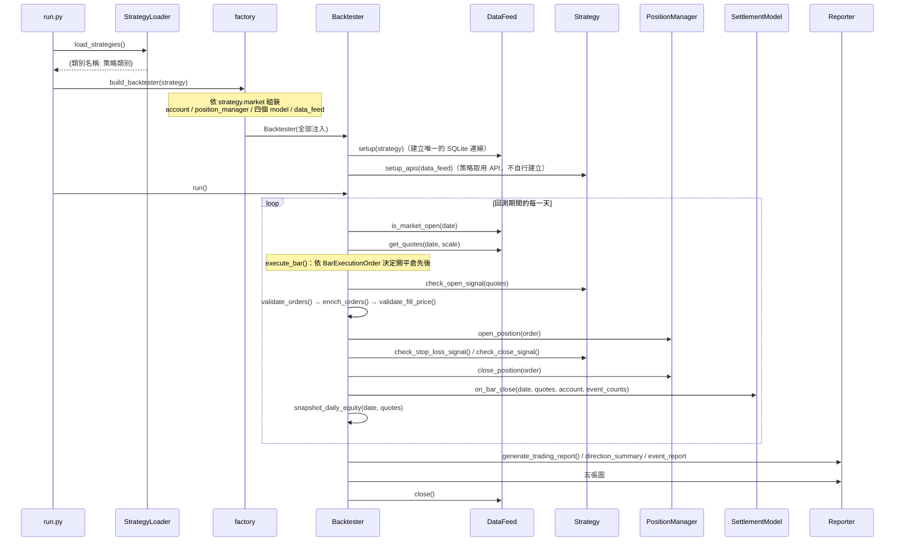

# 回測執行路徑的模組使用關係

> 本文件描述「一次回測從 `run.py` 到報表落地」會經過哪些模組、誰呼叫誰、誰持有什麼狀態。
> 引擎為何長成這樣（設計取捨、已知簡化）見 [多市場回測引擎架構](multi-market-engine.md)；
> 方向驅動的記帳原則見 [放空回測框架規格](short-selling-framework.md)。

---

## 一、分層與相依方向

相依**單向由上往下**，同層之間不互相 import。違反時 `scripts/check_layer_deps.py` 會以非零狀態碼結束（CI 有跑）。

```
入口層      run.py ── tasks/update_db.py
              │
策略層      core/strategies/          ← 宣告 market，是 factory 的分派鍵
            （Alpha：generate_*_signals() → List[Signal]）
              │
部位建構層  core/portfolio/           ← 回測與實盤共用，不屬於任一市場
            （Signal ＋ Account → List[Order]；**只做開倉**）
              │
組裝層      core/backtest/factory.py  ← 全專案唯一的 if market ==
              │
引擎層      core/backtest/backtester.py（市場無關，無子類）
              ├── core/backtest/models/      五個可插拔 model 的其中四個
              ├── core/backtest/datafeed/    資料載入與交易日判定
              ├── core/managers/             部位進出與帳務
              └── core/backtest/report/      報表與圖表
              │
資料層      core/api/ ── core/adapters/
              │
資料存取層  core/dao/（SQL、連線與交易只寫在這裡）── data/db/
              │
領域層      core/models/（帳戶、訂單、部位、報價、交易紀錄）
共用層      core/utils/（enum、路徑、時間、日誌、StockUtils）
```

**引擎不認識任何市場**：`grep "Stock" core/backtest/backtester.py` 為 0。市場語意全部在 `factory.py` 組裝時注入。

**策略層與部位建構層的分界**：

| 層 | 檔案 | 回答什麼 | 不回答什麼 |
|----|------|----------|-----------|
| Alpha | `core/strategies/` | 買哪些、什麼方向、什麼價 | 各買幾張 |
| Portfolio | `core/portfolio/construction.py` | 開倉各買幾張／幾口 | 選哪些標的 |
| Portfolio | `core/portfolio/sizing.py` | 資金怎麼切（可替換） | 用哪個參考價 |

引擎對策略的契約是 `check_*_signal(quotes) -> List[Order]`，**由 `BaseStrategy` 提供**，
策略只實作 `generate_*_signals()`。

**平倉與停損不經過部位建構層**：張數取自持倉查詢、價格由策略的交易邏輯決定
（哪一筆部位、合併與否、回補價怎麼挑），由市場基底的 `build_close_orders()` 直接組單。
把它交給部位建構器等於要求那一層懂 FIFO 與回補價政策。

---

## 二、一次回測的呼叫序列



### 單根 bar 的訂單流

訂單從策略回傳到真正成交，中間有**四道關卡**，任何一關被擋都會計數，不會靜默丟棄：

| 順序 | 關卡 | 實作位置 | 擋掉時計入 |
|:----:|------|----------|------------|
| 1 | 方向白名單（`allowed_directions`、開平倉動作是否相符） | `Backtester.validate_orders()` | `rejected_direction` |
| 2 | 市場專屬欄位補值（`short_method`、`is_day_trade`） | `CostModel.enrich_orders()` | —（只補值不擋） |
| 3 | 持倉檔數硬上限（`max_holdings`） | `Backtester.check_max_holdings()` | `rejected_max_holdings` |
| 4 | 成交價可信度（OHLC 區間、漲跌停、檔位） | `FillModel.validate()` | `rejected_fill_price` |

通過四關後才交給 `PositionManager.open_position()`。

---

## 三、逐檔案職責

### 入口與組裝

| 檔案 | 職責 | 被誰呼叫 |
|------|------|----------|
| `run.py` | CLI 解析（`--mode`、`--strategy`、`--show/--no-show`）、載入策略、建引擎、`run()` | 使用者 |
| `core/strategies/strategy_loader.py` | 掃描 `core/strategies/` 下**所有商品類別子套件**，找出繼承 `BaseStrategy` 的類別；類別名即策略識別名 | `run.py` |
| `core/backtest/factory.py` | 依 `(strategy.market, strategy.instrument_type)` 組裝 model 組合；`build_cost_config()` 依策略宣告推導成本設定 | `run.py`、測試 |

### 引擎與可插拔 model

| 檔案 | 職責 | 持有的狀態 |
|------|------|------------|
| `core/backtest/backtester.py` | 日期迴圈、單根 bar 流程、訂單四道關卡、逐日權益快照、觸發報表 | `daily_equity`、`event_counts` |
| `core/backtest/models/instrument_spec.py` | 一張／一口的計價單位換算、跳動點對齊、漲跌停區間 | 無（純規則） |
| `core/backtest/models/fill_model.py` | 這張單在這根 bar 有沒有可能以這個價格成交 | `prev_close`、`intraday_range` |
| `core/backtest/models/cost_model.py` | 手續費／證交稅／融券手續費／借券費／保證金／利息；`enrich_orders()` 補市場欄位 | `CostConfig`（含 `ShortConstraint`） |
| `core/backtest/models/settlement_model/` | 一根 bar 收盤後市場規則強制執行的動作：當沖強制回補、漲停轉留倉、借券費計提、維持率追繳、停券回補、除息股利補償 | 參照 `FillModel.prev_close`；`force_cover_symbols`、`cash_dividends` 由 `DataFeed` 每根 bar 推入 |
| `core/datafeed/base.py`（契約，回測與實盤共用）／`core/backtest/datafeed/tw/stock_datafeed.py`／`tw/futures_datafeed.py` | 建立並持有全部資料 API、報價轉換、交易日判定、回測結束時關連線 | **單次回測唯一的 SQLite 連線**（台股、期貨各一條，分屬兩個 DB；以 `connect_sqlite()` 開啟，API 與其 DAO 共用） |
| `core/market/tw/market_calendar.py` | 交易日推算（前一交易日、是否開盤、往前推 N 個營業日） | `DataFeed`、策略 |

**跨 model 的共用狀態只有兩個**，皆以 dict 參照傳遞，model 之間不互相 import：

- `event_counts`：`factory` 建立 → 同時給 `Backtester`、`FillModel` 與 `SettlementModel`。既有 key 與報表相容，**不可更名**（新增可以）。
- `prev_close`：`FillModel` 持有 → `SettlementModel` 建構時取得同一個 dict 的參照。

### 帳務與領域模型

| 檔案 | 職責 |
|------|------|
| `core/managers/base/position_manager.py` | `BasePositionManager`：開倉／平倉／`settle_daily()` 的市場無關骨架 |
| `core/managers/stock/position_manager.py` | 台股實作：FIFO 平倉、多空分流記帳、成本攤提、融券轉換 |
| `core/models/base/` | `BaseAccount`／`BaseOrder`／`BasePosition`／`BaseQuote`／`BaseTradeRecord`；識別欄位一律 `symbol` |
| `core/models/stock/` | 台股實作，含 `stock_id` 與 `symbol` 的對應 |

### 資料存取

| 檔案 | 職責 |
|------|------|
| `core/api/base.py` | `BaseDataAPI`：`owns_conn` 決定 `close()` 是否真的關連線（共用連線由 `DataFeed` 負責關）；`build_column_map()` 為具名查詢的共用底座。**API 不寫 SQL**：持有連線、以 `conn=` 建自己的 DAO |
| `core/api/tw/stock_price_api.py` | 日 K 查詢（`get`／`get_range`／`get_stock_price` ＋ 具名查詢） |
| `core/api/tw/stock_tick_api.py` | 逐筆成交（DolphinDB） |
| `core/api/tw/stock_chip_api.py`／`stock_margin_api.py` | 三大法人籌碼、融資融券餘額 |
| `core/api/tw/monthly_revenue_report_api.py`／`financial_statement_api.py` | 月營收、財報 |
| `core/adapters/tw/stock_quote_adapter.py` | 日 K／Tick 的 `DataFrame` → `StockQuote` 物件 |
| `core/dao/connection.py` | 連線的單一入口 `connect_sqlite()`（含唯讀模式）；`DBConnection`／`DBError` 型別別名 |
| `core/dao/base.py` | `BaseDAO`：`owns_conn` 語意、`table_exists()`、`query_df()`、寫入（`insert_or_ignore`／`insert_or_replace`）與 `savepoint()` |
| `core/dao/tw/*_dao.py` | 一張表（或一組緊密相關的表）一個 DAO；清單與設計見[資料存取層](../dev/data-access-layer.md) |

### 報表與分析

| 檔案 | 職責 |
|------|------|
| `core/backtest/report/base.py` | `BaseBacktestReporter`：報表介面與存檔工具 |
| `core/backtest/report/reporter.py` | 台股報表：交易明細、多空統計、事件計數、五張圖、benchmark（`0050` 還原價）比較 |
| `core/backtest/report/futures_reporter.py` | 期貨報表：繼承台股報表，只覆寫交易明細欄位（`Contract ID`，台股為 `Symbol`）、多空統計欄位、對標序列（連續合約優先，查不到退回近月拼接） |
| `core/backtest/analysis/performance_metrics.py` | 績效指標的純函式（Sharpe、Sortino、MDD 等），由 reporter 呼叫並輸出 `<策略>_metrics_summary.csv`；前端只讀這份 CSV、不 import `core` |

---

## 四、輸出檔案

全部落在 `results/<策略名稱>/`：

| 檔案 | 內容 | 產生者 |
|------|------|--------|
| `<策略>_trading_report.csv` | 已平倉交易逐筆明細（含放空專屬的 `Borrow Fee`／`Interest`／`Margin`／`Holding Days`／`ROI on Capital`） | `generate_trading_report()` |
| `<策略>_direction_summary.csv` | 多空分開的勝率、損益、成本統計 | `generate_direction_summary()` |
| `<策略>_event_report.csv` | 事件計數（強制回補、斷頭、拒單、漲停回補失敗等） | `generate_event_report()` |
| `<策略>_metrics_summary.csv` | 整體績效指標（`Metric`／`Value`／`Note` **長表**）：勝率、勝敗比、獲利因子、MDD、年化波動度、Sharpe、Sortino、Information Ratio 與權益口徑。**前端只讀這一份**，不自行重算 | `generate_metrics_summary()` |
| `<策略>_daily_equity.csv` | **含未實現損益**的逐日權益序列 | `Backtester.snapshot_daily_equity()` |
| `<策略>_balance_curve.png` | 權益曲線 | `plot_balance_curve()` |
| `<策略>_networth.png` | 策略 vs `0050` 淨值 | `plot_balance_and_benchmark_curve()` |
| `<策略>_mdd.png` | 策略 vs `0050` 最大回撤 | `plot_balance_mdd()` |
| `<策略>_everyday_profit.png` | 每日損益長條圖（**已實現口徑**） | `plot_everyday_profit()` |
| `<策略>_everyday_equity_change.png` | 每日權益變化（**盯市口徑**，無 `daily_equity` 時不產出） | `plot_everyday_equity_change()` |

日誌落在 `logs/backtest/`。圖表預設不開瀏覽器，要開用 `run.py --show` 或 `ALPHAEDGE_SHOW_FIGURES`。

### 權益曲線的兩種口徑

前三張圖的資料來源收斂在 `StockBacktestReporter.get_equity_series()` 這個唯一入口，回傳序列與其口徑：

| 口徑 | 何時採用 | 節點 | 風險 |
|------|----------|------|------|
| `Mark-to-market` | `daily_equity` 有值（正常回測路徑） | 每個交易日一點 | — |
| `Realized only` | `daily_equity` 為空 | 只有平倉日有點 | **MDD 被低估**：持倉期間的逆勢被整段抹平，而那正是留倉放空最大的風險來源 |

採用的口徑會標在圖表標題或註腳上，避免不同期的報表被混著看。

**`everyday_profit` 與 `everyday_equity_change` 語意不同、不可互相取代**：前者只在平倉當天有數值，後者是逐日權益的差分，持倉期間被軋的那幾天會有負值。

---

## 五、新增一個（市場, 商品）組合要動哪些檔案

既有檔案的改動量是**一個 `elif` 分支**：

| 動作 | 檔案 |
|------|------|
| 新增 | `core/models/<instrument>/`（五個領域模型） |
| 新增 | `core/strategies/<instrument>/base.py`（設定 `self.market` 與 `self.instrument_type`，並實作 `make_portfolio_constructor()` 與 `build_close_orders()`） |
| 新增 | `core/portfolio/construction.py` 的對應建構器（若部位約束與既有兩者都不同） |
| 新增 | `core/backtest/models/` 的該組合 `InstrumentSpec`／`FillModel`／`CostModel`／`SettlementModel` |
| 新增 | `core/backtest/datafeed/<market>/` 的該組合 `DataFeed` |
| 新增 | `core/managers/<instrument>/position_manager.py` |
| **修改** | `core/backtest/factory.py`：加一個 `elif (strategy.market, strategy.instrument_type) == (...)` 分支 |

`backtester.py`、`strategy_loader.py`、`run.py` 皆為 **0 行改動**——`StrategyLoader` 會自動掃描新的子套件，CLI 也不需要 `--market`（市場由策略類別自己宣告）。

---

## 六、動這些模組前要知道的事

1. **不要在 `core/backtest/__init__.py`、`core/strategies/__init__.py` 與 `core/backtest/datafeed/__init__.py` 加 re-export。** 三處都會因套件層 eager import 造成循環；呼叫端一律用完整模組路徑。
2. **策略不要自己 `StockPriceAPI()`。** API 實例由 `DataFeed` 統一持有，`setup_apis(feed)` 只是取用；自行建立會讓單次回測開出多條互不相干的連線。
3. **策略層不得出現資料庫欄位字面值。** 資料表欄位是中文（`"收盤價"`、`"成交股數"`），只有 `core/dao/`、`core/api/`、`core/adapters/` 可以引用（常數定義在 `core/config/schema.py` 的 `PriceColumn`／`ChipColumn`）。策略一律呼叫具名查詢方法：

   | 方法 | 用途 |
   |------|------|
   | `StockPriceAPI.get_close_map(date)` | 單日全市場收盤價對照表 |
   | `StockPriceAPI.get_volume_lots_map(date)` | 單日全市場成交量（張）對照表 |
   | `StockPriceAPI.get_close_series(stock_id, start, end)` | 個股區間收盤序列 |
   | `StockChipAPI.get_trust_net_shares_map(date)` | 單日全市場投信買賣超股數對照表 |

   `tests/test_strategy_data_access.py` 會在策略層出現欄位字面值時失敗——這類錯誤是**靜默**的（換資料源後策略會安靜地不開倉，報表上只表現為訊號變少）。
4. **`core/api/` 不可 import `core/utils/instrument.py`。** `StockUtils` 相依 `MarketCalendar`，而後者相依 `StockPriceAPI`；API 層位於其下，反向相依會直接循環。
5. **回歸雙線不經過 reporter。** `tests/backtest/make_baseline.py` 直接從 `account.trade_records` 組 `DataFrame`，改壞報表欄位兩條線都一樣綠——動 `reporter.py` 時要靠 `test_reporting.py` 與 `test_reporter_timeline.py`。
6. **只有 `core/dao/` 可以 `import sqlite3`。** `core/`、`tasks/` 其他檔案的型別標註用 `DBConnection`，由 `check_layer_deps.py` 的 E'' 項強制；SQL 要寫進 DAO，不要在 API、策略或 DataFeed 裡直接 `conn.execute()`。
7. **reporter 共用 `DataFeed` 的連線。** `Backtester` 把 `StockPriceAPI` 傳給 reporter 取 benchmark，reporter 的 `close()` 只關自己開的連線（`owns_conn` 語意）。
8. **任何動到 `core/backtest/`、`core/managers/`、`core/models/` 的改動，先跑 `./scripts/run_regression.sh`。**

---

## 七、已知的相依例外

§一的圖描述的是**呼叫方向**；實際 `import` 方向與圖不同的地方分兩類，由
`scripts/check_layer_deps.py` 分開處理：

- **反向相依**（低層 import 高層）：`_KNOWN_REVERSE` 現在是**空字典**，也就是一條都沒有。
  這是目標狀態而不是「還沒登記」——ratchet 的意思是**再出現一條就讓腳本以非零結束**。
- **同層不同套件互相 import**：腳本的 F 區，**只列出不擋**，需人工判讀。
  同層之間沒有方向可言，機器判不出哪一條是設計、哪一條是疏漏。
  條數以腳本輸出為準，本文件不複製數字——那種數字只會靜默過期。

下表是 F 區裡需要解釋的幾組，以及它們為什麼是刻意的：

| 現況 | 為什麼是這樣 |
|---|---|
| 策略契約與引擎互相引用：引擎／factory／報表／`core/datafeed/base.py` → 策略契約（三個 `base.py`） | 圖的用途是說明呼叫序列，改畫相依圖反而難讀；`check_layer_deps.py` 以獨立的「策略契約」等級處理，不列入反向相依 |
| `core/pipeline/tw/updaters/*` → `core/api/tw/*`（期貨行情、標的池 API） | 單向：api 已不再 import pipeline（欄位常數下沉到 `core/config/schema.py`、SQLite 工具收進 `core/dao/`） |
| `core/pipeline/tw/` → `core/market/tw/`（`futures_calendar`、`futures_roll`） | 交易日曆與換月規則屬市場結構，**已經住在 `core/market/`**，與 pipeline 同層。清洗連續合約需要換月規則，是刻意的 |
| `core/backtest/models/settlement_model/` → `core/managers/*/position_manager.py` | 期貨轉倉與股票的除權息記帳需要 manager，打破了「model 之間不互相依賴」；升級路徑是把轉倉抽成獨立的 `RollModel` 掛點 |
| **策略層仍 import `core/backtest/models/fill_model.py` 的 `FillConfig`／`FuturesFillConfig`／`VolumeCapPolicy`**（3 檔 3 處） | 只剩**成交假設**這一組。成本設定已搬到 `core/models/`、日曆與換月已搬到 `core/market/`、`sizing.py` 已搬到 `core/portfolio/`；成交假設沒跟著搬，是因為它與 `FillModel` 的實作綁得最緊，搬動會牽動所有成交路徑的呼叫端 |

**已經解決、不再列入的三條**（留紀錄以免有人照舊文件重新引入）：

- `core/utils/instrument.py` 曾 import 引擎層的日曆，現在它**不 import 任何 `core/` 模組**。
- `core/portfolio/construction.py` 曾從 `core/managers/futures/position_manager.py` 取
  `FuturesMarginConfig`，現在取自 `core/market/tw/futures_margin_config.py`（正常向下相依）。
- 策略層曾 import `BaseDataFeed`、`CostConfig`／`FuturesCostConfig`、`MarketCalendar`、
  `FuturesCalendar`、`FuturesRollConfig`（2026-09-19 實測 6 檔 13 處），現在那些型別都已
  下沉到 `core/models/`、`core/market/`、`core/datafeed/`。

## 相關文件

- [多市場回測引擎架構](multi-market-engine.md)——設計決策與已知簡化
- [放空回測框架規格](short-selling-framework.md)——方向驅動的記帳原則
- [策略開發指南](../../core/strategies/README.md)——策略怎麼寫
- [資料存取層（DAO）](../dev/data-access-layer.md)——連線所有權、交易與錯誤語意
